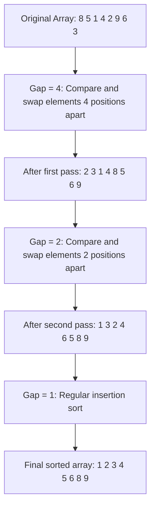

# Shell Sort

## Introduction

Shell Sort is an efficient, comparison-based sorting algorithm that was invented by Donald Shell in 1959. It's essentially an optimization of insertion sort that allows the exchange of items that are far apart. The algorithm divides the input into smaller sublists, which are then sorted using insertion sort.

Why learn about Shell Sort?

- It's significantly more efficient than simple algorithms like Insertion Sort for larger lists
- It's relatively easy to implement compared to more complex algorithms
- It requires minimal additional memory (sorts in-place)
- It performs well on partially sorted arrays

## How Shell Sort Works

Shell Sort works by sorting elements that are far apart from each other and progressively reducing the gap between elements to be compared. The algorithm uses a sequence of "gaps" (also called increments) and for each gap, it sorts all sublists of elements spaced with that gap.

### Key Concepts

1. **Gap Sequence**: A sequence that determines how far apart compared elements are
2. **Diminishing Gaps**: The algorithm starts with a large gap and gradually reduces it to 1
3. **Sublist**: Elements that are 'gap' positions apart form a sublist
4. **Insertion Sort**: Each sublist is sorted using insertion sort

### Step-by-Step Process

1. Choose a gap sequence (common ones include n/2, n/4, ..., 1 or 1, 4, 13, 40, 121, ...)
2. For each gap in the sequence (starting with the largest):
   - Create sublists of elements that are 'gap' distance apart
   - Sort these sublists using insertion sort
3. As the gap decreases, the array becomes more and more ordered
4. When the gap is 1, perform a regular insertion sort (which is efficient because the array is almost sorted)

## Visual Explanation

Let's visualize how Shell Sort works with an example:



## Shell Sort Implementation

Let's implement the Shell Sort algorithm in various programming languages:

### JavaScript Implementation

```javascript
function shellSort(arr) {
    const n = arr.length;
    
    // Start with a big gap, then reduce the gap
    for (let gap = Math.floor(n/2); gap > 0; gap = Math.floor(gap/2)) {
        
        // Do a gapped insertion sort for this gap size
        for (let i = gap; i < n; i++) {
            
            // Save the current element
            const temp = arr[i];
            
            // Shift earlier gap-sorted elements up until the correct location is found
            let j;
            for (j = i; j >= gap && arr[j - gap] > temp; j -= gap) {
                arr[j] = arr[j - gap];
            }
            
            // Put temp (the original arr[i]) in its correct location
            arr[j] = temp;
        }
    }
    return arr;
}

// Example usage
const array = [12, 34, 54, 2, 3, 8, 23, 19];
console.log("Before sorting:", array);
shellSort(array);
console.log("After sorting:", array);
```

**Output:**
```
Before sorting: [12, 34, 54, 2, 3, 8, 23, 19]
After sorting: [2, 3, 8, 12, 19, 23, 34, 54]
```

### Python Implementation

```python
def shell_sort(arr):
    n = len(arr)
    gap = n // 2
    
    # Start with a big gap, then reduce the gap
    while gap > 0:
        # Do a gapped insertion sort
        for i in range(gap, n):
            # Save the current element
            temp = arr[i]
            
            # Shift earlier gap-sorted elements up until the correct location is found
            j = i
            while j >= gap and arr[j - gap] > temp:
                arr[j] = arr[j - gap]
                j -= gap
                
            # Put temp (the original arr[i]) in its correct location
            arr[j] = temp
            
        # Reduce the gap for the next iteration
        gap //= 2
    
    return arr

# Example usage
array = [12, 34, 54, 2, 3, 8, 23, 19]
print("Before sorting:", array)
sorted_array = shell_sort(array)
print("After sorting:", sorted_array)
```

**Output:**
```
Before sorting: [12, 34, 54, 2, 3, 8, 23, 19]
After sorting: [2, 3, 8, 12, 19, 23, 34, 54]
```

### Java Implementation

```java
import java.util.Arrays;

public class ShellSort {
    public static void shellSort(int[] arr) {
        int n = arr.length;
        
        // Start with a big gap, then reduce the gap
        for (int gap = n/2; gap > 0; gap /= 2) {
            // Do a gapped insertion sort for this gap size
            for (int i = gap; i < n; i++) {
                // Save the current element
                int temp = arr[i];
                
                // Shift earlier gap-sorted elements up until the correct location is found
                int j;
                for (j = i; j >= gap && arr[j - gap] > temp; j -= gap) {
                    arr[j] = arr[j - gap];
                }
                
                // Put temp (the original arr[i]) in its correct location
                arr[j] = temp;
            }
        }
    }
    
    public static void main(String[] args) {
        int[] array = {12, 34, 54, 2, 3, 8, 23, 19};
        
        System.out.println("Before sorting: " + Arrays.toString(array));
        shellSort(array);
        System.out.println("After sorting: " + Arrays.toString(array));
    }
}
```

**Output:**
```
Before sorting: [12, 34, 54, 2, 3, 8, 23, 19]
After sorting: [2, 3, 8, 12, 19, 23, 34, 54]
```

## Time and Space Complexity

Shell Sort's time complexity depends on the gap sequence used. With the simple gap sequence (n/2, n/4, ..., 1), the time complexity is:

- **Worst-case time complexity**: O(n²)
- **Average-case time complexity**: O(n^1.3) for Hibbard's sequence
- **Best-case time complexity**: O(n log n)
- **Space complexity**: O(1) - In-place sorting algorithm

The performance of Shell Sort largely depends on the gap sequence chosen. Some well-known gap sequences include:

- **Shell's original sequence**: N/2, N/4, ..., 1
- **Hibbard's sequence**: 1, 3, 7, 15, 31, 63, ... (2^k - 1)
- **Knuth's sequence**: 1, 4, 13, 40, 121, ... (3^k - 1)/2
- **Sedgewick's sequence**: 1, 8, 23, 77, 281, ... (combines powers of 2 and 3)

## When to Use Shell Sort

Shell Sort is particularly useful when:

1. The data set is of medium size (few thousand elements)
2. The data is partially sorted already
3. You need a simple implementation with reasonable performance
4. Memory usage is a concern (in-place algorithm)

## Real-World Applications

While Shell Sort is not as commonly used as algorithms like QuickSort or MergeSort in modern programming libraries, it still has practical applications:

### Example 1: Embedded Systems

```c
// Shell sort implementation for an embedded system with limited memory
void shellSortForSensorData(float* data, int size) {
    for (int gap = size/2; gap > 0; gap /= 2) {
        for (int i = gap; i < size; i++) {
            float temp = data[i];
            int j;
            for (j = i; j >= gap && data[j - gap] > temp; j -= gap) {
                data[j] = data[j - gap];
            }
            data[j] = temp;
        }
    }
    // Now the sensor data is sorted for further processing
}
```

### Example 2: Database Operations

```java
// Using Shell Sort for sorting small database records in memory
public class DatabaseRecord {
    private int id;
    private String name;
    
    // Constructors, getters, setters...
    
    public static void sortRecords(DatabaseRecord[] records) {
        int n = records.length;
        
        // Shell sort implementation for records
        for (int gap = n/2; gap > 0; gap /= 2) {
            for (int i = gap; i < n; i++) {
                DatabaseRecord temp = records[i];
                int j;
                for (j = i; j >= gap && records[j - gap].id > temp.id; j -= gap) {
                    records[j] = records[j - gap];
                }
                records[j] = temp;
            }
        }
    }
}
```

## Advantages and Disadvantages

### Advantages

1. **Simple implementation**: Easier to code than more complex algorithms
2. **In-place sorting**: Requires minimal additional memory
3. **Adaptive**: Performance improves with partially sorted data
4. **More efficient than simple algorithms** like Insertion Sort or Bubble Sort

### Disadvantages

1. **Not stable**: May change the relative order of equal elements
2. **Less efficient** than advanced algorithms like QuickSort or MergeSort for large datasets
3. **Gap sequence dependent**: Performance varies widely based on the sequence chosen
4. **Theoretical complexity**: Hard to precisely analyze due to gap sequence variations

## Summary

Shell Sort is an efficient in-place sorting algorithm that improves upon insertion sort by comparing elements that are distant from each other. The algorithm works by:

1. Choosing a gap sequence
2. Sorting elements that are 'gap' positions apart using insertion sort
3. Progressively reducing the gap until it becomes 1
4. Performing a final insertion sort with gap = 1

Its time complexity varies based on the gap sequence used, but it generally performs better than simple O(n²) algorithms while being easier to implement than more complex O(n log n) algorithms.

Shell Sort occupies a middle ground in the sorting algorithm spectrum, making it suitable for medium-sized datasets or in environments with memory constraints.

## Exercises

1. Implement Shell Sort using a different gap sequence (like Hibbard's or Knuth's) and compare its performance with the default gap sequence.
2. Create a visualization of the Shell Sort algorithm with a small array of 10 elements.
3. Write a function that counts the number of comparisons and swaps performed during Shell Sort.
4. Implement a variant of Shell Sort that works with linked lists instead of arrays.
5. Compare the performance of Shell Sort with Insertion Sort and Quick Sort for various input sizes and patterns (random, nearly sorted, reversed).

## Additional Resources

- Donald Knuth's "The Art of Computer Programming, Volume 3: Sorting and Searching" has extensive analysis of Shell Sort and gap sequences
- [Algorithms, 4th Edition](https://algs4.cs.princeton.edu/home/) by Robert Sedgewick and Kevin Wayne covers Shell Sort in detail
- Interactive visualizations can help understand the algorithm better
- MIT OpenCourseWare's lecture on Shell Sort provides theoretical background

Shell Sort may not be the most efficient sorting algorithm in all cases, but understanding it provides valuable insights into algorithmic optimization and the evolution of sorting techniques. Its relative simplicity combined with reasonable performance makes it an important algorithm to have in your programming toolkit.