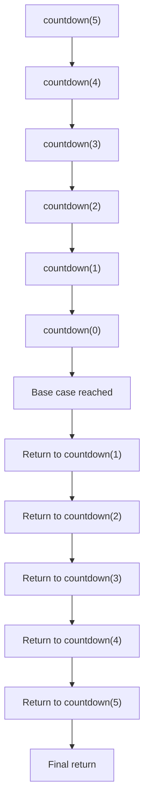

# Recursion Principles

## Introduction

Recursion is a powerful programming technique where a function calls itself to solve a problem. Think of it as solving a big problem by breaking it down into smaller versions of the same problem. When you understand the core principles of recursion, you'll be able to solve complex problems with elegant, concise code.

In this tutorial, we'll explore the fundamental principles that make recursion work and learn how to apply them effectively in your code.

## The Two Essential Components of Recursion

Every proper recursive function must have two key components:

1. **Base case(s)**: A condition that stops the recursion
2. **Recursive case(s)**: Where the function calls itself with a simpler version of the problem

Let's see how these components work together:

```javascript
function countdown(n) {
  // Base case
  if (n <= 0) {
    console.log("Blast off!");
    return;
  }
  
  // Current step
  console.log(n);
  
  // Recursive case
  countdown(n - 1);
}

// Example usage
countdown(5);
```

**Output:**
```
5
4
3
2
1
Blast off!
```

In this example:
- The base case is when `n <= 0`, which stops the recursion
- The recursive case calls `countdown` with `n - 1`, making the problem smaller with each call

## How Recursion Works: The Call Stack

When a function calls itself recursively, each call is added to what's called the "call stack." Understanding this stack is crucial for mastering recursion.



Each recursive call:
1. Gets added to the top of the stack
2. Executes until it reaches another recursive call or completes
3. When completed, it's removed from the stack, and execution returns to the caller

## Common Recursion Patterns

### 1. Linear Recursion

This is the simplest form where a function calls itself once each time. Our countdown example above is linear recursion.

### 2. Binary Recursion

The function makes two recursive calls, like in a binary tree traversal:

```python
def fibonacci(n):
    # Base cases
    if n <= 0:
        return 0
    if n == 1:
        return 1
    
    # Recursive case (binary recursion)
    return fibonacci(n - 1) + fibonacci(n - 2)

# Example usage
result = fibonacci(6)
print(f"The 6th Fibonacci number is: {result}")
```

**Output:**
```
The 6th Fibonacci number is: 8
```

### 3. Tail Recursion

A special form where the recursive call is the last operation performed:

```javascript
function factorialTailRecursive(n, accumulator = 1) {
    // Base case
    if (n <= 1) {
        return accumulator;
    }
    
    // Recursive case (tail recursion)
    return factorialTailRecursive(n - 1, n * accumulator);
}

// Example usage
console.log(factorialTailRecursive(5)); // 120
```

Tail recursion is important because some languages optimize it to avoid stack overflow (though JavaScript typically doesn't).

## The Three Laws of Recursion

To write effective recursive functions, remember these principles:

1. **A recursive function must have a base case**  
   Without it, your function will call itself infinitely, causing a stack overflow.

2. **A recursive function must change its state and move toward the base case**  
   Each recursive call should work on a smaller problem than the original.

3. **A recursive function must call itself**  
   This is the defining characteristic of recursion.

## Real-world Applications

### Example 1: Directory Tree Traversal

Recursion is perfect for traversing hierarchical structures like file systems:

```javascript
function listFiles(directory, indent = '') {
    const fs = require('fs');
    const path = require('path');
    const files = fs.readdirSync(directory);
    
    files.forEach(file => {
        const fullPath = path.join(directory, file);
        const stats = fs.statSync(fullPath);
        
        if (stats.isDirectory()) {
            console.log(`${indent}📁 ${file}/`);
            // Recursive call for subdirectories
            listFiles(fullPath, indent + '  ');
        } else {
            console.log(`${indent}📄 ${file}`);
        }
    });
}

// Example usage (replace with an actual directory path)
// listFiles('/path/to/directory');
```

### Example 2: Solving a Maze

Recursion can help find paths through a maze:

```python
def solve_maze(maze, x, y, solution):
    # Dimensions of the maze
    rows = len(maze)
    cols = len(maze[0])
    
    # Base cases
    # 1. Out of bounds
    if x < 0 or y < 0 or x >= rows or y >= cols:
        return False
    
    # 2. Hit a wall or already visited cell
    if maze[x][y] == '#' or solution[x][y] == 1:
        return False
    
    # 3. Reached the exit
    if x == rows - 1 and y == cols - 1:
        solution[x][y] = 1
        return True
    
    # Mark current cell as part of the solution
    solution[x][y] = 1
    
    # Recursive calls to find a path in all four directions
    if (solve_maze(maze, x+1, y, solution) or  # down
        solve_maze(maze, x, y+1, solution) or  # right
        solve_maze(maze, x-1, y, solution) or  # up
        solve_maze(maze, x, y-1, solution)):   # left
        return True
    
    # If no direction works, backtrack
    solution[x][y] = 0
    return False

# Example maze (0 = path, # = wall)
maze = [
    [0, '#', '#', '#'],
    [0, 0, '#', '#'],
    ['#', 0, 0, '#'],
    ['#', '#', 0, 0]
]

solution = [[0 for _ in range(4)] for _ in range(4)]
if solve_maze(maze, 0, 0, solution):
    print("Solution found:")
    for row in solution:
        print(row)
else:
    print("No solution exists")
```

## Common Pitfalls and Best Practices

### Pitfalls to Avoid

1. **Missing base case**: Always define a condition to stop recursion
2. **Inefficient recursive algorithms**: Consider memoization for problems with overlapping subproblems
3. **Stack overflow**: Be mindful of recursion depth, especially for large inputs

### Best Practices

1. **Visualize the call stack**: Draw out how the calls will stack up to ensure your solution is feasible
2. **Test with small cases first**: Verify your function works with simple inputs before trying larger ones
3. **Consider iterative alternatives**: Sometimes a loop can be more efficient than recursion
4. **Use memoization**: Store previously computed results to avoid redundant calculations

```javascript
function fibonacciMemoized(n, memo = {}) {
    // Check if we've already computed this value
    if (n in memo) return memo[n];
    
    // Base cases
    if (n <= 0) return 0;
    if (n == 1) return 1;
    
    // Store the result before returning
    memo[n] = fibonacciMemoized(n - 1, memo) + fibonacciMemoized(n - 2, memo);
    return memo[n];
}

// Much faster than the original fibonacci function
console.log(fibonacciMemoized(40)); // 102334155
```

## Exercises to Build Your Skills

1. **Factorial Calculation**: Write a recursive function to calculate n!
2. **Sum of Array**: Create a recursive function that sums all elements in an array
3. **Palindrome Check**: Write a recursive function to check if a string is a palindrome
4. **Binary Search**: Implement a recursive binary search algorithm
5. **Tower of Hanoi**: Solve the classic Tower of Hanoi puzzle recursively

## Summary

Recursion is a fundamental programming technique that solves problems by breaking them down into smaller, similar subproblems. By understanding the core principles—base cases, recursive cases, and the call stack—you can write elegant recursive solutions.

Remember the three laws of recursion:
1. Have a base case
2. Change state toward the base case
3. Call the function recursively

While powerful, recursion should be used thoughtfully. Consider the depth of recursion, use memoization when applicable, and be aware that some problems are better solved iteratively.

## Additional Resources

- "Grokking Algorithms" by Aditya Bhargava (has excellent visual explanations of recursion)
- "Introduction to Algorithms" by Cormen, Leiserson, Rivest, and Stein
- Stanford University's free course on recursion in computer science
- Practice recursion problems on platforms like LeetCode, HackerRank, or CodeSignal

The more you practice recursive thinking, the more natural it will become. Start with simple problems and gradually tackle more complex ones as your understanding deepens.