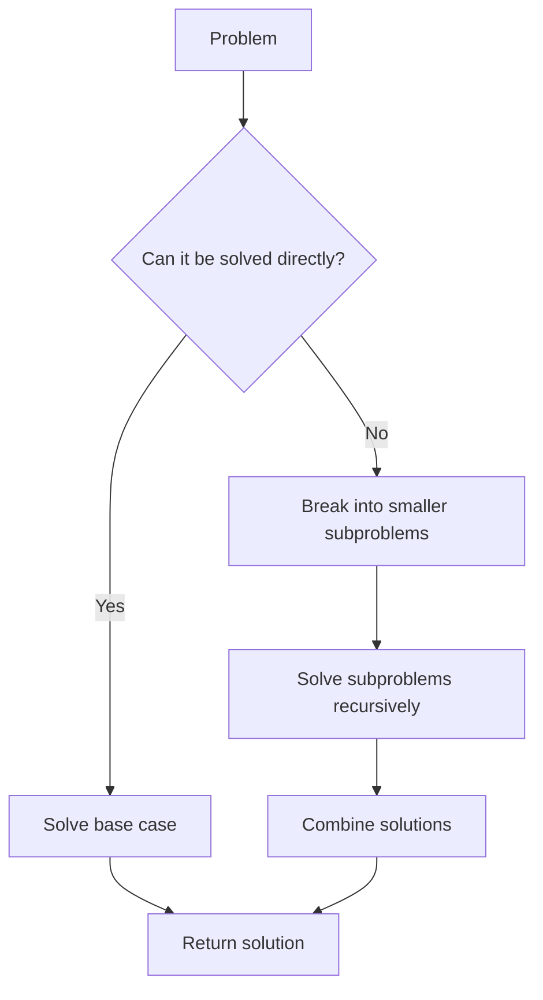

# Recursive Thinking

## Introduction

Recursive thinking is a powerful problem-solving approach where you solve complex problems by breaking them down into simpler versions of the same problem. This technique mirrors how recursive functions work in programming, where a function calls itself with a simplified version of the original problem until it reaches a basic case that can be solved directly.

Learning to "think recursively" is often challenging for beginners, but once mastered, it becomes an invaluable tool in your programming toolkit. This guide will help you develop this mindset and recognize when and how to apply recursive solutions.

## Understanding Recursive Thinking

Recursive thinking involves two key components:

1. **Base case**: The simplest version of the problem that can be solved directly.
2. **Recursive case**: Breaking down the problem into a smaller instance of itself.

When approaching a problem recursively, ask yourself:

- "What is the simplest version of this problem?" (base case)
- "How can I reduce this problem to a simpler version of itself?" (recursive case)

## The Recursive Thinking Process

Thinking recursively involves a specific mental framework. Let's break it down:



### Example: Thinking About a Factorial Problem

Let's see how recursive thinking works for calculating a factorial:

1. **Problem definition**: Calculate n! (n factorial)
2. **Base case identification**: What's the simplest factorial? 0! = 1
3. **Recursive relationship**: For n > 0, n! = n × (n-1)!
4. **Trust the recursion**: Assume the function correctly calculates (n-1)!

Let's implement this in code:

```javascript
function factorial(n) {
  // Base case
  if (n === 0) {
    return 1;
  }
  
  // Recursive case
  return n * factorial(n - 1);
}

console.log(factorial(5)); // Output: 120
```

### Input and Output Tracing

For `factorial(5)`:

```
factorial(5)
  → 5 * factorial(4)
    → 5 * (4 * factorial(3))
      → 5 * (4 * (3 * factorial(2)))
        → 5 * (4 * (3 * (2 * factorial(1))))
          → 5 * (4 * (3 * (2 * (1 * factorial(0)))))
          → 5 * (4 * (3 * (2 * (1 * 1))))
        → 5 * (4 * (3 * (2 * 1)))
      → 5 * (4 * (3 * 2))
    → 5 * (4 * 6)
  → 5 * 24
→ 120
```

## Developing Recursive Intuition

### The Leap of Faith

One of the most challenging aspects of recursive thinking is what's often called the "recursive leap of faith." This means:

- Trust that your recursive function works correctly for smaller inputs
- Focus on the relationship between the current problem and the subproblem
- Don't try to trace through the entire recursion mentally

### Visualizing with Simple Examples

Start with small inputs and trace through the recursion step by step:

```javascript
// Tracing factorial(3):

factorial(3)
  = 3 * factorial(2)
  = 3 * (2 * factorial(1))
  = 3 * (2 * (1 * factorial(0)))
  = 3 * (2 * (1 * 1))
  = 3 * (2 * 1)
  = 3 * 2
  = 6
```

## Practical Examples

### Example 1: Sum of an Array

Let's apply recursive thinking to sum the elements of an array:

```javascript
function sumArray(arr, index = 0) {
  // Base case: empty array or reached the end of array
  if (index >= arr.length) {
    return 0;
  }
  
  // Recursive case: current element + sum of remaining elements
  return arr[index] + sumArray(arr, index + 1);
}

const numbers = [1, 2, 3, 4, 5];
console.log(sumArray(numbers)); // Output: 15
```

### Example 2: Counting Directory Files

A real-world application is counting files in a directory structure:

```javascript
function countFiles(directory) {
  let fileCount = 0;
  
  // Get all items in the directory
  const items = fs.readdirSync(directory);
  
  // Process each item
  for (const item of items) {
    const fullPath = path.join(directory, item);
    
    // Base case: if it's a file, count it
    if (fs.statSync(fullPath).isFile()) {
      fileCount++;
    } 
    // Recursive case: if it's a directory, count files inside it
    else if (fs.statSync(fullPath).isDirectory()) {
      fileCount += countFiles(fullPath);
    }
  }
  
  return fileCount;
}
```

### Example 3: Tree Traversal

Recursive thinking naturally applies to tree structures:

```javascript
class TreeNode {
  constructor(value) {
    this.value = value;
    this.left = null;
    this.right = null;
  }
}

function countNodes(root) {
  // Base case: empty tree
  if (root === null) {
    return 0;
  }
  
  // Recursive case: count current node + nodes in left and right subtrees
  return 1 + countNodes(root.left) + countNodes(root.right);
}

// Create a sample tree
const root = new TreeNode(1);
root.left = new TreeNode(2);
root.right = new TreeNode(3);
root.left.left = new TreeNode(4);
root.left.right = new TreeNode(5);

console.log(countNodes(root)); // Output: 5
```

## Common Recursive Thinking Patterns

### 1. Linear Recursion

Process one element and recursively process the rest:

```javascript
function processArray(arr, index = 0) {
  // Base case
  if (index >= arr.length) return;
  
  // Process current element
  console.log(arr[index]);
  
  // Recursively process the rest
  processArray(arr, index + 1);
}
```

### 2. Divide and Conquer

Split the problem into multiple subproblems, solve them recursively, and combine:

```javascript
function binarySearch(arr, target, left = 0, right = arr.length - 1) {
  // Base case: not found
  if (left > right) return -1;
  
  // Find middle element
  const mid = Math.floor((left + right) / 2);
  
  // Base case: found target
  if (arr[mid] === target) return mid;
  
  // Recursive cases
  if (arr[mid] > target) {
    return binarySearch(arr, target, left, mid - 1);
  } else {
    return binarySearch(arr, target, mid + 1, right);
  }
}
```

### 3. Backtracking

Explore all possible solutions by building candidates incrementally and abandoning paths that fail:

```javascript
function generatePermutations(arr, current = [], result = []) {
  // Base case: we've used all elements
  if (current.length === arr.length) {
    result.push([...current]);
    return;
  }
  
  // Try each element that hasn't been used yet
  for (let i = 0; i < arr.length; i++) {
    if (current.includes(arr[i])) continue;
    
    // Make a choice
    current.push(arr[i]);
    
    // Explore further with this choice
    generatePermutations(arr, current, result);
    
    // Undo the choice (backtrack)
    current.pop();
  }
  
  return result;
}

console.log(generatePermutations([1, 2, 3]));
// Output: [[1,2,3], [1,3,2], [2,1,3], [2,3,1], [3,1,2], [3,2,1]]
```

## Common Challenges in Recursive Thinking

### 1. Identifying the Base Case

The base case is crucial - without it, your recursion will never terminate. Always ask:
- "What is the simplest version of this problem?"
- "When should the recursion stop?"

### 2. Ensuring Progress Toward the Base Case

Each recursive call must move closer to the base case:
- Reduce the problem size (smaller array, smaller number, etc.)
- Track progress with parameters that change in each call

### 3. Managing State Across Recursive Calls

Be careful with:
- Local variables (they're reset in each recursive call)
- Parameters (use them to pass state)
- Global variables (generally avoid them)

## Real-World Applications

Recursive thinking applies to many real-world problems:

1. **File systems**: Traversing directory structures
2. **Web DOM**: Navigating and manipulating nested elements
3. **Data structures**: Working with trees, graphs, and nested objects
4. **Algorithms**: Sorting (merge sort, quicksort), searching, and pathfinding
5. **Graphics**: Fractal generation, recursive drawing patterns
6. **Game AI**: Decision trees, game state exploration

## Summary

Recursive thinking is a powerful mental model that helps solve complex problems by breaking them down into smaller, similar subproblems. The key elements are:

1. Identify the base case (simplest version of the problem)
2. Define the recursive case (how to reduce the problem)
3. Trust that recursion will work for smaller instances
4. Combine the solutions to solve the original problem

With practice, you'll develop an intuition for when and how to apply recursive thinking, making previously challenging problems much more approachable.

## Practice Exercises

1. Write a recursive function to reverse a string.
2. Implement a recursive binary search algorithm.
3. Create a recursive function to calculate the nth Fibonacci number.
4. Write a function to recursively count occurrences of a value in a nested array.
5. Implement a recursive solution for the "Tower of Hanoi" puzzle.

## Additional Resources

- **Books**:
  - "Thinking Recursively" by Eric S. Roberts
  - "The Art of Computer Programming, Vol. 1" by Donald Knuth (sections on recursion)

- **Online Practice**:
  - LeetCode's recursion card
  - HackerRank recursion problems
  - Recursion exercises on Codewars

- **Advanced Topics**:
  - Memoization to optimize recursive solutions
  - Tail recursion optimization
  - Converting recursion to iteration

Remember: recursive thinking is a skill that improves with practice. Start with simple problems, trace through them carefully, and gradually tackle more complex scenarios as your confidence grows.