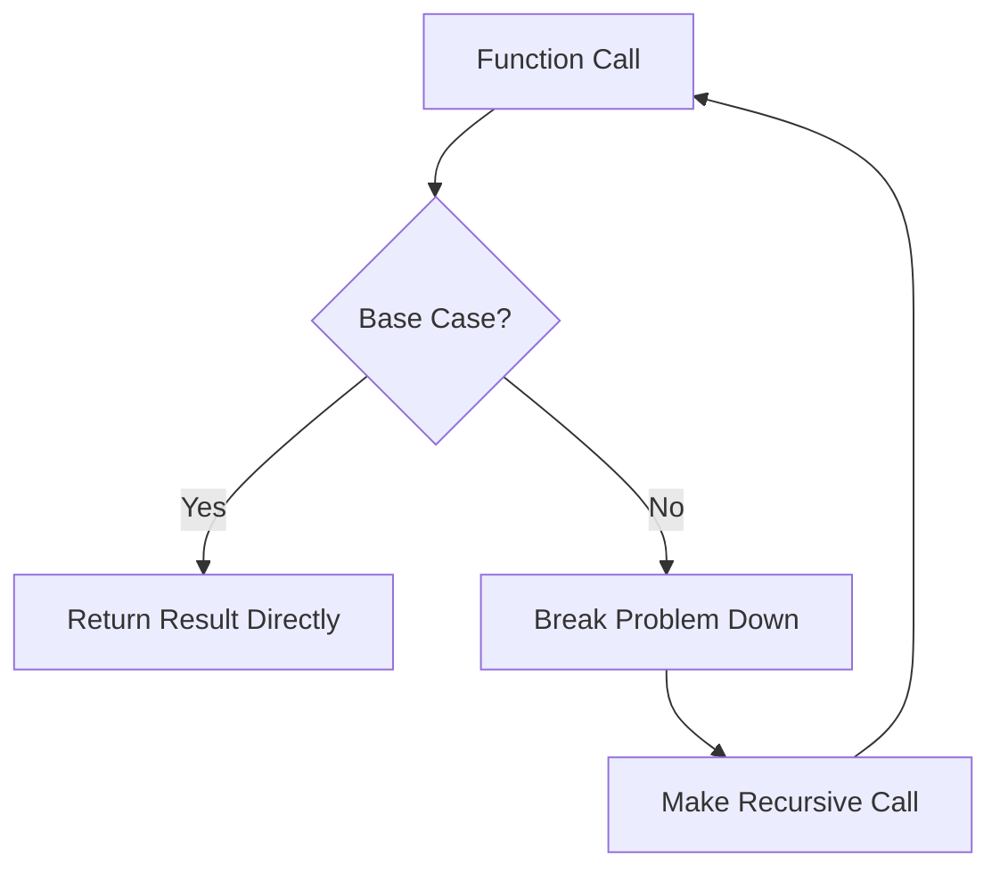

# Base Cases in Recursion

## Introduction

Recursion is a powerful technique where a function calls itself to solve smaller instances of the same problem. However, without a proper stopping mechanism, recursive functions would call themselves indefinitely, causing a stack overflow error. This is where **base cases** come in.

A **base case** (also known as a terminating case) is a condition that stops the recursion. It's the simplest instance of a problem that can be answered directly without further recursive calls.

Think of base cases like the foundation of a building – without them, your recursive structure collapses!

## Why Base Cases Are Essential

Base cases serve three critical purposes:

1. **Preventing infinite recursion** - They provide a way to terminate the recursive calls
2. **Handling edge cases** - They often cover the simplest scenarios of your problem
3. **Building blocks for complex solutions** - They form the foundation upon which recursive solutions are built

Let's visualize the role of base cases in a recursive function:



## Identifying Base Cases

When implementing recursive functions, you should always ask:

1. What is the simplest version of this problem?
2. When should the recursion stop?
3. What is the direct answer for this simplest case?

Common base cases include:

- Empty collections (empty strings, arrays, trees)
- Single-element collections
- Specific values (like 0 or 1 for mathematical functions)
- Boundary conditions

## Base Case Examples

### Example 1: Factorial Function

The factorial of a number n (written as n!) is the product of all positive integers less than or equal to n.

```javascript
function factorial(n) {
  // Base case
  if (n === 0 || n === 1) {
    return 1;
  }
  
  // Recursive case
  return n * factorial(n - 1);
}

// Example usage
console.log(factorial(5)); // Output: 120
console.log(factorial(0)); // Output: 1
```

In this example:
- The base case is when `n` equals 0 or 1, as factorial of both is 1
- Without the base case, the function would try to calculate factorial of negative numbers, leading to infinite recursion

### Example 2: Fibonacci Sequence

The Fibonacci sequence is where each number is the sum of the two preceding ones, starting from 0 and 1.

```python
def fibonacci(n):
    # Base cases
    if n == 0:
        return 0
    if n == 1:
        return 1
    
    # Recursive case
    return fibonacci(n-1) + fibonacci(n-2)

# Example usage
print(fibonacci(0))  # Output: 0
print(fibonacci(1))  # Output: 1
print(fibonacci(6))  # Output: 8
```

In this example:
- We have two base cases: `n = 0` returns 0, and `n = 1` returns 1
- These correspond to the first two numbers in the Fibonacci sequence

### Example 3: Binary Search

Binary search is an efficient algorithm for finding an item in a sorted array.

```java
public static int binarySearch(int[] array, int target, int left, int right) {
    // Base case: element not found
    if (left > right) {
        return -1;
    }
    
    int mid = left + (right - left) / 2;
    
    // Base case: element found
    if (array[mid] == target) {
        return mid;
    }
    
    // Recursive cases
    if (array[mid] > target) {
        return binarySearch(array, target, left, mid - 1);
    } else {
        return binarySearch(array, target, mid + 1, right);
    }
}

// Example usage
int[] sortedArray = {1, 3, 5, 7, 9, 11, 13};
int result = binarySearch(sortedArray, 7, 0, sortedArray.length - 1);
// Output: 3 (index of value 7)
```

Here we have two base cases:
1. When `left > right`, meaning the target is not in the array
2. When `array[mid] == target`, meaning we found the element

## Common Mistakes with Base Cases

### 1. Missing Base Cases

This is the most common error and leads to infinite recursion.

```javascript
// INCORRECT: Missing base case
function countDown(n) {
  console.log(n);
  countDown(n - 1); // This will run forever
}

// CORRECT: With base case
function countDown(n) {
  console.log(n);
  if (n <= 0) {  // Base case
    return;
  }
  countDown(n - 1);
}
```

### 2. Unreachable Base Cases

Sometimes the base case exists but your recursive logic never reaches it.

```python
# INCORRECT: Unreachable base case
def find_in_array(arr, target, index):
    if index == len(arr):  # Base case
        return False
    if arr[index + 1] == target:  # BUG: index+1 means we'll skip the base case check
        return True
    return find_in_array(arr, target, index + 1)
```

### 3. Incorrect Base Case Values

Using the wrong return value for your base case can lead to incorrect results.

```python
# INCORRECT: Wrong base case value
def sum_array(arr, index):
    if index == len(arr):
        return 1  # Should be 0 for a sum!
    return arr[index] + sum_array(arr, index + 1)
```

## Multiple Base Cases

Some recursive functions may require multiple base cases.

```javascript
function tribonacci(n) {
  // Multiple base cases
  if (n === 0) return 0;
  if (n === 1 || n === 2) return 1;
  
  // Recursive case
  return tribonacci(n - 1) + tribonacci(n - 2) + tribonacci(n - 3);
}

console.log(tribonacci(4)); // Output: 4
```

## Real-World Applications

### 1. Directory Traversal

Recursion with base cases is commonly used to traverse file systems.

```javascript
function findFiles(directory, extension) {
  const files = [];
  
  function traverse(currentPath) {
    // Base case: if it's a file
    if (isFile(currentPath)) {
      if (currentPath.endsWith(extension)) {
        files.push(currentPath);
      }
      return;
    }
    
    // Base case: if it's not a directory or file (shouldn't happen normally)
    if (!isDirectory(currentPath)) {
      return;
    }
    
    // Recursive case: if it's a directory
    const entries = getDirectoryContents(currentPath);
    for (const entry of entries) {
      traverse(path.join(currentPath, entry));
    }
  }
  
  traverse(directory);
  return files;
}

// Example usage would find all .js files in a directory
// findFiles("/projects/my-app", ".js");
```

### 2. DOM Traversal in Web Development

```javascript
function collectTextNodes(element, texts = []) {
  // Base case 1: null element
  if (!element) return texts;
  
  // Base case 2: text node
  if (element.nodeType === Node.TEXT_NODE) {
    if (element.textContent.trim() !== '') {
      texts.push(element.textContent.trim());
    }
    return texts;
  }
  
  // Recursive case: element with children
  for (const child of element.childNodes) {
    collectTextNodes(child, texts);
  }
  
  return texts;
}

// Example usage:
// const allTexts = collectTextNodes(document.body);
```

## Best Practices for Base Cases

1. **Always identify base cases first**: Before writing the recursive part, clearly identify when the recursion should stop.

2. **Keep base cases simple**: They should be straightforward and easy to verify.

3. **Test edge cases**: Ensure your function handles edge cases correctly (empty inputs, minimum values, etc.).

4. **Consider performance**: Sometimes adding more base cases can improve performance by reducing unnecessary recursive calls.

## Summary

Base cases are the foundation of recursive functions - they define when the recursion should stop and what value should be returned in the simplest scenarios. Without properly defined base cases, recursive functions would lead to infinite recursion and stack overflow errors.

When designing a recursive solution:
1. Identify the simplest form(s) of the problem
2. Define what values should be returned for these simplest cases
3. Write the recursive logic for breaking down the problem
4. Test with a variety of inputs, including edge cases

Mastering base cases is crucial for using recursion effectively and efficiently in your programs.

## Exercises

1. Write a recursive function to calculate the sum of digits in a number with the appropriate base case.

2. Implement a recursive function that checks if a string is a palindrome (reads the same forward and backward).

3. Create a recursive function to find the maximum element in an array. What is the base case?

4. Write a power function (`pow(x, n)`) that calculates x raised to the power n using recursion. Define clear base cases.

5. Implement depth-first traversal of a binary tree with proper base cases.

## Additional Resources

- [Recursion in Computer Science](https://en.wikipedia.org/wiki/Recursion_(computer_science))
- [Understanding Recursion through the Analogy of Russian Dolls](https://www.freecodecamp.org/news/understanding-recursion-in-programming/)
- [Recursive Algorithms Course](https://www.coursera.org/learn/algorithmic-thinking-1) on Coursera
- Practice recursion problems on platforms like LeetCode, HackerRank, and CodeSignal