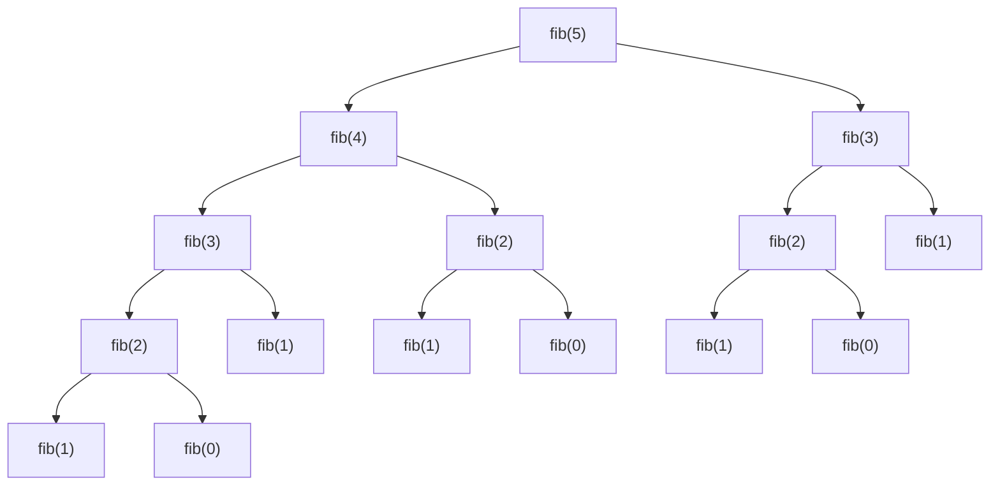
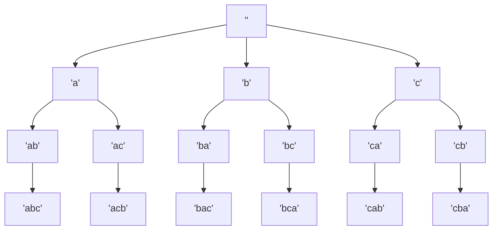

# Recursive Tree

## Introduction

Recursive trees represent one of the most elegant and powerful applications of recursion in computer science. A recursive tree is a pattern where a problem is divided into smaller subproblems that have the same structure as the original problem, creating a tree-like structure of recursive calls.

Unlike linear recursion, where each function call leads to at most one more recursive call, tree recursion branches out with multiple recursive calls from each function invocation, creating a tree-shaped pattern of execution.

In this guide, we'll explore:
- What recursive trees are and how they work
- How to visualize recursive tree patterns
- Implementation techniques for recursive tree algorithms
- Real-world applications and problems solved using recursive trees

## Understanding Recursive Trees

A recursive tree occurs when a function makes multiple recursive calls within its execution. Each recursive call represents a branch in the tree, and the base cases represent the leaves.

### Visualizing a Recursive Tree

Let's visualize a simple recursive function that computes the Fibonacci sequence:



Notice how each call to `fib(n)` branches into calls to `fib(n-1)` and `fib(n-2)`, creating a tree structure. This is the essence of a recursive tree.

## Basic Implementation of a Recursive Tree

Let's start with the classic example of calculating Fibonacci numbers:

```javascript
function fibonacci(n) {
  // Base cases
  if (n <= 0) return 0;
  if (n === 1) return 1;
  
  // Recursive calls (tree structure)
  return fibonacci(n - 1) + fibonacci(n - 2);
}

console.log(fibonacci(5)); // Output: 5
```

### Breaking down the Execution

When we call `fibonacci(5)`, here's what happens:

1. `fibonacci(5)` calls `fibonacci(4)` and `fibonacci(3)`
2. `fibonacci(4)` calls `fibonacci(3)` and `fibonacci(2)`
3. `fibonacci(3)` calls `fibonacci(2)` and `fibonacci(1)`
4. And so on, until we reach the base cases

This is a tree-recursive pattern, as each call branches into multiple recursive calls.

## More Complex Example: Binary Tree Traversal

Binary trees are natural structures to process with recursive trees. Let's implement the three standard traversals:

```javascript
class TreeNode {
  constructor(value) {
    this.value = value;
    this.left = null;
    this.right = null;
  }
}

// In-order traversal (left, root, right)
function inorderTraversal(root) {
  if (root === null) return [];
  
  return [
    ...inorderTraversal(root.left),
    root.value,
    ...inorderTraversal(root.right)
  ];
}

// Pre-order traversal (root, left, right)
function preorderTraversal(root) {
  if (root === null) return [];
  
  return [
    root.value,
    ...preorderTraversal(root.left),
    ...preorderTraversal(root.right)
  ];
}

// Post-order traversal (left, right, root)
function postorderTraversal(root) {
  if (root === null) return [];
  
  return [
    ...postorderTraversal(root.left),
    ...postorderTraversal(root.right),
    root.value
  ];
}

// Create a sample tree
//       1
//      / \
//     2   3
//    / \
//   4   5

const root = new TreeNode(1);
root.left = new TreeNode(2);
root.right = new TreeNode(3);
root.left.left = new TreeNode(4);
root.left.right = new TreeNode(5);

console.log("In-order traversal:", inorderTraversal(root));   // Output: [4, 2, 5, 1, 3]
console.log("Pre-order traversal:", preorderTraversal(root)); // Output: [1, 2, 4, 5, 3]
console.log("Post-order traversal:", postorderTraversal(root)); // Output: [4, 5, 2, 3, 1]
```

### Understanding Tree Traversals

Each traversal method above uses a recursive tree approach, but with different ordering:

- **In-order**: Process left subtree, then current node, then right subtree
- **Pre-order**: Process current node, then left subtree, then right subtree
- **Post-order**: Process left subtree, then right subtree, then current node

The recursive calls form a tree that mirrors the structure of the data tree we are traversing.

## Handling Complex Problems with Recursive Trees

Let's look at a more complex problem: generating all possible permutations of a string.

```javascript
function generatePermutations(str) {
  const result = [];
  
  // Helper function to do the recursive work
  function permute(currentStr, remainingChars) {
    // Base case: no more characters to permute
    if (remainingChars.length === 0) {
      result.push(currentStr);
      return;
    }
    
    // Try each character as the next in the permutation
    for (let i = 0; i < remainingChars.length; i++) {
      const nextChar = remainingChars[i];
      const newRemaining = remainingChars.slice(0, i) + remainingChars.slice(i + 1);
      
      // Recursive call with updated strings
      permute(currentStr + nextChar, newRemaining);
    }
  }
  
  permute('', str);
  return result;
}

console.log(generatePermutations('abc'));
// Output: ['abc', 'acb', 'bac', 'bca', 'cab', 'cba']
```

In this example, each recursive call branches out to try a different character as the next in the permutation, creating a tree of possibilities.

### Visualizing the Permutation Tree

For the string "abc", the recursive tree would look like:



## Real-World Applications of Recursive Trees

Recursive trees have numerous practical applications:

### 1. File System Traversal

When you need to search through a directory structure, recursive tree algorithms are perfect:

```javascript
function findFilesWithExtension(directory, extension) {
  const fs = require('fs');
  const path = require('path');
  let results = [];
  
  // Read directory contents
  const files = fs.readdirSync(directory);
  
  for (const file of files) {
    const fullPath = path.join(directory, file);
    const stat = fs.statSync(fullPath);
    
    if (stat.isDirectory()) {
      // Recursive call for subdirectories
      results = results.concat(findFilesWithExtension(fullPath, extension));
    } else if (path.extname(file) === extension) {
      // Base case: file with matching extension
      results.push(fullPath);
    }
  }
  
  return results;
}

// Example usage:
// const jsFiles = findFilesWithExtension('./project', '.js');
```

### 2. Game AI: Minimax Algorithm

Recursive trees are used in game AI to explore possible future moves and countermoves:

```javascript
function minimax(position, depth, maximizingPlayer) {
  // Base case: terminal node or maximum depth reached
  if (depth === 0 || isTerminalPosition(position)) {
    return evaluatePosition(position);
  }
  
  if (maximizingPlayer) {
    let maxEval = -Infinity;
    for (let move of getPossibleMoves(position)) {
      const newPosition = makeMove(position, move);
      const evaluation = minimax(newPosition, depth - 1, false);
      maxEval = Math.max(maxEval, evaluation);
    }
    return maxEval;
  } else {
    let minEval = Infinity;
    for (let move of getPossibleMoves(position)) {
      const newPosition = makeMove(position, move);
      const evaluation = minimax(newPosition, depth - 1, true);
      minEval = Math.min(minEval, evaluation);
    }
    return minEval;
  }
}

// Note: isTerminalPosition, evaluatePosition, getPossibleMoves, and makeMove
// would need to be implemented specific to your game
```

### 3. Solving Combinatorial Problems

Many combinatorial problems like the N-Queens puzzle use recursive tree approaches:

```javascript
function solveNQueens(n) {
  const result = [];
  const board = Array(n).fill().map(() => Array(n).fill('.'));
  
  function isSafe(row, col) {
    // Check if no queen can attack this position
    // Check column
    for (let i = 0; i < row; i++) {
      if (board[i][col] === 'Q') return false;
    }
    
    // Check upper-left diagonal
    for (let i = row - 1, j = col - 1; i >= 0 && j >= 0; i--, j--) {
      if (board[i][j] === 'Q') return false;
    }
    
    // Check upper-right diagonal
    for (let i = row - 1, j = col + 1; i >= 0 && j < n; i--, j++) {
      if (board[i][j] === 'Q') return false;
    }
    
    return true;
  }
  
  function backtrack(row) {
    if (row === n) {
      // Found a solution
      result.push(board.map(row => row.join('')));
      return;
    }
    
    for (let col = 0; col < n; col++) {
      if (isSafe(row, col)) {
        // Try placing a queen at (row, col)
        board[row][col] = 'Q';
        
        // Recursively place queens in next rows
        backtrack(row + 1);
        
        // Backtrack
        board[row][col] = '.';
      }
    }
  }
  
  backtrack(0);
  return result;
}

console.log(solveNQueens(4));
// Output example for 4x4 board: [".Q..", "...Q", "Q...", "..Q."], ["..Q.", "Q...", "...Q", ".Q.."]
```

## Optimizing Recursive Tree Algorithms

Recursive tree algorithms can sometimes be inefficient due to redundant calculations. Here are some optimization techniques:

### 1. Memoization

Memoization stores the results of expensive function calls and returns the cached result when the same inputs occur again:

```javascript
function fibonacciMemoized(n, memo = {}) {
  // Check if we've already calculated this value
  if (n in memo) return memo[n];
  
  // Base cases
  if (n <= 0) return 0;
  if (n === 1) return 1;
  
  // Calculate and store result
  memo[n] = fibonacciMemoized(n - 1, memo) + fibonacciMemoized(n - 2, memo);
  return memo[n];
}

console.log(fibonacciMemoized(50)); // Fast, even for large values
```

### 2. Dynamic Programming

For problems with overlapping subproblems, you can use dynamic programming to build solutions incrementally:

```javascript
function fibonacciDP(n) {
  if (n <= 0) return 0;
  if (n === 1) return 1;
  
  // Create array to store computed values
  const dp = Array(n + 1).fill(0);
  dp[1] = 1;
  
  // Build up to the solution
  for (let i = 2; i <= n; i++) {
    dp[i] = dp[i - 1] + dp[i - 2];
  }
  
  return dp[n];
}

console.log(fibonacciDP(50)); // Very efficient
```

### 3. Pruning

In some recursive tree algorithms, you can prune branches that won't lead to optimal solutions:

```javascript
function knapsackWithPruning(values, weights, capacity, index = 0, currentValue = 0, currentWeight = 0, bestSoFar = { value: 0 }) {
  // Base case
  if (index === values.length) {
    if (currentValue > bestSoFar.value) {
      bestSoFar.value = currentValue;
    }
    return;
  }
  
  // Pruning: if we can't possibly beat the best solution, stop exploring
  const potentialValue = currentValue + remainingValueHeuristic(values, index);
  if (potentialValue <= bestSoFar.value) {
    return; // Prune this branch
  }
  
  // Include current item if it fits
  if (currentWeight + weights[index] <= capacity) {
    knapsackWithPruning(
      values, weights, capacity,
      index + 1,
      currentValue + values[index],
      currentWeight + weights[index],
      bestSoFar
    );
  }
  
  // Exclude current item
  knapsackWithPruning(
    values, weights, capacity,
    index + 1,
    currentValue,
    currentWeight,
    bestSoFar
  );
  
  return bestSoFar.value;
}

// A simple heuristic that estimates the maximum possible additional value
function remainingValueHeuristic(values, startIndex) {
  let sum = 0;
  for (let i = startIndex; i < values.length; i++) {
    sum += values[i];
  }
  return sum;
}
```

## Summary

Recursive trees are a powerful paradigm in programming that allow us to:

1. Break down complex problems into smaller, similar subproblems
2. Solve problems that have a naturally hierarchical structure
3. Explore multiple paths or possibilities systematically
4. Implement elegant solutions to combinatorial problems

Key concepts we've covered:
- Basic recursive tree pattern and visualization
- Tree traversals using recursion
- Solving complex problems like permutations
- Real-world applications like file system traversal, game AI, and combinatorial problems
- Optimization techniques for recursive tree algorithms

The main challenges to watch for when implementing recursive tree algorithms are:
- Potential inefficiency due to redundant calculations
- Stack overflow for deep recursion
- Managing complex state through recursive calls

With techniques like memoization, dynamic programming, and pruning, these challenges can be overcome, making recursive trees one of the most valuable tools in your programming toolkit.

## Exercises

1. **Binary Tree Height**: Write a function to calculate the height of a binary tree using recursion.
2. **Directory Size**: Create a function that calculates the total size of files in a directory and all its subdirectories.
3. **Maze Solver**: Implement a recursive algorithm to find a path through a maze.
4. **Sudoku Solver**: Build a recursive backtracking algorithm to solve Sudoku puzzles.
5. **Expression Evaluator**: Create a recursive parser and evaluator for mathematical expressions.

## Additional Resources

- "Introduction to Algorithms" by Cormen, Leiserson, Rivest, and Stein
- "The Art of Computer Programming, Vol. 1" by Donald Knuth
- "Algorithms" by Robert Sedgewick and Kevin Wayne
- "Grokking Algorithms" by Aditya Bhargava for a beginner-friendly approach

Keep practicing with recursive trees, and you'll develop an intuitive understanding of how to apply them to a wide range of problems!