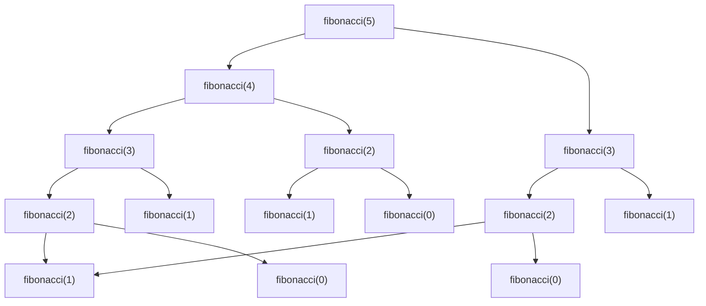

# Memoization

## Introduction

Have you ever solved the same problem multiple times during a recursion, feeling like you're doing unnecessary work? That's where **memoization** comes in—one of the most powerful optimization techniques for recursive algorithms.

Memoization is a technique that stores the results of expensive function calls and returns the cached result when the same inputs occur again. It's like taking notes during a math test so you don't have to recalculate the same values repeatedly.

This technique transforms many recursive algorithms from exponential to linear or polynomial time complexity, particularly when dealing with problems that have **overlapping subproblems**.

## Why We Need Memoization

Let's consider the classic example of calculating Fibonacci numbers recursively:

```javascript
function fibonacci(n) {
  if (n <= 1) {
    return n;
  }
  return fibonacci(n-1) + fibonacci(n-2);
}

console.log(fibonacci(5)); // Output: 5
```

This implementation works, but it's terribly inefficient. When we call `fibonacci(5)`, the function calculates `fibonacci(3)` twice and `fibonacci(2)` three times!



This redundancy causes the time complexity to grow exponentially - O(2ⁿ), making it impractical for even moderately large values of n.

## Implementing Memoization

The basic steps to implement memoization are:

1. Create a data structure (usually an object/dictionary or array) to store computed results
2. Before computing a result, check if it's already in our cache
3. If it's in the cache, return the cached result
4. If not, compute the result, store it in the cache, and then return it

Let's apply memoization to our Fibonacci example:

```javascript
function fibonacciWithMemo(n, memo = {}) {
  // Check if we've already calculated this value
  if (n in memo) {
    return memo[n];
  }
  
  // Base cases
  if (n <= 1) {
    return n;
  }
  
  // Calculate the value and store it in our memo object
  memo[n] = fibonacciWithMemo(n - 1, memo) + fibonacciWithMemo(n - 2, memo);
  return memo[n];
}

console.log(fibonacciWithMemo(5)); // Output: 5
console.log(fibonacciWithMemo(50)); // Output: 12586269025 (instantly!)
```

With memoization, the time complexity reduces from O(2ⁿ) to O(n), since we calculate each Fibonacci number only once!

## Python Implementation

Here's how we would implement the same solution in Python:

```python
def fibonacci_with_memo(n, memo={}):
    # Check if we've already calculated this value
    if n in memo:
        return memo[n]
    
    # Base cases
    if n <= 1:
        return n
    
    # Calculate the value and store it in our memo object
    memo[n] = fibonacci_with_memo(n - 1, memo) + fibonacci_with_memo(n - 2, memo)
    return memo[n]

print(fibonacci_with_memo(5))  # Output: 5
print(fibonacci_with_memo(50))  # Output: 12586269025 (instantly!)
```

:::caution
In Python, using a mutable default parameter like `memo={}` can cause unexpected behavior if you're not careful. The same dictionary is used for all calls to the function. For production code, it's better to use:

```python
def fibonacci_with_memo(n, memo=None):
    if memo is None:
        memo = {}
    # Rest of the implementation remains the same
```
:::

## A General Memoization Pattern

We can create a higher-order function that adds memoization to any function:

```javascript
function memoize(fn) {
  const cache = {};
  return function(...args) {
    const key = JSON.stringify(args);
    if (key in cache) {
      return cache[key];
    }
    const result = fn.apply(this, args);
    cache[key] = result;
    return result;
  };
}

// Usage
const memoizedFibonacci = memoize(function(n) {
  if (n <= 1) {
    return n;
  }
  return memoizedFibonacci(n - 1) + memoizedFibonacci(n - 2);
});

console.log(memoizedFibonacci(50)); // Output: 12586269025 (instantly!)
```

## Real-World Applications

### 1. Dynamic Programming Problems

Many algorithmic challenges can be solved efficiently using memoization:

```javascript
// Calculating binomial coefficients (nCr)
function binomialCoefficient(n, r, memo = {}) {
  const key = `${n},${r}`;
  if (key in memo) return memo[key];
  
  if (r === 0 || r === n) return 1;
  
  memo[key] = binomialCoefficient(n - 1, r - 1, memo) + 
              binomialCoefficient(n - 1, r, memo);
  return memo[key];
}

console.log(binomialCoefficient(20, 10)); // Output: 184756
```

### 2. Expensive API Calls

In web development, you can use memoization to cache expensive API calls:

```javascript
const memoizedFetchData = memoize(async function(userId) {
  const response = await fetch(`https://api.example.com/users/${userId}`);
  return response.json();
});

// First call will fetch data from API
const userData1 = await memoizedFetchData('user123');

// Second call with same ID will use cached results
const userData2 = await memoizedFetchData('user123');
```

### 3. Path-Finding Algorithms

Memoization is crucial in graph traversal algorithms like finding the shortest path:

```javascript
function shortestPath(graph, start, end, visited = new Set(), memo = {}) {
  const key = `${start},${end},${[...visited].join(',')}`;
  
  if (key in memo) return memo[key];
  if (start === end) return 0;
  if (visited.has(start)) return Infinity;
  
  visited.add(start);
  
  let minDistance = Infinity;
  for (const neighbor of graph[start]) {
    const distance = 1 + shortestPath(graph, neighbor, end, new Set(visited), memo);
    minDistance = Math.min(minDistance, distance);
  }
  
  memo[key] = minDistance;
  return minDistance;
}
```

## Common Pitfalls and Best Practices

### When to Use Memoization

Memoization is most effective when:
- The function is pure (same inputs always produce same outputs)
- The function is called repeatedly with the same inputs
- Computing the result is expensive
- The input space is limited (to avoid memory issues)

### When NOT to Use Memoization

Memoization might not be appropriate when:
- The function rarely encounters the same inputs twice
- The function has side effects
- Memory is severely constrained
- The computation is already fast enough

### Handling Mutable Arguments

When your function takes objects or arrays as arguments, be careful with how you create cache keys:

```javascript
function memoizedArraySum(arr, memo = {}) {
  // Bad: Arrays with same values but different references would create different keys
  // const key = arr; 
  
  // Better: Create a string representation
  const key = arr.toString();
  
  if (key in memo) return memo[key];
  
  let sum = 0;
  for (const num of arr) {
    sum += num;
  }
  
  memo[key] = sum;
  return sum;
}
```

## Summary

Memoization is a powerful optimization technique that can dramatically improve the performance of recursive functions by storing and reusing previously computed results. It transforms the time complexity of many algorithms from exponential to linear or polynomial, making previously infeasible calculations possible.

Key takeaways:
- Memoization trades memory for speed
- It's particularly effective for problems with overlapping subproblems
- Implementation typically involves a cache and checking it before performing calculations
- Most effective with pure functions and repeated inputs

## Exercises

1. Implement a memoized version of a recursive function to calculate the nth term of the Tribonacci sequence (like Fibonacci but using the sum of the last 3 terms).
2. Write a memoized function to compute the edit distance between two strings.
3. Create a general memoization function that can handle object arguments correctly.
4. Implement a memoized solution for the "Coin Change" problem: given a set of coin denominations and a target amount, find the minimum number of coins needed to make up that amount.
5. Compare the running time of a recursive solution with and without memoization for calculating Fibonacci numbers from 30 to 40.

## Additional Resources

- **Books**: "Introduction to Algorithms" by Cormen, Leiserson, Rivest, and Stein covers memoization in depth.
- **Online Learning**: Courses on algorithms and dynamic programming on platforms like Coursera and edX.
- **Practice Problems**: LeetCode and HackerRank have many problems where memoization techniques can be applied.
- **Further Topics**: Look into "tabulation" as an alternative to memoization, and explore "dynamic programming" which often uses these techniques.

Happy coding!