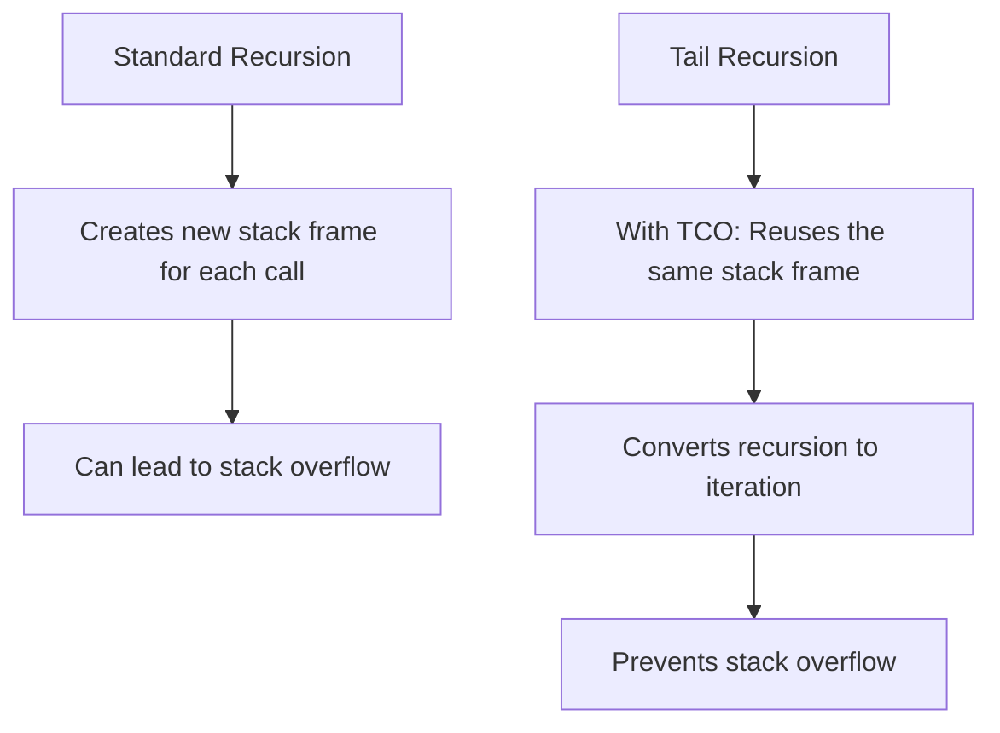

# Tail Recursion

## Introduction

Recursion is a powerful technique in programming where a function calls itself to solve a problem. However, traditional recursion can have performance issues due to growing call stacks. **Tail recursion** is a special form of recursion that can be optimized by compilers and interpreters to avoid these issues.

In this tutorial, we'll explore what tail recursion is, how it differs from standard recursion, and how to write code that can take advantage of tail call optimization.

## What is Tail Recursion?

Tail recursion is a form of recursion where the recursive call is the **very last operation** in the function. In other words, the function does all its work before making the recursive call, and it doesn't do any additional processing with the result of the recursive call.

This special structure allows many programming languages and compilers to optimize tail-recursive functions by reusing the same stack frame for each recursive call, effectively transforming the recursion into iteration behind the scenes.

### Standard Recursion vs. Tail Recursion

Let's compare the two with a simple example - calculating the factorial of a number:

#### Standard Recursion:

```javascript
function factorial(n) {
  // Base case
  if (n <= 1) return 1;
  
  // The recursive call isn't the last operation
  // After the recursive call returns, we still need to multiply by n
  return n * factorial(n - 1);
}
```

Here's what happens when we call `factorial(5)`:

```
factorial(5)
5 * factorial(4)
5 * (4 * factorial(3))
5 * (4 * (3 * factorial(2)))
5 * (4 * (3 * (2 * factorial(1))))
5 * (4 * (3 * (2 * 1)))
5 * (4 * (3 * 2))
5 * (4 * 6)
5 * 24
120
```

Each recursive call adds a new frame to the call stack because the function needs to remember `n` to perform the multiplication after the recursive call returns.

#### Tail Recursion:

```javascript
function factorialTail(n, accumulator = 1) {
  // Base case
  if (n <= 1) return accumulator;
  
  // The recursive call is the last operation
  return factorialTail(n - 1, n * accumulator);
}
```

Here's what happens with `factorialTail(5)`:

```
factorialTail(5, 1)
factorialTail(4, 5*1)
factorialTail(4, 5)
factorialTail(3, 4*5)
factorialTail(3, 20)
factorialTail(2, 3*20)
factorialTail(2, 60)
factorialTail(1, 2*60)
factorialTail(1, 120)
120
```

With tail recursion, each step is completely finished before the recursive call, and there's no need to keep track of previous values in the stack.

## How Tail Call Optimization Works

When a compiler or interpreter implements **tail call optimization (TCO)**, it can replace the recursive call with a jump instruction, essentially reusing the current stack frame instead of creating a new one.



Without tail call optimization, even tail-recursive functions would still consume stack space. The optimization is what enables tail-recursive functions to run in constant stack space.

## Converting Regular Recursion to Tail Recursion

Converting a recursive function to use tail recursion typically involves adding an **accumulator parameter** that keeps track of the partial results. Let's see how to convert some common recursive functions:

### Example 1: Sum of an Array

#### Regular Recursion:

```javascript
function sum(arr) {
  if (arr.length === 0) return 0;
  return arr[0] + sum(arr.slice(1));
}
```

#### Tail Recursive Version:

```javascript
function sumTail(arr, accumulator = 0) {
  if (arr.length === 0) return accumulator;
  return sumTail(arr.slice(1), accumulator + arr[0]);
}
```

### Example 2: Fibonacci Sequence

#### Regular Recursion (Inefficient):

```javascript
function fibonacci(n) {
  if (n <= 1) return n;
  return fibonacci(n - 1) + fibonacci(n - 2);
}
```

#### Tail Recursive Version:

```javascript
function fibonacciTail(n, a = 0, b = 1) {
  if (n === 0) return a;
  return fibonacciTail(n - 1, b, a + b);
}
```

## Practical Applications

### 1. Processing Large Datasets

Tail recursion is particularly useful when processing large datasets where traditional recursion might cause stack overflow:

```javascript
function processLargeArray(array, index = 0, results = []) {
  if (index >= array.length) return results;
  
  // Process the current element
  const processedValue = someTransformation(array[index]);
  results.push(processedValue);
  
  // Tail recursive call
  return processLargeArray(array, index + 1, results);
}
```

### 2. Traversing Tree Structures

While tree traversal often uses traditional recursion, we can use tail recursion for certain types of traversals:

```javascript
function flattenTree(node, result = []) {
  if (!node) return result;
  
  // Add current node's value
  result.push(node.value);
  
  // Process left subtree
  flattenTree(node.left, result);
  
  // Tail recursive call for right subtree
  return flattenTree(node.right, result);
}
```

### 3. Functional Programming Paradigms

In functional programming languages, tail recursion is the preferred way to express loops:

```javascript
// Using tail recursion to implement a map function
function mapTR(fn, arr, index = 0, result = []) {
  if (index >= arr.length) return result;
  
  result.push(fn(arr[index]));
  return mapTR(fn, arr, index + 1, result);
}

// Example usage
const doubled = mapTR(x => x * 2, [1, 2, 3, 4, 5]);
// doubled is [2, 4, 6, 8, 10]
```

## Language Support for Tail Call Optimization

Not all programming languages optimize tail recursive calls. Here's a quick summary of popular languages:

- **Supported**: Scheme, Scala, Erlang, Elixir, Haskell, F#
- **Partially Supported**: JavaScript (only in strict mode in some engines)
- **Not Supported**: Python, Java, C++, Ruby (traditional implementations)

Even in languages without TCO, writing tail-recursive functions is still considered a good practice as it often leads to clearer code.

## Common Pitfalls and Tips

1. **Ensure the recursive call is truly the last operation**:

   ```javascript
   // Not tail recursive
   function notTail(n) {
     if (n <= 0) return 0;
     const result = notTail(n - 1);
     return result + n; // Additional operation after recursive call
   }
   
   // Tail recursive
   function tail(n, acc = 0) {
     if (n <= 0) return acc;
     return tail(n - 1, acc + n); // Nothing happens after the recursive call
   }
   ```

2. **Watch out for hidden operations**:

   ```javascript
   // Not tail recursive despite appearances
   function sneaky(n) {
     if (n <= 0) return 1;
     return n * sneaky(n - 1); // Multiplication happens after recursion
   }
   ```

3. **Be mindful of wrapper functions**:

   ```javascript
   // The inner function call is tail recursive, but outer is not
   function wrapper(n) {
     function innerTail(n, acc) {
       if (n <= 0) return acc;
       return innerTail(n - 1, acc + n);
     }
     return innerTail(n, 0); // Not the last operation in wrapper
   }
   ```

## Summary

Tail recursion is a powerful technique that, when supported by the language implementation, allows recursive functions to execute with the efficiency of iterative solutions. Key points to remember:

1. A function is tail-recursive when the recursive call is the last operation
2. Tail call optimization (TCO) allows recursive functions to run without growing the call stack
3. Converting to tail recursion typically involves using an accumulator parameter
4. Not all languages support TCO, but the pattern is still useful
5. Tail recursion is particularly important in functional programming

## Exercises

1. Convert this recursive function to use tail recursion:
   ```javascript
   function power(base, exponent) {
     if (exponent === 0) return 1;
     return base * power(base, exponent - 1);
   }
   ```

2. Implement a tail-recursive function to reverse a string.

3. Write a tail-recursive function to count the number of elements in a linked list.

4. Convert the following recursive binary search to use tail recursion:
   ```javascript
   function binarySearch(arr, target, left = 0, right = arr.length - 1) {
     if (left > right) return -1;
     
     const mid = Math.floor((left + right) / 2);
     
     if (arr[mid] === target) return mid;
     if (arr[mid] > target) return binarySearch(arr, target, left, mid - 1);
     return binarySearch(arr, target, mid + 1, right);
   }
   ```

5. Research whether your preferred programming language supports tail call optimization and test it with some examples.

## Additional Resources

- [Proper Tail Recursion (SCHEME)](https://www.cs.cornell.edu/courses/cs3110/2014sp/lectures/26/tail-recursion.pdf)
- [Recursion vs. Iteration](https://www.geeksforgeeks.org/difference-between-recursion-and-iteration/)
- [Understanding Recursion in JavaScript](https://www.freecodecamp.org/news/understanding-recursion-in-javascript/)
- [Tail Call Optimization in JavaScript](https://2ality.com/2015/06/tail-call-optimization.html)

Happy coding!