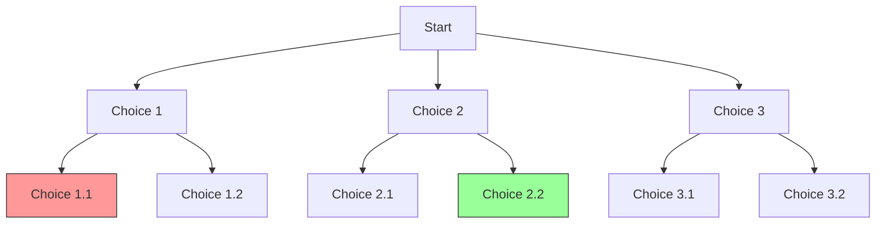

# Backtracking Fundamentals

## Introduction

Have you ever been stuck in a maze and needed to retrace your steps when you hit a dead end? That intuitive process of trying different paths, backing up when necessary, and continuing until you find the exit is essentially what **backtracking** is all about in programming.

Backtracking is a refined algorithmic technique built on recursion that systematically searches for solutions to computational problems. It works by incrementally building candidates for solutions and abandoning a candidate ("backtracking") as soon as it determines the candidate cannot possibly lead to a valid solution.

In this tutorial, you'll learn:
- What backtracking is and how it works
- The general framework for backtracking algorithms
- Common backtracking problems and their solutions
- When to use backtracking (and when not to)

## Understanding Backtracking

### What is Backtracking?

Backtracking is an algorithmic paradigm that tries different solutions until finding the correct one. It builds the solution incrementally, one piece at a time, and abandons a path as soon as it determines that it cannot lead to a valid solution.

Think of backtracking like exploring a tree of possibilities:



At each step, we try one choice. If that leads to a dead end, we *backtrack* to the previous step and try a different choice.

### The General Pattern

Most backtracking algorithms follow this general structure:

```python
def backtrack(candidate):
    if is_solution(candidate):
        output_solution(candidate)
        return
    
    for next_candidate in generate_candidates(candidate):
        if is_valid(next_candidate):
            # Try this candidate as part of the solution
            place(next_candidate)
            
            # Recur to build the rest of the solution
            backtrack(next_candidate)
            
            # Backtrack: undo the choice to try other possibilities
            remove(next_candidate)
```

This framework helps us organize our thinking when solving backtracking problems.

## Backtracking in Action: N-Queens Problem

Let's understand backtracking through a classic example: the N-Queens problem.

**Problem**: Place N queens on an N×N chessboard so that no two queens attack each other.

### The Approach

1. Start with an empty chessboard
2. Try placing queens one row at a time
3. When placing a queen, check if it conflicts with others
4. If a conflict is found, backtrack and try the next position
5. If all queens are placed successfully, we've found a solution

### Code Implementation

```python
def solve_n_queens(n):
    board = [['.' for _ in range(n)] for _ in range(n)]
    solutions = []
    
    def backtrack(row):
        # Base case: If all queens are placed
        if row == n:
            # Add the current board configuration to solutions
            solutions.append([''.join(row) for row in board])
            return
        
        # Try placing a queen in each column of the current row
        for col in range(n):
            if is_safe(row, col):
                # Place the queen
                board[row][col] = 'Q'
                
                # Recur to place queens in subsequent rows
                backtrack(row + 1)
                
                # Backtrack: remove the queen to try other positions
                board[row][col] = '.'
    
    def is_safe(row, col):
        # Check if no queen attacks this position
        
        # Check column (rows above)
        for i in range(row):
            if board[i][col] == 'Q':
                return False
        
        # Check upper-left diagonal
        for i, j in zip(range(row-1, -1, -1), range(col-1, -1, -1)):
            if board[i][j] == 'Q':
                return False
        
        # Check upper-right diagonal
        for i, j in zip(range(row-1, -1, -1), range(col+1, n)):
            if board[i][j] == 'Q':
                return False
        
        return True
    
    # Start backtracking from the first row
    backtrack(0)
    return solutions
```

### Example Output

For n = 4:

```
[
  [".Q..",
   "...Q",
   "Q...",
   "..Q."],
   
  ["..Q.",
   "Q...",
   "...Q",
   ".Q.."]
]
```

This represents two possible arrangements of 4 queens on a 4×4 chessboard where no queen can attack another.

## Solving a Sudoku Puzzle with Backtracking

Another perfect application of backtracking is solving a Sudoku puzzle.

### The Problem

Fill a 9×9 grid with digits from 1-9 such that each row, column, and 3×3 subgrid contains every digit exactly once.

### Backtracking Solution

```python
def solve_sudoku(board):
    # Find an empty cell
    row, col = find_empty(board)
    
    # If there's no empty cell, we're done
    if row is None:
        return True
    
    # Try digits 1-9 for the empty cell
    for num in range(1, 10):
        if is_valid(board, row, col, num):
            # Place the number
            board[row][col] = num
            
            # Recur to fill the rest of the board
            if solve_sudoku(board):
                return True
            
            # If placing num didn't work, backtrack
            board[row][col] = 0
    
    # No valid digit for this position
    return False

def find_empty(board):
    for row in range(9):
        for col in range(9):
            if board[row][col] == 0:
                return row, col
    return None, None

def is_valid(board, row, col, num):
    # Check row
    for x in range(9):
        if board[row][x] == num:
            return False
    
    # Check column
    for x in range(9):
        if board[x][col] == num:
            return False
    
    # Check 3x3 box
    box_row, box_col = 3 * (row // 3), 3 * (col // 3)
    for i in range(3):
        for j in range(3):
            if board[box_row + i][box_col + j] == num:
                return False
    
    return True
```

## Practical Example: Generating All Possible Subsets

Let's look at a simpler practical example: generating all possible subsets (the power set) of a set.

### Problem

Given a set of distinct integers, return all possible subsets.

### Backtracking Solution

```python
def subsets(nums):
    result = []
    
    def backtrack(start, current):
        # Add the current subset to our result
        result.append(current[:])
        
        # Explore further by adding more elements
        for i in range(start, len(nums)):
            # Include nums[i]
            current.append(nums[i])
            
            # Recur with the next elements
            backtrack(i + 1, current)
            
            # Backtrack: remove nums[i] to try other elements
            current.pop()
    
    backtrack(0, [])
    return result
```

### Example

```
Input: nums = [1, 2, 3]
Output: [[], [1], [1, 2], [1, 2, 3], [1, 3], [2], [2, 3], [3]]
```

### How It Works

The algorithm builds different subsets by:
1. Starting with an empty subset
2. Trying to add each element in turn
3. For each added element, recursively building all possible subsets that include it
4. Backtracking by removing the last added element before trying the next possibility

## When to Use Backtracking

Backtracking is particularly useful for problems where:

1. You need to find all (or some) solutions to a problem
2. The problem can be conceptualized as making a sequence of decisions
3. You can determine early if a partial solution cannot be completed

Common problem types well-suited to backtracking:
- Permutation problems
- Combination problems
- Partitioning problems
- Constraint satisfaction problems

### Performance Considerations

While backtracking is powerful, it often has exponential time complexity, making it unsuitable for large inputs. However, its "early pruning" ability (avoiding paths that cannot lead to solutions) makes it much more efficient than brute force approaches.

## Common Backtracking Template

To help solidify your understanding, here's a general template for backtracking problems:

```python
def backtracking_solver(input_data):
    result = []  # To store all valid solutions
    
    def backtrack(state, choices_made):
        # Check if we've found a valid solution
        if is_solution(state):
            result.append(state.copy())  # Make a copy of the current state
            return
        
        # Check if we've reached a dead end
        if is_dead_end(state):
            return
        
        # Try each possible choice
        for choice in get_possible_choices(state, choices_made):
            # Make the choice
            apply_choice(state, choice)
            choices_made.append(choice)
            
            # Recur to make more choices
            backtrack(state, choices_made)
            
            # Undo the choice (backtrack)
            choices_made.pop()
            undo_choice(state, choice)
    
    # Start the backtracking process
    backtrack(initial_state(), [])
    return result
```

## Practical Application: Word Break Problem

Here's a practical backtracking application that demonstrates how we might use this technique in real software:

**Problem**: Given a string `s` and a dictionary of valid words, determine if `s` can be segmented into a space-separated sequence of valid words.

```python
def word_break(s, wordDict):
    memo = {}  # For memoization
    
    def backtrack(start):
        if start == len(s):
            return True
        
        if start in memo:
            return memo[start]
        
        for end in range(start + 1, len(s) + 1):
            if s[start:end] in wordDict and backtrack(end):
                memo[start] = True
                return True
        
        memo[start] = False
        return False
    
    return backtrack(0)
```

**Example:**
```
Input: s = "leetcode", wordDict = ["leet", "code"]
Output: true
Explanation: "leetcode" can be segmented as "leet code".
```

This combines backtracking with memoization (dynamic programming) to avoid redundant calculations, showing how backtracking can be optimized.

## Summary

Backtracking is a powerful algorithmic technique that systematically explores potential solutions to problems:

1. It works by incrementally building candidates for solutions
2. When it determines a candidate cannot be completed to a valid solution, it abandons that partial candidate
3. It's especially useful for combinatorial problems, puzzles, and constraint satisfaction problems

While backtracking has exponential worst-case time complexity, it's often much more efficient than brute force approaches because it abandons unproductive paths early.

## Practice Exercises

To strengthen your understanding of backtracking, try these exercises:

1. **Permutations**: Generate all possible permutations of a given array of distinct integers.
2. **Combination Sum**: Given an array of distinct integers and a target sum, find all unique combinations where the numbers sum to the target.
3. **Word Search**: Given a 2D board of characters and a word, determine if the word can be constructed from adjacent characters on the board.
4. **Rat in a Maze**: Find a path for a rat from source to destination in a maze represented by a binary matrix.

## Additional Resources

- [Backtracking Introduction on GeeksforGeeks](https://www.geeksforgeeks.org/backtracking-introduction/)
- [Princeton Algorithm Course - Backtracking](https://algs4.cs.princeton.edu/lectures/)
- "Introduction to Algorithms" by Cormen, Leiserson, Rivest, and Stein (CLRS)

Remember, mastering backtracking takes practice. Start with simple problems and gradually work your way up to more complex ones. Happy coding!