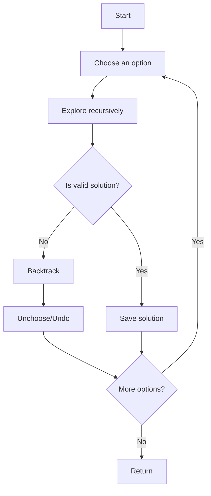

# Recursive Backtracking

## Introduction

Recursive backtracking is a powerful problem-solving technique that explores all possible solutions by incrementally building candidates and abandoning (backtracking) when it determines that a candidate cannot possibly lead to a valid solution. It's like exploring a maze – you try a path, and if it leads to a dead end, you backtrack to a previous junction and try another path.

This approach is particularly useful for solving problems where:
- You need to find all possible solutions
- You must make a sequence of decisions
- Problems have constraints that eliminate many potential solutions

Backtracking can be thought of as a "trial and error" approach performed systematically. It's widely used in puzzles, constraint satisfaction problems, and optimization challenges.

## Understanding the Concept

### The Core Idea

At its core, recursive backtracking follows this pattern:

1. **Choose**: Make a choice to explore a particular path
2. **Explore**: Recursively explore that path
3. **Unchoose**: If the path doesn't lead to a solution, undo the choice and try another

This pattern is sometimes referred to as the "choose-explore-unchoose" paradigm.



### Key Components of Recursive Backtracking

1. **Base Case**: Determines when a solution is found or when to stop exploring
2. **Choice Generation**: Identifies possible choices at each step
3. **Constraints**: Conditions that determine valid choices
4. **Goal State**: The condition that defines a complete solution

## Basic Implementation Template

Here's a general template for recursive backtracking problems:

```javascript
function backtrack(partialSolution) {
  // Base case: If we've found a solution
  if (isSolution(partialSolution)) {
    processSolution(partialSolution);
    return;
  }
  
  // Generate possible next steps
  const candidates = generateCandidates(partialSolution);
  
  // Try each candidate
  for (const candidate of candidates) {
    // Check if this candidate is valid to pursue
    if (isValid(partialSolution, candidate)) {
      // Choose - add the candidate to our solution
      addToSolution(partialSolution, candidate);
      
      // Explore - recursively search with updated solution
      backtrack(partialSolution);
      
      // Unchoose - remove the candidate from solution (backtrack)
      removeFromSolution(partialSolution, candidate);
    }
  }
}
```

## Examples and Applications

Let's explore some classic problems that can be solved using recursive backtracking.

### Example 1: Generating All Permutations

One of the simplest applications of backtracking is generating all permutations of a set of elements.

```javascript
function generatePermutations(arr) {
  const result = [];
  
  function backtrack(current, remaining) {
    // Base case: we've used all elements
    if (remaining.length === 0) {
      result.push([...current]);
      return;
    }
    
    // Try each remaining element
    for (let i = 0; i < remaining.length; i++) {
      // Choose
      const next = remaining[i];
      current.push(next);
      
      // Explore - make a new array without the chosen element
      const newRemaining = [...remaining.slice(0, i), ...remaining.slice(i + 1)];
      backtrack(current, newRemaining);
      
      // Unchoose
      current.pop();
    }
  }
  
  backtrack([], arr);
  return result;
}

// Example usage
const permutations = generatePermutations([1, 2, 3]);
console.log(permutations);
/* Output:
[
  [1, 2, 3], [1, 3, 2],
  [2, 1, 3], [2, 3, 1],
  [3, 1, 2], [3, 2, 1]
]
*/
```

### Example 2: The N-Queens Problem

The N-Queens problem is a classic example that demonstrates the power of backtracking. The challenge is to place N queens on an N×N chessboard so that no two queens threaten each other.

```javascript
function solveNQueens(n) {
  const result = [];
  const board = Array(n).fill().map(() => Array(n).fill('.'));
  
  function backtrack(row) {
    // Base case: All queens have been placed
    if (row === n) {
      // Convert board to required format and add to result
      const solution = board.map(row => row.join(''));
      result.push(solution);
      return;
    }
    
    // Try placing queen in each column of the current row
    for (let col = 0; col < n; col++) {
      if (isValid(row, col)) {
        // Choose
        board[row][col] = 'Q';
        
        // Explore
        backtrack(row + 1);
        
        // Unchoose (backtrack)
        board[row][col] = '.';
      }
    }
  }
  
  function isValid(row, col) {
    // Check column
    for (let i = 0; i < row; i++) {
      if (board[i][col] === 'Q') return false;
    }
    
    // Check upper left diagonal
    for (let i = row - 1, j = col - 1; i >= 0 && j >= 0; i--, j--) {
      if (board[i][j] === 'Q') return false;
    }
    
    // Check upper right diagonal
    for (let i = row - 1, j = col + 1; i >= 0 && j < n; i--, j++) {
      if (board[i][j] === 'Q') return false;
    }
    
    return true;
  }
  
  backtrack(0);
  return result;
}

// Example usage
const solutions = solveNQueens(4);
console.log(solutions);
/* Output:
[
  [".Q..", "...Q", "Q...", "..Q."],
  ["..Q.", "Q...", "...Q", ".Q.."]
]
*/
```

### Example 3: Sudoku Solver

Sudoku is another classic problem that can be elegantly solved with backtracking.

```javascript
function solveSudoku(board) {
  // Find an empty cell
  function findEmptyCell() {
    for (let row = 0; row < 9; row++) {
      for (let col = 0; col < 9; col++) {
        if (board[row][col] === '.') {
          return [row, col];
        }
      }
    }
    return null; // No empty cell found
  }
  
  // Check if placing number at position is valid
  function isValid(row, col, num) {
    // Check row
    for (let x = 0; x < 9; x++) {
      if (board[row][x] === num) return false;
    }
    
    // Check column
    for (let x = 0; x < 9; x++) {
      if (board[x][col] === num) return false;
    }
    
    // Check 3x3 box
    const boxRow = Math.floor(row / 3) * 3;
    const boxCol = Math.floor(col / 3) * 3;
    
    for (let i = 0; i < 3; i++) {
      for (let j = 0; j < 3; j++) {
        if (board[boxRow + i][boxCol + j] === num) return false;
      }
    }
    
    return true;
  }
  
  function solve() {
    const emptyCell = findEmptyCell();
    
    // Base case: no empty cells means we've solved the puzzle
    if (!emptyCell) return true;
    
    const [row, col] = emptyCell;
    
    // Try digits 1-9
    for (let num = 1; num <= 9; num++) {
      const strNum = String(num);
      
      // Check if we can place this number
      if (isValid(row, col, strNum)) {
        // Choose
        board[row][col] = strNum;
        
        // Explore
        if (solve()) {
          return true; // Solution found
        }
        
        // Unchoose (backtrack)
        board[row][col] = '.';
      }
    }
    
    return false; // Trigger backtracking
  }
  
  solve();
  return board;
}

// Example usage
const sudokuPuzzle = [
  ["5","3",".",".","7",".",".",".","."],
  ["6",".",".","1","9","5",".",".","."],
  [".","9","8",".",".",".",".","6","."],
  ["8",".",".",".","6",".",".",".","3"],
  ["4",".",".","8",".","3",".",".","1"],
  ["7",".",".",".","2",".",".",".","6"],
  [".","6",".",".",".",".","2","8","."],
  [".",".",".","4","1","9",".",".","5"],
  [".",".",".",".","8",".",".","7","9"]
];

const solvedPuzzle = solveSudoku(sudokuPuzzle);
console.log(solvedPuzzle);
/* Output would be the solved sudoku board */
```

## Real-World Applications

Recursive backtracking is not just for puzzles; it has practical applications in many areas:

1. **Path Finding**: Finding routes in maps or networks
2. **Constraint Satisfaction Problems**: Scheduling, resource allocation
3. **Game AI**: Analyzing possible moves in games like chess
4. **Combinatorial Optimization**: Finding optimal arrangements or selections
5. **Pattern Matching**: Advanced string matching algorithms

### Example: Simple Maze Solver

Here's a real-world application - solving a maze:

```javascript
function solveMaze(maze) {
  const height = maze.length;
  const width = maze[0].length;
  const solution = Array(height).fill().map(() => Array(width).fill(0));
  
  function backtrack(row, col) {
    // Check if current position is valid and not a wall
    if (row < 0 || row >= height || col < 0 || col >= width || maze[row][col] === 1 || solution[row][col] === 1) {
      return false;
    }
    
    // Mark the current cell as part of solution path
    solution[row][col] = 1;
    
    // Check if we've reached the destination (bottom-right corner)
    if (row === height - 1 && col === width - 1) {
      return true; // Maze solved!
    }
    
    // Try to move in all four directions
    // Right
    if (backtrack(row, col + 1)) return true;
    // Down
    if (backtrack(row + 1, col)) return true;
    // Left
    if (backtrack(row, col - 1)) return true;
    // Up
    if (backtrack(row - 1, col)) return true;
    
    // If no direction leads to solution, backtrack
    solution[row][col] = 0;
    return false;
  }
  
  // Start from top-left (0,0)
  if (backtrack(0, 0)) {
    return solution; // Return path if found
  } else {
    return null; // No solution exists
  }
}

// Example usage
const maze = [
  [0, 0, 1, 0],
  [1, 0, 0, 0],
  [0, 1, 0, 1],
  [0, 0, 0, 0]
];
// 0 represents open path, 1 represents wall

const solution = solveMaze(maze);
console.log(solution);
/* Output:
[
  [1, 1, 0, 0],
  [0, 1, 0, 0],
  [0, 1, 1, 0],
  [0, 0, 1, 1]
]
*/
```

## Common Optimization Techniques

While backtracking is powerful, it can be slow for large problems due to its exhaustive nature. Here are some techniques to optimize it:

1. **Early Pruning**: Check constraints as early as possible to avoid exploring invalid paths
2. **Order Heuristics**: Try the most promising candidates first
3. **Memoization**: Store and reuse results of already solved subproblems
4. **Symmetry Breaking**: Avoid exploring paths that are symmetric to ones already explored

## Common Pitfalls and Tips

1. **Infinite Recursion**: Ensure your base case is reachable
2. **Forgetting to Backtrack**: Make sure to undo all changes when backtracking
3. **Inefficient Constraints**: Implement constraint checking efficiently
4. **Stack Overflow**: Be aware of recursion depth limits
5. **State Modification**: Be careful about modifying shared state

## Summary

Recursive backtracking is a versatile problem-solving technique that works by:
1. Exploring potential solutions incrementally
2. Using recursion to build and track partial solutions
3. Abandoning paths that can't lead to valid solutions
4. Systematically exploring all possibilities

It's particularly powerful for constraint-based problems or when you need to find all possible solutions. While not always the most efficient algorithm, it's a fundamental technique that every programmer should understand.

## Exercises

To strengthen your understanding of recursive backtracking, try these exercises:

1. **Word Search**: Write a function to find if a word exists in a 2D grid of characters.
2. **Subset Sum**: Find all subsets of an array that sum to a specific target.
3. **Knight's Tour**: Find a sequence of moves for a knight that visits every square on a chess board exactly once.
4. **Coloring Problem**: Color a graph using at most k colors so that no adjacent vertices share the same color.
5. **Rat in a Maze**: Implement a variation of the maze solving problem where multiple paths are possible and you need to find the shortest one.

## Additional Resources

- "Introduction to Algorithms" by Thomas H. Cormen, Charles E. Leiserson, Ronald L. Rivest, and Clifford Stein
- "Algorithm Design Manual" by Steven S. Skiena
- Online platforms like LeetCode, HackerRank, and CodeSignal have many backtracking problems to practice

Remember that mastering recursive backtracking comes with practice. Start with simple problems and gradually work your way up to more complex ones!