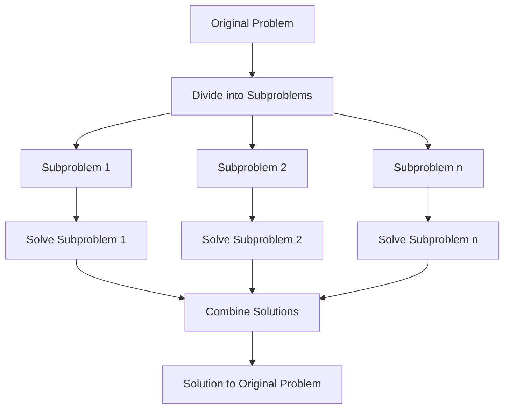

# Divide and Conquer

Divide and Conquer is a powerful algorithmic paradigm that breaks down complex problems into smaller, more manageable subproblems, solves them independently, and then combines their solutions to solve the original problem. This technique is a cornerstone of efficient algorithm design and is widely used in various applications.

## What is Divide and Conquer?

The Divide and Conquer approach consists of three main steps:

1. **Divide**: Break the original problem into smaller subproblems.
2. **Conquer**: Solve the subproblems recursively.
3. **Combine**: Merge the solutions of the subproblems to create a solution for the original problem.



## Why Use Divide and Conquer?

- **Efficiency**: Many divide and conquer algorithms have optimal time complexity (e.g., O(n log n) for sorting algorithms).
- **Parallelism**: Subproblems can often be solved independently, making them suitable for parallel processing.
- **Clarity**: The approach often leads to cleaner, more understandable code for complex problems.

## Common Divide and Conquer Algorithms

### 1. Binary Search

Binary search finds the position of a target value within a sorted array by repeatedly dividing the search interval in half.

```javascript
function binarySearch(arr, target, left = 0, right = arr.length - 1) {
  // Base case: element not found
  if (left > right) {
    return -1;
  }
  
  // Find middle index
  const mid = Math.floor((left + right) / 2);
  
  // Found the element
  if (arr[mid] === target) {
    return mid;
  }
  
  // Decide which half to search
  if (arr[mid] > target) {
    // Search in the left half
    return binarySearch(arr, target, left, mid - 1);
  } else {
    // Search in the right half
    return binarySearch(arr, target, mid + 1, right);
  }
}

// Example usage
const sortedArray = [2, 3, 5, 7, 11, 13, 17, 19, 23];
console.log(binarySearch(sortedArray, 11)); // Output: 4
console.log(binarySearch(sortedArray, 6));  // Output: -1
```

### 2. Merge Sort

Merge Sort is an efficient, stable sorting algorithm that uses the divide and conquer approach.

```javascript
function mergeSort(arr) {
  // Base case: array with 0 or 1 element is already sorted
  if (arr.length <= 1) {
    return arr;
  }
  
  // Divide the array into two halves
  const mid = Math.floor(arr.length / 2);
  const leftHalf = arr.slice(0, mid);
  const rightHalf = arr.slice(mid);
  
  // Recursively sort both halves
  const sortedLeft = mergeSort(leftHalf);
  const sortedRight = mergeSort(rightHalf);
  
  // Merge the sorted halves
  return merge(sortedLeft, sortedRight);
}

function merge(left, right) {
  let result = [];
  let leftIndex = 0;
  let rightIndex = 0;
  
  // Compare elements from both arrays and add smaller one to result
  while (leftIndex < left.length && rightIndex < right.length) {
    if (left[leftIndex] < right[rightIndex]) {
      result.push(left[leftIndex]);
      leftIndex++;
    } else {
      result.push(right[rightIndex]);
      rightIndex++;
    }
  }
  
  // Add remaining elements
  return result.concat(left.slice(leftIndex)).concat(right.slice(rightIndex));
}

// Example usage
const unsortedArray = [38, 27, 43, 3, 9, 82, 10];
console.log(mergeSort(unsortedArray)); // Output: [3, 9, 10, 27, 38, 43, 82]
```

### 3. Quick Sort

Quick Sort is another efficient sorting algorithm that uses divide and conquer.

```javascript
function quickSort(arr, low = 0, high = arr.length - 1) {
  if (low < high) {
    // Partition the array and get the pivot index
    const pivotIndex = partition(arr, low, high);
    
    // Recursively sort elements before and after the pivot
    quickSort(arr, low, pivotIndex - 1);
    quickSort(arr, pivotIndex + 1, high);
  }
  
  return arr;
}

function partition(arr, low, high) {
  // Choose the rightmost element as pivot
  const pivot = arr[high];
  let i = low - 1;
  
  // Move all elements smaller than pivot to the left
  for (let j = low; j < high; j++) {
    if (arr[j] <= pivot) {
      i++;
      [arr[i], arr[j]] = [arr[j], arr[i]]; // Swap elements
    }
  }
  
  // Place pivot in its correct position
  [arr[i + 1], arr[high]] = [arr[high], arr[i + 1]];
  return i + 1; // Return pivot index
}

// Example usage
const unsortedArray = [10, 7, 8, 9, 1, 5];
console.log(quickSort(unsortedArray)); // Output: [1, 5, 7, 8, 9, 10]
```

## Real-world Applications

### 1. Fast Fourier Transform (FFT)

FFT is an algorithm that computes the Discrete Fourier Transform of a sequence, reducing the complexity from O(n²) to O(n log n). It's widely used in:
- Digital signal processing
- Image processing
- Audio compression (MP3, AAC)
- Multiplying large integers

### 2. Closest Pair of Points

Finding the closest pair of points in a set is efficiently solved using divide and conquer:

```javascript
function closestPair(points) {
  // Sort points by x-coordinate
  points.sort((a, b) => a.x - b.x);
  
  // Find closest pair recursively
  return findClosest(points, 0, points.length - 1);
}

function findClosest(points, start, end) {
  // Base cases
  if (end - start <= 2) {
    return bruteForceClosest(points, start, end);
  }
  
  // Divide points into two halves
  const mid = Math.floor((start + end) / 2);
  const midPoint = points[mid];
  
  // Recursively find minimum distance in both halves
  const leftMin = findClosest(points, start, mid);
  const rightMin = findClosest(points, mid + 1, end);
  
  // Find minimum of two minimums
  let minDist = Math.min(leftMin, rightMin);
  
  // Build a strip of points that are potentially closer
  const strip = [];
  for (let i = start; i <= end; i++) {
    if (Math.abs(points[i].x - midPoint.x) < minDist) {
      strip.push(points[i]);
    }
  }
  
  // Sort the strip by y-coordinate
  strip.sort((a, b) => a.y - b.y);
  
  // Find closest points in the strip
  for (let i = 0; i < strip.length; i++) {
    for (let j = i + 1; j < strip.length && (strip[j].y - strip[i].y) < minDist; j++) {
      const dist = distance(strip[i], strip[j]);
      minDist = Math.min(minDist, dist);
    }
  }
  
  return minDist;
}

function bruteForceClosest(points, start, end) {
  let minDist = Infinity;
  for (let i = start; i <= end; i++) {
    for (let j = i + 1; j <= end; j++) {
      minDist = Math.min(minDist, distance(points[i], points[j]));
    }
  }
  return minDist;
}

function distance(p1, p2) {
  return Math.sqrt(Math.pow(p1.x - p2.x, 2) + Math.pow(p1.y - p2.y, 2));
}

// Example usage
const points = [
  { x: 2, y: 3 },
  { x: 12, y: 30 },
  { x: 40, y: 50 },
  { x: 5, y: 1 },
  { x: 6, y: 2 }
];
console.log(closestPair(points)); // Output: 1.4142135623730951 (distance between (5,1) and (6,2))
```

### 3. Strassen's Matrix Multiplication

Traditional matrix multiplication has O(n³) complexity, but Strassen's algorithm uses divide and conquer to achieve approximately O(n^2.8074) complexity.

## How to Approach Divide and Conquer Problems

1. **Identify the base case(s)**: Determine when the problem is small enough to solve directly.
2. **Define the divide step**: Figure out how to break the problem into smaller subproblems.
3. **Implement the conquer step**: Solve the subproblems recursively.
4. **Implement the combine step**: Determine how to merge the solutions to subproblems.

## Performance Analysis

The time complexity of divide and conquer algorithms can often be expressed using the Master Theorem:

For a recurrence relation of the form:
T(n) = a T(n/b) + O(n^d)

Where:
- a is the number of subproblems
- b is the factor by which the input size is reduced
- O(n^d) is the cost of dividing and combining

The solution depends on the relationship between d and log_b(a):

1. If d < log_b(a), then T(n) = O(n^(log_b(a)))
2. If d = log_b(a), then T(n) = O(n^d log n)
3. If d > log_b(a), then T(n) = O(n^d)

## Common Pitfalls

1. **Incorrect base case**: Make sure your base case correctly handles the smallest possible input.
2. **Inefficient combinations**: The combine step should not negate the efficiency gains from dividing.
3. **Unbalanced divisions**: Try to divide the problem into roughly equal parts for optimal performance.

## Summary

Divide and Conquer is a powerful algorithmic paradigm that breaks complex problems into smaller, manageable subproblems. It's the foundation for many efficient algorithms including binary search, merge sort, and quicksort.

The key benefits include improved efficiency, potential for parallelization, and clearer code structure for complex problems. By mastering the divide and conquer approach, you can tackle a wide range of programming challenges more efficiently.

## Exercises

1. Implement a divide and conquer algorithm to find the maximum and minimum elements in an array with minimum comparisons.
2. Use the divide and conquer approach to compute the n-th Fibonacci number in O(log n) time.
3. Implement a divide and conquer algorithm for the Tower of Hanoi problem.
4. Create a function that uses divide and conquer to count the number of inversions in an array.
5. Implement the Karatsuba algorithm for fast multiplication of large integers.

## Additional Resources

- "Introduction to Algorithms" by Cormen, Leiserson, Rivest, and Stein
- "Algorithms" by Robert Sedgewick and Kevin Wayne
- "The Algorithm Design Manual" by Steven Skiena

By mastering the Divide and Conquer technique, you'll be able to solve complex problems efficiently and write algorithms that scale well with input size.