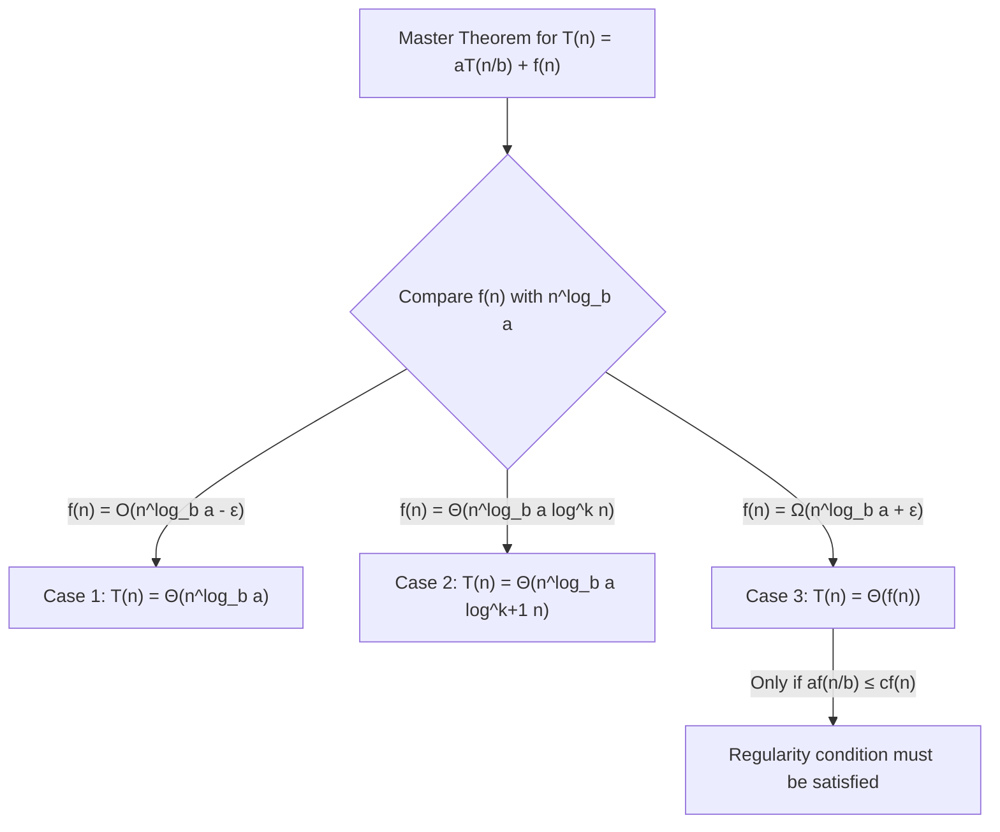

# Master Theorem

## Introduction

When you're working with recursive algorithms, especially those that follow a divide-and-conquer strategy, understanding their time complexity becomes crucial. The **Master Theorem** is a mathematical formula that provides a convenient way to analyze the time complexity of many recursive algorithms without solving recurrence relations from scratch.

This theorem applies to recurrence relations of the form:

$$T(n) = aT(n/b) + f(n)$$

Where:
- $T(n)$ is the time complexity function
- $a ≥ 1$ is the number of recursive subproblems
- $b > 1$ is the factor by which the problem size shrinks
- $f(n)$ is the cost of dividing the problem and combining solutions

## Understanding the Formula

Let's break down what each part of the formula means in plain English:

- **$T(n)$**: The time it takes to solve a problem of size $n$
- **$a$**: How many subproblems we create
- **$n/b$**: The size of each subproblem (reduced by a factor of $b$)
- **$f(n)$**: The work done outside of the recursive calls (dividing the problem and combining results)

## The Three Cases of the Master Theorem

The Master Theorem gives us three cases to determine the asymptotic behavior of $T(n)$:

### Case 1: When the work to split/combine is less important

If $f(n) = O(n^{\log_b a-\epsilon})$ for some constant $\epsilon > 0$, then:

$$T(n) = \Theta(n^{\log_b a})$$

**In simpler terms**: If the work to split and combine solutions grows slower than the recursive work, the recursive work dominates.

### Case 2: When the split/combine work is comparable

If $f(n) = \Theta(n^{\log_b a} \log^k n)$ for some $k \geq 0$, then:

$$T(n) = \Theta(n^{\log_b a} \log^{k+1} n)$$

**In simpler terms**: If the split/combine work is comparable to the recursive work, we get the recursive work with an extra logarithmic factor.

### Case 3: When the split/combine work dominates

If $f(n) = \Omega(n^{\log_b a+\epsilon})$ for some constant $\epsilon > 0$, and if $af(n/b) \leq cf(n)$ for some $c < 1$ and sufficiently large $n$, then:

$$T(n) = \Theta(f(n))$$

**In simpler terms**: If the work to split/combine dominates the work done by the recursion, then the overall complexity is just the complexity of that split/combine work.

## Examples with Step-by-Step Analysis

Let's analyze some common recursive algorithms using the Master Theorem:

### Example 1: Binary Search

Binary search divides the search space in half each time:

```java
int binarySearch(int[] array, int target, int left, int right) {
    if (left > right) return -1;
    
    int mid = left + (right - left) / 2;
    
    if (array[mid] == target) return mid;
    else if (array[mid] > target) return binarySearch(array, target, left, mid - 1);
    else return binarySearch(array, target, mid + 1, right);
}
```

For binary search:
- $a = 1$ (one recursive call)
- $b = 2$ (problem size is halved)
- $f(n) = O(1)$ (constant work outside the recursion)

Let's apply the Master Theorem:
1. Calculate $n^{\log_b a} = n^{\log_2 1} = n^0 = 1$
2. Compare $f(n) = O(1)$ with $n^{\log_b a} = 1$
3. Since $f(n) = O(1) = O(n^0)$, this is Case 2 with $k = 0$
4. Therefore, $T(n) = \Theta(\log n)$

So binary search has a time complexity of $\Theta(\log n)$.

### Example 2: Merge Sort

Merge sort divides the array in half and sorts each half recursively:

```java
void mergeSort(int[] arr, int left, int right) {
    if (left < right) {
        int mid = left + (right - left) / 2;
        
        mergeSort(arr, left, mid);       // Sort left half
        mergeSort(arr, mid + 1, right);  // Sort right half
        
        merge(arr, left, mid, right);    // Merge the sorted halves
    }
}
```

For merge sort:
- $a = 2$ (two recursive calls)
- $b = 2$ (problem size is halved)
- $f(n) = O(n)$ (merging takes linear time)

Let's apply the Master Theorem:
1. Calculate $n^{\log_b a} = n^{\log_2 2} = n^1 = n$
2. Compare $f(n) = O(n)$ with $n^{\log_b a} = n$
3. Since $f(n) = \Theta(n) = \Theta(n^{\log_b a})$, this is Case 2 with $k = 0$
4. Therefore, $T(n) = \Theta(n \log n)$

So merge sort has a time complexity of $\Theta(n \log n)$.

### Example 3: Fast Integer Multiplication (Karatsuba's Algorithm)

A recursive algorithm for multiplying two n-digit numbers:

```python
def karatsuba(x, y):
    # Base case for recursion
    if x < 10 or y < 10:
        return x * y
    
    # Calculate the size of the numbers
    n = max(len(str(x)), len(str(y)))
    m = n // 2
    
    # Split the digit sequences
    power = 10**m
    a, b = x // power, x % power
    c, d = y // power, y % power
    
    # Recursive steps
    ac = karatsuba(a, c)
    bd = karatsuba(b, d)
    abcd = karatsuba(a+b, c+d) - ac - bd
    
    # Combine the results
    return ac * (10 ** (2*m)) + abcd * (10 ** m) + bd
```

For Karatsuba's algorithm:
- $a = 3$ (three recursive calls)
- $b = 2$ (problem size is halved)
- $f(n) = O(n)$ (splitting and combining takes linear time)

Let's apply the Master Theorem:
1. Calculate $n^{\log_b a} = n^{\log_2 3} \approx n^{1.585}$
2. Compare $f(n) = O(n)$ with $n^{\log_b a} \approx n^{1.585}$
3. Since $f(n) = O(n) = O(n^{\log_b a - 0.585})$, this is Case 1
4. Therefore, $T(n) = \Theta(n^{\log_2 3}) \approx \Theta(n^{1.585})$

So Karatsuba's multiplication has a time complexity of $\Theta(n^{\log_2 3})$, which is better than the naive $O(n^2)$ approach.

## Visual Representation of the Master Theorem Cases



## Practical Applications

The Master Theorem is extremely useful in analyzing many common algorithms:

### 1. Sorting Algorithms
- **Merge Sort**: T(n) = 2T(n/2) + O(n) → O(n log n)
- **Quicksort** (average case): T(n) = 2T(n/2) + O(n) → O(n log n)

### 2. Search Algorithms
- **Binary Search**: T(n) = T(n/2) + O(1) → O(log n)

### 3. Matrix Operations
- **Strassen's Matrix Multiplication**: T(n) = 7T(n/2) + O(n²) → O(n^log₂7) ≈ O(n^2.81)

### 4. Closest Pair of Points
- **Divide-and-conquer approach**: T(n) = 2T(n/2) + O(n log n) → O(n log² n)

### 5. Fast Fourier Transform (FFT)
- **Cooley-Tukey algorithm**: T(n) = 2T(n/2) + O(n) → O(n log n)

## Limitations of the Master Theorem

While powerful, the Master Theorem doesn't apply to all recurrence relations:

1. The subproblems must be of equal size (n/b)
2. The recurrence must be in the exact form T(n) = aT(n/b) + f(n)
3. It doesn't apply when a is not a constant
4. It doesn't apply when the subproblem size doesn't reduce by a constant factor

For such cases, other techniques like recursion trees or substitution method must be used.

## When the Master Theorem Doesn't Apply

Here are some examples where the Master Theorem doesn't apply:

1. **Uneven division**: T(n) = T(n/3) + T(2n/3) + O(n)
2. **Non-standard form**: T(n) = T(n-1) + n
3. **Variable subproblems**: T(n) = T(√n) + 1

## Summary

The Master Theorem is a powerful tool that simplifies the analysis of many divide-and-conquer recursive algorithms. By categorizing the recurrence relation into one of three cases, you can determine the asymptotic complexity without solving the recurrence relation from scratch.

Remember the key steps:
1. Express your recurrence in the form T(n) = aT(n/b) + f(n)
2. Calculate n^log_b a
3. Compare this value with f(n) to determine which case applies
4. Apply the corresponding formula to find the time complexity

Mastering this theorem will make algorithm analysis much more straightforward and is an essential skill for any computer scientist or software engineer working with complex algorithms.

## Practice Exercises

1. Analyze the recurrence relation T(n) = 4T(n/2) + n².
2. Determine the time complexity of T(n) = 3T(n/4) + n log n.
3. Find the asymptotic complexity of T(n) = 2T(n/2) + n/log n.
4. Analyze the recurrence relation T(n) = T(n/2) + T(n/3) + n. (Hint: The Master Theorem doesn't directly apply here.)
5. Consider a modified binary search where you check 3 elements at each step. Express the recurrence relation and solve it using the Master Theorem.

## Additional Resources

- **Introduction to Algorithms** by Thomas H. Cormen, Charles E. Leiserson, Ronald L. Rivest, and Clifford Stein (CLRS) - Chapter on "Divide-and-Conquer" provides an in-depth treatment of the Master Theorem
- **Algorithms** by Robert Sedgewick and Kevin Wayne - Contains practical applications of the Master Theorem
- **Algorithm Design Manual** by Steven Skiena - Gives practical context to theoretical concepts like the Master Theorem

As you continue your algorithm journey, the Master Theorem will become an invaluable tool in your analytical arsenal. Practice applying it to various recurrence relations to gain confidence in algorithm analysis.