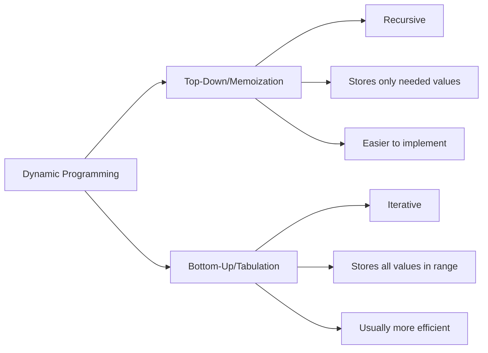

# Dynamic Programming Introduction

## What is Dynamic Programming?

Dynamic Programming (DP) is a powerful algorithmic technique used to solve complex problems by breaking them down into simpler subproblems. It's particularly useful for optimization problems where we need to find the best possible solution among many possibilities.

The term "Dynamic Programming" was coined by mathematician Richard Bellman in the 1950s. Despite its name, it has nothing to do with dynamic code or programming in the conventional sense. Instead, it refers to a method of solving problems by caching the results of overlapping subproblems to avoid redundant calculations.

## Core Principles of Dynamic Programming

Dynamic Programming works on two fundamental principles:

1. **Optimal Substructure**: A problem has optimal substructure if an optimal solution can be constructed from optimal solutions of its subproblems.

2. **Overlapping Subproblems**: A problem has overlapping subproblems if the same subproblems need to be solved multiple times when finding the overall solution.

If a problem satisfies both of these properties, Dynamic Programming can be applied to solve it efficiently.

## When to Use Dynamic Programming

DP is particularly useful for problems with the following characteristics:

- The problem can be broken down into smaller subproblems
- There are overlapping subproblems (same calculations repeated multiple times)
- The problem requires finding an optimal value (maximum, minimum, etc.)
- A greedy approach doesn't work

Common problem domains include:
- Optimization problems
- Combinatorial problems
- Sequence alignment
- Resource allocation

## Implementation Approaches

There are two primary approaches to implement Dynamic Programming:

### 1. Top-Down Approach (Memoization)

Memoization is a top-down approach where we start with the original problem and break it down into subproblems. We use recursion to solve these subproblems and store the results in a cache (usually an array or a hash map) to avoid redundant calculations.

```javascript
// Example: Fibonacci sequence with memoization
function fibonacci(n, memo = {}) {
  // Base cases
  if (n <= 1) return n;
  
  // Check if we've already calculated this value
  if (memo[n]) return memo[n];
  
  // Calculate and store the result
  memo[n] = fibonacci(n - 1, memo) + fibonacci(n - 2, memo);
  return memo[n];
}

console.log(fibonacci(10)); // Output: 55
console.log(fibonacci(40)); // Output: 102334155 (calculates much faster than naive recursion)
```

### 2. Bottom-Up Approach (Tabulation)

Tabulation is a bottom-up approach where we start with the smallest subproblems and work our way up to the original problem. We use an iterative approach and store the results in a table (usually an array).

```javascript
// Example: Fibonacci sequence with tabulation
function fibonacciTabulation(n) {
  // Create a table to store results
  const dp = new Array(n + 1).fill(0);
  
  // Base cases
  dp[0] = 0;
  dp[1] = 1;
  
  // Fill the table bottom-up
  for (let i = 2; i <= n; i++) {
    dp[i] = dp[i - 1] + dp[i - 2];
  }
  
  return dp[n];
}

console.log(fibonacciTabulation(10)); // Output: 55
console.log(fibonacciTabulation(40)); // Output: 102334155
```

## Comparing the Approaches

Let's compare the two approaches:



| Approach | Pros | Cons |
|----------|------|------|
| Memoization (Top-Down) | - Easier to implement<br />- Only calculates needed values<br />- More intuitive | - Stack overflow for large inputs<br />- Overhead from recursion |
| Tabulation (Bottom-Up) | - More efficient<br />- No recursion overhead<br />- No stack overflow | - Must solve all subproblems<br />- Sometimes harder to implement |

## Example: Climbing Stairs Problem

Let's solve a classic DP problem: You are climbing a staircase that has `n` steps. You can climb either 1 or 2 steps at a time. In how many distinct ways can you climb to the top?

### Problem Analysis

For a staircase with `n` steps:
- To reach step `n`, we must have come from either step `n-1` or step `n-2`
- Total ways to reach step `n` = ways to reach step `n-1` + ways to reach step `n-2`

This is essentially the Fibonacci sequence starting from a different point.

### Top-Down Solution (Memoization)

```javascript
function climbStairs(n, memo = {}) {
  // Base cases
  if (n <= 0) return 0;
  if (n === 1) return 1;
  if (n === 2) return 2;
  
  // Check if we've already calculated this
  if (memo[n]) return memo[n];
  
  // Calculate and store the result
  memo[n] = climbStairs(n - 1, memo) + climbStairs(n - 2, memo);
  return memo[n];
}

console.log(climbStairs(4)); // Output: 5
console.log(climbStairs(10)); // Output: 89
```

### Bottom-Up Solution (Tabulation)

```javascript
function climbStairsTabulation(n) {
  // Handle edge cases
  if (n <= 0) return 0;
  if (n === 1) return 1;
  if (n === 2) return 2;
  
  // Create and initialize the table
  const dp = new Array(n + 1);
  dp[1] = 1;
  dp[2] = 2;
  
  // Fill the table bottom-up
  for (let i = 3; i <= n; i++) {
    dp[i] = dp[i - 1] + dp[i - 2];
  }
  
  return dp[n];
}

console.log(climbStairsTabulation(4)); // Output: 5
console.log(climbStairsTabulation(10)); // Output: 89
```

### Visualizing the Solution

For `n = 4`, the possible ways to climb are:
1. 1 + 1 + 1 + 1
2. 1 + 1 + 2
3. 1 + 2 + 1
4. 2 + 1 + 1
5. 2 + 2

This matches our output of 5 distinct ways.

## Real-World Applications

Dynamic Programming isn't just a theoretical concept—it's used in many real-world applications:

1. **GPS Navigation Systems**: Finding shortest paths using algorithms like Dijkstra's or Floyd-Warshall

2. **Bioinformatics**: Sequence alignment in DNA and protein sequences using algorithms like Smith-Waterman

3. **Natural Language Processing**: Part-of-speech tagging and speech recognition

4. **Resource Management**: Task scheduling, knapsack problems for inventory management

5. **Financial Modeling**: Portfolio optimization and option pricing models

## Common DP Patterns

As you solve more DP problems, you'll start to recognize common patterns:

1. **Linear Sequence**: Like the Fibonacci or climbing stairs problems
2. **Grid Traversal**: Finding paths through 2D grids
3. **Two-String Problems**: String matching, edit distance
4. **Decision Making**: 0/1 knapsack problem, coin change
5. **Interval Problems**: Matrix chain multiplication

## Example: Longest Common Subsequence

Let's look at a slightly more complex example—the longest common subsequence (LCS) between two strings.

Given two strings `text1` and `text2`, return the length of their longest common subsequence. If there is no common subsequence, return 0.

```javascript
function longestCommonSubsequence(text1, text2) {
    const m = text1.length;
    const n = text2.length;
    
    // Create a 2D table
    const dp = Array(m + 1).fill().map(() => Array(n + 1).fill(0));
    
    // Fill the table
    for (let i = 1; i <= m; i++) {
        for (let j = 1; j <= n; j++) {
            if (text1[i - 1] === text2[j - 1]) {
                dp[i][j] = dp[i - 1][j - 1] + 1;
            } else {
                dp[i][j] = Math.max(dp[i - 1][j], dp[i][j - 1]);
            }
        }
    }
    
    return dp[m][n];
}

console.log(longestCommonSubsequence("abcde", "ace")); // Output: 3 (The LCS is "ace")
console.log(longestCommonSubsequence("abc", "def")); // Output: 0 (No common subsequence)
```

## Tips for Solving DP Problems

1. **Identify the state**: Determine what information you need to represent a subproblem.
2. **Define the recurrence relation**: How does the solution to the current problem relate to solutions of smaller subproblems?
3. **Identify base cases**: What are the smallest subproblems that have trivial solutions?
4. **Decide between top-down and bottom-up**: Choose the approach that best fits your problem.
5. **Optimize space if needed**: Many DP solutions can be optimized to use less memory.

## Common Pitfalls

- **Over-complicating state representation**: Keep it as simple as possible
- **Incorrect base cases**: Make sure your base cases are correct
- **Not handling edge cases**: Pay attention to empty inputs, zero values, etc.
- **Wrong recurrence relation**: Double-check your logic for combining subproblems

## Summary

Dynamic Programming is a powerful technique for solving optimization problems by breaking them down into simpler subproblems and avoiding redundant work. The key to mastering DP is practice and pattern recognition.

Remember:
- Look for optimal substructure and overlapping subproblems
- Choose between memoization (top-down) and tabulation (bottom-up)
- Properly identify states and recurrence relations
- Start with base cases and build up to the complete solution

With practice, you'll learn to recognize when and how to apply DP techniques to solve complex problems efficiently.

## Practice Problems

To strengthen your understanding of Dynamic Programming, try these problems:

1. **Coin Change**: Given a set of coin denominations and a target amount, find the minimum number of coins needed to make that amount.

2. **Knapsack Problem**: Given items with weights and values, determine the most valuable combination you can put in a knapsack with limited capacity.

3. **Longest Increasing Subsequence**: Find the length of the longest subsequence in an array where all elements are in increasing order.

4. **Edit Distance**: Determine the minimum number of operations (insert, delete, replace) to convert one string into another.

5. **Maximum Subarray Sum**: Find the contiguous subarray with the largest sum in an array of integers.

## Additional Resources

- Books:
  - "Introduction to Algorithms" by Cormen, Leiserson, Rivest, and Stein
  - "Algorithms" by Robert Sedgewick and Kevin Wayne

- Online Courses:
  - MIT OpenCourseWare: Introduction to Algorithms
  - Stanford's Algorithms Specialization on Coursera

- Practice Platforms:
  - LeetCode's Dynamic Programming section
  - HackerRank's Dynamic Programming challenges

Happy coding!