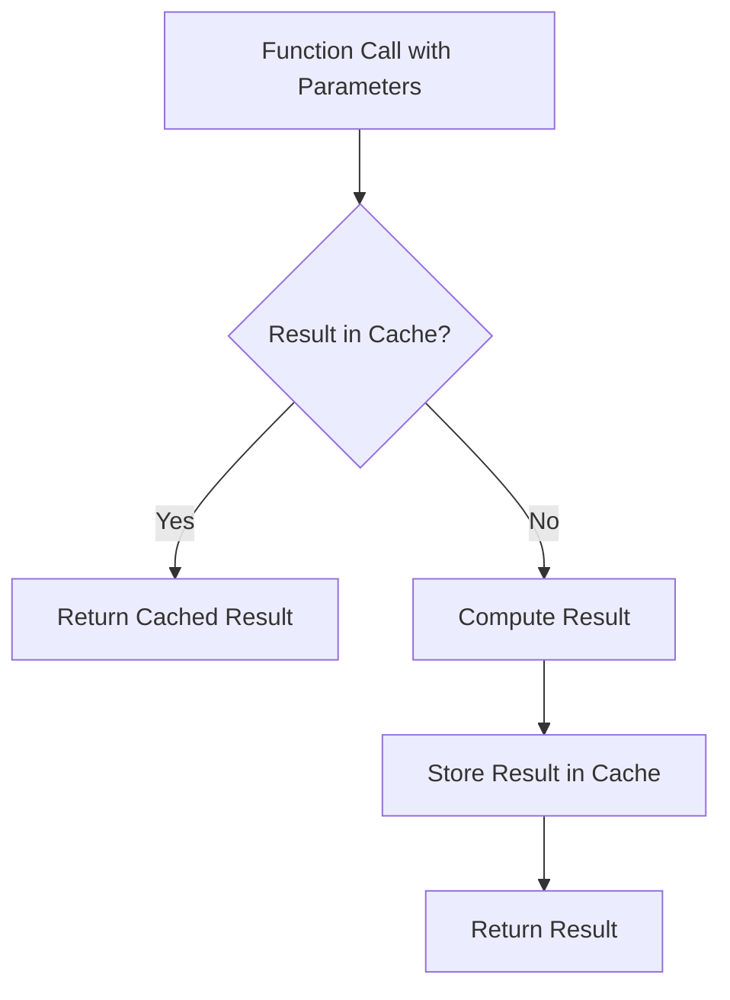
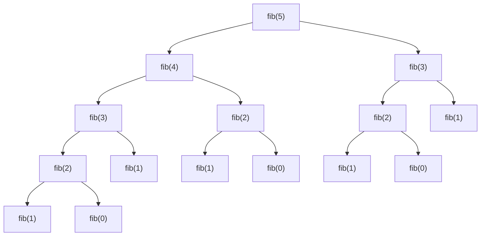
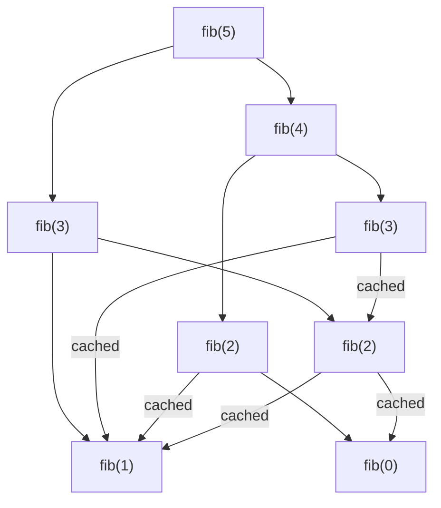

# Memoization Technique

## Introduction

Memoization is one of the core techniques in dynamic programming that can drastically improve the performance of recursive algorithms. The term "memoization" comes from the word "memorandum," meaning "to be remembered." As the name suggests, this technique involves storing previously calculated results to avoid redundant calculations in future function calls.

When solving problems recursively, we often end up calculating the same subproblems multiple times. Memoization helps us avoid this inefficiency by storing the results of expensive function calls and returning the cached result when the same inputs occur again.

## Understanding Memoization

### The Basic Concept

At its core, memoization follows this simple principle:

1. Before performing a calculation, check if you've done it before
2. If yes, return the stored result
3. If no, perform the calculation, store the result, and then return it

Let's visualize this concept:



### The Benefits of Memoization

- **Performance Improvement**: Dramatically reduces time complexity in algorithms with overlapping subproblems
- **Simple Implementation**: Often requires minimal changes to a recursive algorithm
- **Memory-Time Tradeoff**: Uses additional memory to save computation time

## Implementing Memoization

### A Simple Example: Fibonacci Sequence

Let's start with a classic problem: calculating the nth Fibonacci number.

First, let's look at a standard recursive implementation:

```javascript
function fibonacci(n) {
  if (n <= 1) return n;
  return fibonacci(n - 1) + fibonacci(n - 2);
}

console.log(fibonacci(10)); // Output: 55
```

This implementation has a time complexity of O(2^n) because each call branches into two more calls.

Now, let's improve it with memoization:

```javascript
function fibonacciMemo(n, memo = {}) {
  if (n in memo) return memo[n];
  if (n <= 1) return n;
  
  memo[n] = fibonacciMemo(n - 1, memo) + fibonacciMemo(n - 2, memo);
  return memo[n];
}

console.log(fibonacciMemo(10)); // Output: 55
console.log(fibonacciMemo(100)); // Output: A very large number without stack overflow
```

The memoized version reduces time complexity to O(n) since each fibonacci number is calculated only once.

### Visualizing the Difference

Let's visualize the function calls for calculating fibonacci(5):

Without memoization:



With memoization:



Notice how the memoized version avoids recalculating fib(3), fib(2), etc.

## Practical Examples

### Example 1: Climbing Stairs Problem

Problem: You are climbing a staircase. It takes n steps to reach the top. Each time you can either climb 1 or 2 steps. How many distinct ways can you climb to the top?

Solution without memoization:

```javascript
function climbStairs(n) {
  if (n <= 2) return n;
  return climbStairs(n - 1) + climbStairs(n - 2);
}

console.log(climbStairs(5)); // Output: 8
// Will be very slow for large n
```

Solution with memoization:

```javascript
function climbStairsMemo(n, memo = {}) {
  if (n in memo) return memo[n];
  if (n <= 2) return n;
  
  memo[n] = climbStairsMemo(n - 1, memo) + climbStairsMemo(n - 2, memo);
  return memo[n];
}

console.log(climbStairsMemo(5)); // Output: 8
console.log(climbStairsMemo(45)); // Output: 1836311903
// Fast even for large n
```

### Example 2: Grid Traveler Problem

Problem: You are a traveler on a 2D grid. You begin at the top-left corner and your goal is to reach the bottom-right corner. You may only move down or right. How many possible unique paths are there?

```javascript
function gridTraveler(m, n) {
  if (m === 1 && n === 1) return 1;
  if (m === 0 || n === 0) return 0;
  return gridTraveler(m - 1, n) + gridTraveler(m, n - 1);
}

console.log(gridTraveler(2, 3)); // Output: 3
// Very slow for large grids
```

With memoization:

```javascript
function gridTravelerMemo(m, n, memo = {}) {
  const key = `${m},${n}`;
  
  if (key in memo) return memo[key];
  if (m === 1 && n === 1) return 1;
  if (m === 0 || n === 0) return 0;
  
  memo[key] = gridTravelerMemo(m - 1, n, memo) + gridTravelerMemo(m, n - 1, memo);
  return memo[key];
}

console.log(gridTravelerMemo(2, 3)); // Output: 3
console.log(gridTravelerMemo(18, 18)); // Output: 2333606220
// Fast even for large grids
```

### Example 3: Coin Change Problem

Problem: Given an array of coin denominations and a target amount, find the minimum number of coins needed to make up that amount.

```javascript
function minCoins(coins, amount, memo = {}) {
  if (amount in memo) return memo[amount];
  if (amount === 0) return 0;
  if (amount < 0) return Infinity;
  
  let min = Infinity;
  
  for (let coin of coins) {
    const subproblem = minCoins(coins, amount - coin, memo);
    if (subproblem !== Infinity) {
      min = Math.min(min, subproblem + 1);
    }
  }
  
  memo[amount] = min;
  return min;
}

console.log(minCoins([1, 2, 5], 11)); // Output: 3 (5 + 5 + 1)
```

## Implementation Patterns

### Using Object for Memoization

```javascript
function memoizedFunction(param, memo = {}) {
  // Check if result exists
  if (param in memo) return memo[param];
  
  // Base case
  
  // Calculate result
  
  // Store result
  memo[param] = result;
  
  return result;
}
```

### Using an Array for Memoization

```javascript
function memoizedFunctionWithArray(n) {
  // Initialize memo array
  const memo = Array(n + 1).fill(null);
  
  function calculate(i) {
    // Check if result exists
    if (memo[i] !== null) return memo[i];
    
    // Base case
    
    // Calculate result
    
    // Store result
    memo[i] = result;
    
    return result;
  }
  
  return calculate(n);
}
```

### Using a Decorated Function

For more advanced usage, you can create a memoization decorator:

```javascript
function memoize(fn) {
  const cache = {};
  
  return function(...args) {
    const key = JSON.stringify(args);
    if (key in cache) {
      return cache[key];
    }
    
    const result = fn.apply(this, args);
    cache[key] = result;
    return result;
  };
}

// Usage
const memoizedFib = memoize(function(n) {
  if (n <= 1) return n;
  return memoizedFib(n - 1) + memoizedFib(n - 2);
});

console.log(memoizedFib(40)); // Fast result
```

## Best Practices

1. **Choose Appropriate Cache Structure**: Use objects for string/numeric keys and Maps for complex keys
2. **Consider Cache Size**: For very large inputs, consider implementing a cache eviction strategy
3. **Handle Edge Cases**: Ensure proper handling of base cases
4. **Cache Invalidation**: In some applications, you might need to clear the cache periodically
5. **Use Meaningful Keys**: When memoizing functions with multiple parameters, create a unique key

## Common Pitfalls

### Mutable Objects as Keys

When using objects as keys, be careful about serialization:

```javascript
function memoizedFunction(obj, memo = {}) {
  // Wrong: Objects as direct keys
  if (obj in memo) return memo[obj];
  
  // Correct: Serialize object to create a string key
  const key = JSON.stringify(obj);
  if (key in memo) return memo[key];
  
  // Rest of the function
}
```

### Memory Leaks

If you're creating many memoization caches, be mindful of memory usage:

```javascript
// Potential memory issue in a loop
for (let i = 0; i < 1000000; i++) {
  const result = memoizedFunction(i);
}

// Better approach: Scope the memo object
function processManyValues(values) {
  const memo = {};
  
  for (let value of values) {
    const result = memoizedFunction(value, memo);
  }
}
```

## When to Use Memoization

Memoization is particularly useful when:

1. **Overlapping Subproblems**: The same calculations are repeated multiple times
2. **Pure Functions**: Functions with no side effects whose output depends solely on inputs
3. **Expensive Computations**: Operations that are computationally intensive
4. **Limited Input Range**: When the domain of possible inputs is reasonably small

## Summary

Memoization is a powerful technique that optimizes recursive algorithms by storing previously computed results. By trading memory for speed, it can transform exponential-time algorithms into polynomial or even linear-time algorithms.

Key takeaways:
- Memoization stores the results of function calls to avoid redundant calculations
- Implementation typically involves a cache (object or array) and a check before computation
- It's especially useful for problems with overlapping subproblems
- The technique dramatically improves performance while keeping code relatively simple
- Proper key generation and cache management are important considerations

## Exercises

1. Implement a memoized solution for calculating binomial coefficients (nCr)
2. Solve the "House Robber" problem: Given an array of house values, find the maximum value you can rob without robbing adjacent houses
3. Create a general memoization utility function that can memoize any pure function
4. Implement the "Can Sum" problem: Given an array of numbers and a target sum, determine if any combination of array elements can sum to the target
5. Extend the Fibonacci implementation to handle very large numbers (hint: use BigInt in JavaScript)

## Additional Resources

- [Dynamic Programming](https://en.wikipedia.org/wiki/Dynamic_programming) (Wikipedia)
- "Introduction to Algorithms" by Cormen, Leiserson, Rivest, and Stein
- "Algorithms" by Robert Sedgewick and Kevin Wayne
- [Memoization in JavaScript](https://developer.mozilla.org/en-US/docs/Web/JavaScript/Reference/Functions/memoization) (MDN Web Docs)

Now that you've mastered memoization, you're well-equipped to tackle complex recursive problems efficiently! In the next section, we'll explore tabulation, another important dynamic programming technique.