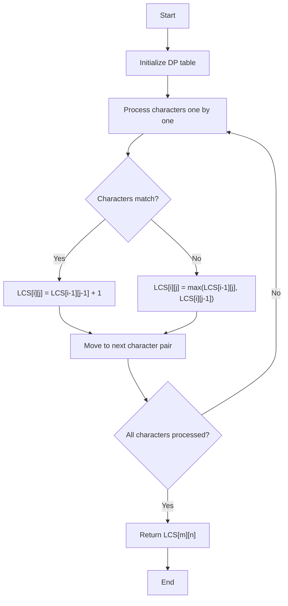

# Longest Common Subsequence

## Introduction

The Longest Common Subsequence (LCS) problem is a classic problem in computer science that finds applications in various fields such as bioinformatics for DNA sequence alignment, file comparison tools, and version control systems like Git. 

**What is a subsequence?** A subsequence is a sequence derived from another sequence by deleting some or no elements without changing the order of the remaining elements. For example, "abc", "abg", "bdf", "aeg" are all subsequences of "abcdefg".

**What is the LCS problem?** Given two strings, the LCS problem asks us to find the longest subsequence that appears in both strings. For instance, the LCS of "ABCBDAB" and "BDCABA" is "BCBA" with a length of 4.

This problem is an excellent example of dynamic programming, where we break down a complex problem into simpler subproblems and build up the solution systematically.

## Understanding the Problem

Before diving into the solution, let's clarify the problem with a simple example:

Consider two strings:
- String A: "ABCD"  
- String B: "ACBD"

To find their LCS, we identify the characters that appear in both strings while preserving their relative order.

Both "ABD" and "ACD" are common subsequences of length 3, making them the longest common subsequences for this example.

## The Dynamic Programming Approach

### 1. Problem Breakdown

To solve the LCS problem, we need to:
1. Define subproblems
2. Establish recurrence relations
3. Implement a bottom-up or top-down approach to compute the solution

### 2. Defining the Subproblems

Let's define `LCS[i][j]` as the length of the longest common subsequence between:
- The first `i` characters of string A: A[0...i-1]
- The first `j` characters of string B: B[0...j-1]

### 3. Establishing Recurrence Relations

For each position (i, j), we have two primary cases:

1. If the current characters match (A[i-1] = B[j-1]):
   ```
   LCS[i][j] = 1 + LCS[i-1][j-1]
   ```

2. If the current characters don't match:
   ```
   LCS[i][j] = max(LCS[i-1][j], LCS[i][j-1])
   ```

### 4. Base Cases

- `LCS[i][0] = 0` for all `i` (empty string B means no common subsequence)
- `LCS[0][j] = 0` for all `j` (empty string A means no common subsequence)

## Implementing the LCS Algorithm

Let's implement the LCS algorithm using a bottom-up dynamic programming approach:

### Python Implementation

```python
def longest_common_subsequence(text1: str, text2: str) -> int:
    # Get the lengths of both strings
    m, n = len(text1), len(text2)
    
    # Initialize DP table with zeros
    dp = [[0] * (n + 1) for _ in range(m + 1)]
    
    # Fill the DP table
    for i in range(1, m + 1):
        for j in range(1, n + 1):
            if text1[i - 1] == text2[j - 1]:
                # If characters match, take diagonal value + 1
                dp[i][j] = dp[i - 1][j - 1] + 1
            else:
                # Otherwise, take the maximum of the left or above cell
                dp[i][j] = max(dp[i - 1][j], dp[i][j - 1])
    
    # The bottom-right cell contains the length of the LCS
    return dp[m][n]

# Example usage
text1 = "ABCBDAB"
text2 = "BDCABA"
print(f"Length of LCS: {longest_common_subsequence(text1, text2)}")
# Output: Length of LCS: 4
```

### Java Implementation

```java
public class LongestCommonSubsequence {
    public static int longestCommonSubsequence(String text1, String text2) {
        int m = text1.length();
        int n = text2.length();
        
        // Initialize DP table
        int[][] dp = new int[m + 1][n + 1];
        
        // Fill the DP table
        for (int i = 1; i <= m; i++) {
            for (int j = 1; j <= n; j++) {
                if (text1.charAt(i - 1) == text2.charAt(j - 1)) {
                    dp[i][j] = dp[i - 1][j - 1] + 1;
                } else {
                    dp[i][j] = Math.max(dp[i - 1][j], dp[i][j - 1]);
                }
            }
        }
        
        return dp[m][n];
    }
    
    public static void main(String[] args) {
        String text1 = "ABCBDAB";
        String text2 = "BDCABA";
        System.out.println("Length of LCS: " + longestCommonSubsequence(text1, text2));
        // Output: Length of LCS: 4
    }
}
```

### JavaScript Implementation

```javascript
function longestCommonSubsequence(text1, text2) {
    const m = text1.length;
    const n = text2.length;
    
    // Initialize DP table with zeros
    const dp = Array(m + 1).fill().map(() => Array(n + 1).fill(0));
    
    // Fill the DP table
    for (let i = 1; i <= m; i++) {
        for (let j = 1; j <= n; j++) {
            if (text1[i - 1] === text2[j - 1]) {
                dp[i][j] = dp[i - 1][j - 1] + 1;
            } else {
                dp[i][j] = Math.max(dp[i - 1][j], dp[i][j - 1]);
            }
        }
    }
    
    return dp[m][n];
}

// Example usage
const text1 = "ABCBDAB";
const text2 = "BDCABA";
console.log(`Length of LCS: ${longestCommonSubsequence(text1, text2)}`);
// Output: Length of LCS: 4
```

## Reconstructing the LCS

Often, we want to find not just the length of the LCS but the actual subsequence itself. Here's how we can modify our algorithm to reconstruct the LCS:

```python
def get_longest_common_subsequence(text1: str, text2: str) -> str:
    m, n = len(text1), len(text2)
    dp = [[0] * (n + 1) for _ in range(m + 1)]
    
    # Fill the DP table
    for i in range(1, m + 1):
        for j in range(1, n + 1):
            if text1[i - 1] == text2[j - 1]:
                dp[i][j] = dp[i - 1][j - 1] + 1
            else:
                dp[i][j] = max(dp[i - 1][j], dp[i][j - 1])
    
    # Reconstruct the LCS
    lcs = []
    i, j = m, n
    while i > 0 and j > 0:
        if text1[i - 1] == text2[j - 1]:
            lcs.append(text1[i - 1])
            i -= 1
            j -= 1
        elif dp[i - 1][j] > dp[i][j - 1]:
            i -= 1
        else:
            j -= 1
    
    # Return the LCS (reversed since we built it backwards)
    return ''.join(reversed(lcs))

# Example usage
text1 = "ABCBDAB"
text2 = "BDCABA"
print(f"LCS: {get_longest_common_subsequence(text1, text2)}")
# Output: LCS: BCBA
```

## Visualizing the Algorithm

Let's visualize the LCS algorithm's execution for better understanding:



## Time and Space Complexity

- **Time Complexity**: O(m × n), where m and n are the lengths of the two strings. This is because we need to fill an m × n table.
- **Space Complexity**: O(m × n) for the DP table.

### Space Optimization

We can optimize the space complexity to O(min(m, n)) by only keeping track of two rows of the DP table at a time, since each entry depends only on the previous row.

```python
def longest_common_subsequence_optimized(text1: str, text2: str) -> int:
    # Ensure text1 is the shorter string for optimization
    if len(text1) > len(text2):
        text1, text2 = text2, text1
    
    m, n = len(text1), len(text2)
    
    # Initialize previous and current row
    prev_row = [0] * (n + 1)
    curr_row = [0] * (n + 1)
    
    # Fill the DP table row by row
    for i in range(1, m + 1):
        for j in range(1, n + 1):
            if text1[i - 1] == text2[j - 1]:
                curr_row[j] = prev_row[j - 1] + 1
            else:
                curr_row[j] = max(prev_row[j], curr_row[j - 1])
        
        # Update previous row for next iteration
        prev_row, curr_row = curr_row, [0] * (n + 1)
    
    return prev_row[n]
```

## Real-World Applications

The LCS algorithm finds many practical applications across different fields:

### 1. Bioinformatics
In DNA sequence alignment, LCS helps identify similarities between genetic sequences, which is crucial for evolutionary studies and genetic research.

```python
# Example: DNA sequence comparison
dna_seq1 = "ACCGGTCGAGTGCGCGGAAGCCGGCCGAA"
dna_seq2 = "GTCGTTCGGAATGCCGTTGCTCTGTAA"
common_seq = get_longest_common_subsequence(dna_seq1, dna_seq2)
print(f"Common DNA subsequence: {common_seq}")
```

### 2. Version Control Systems
Software like Git uses LCS-like algorithms to compare file versions and show differences efficiently.

### 3. Plagiarism Detection
LCS can help identify common text between documents to detect potential plagiarism.

```python
# Simple plagiarism check example
document1 = "The quick brown fox jumps over the lazy dog"
document2 = "A quick fox jumped above a lazy brown dog"
common_text = get_longest_common_subsequence(document1, document2)
similarity_ratio = len(common_text) / max(len(document1), len(document2))
print(f"Similarity ratio: {similarity_ratio:.2f}")
```

### 4. Spell Checking and Auto-correction
LCS can be used to find the closest match for a misspelled word.

## Variations and Extensions

### Longest Common Substring vs Subsequence
It's important to note the difference between the Longest Common Subsequence and the Longest Common Substring:
- A **subsequence** doesn't need to be contiguous (can have gaps)
- A **substring** must be contiguous (no gaps allowed)

### Multiple Sequence LCS
The LCS problem can be extended to find the longest common subsequence among multiple strings, though the complexity grows exponentially with the number of strings.

## Summary

The Longest Common Subsequence problem is:
- A classic dynamic programming problem
- Solved by building a table of optimal subproblems
- Applicable to many real-world scenarios
- Efficiently computed in O(m × n) time

Key points to remember:
1. LCS finds the longest sequence of characters that appear in the same order in both strings
2. The dynamic programming approach breaks down the problem into simpler subproblems
3. The solution is built bottom-up by filling a 2D table
4. Both the length and the actual subsequence can be computed

## Exercises

1. **Basic**: Implement the LCS algorithm to find the length of the longest common subsequence between "ABCDEF" and "ACBCF".

2. **Intermediate**: Modify the LCS algorithm to print all possible longest common subsequences (there might be more than one).

3. **Advanced**: Implement a space-optimized version of the LCS algorithm that uses only O(min(m, n)) extra space.

4. **Application**: Use the LCS algorithm to implement a simple version control system that can show differences between two text files.

5. **Challenge**: Extend the LCS algorithm to handle three input strings. What is the time and space complexity of your solution?

## Additional Resources

- [Dynamic Programming - GeeksforGeeks](https://www.geeksforgeeks.org/dynamic-programming/)
- [Introduction to Algorithms](https://mitpress.mit.edu/books/introduction-algorithms-third-edition) by Cormen, Leiserson, Rivest, and Stein - Chapter on Dynamic Programming
- [Algorithms, 4th Edition](https://algs4.cs.princeton.edu/home/) by Robert Sedgewick and Kevin Wayne

Happy coding!