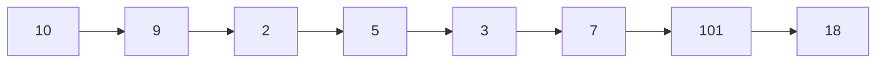

# Longest Increasing Subsequence

## Introduction

The Longest Increasing Subsequence (LIS) is a classic problem in computer science and a fundamental example of dynamic programming. It asks for the length of the longest subsequence of a given sequence such that all elements of the subsequence are sorted in increasing order.

A **subsequence** is a sequence that can be derived from another sequence by deleting some or no elements without changing the order of the remaining elements.

For example, given the array `[10, 9, 2, 5, 3, 7, 101, 18]`, the longest increasing subsequence is `[2, 3, 7, 18]` or `[2, 3, 7, 101]`, both of which have a length of 4.

## Problem Statement

Given an array of integers, find the length of the longest subsequence such that all elements of the subsequence are sorted in strictly increasing order.

### Input Format
- An array of integers: `nums[]`

### Output
- The length of the longest increasing subsequence

## Understanding the Problem

Before diving into the solution, let's break down the problem with an example:

Consider the array: `[3, 4, 1, 2, 8, 5, 6]`

Possible increasing subsequences include:
- `[3, 4, 8]`
- `[3, 4, 5, 6]`
- `[1, 2, 5, 6]`
- `[1, 2, 8]`

The longest among these is `[3, 4, 5, 6]` or `[1, 2, 5, 6]`, both with length 4.

## Dynamic Programming Approach

### Recursive Approach (Not Efficient)

Let's first understand how we might solve this recursively to build intuition:

```java
public int lengthOfLIS(int[] nums, int prev, int currentPos) {
    // Base case: If we've reached the end of the array
    if (currentPos == nums.length) {
        return 0;
    }
    
    // Option 1: Skip the current element
    int skip = lengthOfLIS(nums, prev, currentPos + 1);
    
    // Option 2: Include the current element if it's greater than the previous
    int include = 0;
    if (prev < 0 || nums[currentPos] > nums[prev]) {
        include = 1 + lengthOfLIS(nums, currentPos, currentPos + 1);
    }
    
    // Return the maximum of the two options
    return Math.max(skip, include);
}
```

However, this approach has exponential time complexity because of overlapping subproblems.

### Bottom-Up Dynamic Programming Solution

Now, let's implement an O(n²) solution using dynamic programming:

```java
public int lengthOfLIS(int[] nums) {
    if (nums == null || nums.length == 0) {
        return 0;
    }
    
    int n = nums.length;
    int[] dp = new int[n]; // dp[i] represents the length of LIS ending at index i
    
    // Initialize all values in dp array to 1 (each element by itself is an LIS of length 1)
    Arrays.fill(dp, 1);
    
    int maxLength = 1; // Initialize the result
    
    // Fill dp array
    for (int i = 1; i < n; i++) {
        for (int j = 0; j < i; j++) {
            // If current element is greater than previous element
            if (nums[i] > nums[j]) {
                dp[i] = Math.max(dp[i], dp[j] + 1);
            }
        }
        maxLength = Math.max(maxLength, dp[i]);
    }
    
    return maxLength;
}
```

### How the Solution Works

Let's understand this approach:

1. We create a `dp` array where `dp[i]` represents the length of the LIS ending at index `i`.
2. Initially, every element forms an LIS of length 1 by itself, so we fill the `dp` array with 1s.
3. For each element at position `i`, we look at all previous elements at positions `j < i`:
   - If `nums[i] > nums[j]`, we can extend the LIS ending at position `j` with the element at position `i`.
   - We update `dp[i]` to be the maximum of its current value and `dp[j] + 1`.
4. The maximum value in the `dp` array represents the length of the LIS for the entire array.

Let's trace through an example:
Array: `[10, 9, 2, 5, 3, 7, 101, 18]`

1. Initialize `dp = [1, 1, 1, 1, 1, 1, 1, 1]`
2. Process each element:
   - `dp[0] = 1` (10 itself)
   - For 9 (`i = 1`): No element before it is smaller, so `dp[1] = 1`
   - For 2 (`i = 2`): No element before it is smaller, so `dp[2] = 1`
   - For 5 (`i = 3`): 5 > 2, so `dp[3] = max(dp[3], dp[2] + 1) = max(1, 2) = 2`
   - For 3 (`i = 4`): 3 > 2, so `dp[4] = max(dp[4], dp[2] + 1) = max(1, 2) = 2`
   - For 7 (`i = 5`): 7 > 5 and 7 > 3, so `dp[5] = max(dp[5], max(dp[3] + 1, dp[4] + 1)) = max(1, max(3, 3)) = 3`
   - For 101 (`i = 6`): 101 is greater than all previous elements, so `dp[6] = max(dp[6], max of all previous dp + 1) = 4`
   - For 18 (`i = 7`): 18 is greater than all elements except 101, so `dp[7] = 4`
3. The maximum value in `dp` is 4, which is the length of the LIS.

## Optimized O(n log n) Solution

For larger inputs, we can optimize further using binary search:

```java
public int lengthOfLIS(int[] nums) {
    int[] tails = new int[nums.length];
    int size = 0;
    
    for (int num : nums) {
        int left = 0, right = size;
        // Binary search to find position to replace or add
        while (left < right) {
            int mid = left + (right - left) / 2;
            if (tails[mid] < num) {
                left = mid + 1;
            } else {
                right = mid;
            }
        }
        
        // Update tails array
        tails[left] = num;
        if (left == size) size++;
    }
    
    return size;
}
```

This approach maintains an array `tails` where `tails[i]` represents the smallest ending element of all increasing subsequences of length `i+1`. We use binary search to efficiently update this array.

## Real-World Applications

The LIS algorithm has numerous practical applications:

1. **Package Version Management**: Determining a valid upgrade path for software packages.
2. **Sequence Alignment in Bioinformatics**: Finding similarities between DNA, RNA, or protein sequences.
3. **Supply Chain Optimization**: Optimizing manufacturing processes where components must be processed in an increasing order of sizes.
4. **Network Routing**: Finding the most efficient path in network routing protocols.
5. **Financial Analysis**: Identifying trends in stock prices or economic indicators.

## Example: Stock Price Analysis

Imagine you're analyzing stock prices and want to find the longest period of overall growth (not necessarily consecutive days).

```java
public int longestGrowthPeriod(int[] stockPrices) {
    // Use the LIS algorithm to find periods of growth
    return lengthOfLIS(stockPrices);
}

// Example usage:
// int[] dailyPrices = {100, 90, 95, 105, 102, 110, 115, 105, 120};
// longestGrowthPeriod(dailyPrices) would return 5, representing the subsequence [90, 95, 105, 110, 120]
```

## Step-by-Step Visualization

Let's visualize how the dp array gets filled for the example `[10, 9, 2, 5, 3, 7, 101, 18]`:



DP array progression:

```
Initial dp: [1, 1, 1, 1, 1, 1, 1, 1]

After processing dp[1]: [1, 1, 1, 1, 1, 1, 1, 1]
After processing dp[2]: [1, 1, 1, 1, 1, 1, 1, 1]
After processing dp[3]: [1, 1, 1, 2, 1, 1, 1, 1]
After processing dp[4]: [1, 1, 1, 2, 2, 1, 1, 1]
After processing dp[5]: [1, 1, 1, 2, 2, 3, 1, 1]
After processing dp[6]: [1, 1, 1, 2, 2, 3, 4, 1]
After processing dp[7]: [1, 1, 1, 2, 2, 3, 4, 4]
```

## Summary

The Longest Increasing Subsequence problem is a classic example of dynamic programming that demonstrates how to:

1. Break down a complex problem into simpler subproblems
2. Store and reuse solutions to these subproblems
3. Build up the solution systematically

We've explored:
- A basic O(n²) DP solution that's intuitive but not optimal for large inputs
- An optimized O(n log n) solution using binary search
- Real-world applications of LIS

## Practice Exercises

1. **Implement both solutions**: Try coding both the O(n²) and O(n log n) solutions.
2. **Print the LIS**: Modify the algorithm to not just return the length but also output one valid LIS.
3. **Longest Decreasing Subsequence**: Adapt the solution to find the longest decreasing subsequence.
4. **Longest Bitonic Subsequence**: Find the longest subsequence that first increases and then decreases.
5. **Longest Common Subsequence**: Compare LIS with the related problem of finding the longest common subsequence between two arrays.

## Additional Resources

- [CLRS Book](https://mitpress.mit.edu/books/introduction-algorithms-third-edition) - Introduction to Algorithms by Cormen, Leiserson, Rivest, and Stein
- [GeeksforGeeks LIS Problem](https://www.geeksforgeeks.org/longest-increasing-subsequence-dp-3/)
- [LeetCode Problem 300: Longest Increasing Subsequence](https://leetcode.com/problems/longest-increasing-subsequence/)

Remember that mastering dynamic programming comes with practice. Work through different examples and variations of this problem to strengthen your understanding!