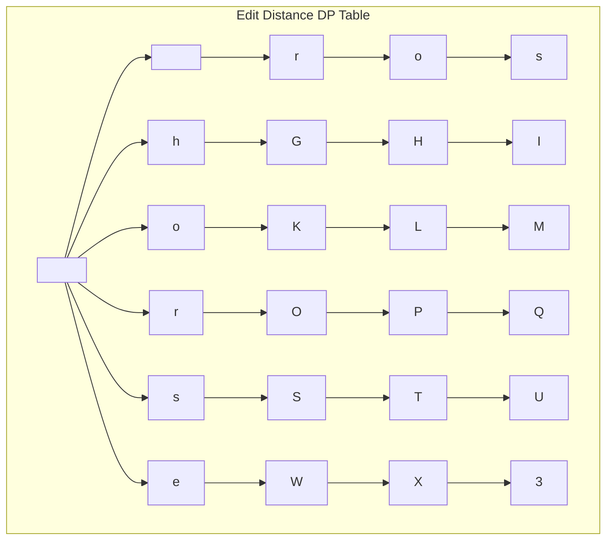

# Edit Distance

## Introduction

Edit Distance is a fundamental algorithm in computer science that quantifies how dissimilar two strings are by counting the minimum number of operations required to transform one string into another. This metric is also known as **Levenshtein Distance**, named after Vladimir Levenshtein who defined this concept in 1965.

The allowed operations typically include:
- **Insertion**: Add a character to the string
- **Deletion**: Remove a character from the string
- **Substitution**: Replace one character with another

Edit Distance has many practical applications in:
- Spell checking and autocorrect features
- DNA sequence alignment in bioinformatics
- Plagiarism detection
- Fuzzy string matching
- Natural language processing

Let's dive into this fascinating algorithm and see how dynamic programming helps us solve it efficiently.

## Understanding the Problem

Given two strings `str1` and `str2`, the Edit Distance problem asks for the minimum number of operations (insertions, deletions, and substitutions) required to convert `str1` into `str2`.

### Example

**Input:**
- `str1 = "horse"`
- `str2 = "ros"`

**Output:** 3

**Explanation:** 
1. Replace 'h' with 'r' → "rorse"
2. Delete 'r' → "rose"
3. Delete 'e' → "ros"

## Naive Recursive Approach

Before diving into the dynamic programming solution, let's understand the problem recursively. We can define the edit distance between two strings using the following recursive formula:

If the last characters of both strings match, no operation is needed for these characters, so we recur for the remaining strings:
```
If str1[m-1] == str2[n-1]:
    editDist(str1, str2, m-1, n-1)
```

If the last characters don't match, we consider all three operations and pick the minimum:
```
If str1[m-1] != str2[n-1]:
    1 + min(
        editDist(str1, str2, m, n-1),    // Insert
        editDist(str1, str2, m-1, n),    // Remove
        editDist(str1, str2, m-1, n-1)   // Replace
    )
```

Here's a recursive implementation:

```python
def edit_distance_recursive(str1, str2, m, n):
    # If first string is empty, the only option is to
    # insert all characters of second string into first
    if m == 0:
        return n
    
    # If second string is empty, the only option is to
    # remove all characters of first string
    if n == 0:
        return m
    
    # If last characters of two strings are same, nothing
    # much to do. Get the count for remaining strings.
    if str1[m-1] == str2[n-1]:
        return edit_distance_recursive(str1, str2, m-1, n-1)
    
    # If last characters are not same, consider all three
    # operations on last character of first string, recursively
    # compute minimum cost for all three operations and take
    # minimum of three values.
    return 1 + min(
        edit_distance_recursive(str1, str2, m, n-1),    # Insert
        edit_distance_recursive(str1, str2, m-1, n),    # Remove
        edit_distance_recursive(str1, str2, m-1, n-1)   # Replace
    )
```

However, this recursive solution suffers from exponential time complexity due to overlapping subproblems. This is where dynamic programming comes to the rescue!

## Dynamic Programming Solution

We'll use a 2D table `dp` where `dp[i][j]` represents the edit distance between the first `i` characters of `str1` and the first `j` characters of `str2`.

### The DP Table Setup

1. **Base cases**:
   - If `str1` is empty (i=0), we need `j` insertions to convert it to `str2[0...j-1]`
   - If `str2` is empty (j=0), we need `i` deletions to convert `str1[0...i-1]` to it

2. **Recurrence relation**:
   - If `str1[i-1] == str2[j-1]`, then `dp[i][j] = dp[i-1][j-1]` (no operation needed)
   - Otherwise, `dp[i][j] = 1 + min(dp[i][j-1], dp[i-1][j], dp[i-1][j-1])` (minimum of insert, delete, replace)

### Visualization

Let's visualize the DP table for our example:
- `str1 = "horse"`
- `str2 = "ros"`



### Implementation

Let's implement the dynamic programming solution:

```python
def edit_distance_dp(str1, str2):
    m = len(str1)
    n = len(str2)
    
    # Create a table to store results of subproblems
    dp = [[0 for x in range(n + 1)] for x in range(m + 1)]
    
    # Fill dp[][] in bottom up manner
    for i in range(m + 1):
        for j in range(n + 1):
            # If first string is empty, only option is to
            # insert all characters of second string
            if i == 0:
                dp[i][j] = j
            
            # If second string is empty, only option is to
            # remove all characters of first string
            elif j == 0:
                dp[i][j] = i
            
            # If last characters are same, ignore the last char
            # and recur for remaining string
            elif str1[i-1] == str2[j-1]:
                dp[i][j] = dp[i-1][j-1]
            
            # If the last character is different, consider all
            # possibilities and find the minimum
            else:
                dp[i][j] = 1 + min(dp[i][j-1],      # Insert
                                   dp[i-1][j],      # Remove
                                   dp[i-1][j-1])    # Replace
    
    return dp[m][n]
```

### Complete Example with Step-by-Step Explanation

Let's trace through the example:
- `str1 = "horse"`
- `str2 = "ros"`

Here's how our DP table will be filled:

```
      |     |  r  |  o  |  s  |
------|-----|-----|-----|-----|
      |  0  |  1  |  2  |  3  |
------|-----|-----|-----|-----|
  h   |  1  |  1  |  2  |  3  |
------|-----|-----|-----|-----|
  o   |  2  |  2  |  1  |  2  |
------|-----|-----|-----|-----|
  r   |  3  |  2  |  2  |  2  |
------|-----|-----|-----|-----|
  s   |  4  |  3  |  3  |  2  |
------|-----|-----|-----|-----|
  e   |  5  |  4  |  4  |  3  |
```

Let's analyze a few key cells:

1. `dp[1][1]` (comparing "h" with "r"):
   - Since "h" ≠ "r", we take the minimum of:
     - Insert (dp[1][0] + 1) = 2
     - Delete (dp[0][1] + 1) = 2
     - Substitute (dp[0][0] + 1) = 1
   - So, `dp[1][1] = 1`

2. `dp[2][2]` (comparing "ho" with "ro"):
   - Since "o" = "o", we take dp[1][1] = 1

3. `dp[5][3]` (comparing "horse" with "ros"):
   - The final answer is 3, which means we need 3 operations to convert "horse" to "ros".

### Time and Space Complexity

- **Time Complexity**: O(m × n), where m and n are the lengths of the two strings.
- **Space Complexity**: O(m × n) for the DP table.

## Space-Optimized Solution

Since each row in our DP table only depends on the previous row, we can optimize the space complexity to O(min(m, n)):

```python
def edit_distance_optimized(str1, str2):
    m = len(str1)
    n = len(str2)
    
    # Make sure m <= n to optimize space
    if m > n:
        str1, str2 = str2, str1
        m, n = n, m
    
    # Previous row of the DP table
    previous = [j for j in range(n + 1)]
    
    # Current row of the DP table
    current = [0] * (n + 1)
    
    for i in range(1, m + 1):
        current[0] = i
        
        for j in range(1, n + 1):
            if str1[i-1] == str2[j-1]:
                current[j] = previous[j-1]
            else:
                current[j] = 1 + min(current[j-1],    # Insert
                                     previous[j],     # Remove
                                     previous[j-1])   # Replace
        
        # Swap current and previous rows
        previous, current = current, previous
    
    return previous[n]
```

## Real-World Applications

### 1. Spell Checking

Edit distance is widely used in spell checkers to suggest corrections for misspelled words. When a user types a word that isn't in the dictionary, the spell checker finds words with the smallest edit distance.

```python
def suggest_corrections(misspelled_word, dictionary, max_distance=2):
    suggestions = []
    
    for word in dictionary:
        distance = edit_distance_dp(misspelled_word, word)
        if distance <= max_distance:
            suggestions.append((word, distance))
    
    return sorted(suggestions, key=lambda x: x[1])

# Example usage
dictionary = ["hello", "help", "hell", "held", "helm"]
misspelled = "helo"
suggestions = suggest_corrections(misspelled, dictionary)
print(f"Did you mean: {[word for word, _ in suggestions]}")
# Output: Did you mean: ['hello', 'help', 'hell', 'held', 'helm']
```

### 2. DNA Sequence Alignment

In bioinformatics, edit distance helps align DNA sequences to identify mutations or evolutionary relationships.

```python
def align_sequences(seq1, seq2):
    distance = edit_distance_dp(seq1, seq2)
    print(f"The genetic distance between sequences is {distance}")
    return distance

# Example
seq1 = "ACGTACGT"
seq2 = "ACGTATGT"
align_sequences(seq1, seq2)  # Output: The genetic distance between sequences is 1
```

### 3. Plagiarism Detection

By calculating the edit distance between documents or code snippets, we can identify potential plagiarism.

```python
def check_similarity(text1, text2):
    distance = edit_distance_dp(text1, text2)
    max_length = max(len(text1), len(text2))
    similarity = 1 - (distance / max_length)
    return similarity * 100  # Return percentage

# Example
original = "This is a sample text for demonstration"
copied = "This is an example text for demonstration"
similarity = check_similarity(original, copied)
print(f"Similarity: {similarity:.2f}%")
# Output: Similarity: 88.89%
```

## Summary

Edit Distance is a powerful dynamic programming algorithm with wide applications in text processing and bioinformatics. It efficiently computes the minimum number of operations needed to transform one string into another.

Key points to remember:
1. The three basic operations are insertion, deletion, and substitution.
2. The dynamic programming approach uses a 2D table where dp[i][j] represents the edit distance between the first i characters of str1 and first j characters of str2.
3. The time complexity is O(m × n) and space complexity can be optimized to O(min(m, n)).
4. Real-world applications include spell checking, DNA sequence alignment, and plagiarism detection.

## Exercises

1. Modify the edit distance algorithm to allow different costs for insertion, deletion, and substitution operations.
2. Implement a function that not only returns the edit distance but also the sequence of operations needed to transform one string into another.
3. Adapt the algorithm to solve the longest common subsequence problem.
4. Create a spell checker for a given dictionary that suggests corrections for misspelled words.
5. Implement an algorithm to find the edit distance when only insertions and deletions are allowed (no substitutions).

## Additional Resources

- "Introduction to Algorithms" by Cormen, Leiserson, Rivest, and Stein (CLRS)
- "Algorithms on Strings, Trees, and Sequences" by Dan Gusfield
- [Wikipedia: Levenshtein distance](https://en.wikipedia.org/wiki/Levenshtein_distance)
- Online practice: Look for problems like "Edit Distance" on platforms like LeetCode, HackerRank, or CodeForces

Remember that practice is key to mastering dynamic programming. Try solving various edit distance problems and variations to build your intuition for this powerful technique!