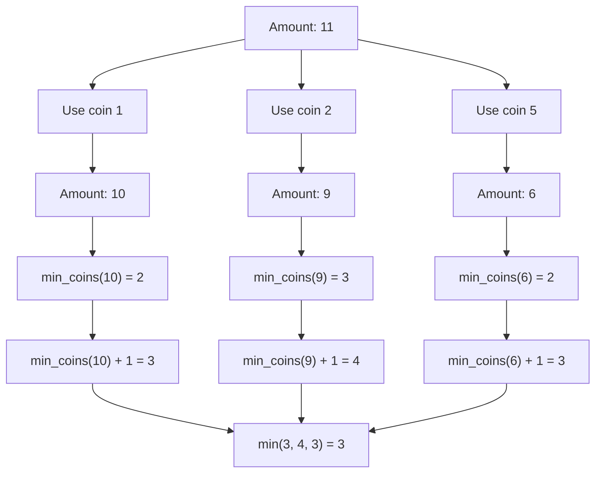

# Coin Change Problems

## Introduction

The coin change problem is a classic example that demonstrates the power and elegance of dynamic programming. At its core, this problem involves determining how to make change for a given amount using a specific set of coin denominations. There are two primary variations:

1. **Minimum Coins Problem**: Find the minimum number of coins needed to make change for a given amount.
2. **Ways to Make Change Problem**: Count the total number of different ways to make change for a given amount.

These problems appear frequently in coding interviews and have practical applications in financial software, vending machines, and any system that needs to optimize or count change combinations.

## Understanding the Coin Change Problem

### Problem Statement

Let's formalize both variations:

#### Minimum Coins Problem:
Given a set of coin denominations and a target amount, find the minimum number of coins needed to make up that amount. If the amount cannot be made up by any combination of the given coins, return -1.

#### Ways to Make Change Problem:
Given a set of coin denominations and a target amount, count the number of different ways to make up that amount using the given coins.

### Thinking Dynamically

Both variations can be solved using dynamic programming because:

1. They have **optimal substructure** - optimal solutions to larger problems incorporate optimal solutions to smaller subproblems.
2. They have **overlapping subproblems** - the same subproblems are solved multiple times when using a naive recursive approach.

## Solving the Minimum Coins Problem

Let's start by solving the problem of finding the minimum number of coins needed to make change.

### 1. Define the State

Let `dp[i]` represent the minimum number of coins needed to make amount `i`.

### 2. Base Case

- `dp[0] = 0` (It takes 0 coins to make amount 0)
- Initialize all other values to a large number (infinity)

### 3. State Transition

For each amount `i` from 1 to the target amount:
- For each coin denomination `coin`:
  - If `i - coin ≥ 0`, then `dp[i] = min(dp[i], dp[i - coin] + 1)`

This formula means: "To make amount `i`, we can use one coin of denomination `coin` and then make the remaining amount `i - coin`."

### 4. Implementation

```python
def min_coins(coins, amount):
    # Initialize dp array with a value larger than any possible answer
    dp = [float('inf')] * (amount + 1)
    dp[0] = 0
    
    for i in range(1, amount + 1):
        for coin in coins:
            if i - coin >= 0:
                dp[i] = min(dp[i], dp[i - coin] + 1)
    
    # If dp[amount] is still infinity, it's impossible to make the amount
    return dp[amount] if dp[amount] != float('inf') else -1
```

Let's trace through an example:

**Input:**
- Coins: [1, 2, 5]
- Amount: 11

**Output:** 3 (5 + 5 + 1)

**Step-by-Step Trace:**

| Amount | 0 | 1 | 2 | 3 | 4 | 5 | 6 | 7 | 8 | 9 | 10 | 11 |
|--------|---|---|---|---|---|---|---|---|---|---|----|----|
| Initial| 0 | ∞ | ∞ | ∞ | ∞ | ∞ | ∞ | ∞ | ∞ | ∞ | ∞  | ∞  |
| After  | 0 | 1 | 1 | 2 | 2 | 1 | 2 | 2 | 3 | 3 | 2  | 3  |

## Solving the Ways to Make Change Problem

Now let's tackle the problem of counting the number of ways to make change.

### 1. Define the State

Let `dp[i]` represent the number of ways to make amount `i`.

### 2. Base Case

- `dp[0] = 1` (There's 1 way to make amount 0 - by using no coins)
- Initialize all other values to 0

### 3. State Transition

For each coin denomination `coin`:
- For each amount `i` from `coin` to the target amount:
  - `dp[i] += dp[i - coin]`

This formula means: "The number of ways to make amount `i` includes all the ways to make amount `i - coin`."

### 4. Implementation

```javascript
function countWaysToMakeChange(coins, amount) {
    // Initialize dp array
    const dp = new Array(amount + 1).fill(0);
    dp[0] = 1; // There's one way to make amount 0
    
    for (const coin of coins) {
        for (let i = coin; i <= amount; i++) {
            dp[i] += dp[i - coin];
        }
    }
    
    return dp[amount];
}
```

Let's trace through an example:

**Input:**
- Coins: [1, 2, 5]
- Amount: 5

**Output:** 4 (The ways are: [1,1,1,1,1], [1,1,1,2], [1,2,2], [5])

**Step-by-Step Trace:**

| Amount | 0 | 1 | 2 | 3 | 4 | 5 |
|--------|---|---|---|---|---|---|
| Initial| 1 | 0 | 0 | 0 | 0 | 0 |
| After coin=1| 1 | 1 | 1 | 1 | 1 | 1 |
| After coin=2| 1 | 1 | 2 | 2 | 3 | 3 |
| After coin=5| 1 | 1 | 2 | 2 | 3 | 4 |

## Visualizing the Solution

Let's visualize the dynamic programming approach for the Minimum Coins Problem:



## Real-World Applications

### 1. ATM Cash Dispensers

ATMs need to dispense the minimum number of bills when a customer makes a withdrawal. This is a direct application of the minimum coins problem:

```python
def atm_dispenser(denominations, amount):
    result = min_coins(denominations, amount)
    
    if result == -1:
        return "Cannot dispense exact amount"
    return f"Minimum number of bills needed: {result}"
```

### 2. Currency Exchange Systems

When converting between currencies, systems might need to determine the number of ways to represent an amount:

```javascript
function currencyExchangeOptions(availableDenominations, amount) {
    const ways = countWaysToMakeChange(availableDenominations, amount);
    return `There are ${ways} different ways to represent ${amount} with the given denominations.`;
}
```

### 3. Retail Cash Registers

Cashiers need to return change using available denominations, often aiming to use the fewest coins or bills:

```python
def calculate_change(price, payment, available_coins):
    change_amount = payment - price
    coin_count = min_coins(available_coins, change_amount)
    
    if coin_count == -1:
        return "Cannot provide exact change"
    return f"Cashier needs to give {coin_count} coins/bills as change"
```

## Time and Space Complexity Analysis

### Minimum Coins Problem:
- **Time Complexity**: O(amount × n), where n is the number of coin denominations
- **Space Complexity**: O(amount) for the dp array

### Ways to Make Change Problem:
- **Time Complexity**: O(amount × n), where n is the number of coin denominations
- **Space Complexity**: O(amount) for the dp array

## Common Mistakes and Pitfalls

1. **Forgetting Base Cases**: Always initialize `dp[0]` correctly (0 for minimum coins, 1 for counting ways).

2. **Incorrect Loop Order**: 
   - For minimum coins: iterate over amounts first, then coins.
   - For counting ways: iterate over coins first, then amounts.

3. **Not Handling Impossible Cases**: When no solution exists for minimum coins, remember to return -1.

4. **Integer Overflow**: For large amounts or many ways, consider using big integers or modulo arithmetic.

## Summary

The coin change problems are elegant illustrations of dynamic programming principles:

1. We break down a complex problem into simpler subproblems.
2. We store solutions to these subproblems to avoid redundant calculations.
3. We build up to the final solution incrementally.

These problems teach fundamental DP concepts like state definition, base cases, and transition functions. By mastering coin change problems, you gain insights applicable to a wide range of optimization and counting problems.

## Exercises

1. Modify the minimum coins algorithm to also return which coins to use, not just the count.

2. Solve the coin change problem where each coin can be used at most once.

3. Implement a solution for the coin change problem where there are limitations on how many of each coin denomination is available.

4. Find the number of ways to make change where the order of coins matters (e.g., [1,2,1] and [2,1,1] would count as different ways).

## Additional Resources

- "Introduction to Algorithms" by Cormen, Leiserson, Rivest, and Stein
- "Dynamic Programming for Coding Interviews" by Meenakshi and Kamal Rawat
- LeetCode problems #322 (Coin Change) and #518 (Coin Change 2)

Happy coding!