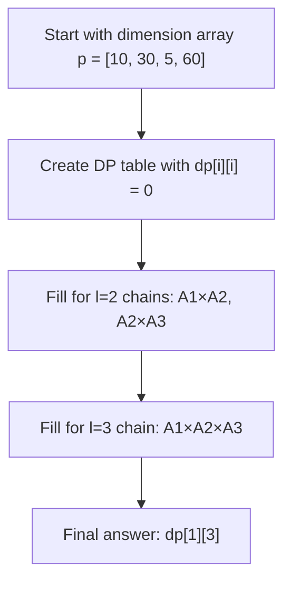

# Matrix Chain Multiplication

## Introduction

Matrix chain multiplication is a classic problem in computer science that perfectly illustrates the power of dynamic programming. The problem involves finding the most efficient way to multiply a sequence of matrices together.

When multiplying matrices, the order in which you perform the multiplication can significantly impact the total number of operations required. Although the result will be the same regardless of the order (as matrix multiplication is associative), the computational cost can vary drastically.

For example, if you have three matrices A, B, and C with dimensions 10×30, 30×5, and 5×60 respectively, you could multiply them as (A×B)×C or A×(B×C). The number of scalar multiplications in each case would be different, and our goal is to find the order that minimizes this cost.

## Problem Statement

Given a chain of matrices A₁, A₂, ..., An, where A₁ is a p₀×p₁ matrix, A₂ is a p₁×p₂ matrix, and so on, find the most efficient way to multiply these matrices together.

The problem input is usually given as an array p[] of size n+1, where p[i-1] × p[i] are the dimensions of matrix Ai for 1 ≤ i ≤ n.

## Understanding Matrix Multiplication Cost

Before diving into the solution, let's understand how to calculate the cost of matrix multiplication:

- When multiplying a matrix of size p×q with another of size q×r, the number of scalar multiplications needed is p×q×r.
- For example, multiplying a 2×3 matrix with a 3×4 matrix requires 2×3×4 = 24 scalar multiplications.

## Naive Recursive Approach

Let's first consider a recursive approach to understand the problem better:

```java
public static int matrixChainOrderRecursive(int[] p, int i, int j) {
    if (i == j) {
        return 0; // Cost is zero when multiplying single matrix
    }
    
    int min = Integer.MAX_VALUE;
    
    // Try placing parenthesis at different positions
    for (int k = i; k < j; k++) {
        int cost = matrixChainOrderRecursive(p, i, k) +
                   matrixChainOrderRecursive(p, k + 1, j) +
                   p[i - 1] * p[k] * p[j];
                   
        if (cost < min) {
            min = cost;
        }
    }
    
    return min;
}
```

This recursive approach considers all possible ways to parenthesize the matrix chain and selects the minimum cost. However, it recomputes many subproblems multiple times, leading to exponential time complexity.

## Dynamic Programming Approach

Now, let's implement the efficient dynamic programming solution which has O(n³) time complexity:

```java
public static int matrixChainOrder(int[] p) {
    int n = p.length - 1;
    int[][] dp = new int[n + 1][n + 1];
    
    // Initialize diagonal elements to 0 (cost for single matrix)
    for (int i = 1; i <= n; i++) {
        dp[i][i] = 0;
    }
    
    // l is chain length
    for (int l = 2; l <= n; l++) {
        for (int i = 1; i <= n - l + 1; i++) {
            int j = i + l - 1;
            dp[i][j] = Integer.MAX_VALUE;
            
            // Try each possible split point
            for (int k = i; k < j; k++) {
                int cost = dp[i][k] + dp[k + 1][j] + p[i - 1] * p[k] * p[j];
                if (cost < dp[i][j]) {
                    dp[i][j] = cost;
                }
            }
        }
    }
    
    return dp[1][n];
}
```

### Step-by-Step Explanation

1. **Create a DP table**: Initialize an `(n+1) × (n+1)` table where `dp[i][j]` represents the minimum cost of multiplying matrices from `Ai` to `Aj`.
2. **Base case**: The cost of multiplying a single matrix is 0, so `dp[i][i] = 0` for all `i`.
3. **Fill the table**: For chains of length `2` to `n`, calculate the minimum cost by trying all possible split points.
4. **Return the answer**: `dp[1][n]` gives the minimum cost for the entire chain.

## Visualization

Let's visualize how the dynamic programming table is filled for a simple example:



## Example with Trace

Let's trace through a concrete example:

Given matrices with dimensions: A₁(10×30), A₂(30×5), A₃(5×60)

Our dimension array p = [10, 30, 5, 60]

Tracing the dynamic programming approach:

1. Initialize dp[i][i] = 0 for i = 1,2,3
2. For l = 2 (chain length 2):
   - For i = 1, j = 2: Calculate dp[1][2] = min cost of multiplying A₁×A₂
     - k = 1: cost = dp[1][1] + dp[2][2] + 10×30×5 = 0 + 0 + 1500 = 1500
     - dp[1][2] = 1500
   - For i = 2, j = 3: Calculate dp[2][3] = min cost of multiplying A₂×A₃
     - k = 2: cost = dp[2][2] + dp[3][3] + 30×5×60 = 0 + 0 + 9000 = 9000
     - dp[2][3] = 9000
3. For l = 3 (chain length 3):
   - For i = 1, j = 3: Calculate dp[1][3] = min cost of multiplying A₁×A₂×A₃
     - k = 1: cost = dp[1][1] + dp[2][3] + 10×30×60 = 0 + 9000 + 18000 = 27000
     - k = 2: cost = dp[1][2] + dp[3][3] + 10×5×60 = 1500 + 0 + 3000 = 4500
     - dp[1][3] = min(27000, 4500) = 4500

Therefore, the minimum cost is 4500, achieved by the multiplication order A₁×(A₂×A₃).

## Real-World Applications

Matrix chain multiplication optimization is relevant in many areas:

1. **Graphics and 3D modeling**: Complex transformations often involve chains of matrix multiplications.

2. **Machine learning**: When implementing neural networks, optimizing matrix operations can significantly improve performance.

3. **Scientific computing**: Many algorithms in physics simulations, statistics, and other scientific fields rely on efficient matrix operations.

4. **Image processing**: Operations like applying multiple filters to an image can be viewed as a matrix chain multiplication problem.

## Retrieving the Optimal Parenthesization

Besides finding the minimum cost, we often want to know the actual multiplication order. We can extend our solution to track this:

```java
public static void printOptimalParenthesization(int[][] s, int i, int j) {
    if (i == j) {
        System.out.print("A" + i);
        return;
    }
    
    System.out.print("(");
    printOptimalParenthesization(s, i, s[i][j]);
    printOptimalParenthesization(s, s[i][j] + 1, j);
    System.out.print(")");
}

public static int[][] matrixChainOrderWithParenthesization(int[] p) {
    int n = p.length - 1;
    int[][] dp = new int[n + 1][n + 1];
    int[][] s = new int[n + 1][n + 1]; // To store split points
    
    for (int l = 2; l <= n; l++) {
        for (int i = 1; i <= n - l + 1; i++) {
            int j = i + l - 1;
            dp[i][j] = Integer.MAX_VALUE;
            
            for (int k = i; k < j; k++) {
                int cost = dp[i][k] + dp[k + 1][j] + p[i - 1] * p[k] * p[j];
                if (cost < dp[i][j]) {
                    dp[i][j] = cost;
                    s[i][j] = k; // Store the split point
                }
            }
        }
    }
    
    return s; // Return the split points matrix
}
```

## Complete Solution

Here's a complete implementation with the ability to calculate both the minimum cost and the optimal parenthesization:

```java
public class MatrixChainMultiplication {
    public static void main(String[] args) {
        int[] dimensions = {10, 30, 5, 60};
        
        // Calculate minimum cost
        int minCost = matrixChainOrder(dimensions);
        System.out.println("Minimum number of multiplications: " + minCost);
        
        // Get optimal parenthesization
        int[][] splitPoints = matrixChainOrderWithParenthesization(dimensions);
        System.out.print("Optimal Parenthesization: ");
        printOptimalParenthesization(splitPoints, 1, dimensions.length - 1);
    }
    
    // Methods as defined earlier...
}
```

## Time and Space Complexity

- **Time Complexity**: O(n³) where n is the number of matrices.
- **Space Complexity**: O(n²) for the dp table.

## Summary

Matrix Chain Multiplication is a classic dynamic programming problem that teaches us how to optimize operations by finding the optimal order of execution. By breaking down the problem into overlapping subproblems and using a bottom-up approach, we can efficiently find the solution.

Key takeaways:
- The order of multiplying matrices can dramatically impact the computational cost
- Dynamic programming provides an efficient O(n³) solution
- This technique can be applied to many real-world optimization problems

## Exercises

1. Implement the matrix chain multiplication algorithm to handle matrices with actual values, not just dimensions.

2. Modify the algorithm to also output the actual sequence of multiplications in the optimal order.

3. Try to optimize the space complexity of the algorithm to O(n) by observing that we only need the most recent results.

4. Research how matrix chain multiplication relates to other dynamic programming problems like optimal binary search trees.

5. Consider a scenario where some pairs of matrices have specialized, more efficient multiplication algorithms available. How would you modify your approach?

## Additional Resources

- Introduction to Algorithms (CLRS) - Chapter on Dynamic Programming
- MIT OpenCourseware - Dynamic Programming Lectures
- The Algorithm Design Manual by Steven S. Skiena

Happy coding!