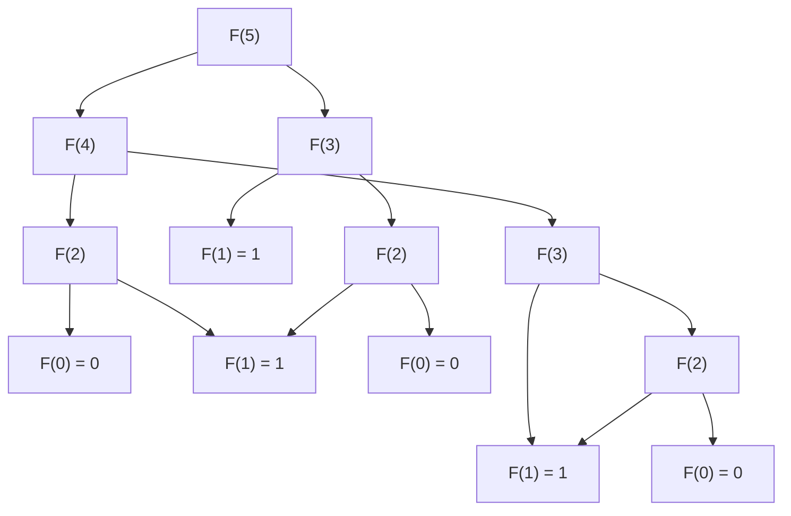

# Overlapping Subproblems

## Introduction

Dynamic Programming (DP) is a powerful algorithmic technique used to solve complex problems by breaking them down into simpler subproblems. One of the two fundamental properties that a problem must have to be solved using dynamic programming is **overlapping subproblems**.

In this tutorial, we'll dive deep into what overlapping subproblems are, how to identify them, and how to leverage this property to create efficient algorithms.

## What are Overlapping Subproblems?

**Overlapping subproblems** occur when solving a problem requires solving the same subproblem multiple times. Instead of recalculating the solution to these repeated subproblems, we can store the results of each subproblem once and look them up when needed again.

This is different from divide and conquer algorithms (like merge sort), where subproblems are typically distinct and don't overlap.

Let's use a classic example to understand this concept better.

### Example: Fibonacci Sequence

The Fibonacci sequence is defined as:
- F(0) = 0
- F(1) = 1
- F(n) = F(n-1) + F(n-2) for n > 1

Let's see what happens when we try to compute F(5) using a recursive approach:



Notice how F(3), F(2), F(1), and F(0) are computed multiple times. These are overlapping subproblems. As n gets larger, the number of redundant calculations grows exponentially, making the naive recursive solution very inefficient.

## Identifying Overlapping Subproblems

To identify if a problem has overlapping subproblems, ask yourself:

1. Can the problem be broken down into smaller versions of the same problem?
2. When solving these smaller problems, do we end up solving the same subproblem multiple times?

If both answers are yes, the problem likely has overlapping subproblems and is a good candidate for dynamic programming.

## Solving Overlapping Subproblems Efficiently

There are two main approaches to handle overlapping subproblems:

1. **Memoization (Top-down)**: We use recursion but cache the results of subproblems.
2. **Tabulation (Bottom-up)**: We build a table (usually an array) and fill it iteratively.

Let's implement both approaches for the Fibonacci sequence:

### 1. Naive Recursive Solution (Inefficient)

```javascript
function fibonacci(n) {
  if (n <= 1) return n;
  return fibonacci(n - 1) + fibonacci(n - 2);
}

console.log(fibonacci(10)); // Output: 55
```

Time Complexity: O(2^n) - Exponential, very inefficient for large n.

### 2. Memoization (Top-down DP)

```javascript
function fibonacci(n, memo = {}) {
  if (n in memo) return memo[n];
  if (n <= 1) return n;
  
  memo[n] = fibonacci(n - 1, memo) + fibonacci(n - 2, memo);
  return memo[n];
}

console.log(fibonacci(10)); // Output: 55
console.log(fibonacci(100)); // Output: Very large number
```

Time Complexity: O(n) - Linear time, much more efficient.

### 3. Tabulation (Bottom-up DP)

```javascript
function fibonacci(n) {
  if (n <= 1) return n;
  
  let dp = new Array(n + 1);
  dp[0] = 0;
  dp[1] = 1;
  
  for (let i = 2; i <= n; i++) {
    dp[i] = dp[i - 1] + dp[i - 2];
  }
  
  return dp[n];
}

console.log(fibonacci(10)); // Output: 55
```

Time Complexity: O(n) - Linear time, efficient and uses iterative approach.

### 4. Space-Optimized Tabulation

Since we only need the last two values to calculate the next Fibonacci number, we can optimize space:

```javascript
function fibonacci(n) {
  if (n <= 1) return n;
  
  let a = 0, b = 1;
  for (let i = 2; i <= n; i++) {
    let temp = a + b;
    a = b;
    b = temp;
  }
  
  return b;
}

console.log(fibonacci(10)); // Output: 55
```

Time Complexity: O(n) - Linear time
Space Complexity: O(1) - Constant space, most efficient

## More Examples with Overlapping Subproblems

Let's look at a few more problems that exhibit the overlapping subproblems property:

### Example 1: Longest Common Subsequence (LCS)

Finding the longest common subsequence between two strings involves solving many overlapping subproblems.

```javascript
function lcs(str1, str2, m, n, memo = {}) {
  // Create a unique key for memoization
  const key = `${m},${n}`;
  
  // Base case
  if (m === 0 || n === 0) return 0;
  
  // Check if we've already solved this subproblem
  if (key in memo) return memo[key];
  
  // If the characters match
  if (str1[m - 1] === str2[n - 1]) {
    memo[key] = 1 + lcs(str1, str2, m - 1, n - 1, memo);
    return memo[key];
  }
  
  // If characters don't match
  memo[key] = Math.max(
    lcs(str1, str2, m - 1, n, memo),
    lcs(str1, str2, m, n - 1, memo)
  );
  
  return memo[key];
}

const str1 = "ABCDGH";
const str2 = "AEDFHR";
console.log(lcs(str1, str2, str1.length, str2.length)); // Output: 3 (ADH)
```

### Example 2: Coin Change Problem

The problem of finding the minimum number of coins to make a given amount also involves overlapping subproblems.

```javascript
function minCoins(coins, amount) {
  // Create a DP array initialized with Infinity
  const dp = new Array(amount + 1).fill(Infinity);
  dp[0] = 0;
  
  // Try each coin for all amounts from 1 to amount
  for (let i = 1; i <= amount; i++) {
    for (const coin of coins) {
      if (coin <= i) {
        dp[i] = Math.min(dp[i], dp[i - coin] + 1);
      }
    }
  }
  
  return dp[amount] === Infinity ? -1 : dp[amount];
}

console.log(minCoins([1, 5, 10, 25], 63)); // Output: 6 (25 + 25 + 10 + 1 + 1 + 1)
```

## Real-World Applications

Overlapping subproblems and dynamic programming are not just theoretical concepts; they have many practical applications:

1. **Resource Allocation**: In project management, determining the optimal allocation of limited resources.

2. **Text Processing**: Algorithms like diff (used in version control systems), spell checkers, and DNA sequence alignment all leverage DP.

3. **Financial Optimization**: Portfolio optimization and option pricing models often use DP techniques.

4. **Network Routing**: Finding the shortest path in a network with various constraints.

5. **Image Processing**: Seam carving for content-aware image resizing.

## Summary

Overlapping subproblems are one of the key properties that make a problem suitable for dynamic programming. When we recognize that a problem contains subproblems that are solved repeatedly, we can optimize our solution by:

1. Using memoization to cache results of subproblems in a top-down approach
2. Using tabulation to build solutions iteratively from the bottom-up
3. Sometimes optimizing space complexity by only storing necessary information

By identifying and efficiently handling overlapping subproblems, we can transform exponential-time algorithms into polynomial-time solutions, making previously intractable problems solvable.

## Additional Resources and Exercises

### Exercises

1. Implement a dynamic programming solution for calculating binomial coefficients (nCr).
2. Solve the "Edit Distance" problem: Find the minimum number of operations required to convert string A to string B.
3. Implement the "Longest Increasing Subsequence" problem with dynamic programming.
4. Create a solution for the "Matrix Chain Multiplication" problem.
5. Solve the "0/1 Knapsack" problem using both memoization and tabulation approaches.

### Resources for Further Learning

- "Introduction to Algorithms" by Cormen, Leiserson, Rivest, and Stein
- "Algorithms" by Robert Sedgewick and Kevin Wayne
- LeetCode's Dynamic Programming section for practice problems
- GeeksforGeeks' Dynamic Programming tutorials
- MIT OpenCourseWare's Algorithms lectures

Remember that mastering dynamic programming takes practice. Start with simple problems and gradually tackle more complex ones as you become comfortable with the pattern.