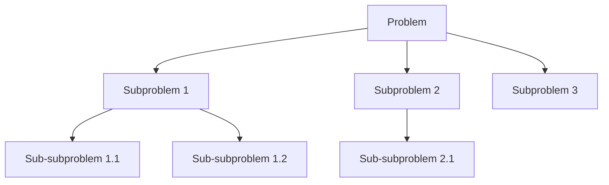

# Optimal Substructure

## Introduction

Optimal substructure is one of the fundamental properties that makes dynamic programming possible. It's a characteristic of a problem where the optimal solution can be constructed from the optimal solutions of its subproblems. 

In simpler words, if a problem has optimal substructure, solving it becomes easier because we can:
1. Break it down into smaller versions of the same problem
2. Solve these smaller subproblems optimally
3. Use these solutions to build the optimal solution to the original problem

Understanding optimal substructure is crucial for recognizing when to apply dynamic programming and how to formulate solutions efficiently.

## What is Optimal Substructure?

A problem exhibits optimal substructure if an optimal solution to the problem contains optimal solutions to its subproblems. This property is key to the "divide-and-conquer" approach that dynamic programming employs.

### Key Characteristics

- The optimal solution to a problem incorporates optimal solutions to related subproblems
- These subproblems can be solved independently
- Solutions can be combined to form the solution to the original problem

Let's illustrate this with a simple example:



## Common Examples with Optimal Substructure

### 1. Fibonacci Sequence

The Fibonacci sequence is a perfect example of optimal substructure:

- `F(n) = F(n-1) + F(n-2)` for n > 1
- Base cases: `F(0) = 0`, `F(1) = 1`

```javascript
// Recursive implementation (inefficient)
function fibonacci(n) {
  if (n <= 1) return n;
  return fibonacci(n-1) + fibonacci(n-2);
}

// Dynamic programming implementation (efficient)
function fibonacciDP(n) {
  if (n <= 1) return n;
  
  let fib = [0, 1];
  for (let i = 2; i <= n; i++) {
    fib[i] = fib[i-1] + fib[i-2];
  }
  
  return fib[n];
}

console.log(fibonacciDP(10)); // Output: 55
```

Here, the optimal solution for finding the nth Fibonacci number depends on the optimal solutions to finding the (n-1)th and (n-2)th Fibonacci numbers.

### 2. Shortest Path Problem

Finding the shortest path from a source to a destination in a graph also demonstrates optimal substructure:

```javascript
// Dijkstra's algorithm pseudocode
function dijkstra(graph, source) {
  // Initialize distances with Infinity
  let distances = {};
  for (let vertex in graph) {
    distances[vertex] = Infinity;
  }
  distances[source] = 0;
  
  const unvisited = new Set(Object.keys(graph));
  
  while (unvisited.size > 0) {
    // Find vertex with minimum distance
    let current = [...unvisited].reduce(
      (min, vertex) => distances[vertex] < distances[min] ? vertex : min,
      [...unvisited][0]
    );
    
    // Remove current from unvisited
    unvisited.delete(current);
    
    // For each neighbor of current
    for (let neighbor in graph[current]) {
      let alt = distances[current] + graph[current][neighbor];
      if (alt < distances[neighbor]) {
        distances[neighbor] = alt;
      }
    }
  }
  
  return distances;
}
```

In the shortest path problem, if a node X is on the shortest path from source S to destination D, then the shortest path from S to X is also part of the overall shortest path—this is optimal substructure.

## How to Identify Optimal Substructure

To determine whether a problem has optimal substructure, ask yourself these questions:

1. **Can the problem be broken down into smaller versions of the same problem?**
2. **Can an optimal solution be constructed from optimal solutions of subproblems?**
3. **Are the subproblems independent of each other?** (This is important - subproblems should not overlap in ways that affect their optimal solutions)

## Step-by-Step Process for Applying Optimal Substructure

1. **Identify the structure of an optimal solution**
2. **Define a recursive relationship** between the problem and its subproblems
3. **Express the solution value** in terms of optimal solutions to subproblems
4. **Implement either a top-down (memoization) or bottom-up (tabulation) approach**

## Practical Example: Longest Common Subsequence (LCS)

Let's solve the Longest Common Subsequence problem, which has optimal substructure:

**Problem**: Find the longest subsequence common to two strings.

**Example**:
- String 1: "ABCBDAB" 
- String 2: "BDCABA"
- LCS: "BCBA" (length 4)

**Optimal Substructure**:
- If last characters match: LCS(X[1...m], Y[1...n]) = 1 + LCS(X[1...m-1], Y[1...n-1])
- If last characters don't match: LCS(X[1...m], Y[1...n]) = max(LCS(X[1...m-1], Y[1...n]), LCS(X[1...m], Y[1...n-1]))

```javascript
function longestCommonSubsequence(text1, text2) {
  const m = text1.length;
  const n = text2.length;
  
  // Create DP table
  const dp = Array(m + 1).fill().map(() => Array(n + 1).fill(0));
  
  // Fill the dp table
  for (let i = 1; i <= m; i++) {
    for (let j = 1; j <= n; j++) {
      // If characters match, take diagonal value and add 1
      if (text1[i - 1] === text2[j - 1]) {
        dp[i][j] = dp[i - 1][j - 1] + 1;
      } else {
        // If not, take maximum from left or top
        dp[i][j] = Math.max(dp[i - 1][j], dp[i][j - 1]);
      }
    }
  }
  
  // Reconstruct the LCS
  let lcs = '';
  let i = m, j = n;
  while (i > 0 && j > 0) {
    if (text1[i - 1] === text2[j - 1]) {
      lcs = text1[i - 1] + lcs;
      i--;
      j--;
    } else if (dp[i - 1][j] > dp[i][j - 1]) {
      i--;
    } else {
      j--;
    }
  }
  
  return {
    length: dp[m][n],
    subsequence: lcs
  };
}

// Example usage
const result = longestCommonSubsequence("ABCBDAB", "BDCABA");
console.log(`Length of LCS: ${result.length}`);  // Output: 4
console.log(`LCS: ${result.subsequence}`);       // Output: BCBA
```

## Real-World Applications

Optimal substructure appears in many practical applications:

### 1. Sequence Alignment in Bioinformatics

Comparing DNA, RNA, or protein sequences to identify similarities relies heavily on dynamic programming with optimal substructure. The edit distance problem (also known as Levenshtein distance) is a classic example.

```javascript
function editDistance(str1, str2) {
  const m = str1.length;
  const n = str2.length;
  
  // Create a table to store results of subproblems
  const dp = Array(m + 1).fill().map(() => Array(n + 1).fill(0));
  
  // Fill dp[][] in bottom-up manner
  for (let i = 0; i <= m; i++) {
    for (let j = 0; j <= n; j++) {
      // If first string is empty, only option is to insert all characters of second string
      if (i === 0) {
        dp[i][j] = j;
      }
      // If second string is empty, only option is to delete all characters of first string
      else if (j === 0) {
        dp[i][j] = i;
      }
      // If last characters are same, ignore last char and recur for remaining
      else if (str1[i - 1] === str2[j - 1]) {
        dp[i][j] = dp[i - 1][j - 1];
      }
      // If last characters are different, consider all possibilities and find minimum
      else {
        dp[i][j] = 1 + Math.min(
          dp[i][j - 1],      // Insert
          dp[i - 1][j],      // Remove
          dp[i - 1][j - 1]   // Replace
        );
      }
    }
  }
  
  return dp[m][n];
}

console.log(editDistance("kitten", "sitting")); // Output: 3
```

### 2. Financial Planning - Knapsack Problem

Investment portfolio optimization can be modeled as a knapsack problem, which has optimal substructure:

```javascript
function knapsack(values, weights, capacity) {
  const n = values.length;
  // Create a 2D array for memoization
  const dp = Array(n + 1).fill().map(() => Array(capacity + 1).fill(0));
  
  // Build table dp[][] in bottom-up manner
  for (let i = 1; i <= n; i++) {
    for (let w = 0; w <= capacity; w++) {
      if (weights[i - 1] <= w) {
        // Include or exclude the current item
        dp[i][w] = Math.max(
          values[i - 1] + dp[i - 1][w - weights[i - 1]], 
          dp[i - 1][w]
        );
      } else {
        // Current item can't be included
        dp[i][w] = dp[i - 1][w];
      }
    }
  }
  
  // Return the maximum value
  return dp[n][capacity];
}

const values = [60, 100, 120];
const weights = [10, 20, 30];
const capacity = 50;
console.log(knapsack(values, weights, capacity)); // Output: 220
```

## When Optimal Substructure Doesn't Apply

Not all problems have optimal substructure. For instance:

1. **Longest Simple Path in a Graph**: The longest path between two vertices might not include the longest paths between intermediate vertices.
2. **Problems with future dependencies**: If a subproblem's solution depends on future decisions rather than just previous ones.

## Summary

Optimal substructure is a powerful concept in dynamic programming that allows us to:

- Break complex problems into simpler subproblems
- Solve each subproblem only once and store its solution
- Combine these solutions to solve the original problem efficiently

Understanding this property helps you identify when dynamic programming is applicable and how to formulate efficient solutions.

## Exercises

1. Determine whether the following problems have optimal substructure:
   - Matrix chain multiplication
   - Maximum sum subarray problem
   - Traveling salesman problem
   - Coin change problem

2. Implement a dynamic programming solution for the "Coin Change" problem where given a set of coin denominations and a target amount, find the minimum number of coins needed to make that amount.

3. Explore how the "Rod Cutting" problem exhibits optimal substructure and implement a solution.

## Additional Resources

- Introduction to Algorithms by Cormen, Leiserson, Rivest, and Stein (Chapter on Dynamic Programming)
- Algorithm Design Manual by Steven Skiena
- [MIT OpenCourseWare: Introduction to Algorithms](https://ocw.mit.edu/courses/electrical-engineering-and-computer-science/6-006-introduction-to-algorithms-fall-2011/)

Understanding optimal substructure is a key step in mastering dynamic programming. With practice, you'll develop the intuition to recognize this property in problems and leverage it to create efficient solutions.