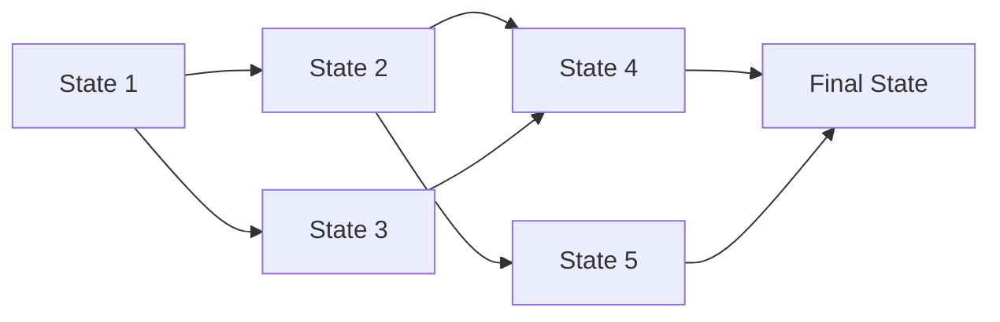

# State Definition in Dynamic Programming

## Introduction

State definition is arguably **the most crucial step** in solving any dynamic programming (DP) problem. When you're faced with a complex problem that seems overwhelming, properly defining the state can transform the problem from impossible to solvable.

In this guide, we'll explore what states are in dynamic programming, how to define them effectively, and apply this knowledge to solve real-world problems.

## What is a State in Dynamic Programming?

A **state** in dynamic programming represents the condition or situation of the problem at a particular point during the computation. It encapsulates all the information needed to make optimal decisions from that point forward, without needing to know how we arrived at that state.

Think of a state as a snapshot that contains just enough information to:
1. Make the current decision
2. Connect to future states
3. Retrieve the optimal solution

## The Importance of State Definition

Proper state definition is critical because:

- It determines the structure of your DP solution
- It affects time and space complexity
- A poorly defined state can make a problem unsolvable or inefficient
- The right state definition often leads to elegant, efficient solutions

## How to Define States Effectively

### Step 1: Identify the Decisions

First, understand what decisions need to be made at each step of the problem.

### Step 2: Identify the Parameters That Affect Decisions

Ask yourself: "What information do I need to make an optimal decision at this point?"

### Step 3: Define the Minimal State

The state should be minimal but complete - include everything necessary but nothing extra.

### Step 4: Define the State Transitions

Determine how one state leads to another based on the decisions made.

## Common Types of States

Let's explore some common patterns for state definitions:

### 1. Index-based States

The simplest form where the state depends on the position in an array or string.

```javascript
// Example: Maximum subarray sum
// dp[i] = maximum sum ending at index i

function maxSubarraySum(nums) {
  if (nums.length === 0) return 0;
  
  let dp = new Array(nums.length);
  dp[0] = nums[0];
  
  for (let i = 1; i < nums.length; i++) {
    dp[i] = Math.max(dp[i-1] + nums[i], nums[i]);
  }
  
  return Math.max(...dp);
}

// Input: [-2, 1, -3, 4, -1, 2, 1, -5, 4]
// Output: 6 (subarray [4, -1, 2, 1])
```

### 2. Multi-dimensional States

When a single index isn't enough, we use multiple parameters.

```javascript
// Example: Knapsack problem
// dp[i][w] = maximum value with first i items and capacity w

function knapsack(weights, values, capacity) {
  let n = weights.length;
  let dp = Array(n + 1).fill().map(() => Array(capacity + 1).fill(0));
  
  for (let i = 1; i <= n; i++) {
    for (let w = 0; w <= capacity; w++) {
      // Don't include the current item
      dp[i][w] = dp[i-1][w];
      
      // Include the current item if possible
      if (w >= weights[i-1]) {
        dp[i][w] = Math.max(dp[i][w], dp[i-1][w-weights[i-1]] + values[i-1]);
      }
    }
  }
  
  return dp[n][capacity];
}

// Input: weights = [2, 3, 4, 5], values = [3, 4, 5, 6], capacity = 8
// Output: 10 (take items with weights 3 and 5, values 4 and 6)
```

### 3. Bitmask States

When dealing with a small set of items where we need to track combinations.

```javascript
// Example: Traveling Salesman Problem
// dp[mask][i] = minimum distance to visit cities in mask ending at city i

function tsp(distances) {
  const n = distances.length;
  const VISITED_ALL = (1 << n) - 1;
  
  // dp[mask][last] = min distance to visit all cities in mask ending at 'last'
  const dp = Array(1 << n).fill().map(() => Array(n).fill(Infinity));
  
  // Base case: start at city 0 with distance 0
  dp[1][0] = 0;
  
  for (let mask = 1; mask < (1 << n); mask++) {
    for (let last = 0; last < n; last++) {
      // Skip if 'last' is not in the mask
      if (!(mask & (1 << last))) continue;
      
      // Try all next cities
      for (let next = 0; next < n; next++) {
        if (mask & (1 << next)) continue; // Skip if already visited
        
        const newMask = mask | (1 << next);
        dp[newMask][next] = Math.min(
          dp[newMask][next],
          dp[mask][last] + distances[last][next]
        );
      }
    }
  }
  
  // Find minimum distance to return to city 0 after visiting all cities
  let result = Infinity;
  for (let last = 0; last < n; last++) {
    result = Math.min(result, dp[VISITED_ALL][last] + distances[last][0]);
  }
  
  return result;
}

// Input: distances = [[0, 10, 15, 20], [10, 0, 35, 25], [15, 35, 0, 30], [20, 25, 30, 0]]
// Output: 80
```

## Common Mistakes in State Definition

### 1. Including Redundant Information

Extra state parameters lead to inefficient solutions with higher time and space complexity.

### 2. Missing Critical Information

Insufficient states lead to incorrect solutions as the algorithm can't make optimal decisions.

### 3. Overlapping or Ambiguous States

When states aren't uniquely defined, it leads to incorrect calculations or harder-to-implement solutions.

## Real-World Example: Minimum Cost Path in a Grid

Let's solve a practical problem step by step.

**Problem**: Find the minimum cost path from top-left to bottom-right in a grid, where each cell has a cost. You can only move right or down.

### Step 1: Identify the Decision

At each cell, we need to decide whether to move right or down.

### Step 2: Identify the Parameters

To make this decision, we need to know:
- Our current position (i, j)
- The cost grid

### Step 3: Define the State

```
dp[i][j] = minimum cost to reach the bottom-right from position (i, j)
```

### Step 4: Define the State Transitions

```
dp[i][j] = cost[i][j] + min(dp[i+1][j], dp[i][j+1])
```

### Implementation

```javascript
function minCostPath(grid) {
  const m = grid.length;
  const n = grid[0].length;
  
  // Create DP table with extra row and column for base cases
  const dp = Array(m+1).fill().map(() => Array(n+1).fill(Infinity));
  
  // Base case: bottom-right cell
  dp[m-1][n-1] = grid[m-1][n-1];
  
  // Fill the DP table bottom-up
  for (let i = m-1; i >= 0; i--) {
    for (let j = n-1; j >= 0; j--) {
      // Skip the bottom-right cell (already handled)
      if (i === m-1 && j === n-1) continue;
      
      // Option 1: Move right
      const rightOption = j+1 < n ? dp[i][j+1] : Infinity;
      
      // Option 2: Move down
      const downOption = i+1 < m ? dp[i+1][j] : Infinity;
      
      // Take the minimum of both options and add current cell's cost
      dp[i][j] = grid[i][j] + Math.min(rightOption, downOption);
    }
  }
  
  return dp[0][0];
}

// Input: grid = [[1, 3, 1], [1, 5, 1], [4, 2, 1]]
// Output: 7 (path: 1→3→1→1→1)
```

## Visualizing State Transitions

State transitions can be visualized as directed graphs, where nodes represent states and edges represent transitions.



## Advanced Tips for State Definition

### Tip 1: Start with Recursive Formulation

Begin by thinking about the problem recursively. The parameters to your recursive function often become your state variables.

### Tip 2: Use More States When Needed

Don't hesitate to add state dimensions if they're necessary, but always question if each is truly needed.

### Tip 3: Consider State Compression

When dealing with large state spaces, consider techniques like:
- Rolling arrays (e.g., only keeping the last two rows)
- Bitmasks for small sets
- Hash maps for sparse states

### Tip 4: Understand the Problem Constraints

The constraints can guide how complex your state needs to be and what optimizations you might need.

## Summary

Defining the right state is the cornerstone of dynamic programming. Remember these key points:

1. A state must contain all information needed to make optimal decisions from that point forward
2. States should be minimal but complete
3. Clear state transitions lead to clean, efficient code
4. The structure of your DP solution follows directly from your state definition

By mastering state definition, you'll be able to solve a wide range of complex problems using dynamic programming.

## Practice Problems

To solidify your understanding, try defining states and solving these problems:

1. Longest Common Subsequence
2. Edit Distance
3. Coin Change (minimum number of coins)
4. Maximum Sum Increasing Subsequence
5. Longest Palindromic Substring

## Additional Resources

- [Introduction to Algorithms](https://mitpress.mit.edu/books/introduction-algorithms-third-edition) - For in-depth coverage of dynamic programming
- [Competitive Programmer's Handbook](https://cses.fi/book/book.pdf) - Chapter 7 covers dynamic programming
- [Algorithms, 4th Edition](https://algs4.cs.princeton.edu/) - By Robert Sedgewick and Kevin Wayne

Remember, practice is key to mastering state definition. Start with simpler problems and work your way up to more complex ones.