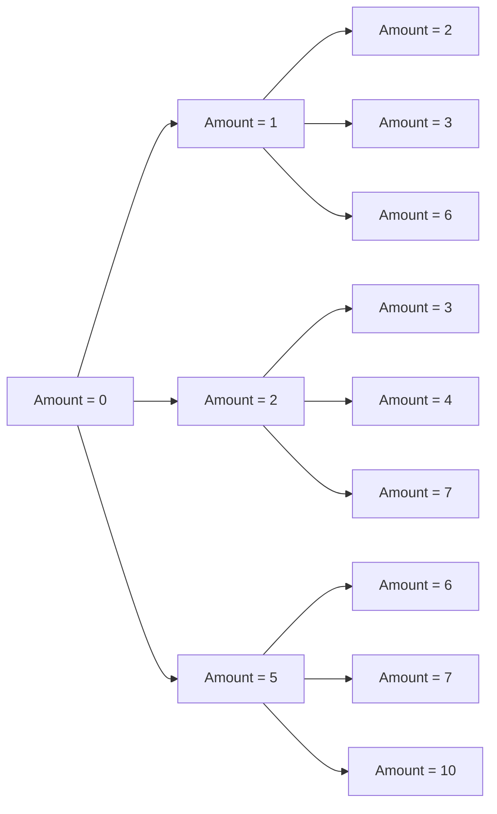

# Transition Functions

## Introduction

Dynamic Programming (DP) is a powerful technique for solving complex problems by breaking them down into simpler subproblems. At the heart of any dynamic programming solution lies the **transition function** - a mathematical formulation that defines how to move from one state to another in our solution space.

Think of transition functions as the "rules of transformation" that tell us how to build optimal solutions from previously calculated results. They are the bridges connecting our subproblems, enabling the incremental construction of the final solution.

In this tutorial, we'll explore what transition functions are, how to derive them, and how to implement them effectively in various dynamic programming problems.

## What are Transition Functions?

A transition function in dynamic programming defines how we move from one state to another while maintaining optimality. It answers the question: "Given that I know the answers to smaller subproblems, how do I compute the answer for the current problem?"

Mathematically, a transition function can be expressed as:

```
DP[current_state] = optimal_combination(DP[previous_states])
```

Where:
- `DP[current_state]` is the value of our objective function at the current state
- `optimal_combination` could be min, max, sum, or any other operation depending on the problem
- `DP[previous_states]` represents values we've already computed for smaller subproblems

## Components of a Transition Function

A well-defined transition function consists of three key components:

1. **State Definition**: What information do we need to represent a subproblem?
2. **Base Cases**: Initial values for the simplest subproblems
3. **Recurrence Relation**: The mathematical formula that relates the current state to previous states

Let's explore each component in detail.

## Deriving Transition Functions

Deriving a good transition function is often the most challenging part of solving a dynamic programming problem. Here's a step-by-step approach:

1. **Define the state clearly**: Identify what variables you need to completely describe a subproblem
2. **Identify the base cases**: Determine the simplest subproblems you can solve directly
3. **Think recursively**: Ask, "If I know the solutions to smaller subproblems, how can I solve the current problem?"
4. **Express the optimal solution**: Write down the mathematical relationship between the current state and previous states

## Example 1: Fibonacci Sequence

Let's start with a simple example - calculating the nth Fibonacci number using dynamic programming.

### State Definition
- `DP[i]` = the ith Fibonacci number

### Base Cases
- `DP[0] = 0`
- `DP[1] = 1`

### Transition Function
- `DP[i] = DP[i-1] + DP[i-2]` for i ≥ 2

### Implementation

```javascript
function fibonacci(n) {
  // Base cases
  if (n <= 1) return n;
  
  // Initialize DP array
  const dp = new Array(n + 1);
  dp[0] = 0;
  dp[1] = 1;
  
  // Apply transition function for each state
  for (let i = 2; i <= n; i++) {
    dp[i] = dp[i - 1] + dp[i - 2];
  }
  
  return dp[n];
}

// Example usage
console.log(fibonacci(10)); // Output: 55
```

## Example 2: Coin Change Problem

Let's tackle a more complex problem: finding the minimum number of coins needed to make a certain amount of money.

### Problem Statement
Given coins of different denominations and a total amount of money, find the minimum number of coins needed to make up that amount. If the amount cannot be made up by any combination of coins, return -1.

### State Definition
- `DP[amount]` = minimum number of coins needed to make up `amount`

### Base Cases
- `DP[0] = 0` (it takes 0 coins to make up amount 0)
- `DP[amount] = Infinity` if amount < 0 (impossible)

### Transition Function
- `DP[amount] = min(DP[amount], DP[amount - coin] + 1)` for each coin in coins

This says: "The minimum number of coins needed for the current amount is the minimum of either the current value or the minimum coins needed for (amount - coin value) plus one additional coin."

### Implementation

```javascript
function coinChange(coins, amount) {
  // Create DP array filled with amount+1 (which is > max possible coins needed)
  const dp = new Array(amount + 1).fill(amount + 1);
  
  // Base case
  dp[0] = 0;
  
  // Fill DP array using transition function
  for (let currentAmount = 1; currentAmount <= amount; currentAmount++) {
    for (const coin of coins) {
      if (coin <= currentAmount) {
        // Apply transition function
        dp[currentAmount] = Math.min(dp[currentAmount], dp[currentAmount - coin] + 1);
      }
    }
  }
  
  // If dp[amount] is still amount+1, it means it's impossible to make that amount
  return dp[amount] > amount ? -1 : dp[amount];
}

// Example usage
console.log(coinChange([1, 2, 5], 11)); // Output: 3 (5 + 5 + 1)
console.log(coinChange([2], 3));        // Output: -1 (impossible)
```

## Example 3: Knapsack Problem

The 0/1 knapsack problem is a classic dynamic programming problem where we need to select items to maximize value while respecting a weight constraint.

### Problem Statement
Given weights and values of n items, put these items in a knapsack with capacity W to get the maximum total value in the knapsack.

### State Definition
- `DP[i][w]` = maximum value that can be obtained using the first i items with a knapsack capacity of w

### Base Cases
- `DP[0][w] = 0` for all w (no items means no value)
- `DP[i][0] = 0` for all i (no capacity means no value)

### Transition Function
For each item i with weight weight[i-1] and value value[i-1]:
- If the current item can fit (`weight[i-1] ≤ w`):
  - `DP[i][w] = max(DP[i-1][w], DP[i-1][w - weight[i-1]] + value[i-1])`
- If the current item doesn't fit:
  - `DP[i][w] = DP[i-1][w]`

### Implementation

```javascript
function knapsack(values, weights, capacity) {
  const n = values.length;
  
  // Create a 2D DP array
  const dp = Array(n + 1)
    .fill()
    .map(() => Array(capacity + 1).fill(0));
  
  // Fill the DP table using the transition function
  for (let i = 1; i <= n; i++) {
    for (let w = 0; w <= capacity; w++) {
      // Current item's weight and value (0-indexed array)
      const currentWeight = weights[i - 1];
      const currentValue = values[i - 1];
      
      if (currentWeight <= w) {
        // Apply transition function when item can fit
        dp[i][w] = Math.max(
          dp[i - 1][w],                              // Don't take the item
          dp[i - 1][w - currentWeight] + currentValue // Take the item
        );
      } else {
        // Item doesn't fit, so we can't take it
        dp[i][w] = dp[i - 1][w];
      }
    }
  }
  
  return dp[n][capacity];
}

// Example usage
const values = [60, 100, 120];
const weights = [10, 20, 30];
const capacity = 50;

console.log(knapsack(values, weights, capacity)); // Output: 220 (items with values 100 and 120)
```

## Visualizing State Transitions

Understanding state transitions becomes easier with visual representation. Let's visualize the state transitions for the coin change problem:



Each arrow represents adding one coin to reach the new amount. The optimal solution is found by exploring all possible transitions and selecting the one that minimizes the number of coins.

## Common Patterns in Transition Functions

Through our examples, you might have noticed some patterns in how transition functions are formulated:

1. **Minimization Problems**: `DP[state] = min(DP[state], DP[previous_state] + cost)`
2. **Maximization Problems**: `DP[state] = max(DP[state], DP[previous_state] + gain)`
3. **Counting Problems**: `DP[state] += DP[previous_state]`
4. **Boolean Problems**: `DP[state] = DP[state] || DP[previous_state]`

Recognizing these patterns can help you quickly formulate transition functions for new problems.

## Tips for Designing Effective Transition Functions

1. **Start simple**: Begin with a recursive formulation, then optimize
2. **Draw examples**: Work through small examples by hand to understand transitions
3. **Identify dependencies**: Which previous states are needed for the current state?
4. **Watch for edge cases**: Ensure your transition function handles boundary conditions
5. **Consider space/time trade-offs**: Sometimes you can optimize storage by using only necessary states

## Real-World Applications

Transition functions in dynamic programming have numerous practical applications:

### 1. Route Planning
Navigation apps use DP with transition functions that represent moving from one intersection to another, with the goal of finding the shortest or fastest path.

```javascript
// Simplified pseudocode for route planning
function shortestPath(graph, start, end) {
  const distance = {}; // DP array
  // Initialize all distances as infinite except start
  // ...
  
  // Transition function: distance[node] = min(distance[node], distance[neighbor] + edge_cost)
  // Implementation using Dijkstra's algorithm
  // ...
}
```

### 2. Text Formatting and Word Wrap
Word processors use DP to determine optimal line breaks in paragraphs.

```javascript
function wordWrap(words, maxWidth) {
  const n = words.length;
  // DP[i] = minimum cost of formatting words[i...n-1]
  const dp = new Array(n + 1).fill(0);
  
  // Process from end to start
  for (let i = n - 1; i >= 0; i--) {
    // Transition function: try placing different numbers of words on the first line
    // and find the minimum cost
    // ...
  }
  
  return dp[0];
}
```

### 3. Resource Allocation
Companies use DP for optimizing the allocation of resources like time, money, and personnel.

```javascript
function resourceAllocation(projects, budget) {
  // DP[b] = maximum value achievable with budget b
  const dp = new Array(budget + 1).fill(0);
  
  // For each project, update the DP table
  for (const project of projects) {
    for (let b = budget; b >= project.cost; b--) {
      // Transition function: either take this project or not
      dp[b] = Math.max(dp[b], dp[b - project.cost] + project.value);
    }
  }
  
  return dp[budget];
}
```

## Summary

Transition functions are the cornerstone of dynamic programming solutions. They define how we move from one state to another while maintaining optimal substructure. To create effective transition functions:

1. Clearly define your state representation
2. Identify base cases that can be solved directly
3. Formulate a recurrence relation that connects current states to previous states
4. Implement the solution in a bottom-up manner to avoid redundant calculations

By mastering transition functions, you'll be able to solve a wide range of optimization problems efficiently and elegantly.

## Exercises

To solidify your understanding, try deriving transition functions for these problems:

1. **Longest Common Subsequence**: Given two strings, find the length of their longest common subsequence.

2. **Edit Distance**: Find the minimum number of operations (insert, delete, replace) to transform one string into another.

3. **Maximum Subarray Sum**: Find the contiguous subarray with the largest sum.

4. **Longest Increasing Subsequence**: Find the length of the longest subsequence such that all elements are in increasing order.

5. **Matrix Chain Multiplication**: Find the most efficient way to multiply a chain of matrices.

## Additional Resources

- [Introduction to Algorithms](https://mitpress.mit.edu/books/introduction-algorithms-third-edition) by Cormen, Leiserson, Rivest, and Stein - Chapter on Dynamic Programming
- [Competitive Programmer's Handbook](https://cses.fi/book/book.pdf) by Antti Laaksonen - Section on Dynamic Programming
- [Dynamic Programming - GeeksforGeeks](https://www.geeksforgeeks.org/dynamic-programming/)
- [Algorithms, Part II](https://www.coursera.org/learn/algorithms-part2) by Princeton University on Coursera

Remember, mastering transition functions takes practice. Start with simpler problems and gradually work your way up to more complex ones. With persistence, you'll develop the intuition needed to formulate effective transition functions for any dynamic programming problem.