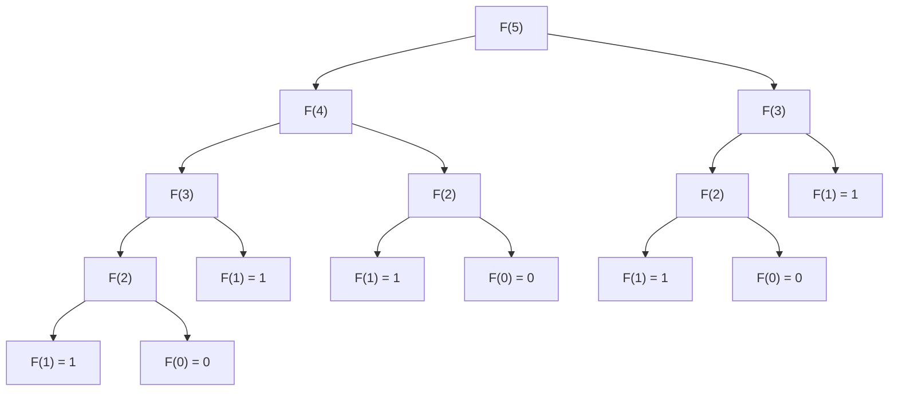

# 1D Dynamic Programming Problems

## Introduction

One-dimensional Dynamic Programming (1D DP) is a fundamental concept in algorithm design where we solve problems by breaking them down into simpler overlapping subproblems and storing the solutions to avoid redundant calculations. In 1D DP, we typically use a single array to keep track of our subproblem solutions, creating a "memory" of previously solved problems.

1D DP is the perfect starting point for understanding the broader concept of dynamic programming, as it's more straightforward to visualize and implement compared to multi-dimensional approaches.

## Understanding 1D DP

### Key Characteristics

1D DP problems typically have the following characteristics:

1. **Optimal Substructure**: The optimal solution can be constructed from optimal solutions of its subproblems.
2. **Overlapping Subproblems**: The same subproblems are solved multiple times.
3. **Single State Variable**: The subproblems can be defined using a single parameter or state variable (hence "1D").

### General Steps to Solve 1D DP Problems

1. **Define the state**: Determine what a subproblem looks like (e.g., `dp[i]` might represent the solution for the first `i` elements).
2. **Establish the base case(s)**: Define the solutions for the smallest possible subproblems.
3. **Create a state transition equation**: Define how to build larger solutions from smaller ones.
4. **Determine the calculation order**: Decide whether to use a bottom-up (tabulation) or top-down (memoization) approach.
5. **Implement the solution**: Code the solution based on the above steps.

## Common 1D DP Problems

Let's explore some classic 1D DP problems that every programmer should know.

### Problem 1: Fibonacci Sequence

The Fibonacci sequence is a perfect introduction to dynamic programming.

#### Problem Statement
Calculate the nth Fibonacci number, where F(0) = 0, F(1) = 1, and F(n) = F(n-1) + F(n-2) for n > 1.

#### Naive Recursive Approach

```javascript
function fibonacci(n) {
  if (n <= 1) return n;
  return fibonacci(n - 1) + fibonacci(n - 2);
}

console.log(fibonacci(10)); // Output: 55
```

The above solution has a time complexity of O(2^n), which is highly inefficient due to repeated calculations.

#### DP Approach (Bottom-Up)

```javascript
function fibonacciDP(n) {
  if (n <= 1) return n;
  
  const dp = new Array(n + 1);
  dp[0] = 0;
  dp[1] = 1;
  
  for (let i = 2; i <= n; i++) {
    dp[i] = dp[i - 1] + dp[i - 2];
  }
  
  return dp[n];
}

console.log(fibonacciDP(10)); // Output: 55
```

Time Complexity: O(n) - We only calculate each Fibonacci number once.
Space Complexity: O(n) - We store all Fibonacci numbers up to n.

#### Space-Optimized DP

```javascript
function fibonacciOptimized(n) {
  if (n <= 1) return n;
  
  let prev2 = 0;
  let prev1 = 1;
  let current;
  
  for (let i = 2; i <= n; i++) {
    current = prev1 + prev2;
    prev2 = prev1;
    prev1 = current;
  }
  
  return prev1;
}

console.log(fibonacciOptimized(10)); // Output: 55
```

Time Complexity: O(n)
Space Complexity: O(1) - We only store three variables.

### Problem 2: Climbing Stairs

#### Problem Statement
You are climbing a staircase. It takes n steps to reach the top. Each time you can either climb 1 or 2 steps. How many distinct ways can you climb to the top?

#### DP Approach

```python
def climbStairs(n):
    if n <= 2:
        return n
    
    dp = [0] * (n + 1)
    dp[1] = 1
    dp[2] = 2
    
    for i in range(3, n + 1):
        dp[i] = dp[i - 1] + dp[i - 2]
    
    return dp[n]

print(climbStairs(5))  # Output: 8
```

For n = 5:
- dp[1] = 1 (1 way: 1 step)
- dp[2] = 2 (2 ways: 1+1 or 2 steps)
- dp[3] = 3 (3 ways: 1+1+1, 1+2, 2+1)
- dp[4] = 5 (5 ways: 1+1+1+1, 1+1+2, 1+2+1, 2+1+1, 2+2)
- dp[5] = 8 (8 ways)

### Problem 3: Maximum Subarray

#### Problem Statement
Given an integer array `nums`, find the contiguous subarray (containing at least one number) with the largest sum and return its sum.

#### DP Approach (Kadane's Algorithm)

```cpp
int maxSubArray(vector<int>& nums) {
    // Base case
    if (nums.empty()) return 0;
    
    // Initialize our DP array with the first element
    int maxSoFar = nums[0];
    int maxEndingHere = nums[0];
    
    // Start from the second element
    for (int i = 1; i < nums.size(); i++) {
        // For each position, we either take only the current element 
        // or add it to the previous subarray
        maxEndingHere = max(nums[i], maxEndingHere + nums[i]);
        
        // Update the overall maximum
        maxSoFar = max(maxSoFar, maxEndingHere);
    }
    
    return maxSoFar;
}
```

For example, if nums = [-2, 1, -3, 4, -1, 2, 1, -5, 4]:

1. maxEndingHere = -2, maxSoFar = -2
2. maxEndingHere = 1, maxSoFar = 1
3. maxEndingHere = -2, maxSoFar = 1
4. maxEndingHere = 4, maxSoFar = 4
5. maxEndingHere = 3, maxSoFar = 4
6. maxEndingHere = 5, maxSoFar = 5
7. maxEndingHere = 6, maxSoFar = 6
8. maxEndingHere = 1, maxSoFar = 6
9. maxEndingHere = 5, maxSoFar = 6

The answer is 6, which is the sum of the subarray [4, -1, 2, 1].

## Problem 4: House Robber

### Problem Statement
A professional robber plans to rob houses along a street. Each house has a certain amount of money stashed. The only constraint stopping the robber from robbing each house is that adjacent houses have security systems connected, and they will automatically contact the police if two adjacent houses were broken into on the same night. Given a list of non-negative integers representing the amount of money in each house, determine the maximum amount of money the robber can rob without alerting the police.

### DP Approach

```java
public int rob(int[] nums) {
    if (nums.length == 0) return 0;
    if (nums.length == 1) return nums[0];
    
    // dp[i] represents the maximum amount that can be robbed up to the ith house
    int[] dp = new int[nums.length];
    
    // Base cases
    dp[0] = nums[0];
    dp[1] = Math.max(nums[0], nums[1]);
    
    // Build up the dp array
    for (int i = 2; i < nums.length; i++) {
        dp[i] = Math.max(dp[i - 1], dp[i - 2] + nums[i]);
    }
    
    return dp[nums.length - 1];
}
```

For example, if nums = [1, 2, 3, 1]:
1. dp[0] = 1 (rob the first house)
2. dp[1] = 2 (rob the second house, skip the first)
3. dp[2] = 4 (rob the third house and the first, skip the second)
4. dp[3] = 4 (skip the fourth house or rob it and the second house: max(4, 2+1) = 4)

The answer is 4.

## More Advanced 1D DP Problems

### Coin Change

#### Problem Statement
You are given an integer array `coins` representing coins of different denominations and an integer `amount` representing a total amount of money. Return the fewest number of coins needed to make up that amount. If that amount of money cannot be made up by any combination of the coins, return -1.

#### DP Approach

```python
def coinChange(coins, amount):
    # Initialize dp array with amount + 1 (more than any possible answer)
    dp = [amount + 1] * (amount + 1)
    dp[0] = 0  # Base case: 0 coins to make amount 0
    
    # For each amount, try every coin
    for i in range(1, amount + 1):
        for coin in coins:
            if coin <= i:  # Can use this coin
                dp[i] = min(dp[i], dp[i - coin] + 1)
    
    return dp[amount] if dp[amount] != amount + 1 else -1

# Example
print(coinChange([1, 2, 5], 11))  # Output: 3 (5 + 5 + 1)
```

### Longest Increasing Subsequence

#### Problem Statement
Given an integer array `nums`, find the length of the longest strictly increasing subsequence.

#### DP Approach

```javascript
function lengthOfLIS(nums) {
    if (nums.length === 0) return 0;
    
    // Initialize dp array: dp[i] represents the length of LIS ending at index i
    const dp = new Array(nums.length).fill(1);
    
    // For each element, we check all previous elements
    for (let i = 1; i < nums.length; i++) {
        for (let j = 0; j < i; j++) {
            // If the current element is greater than the previous element,
            // we can extend that subsequence
            if (nums[i] > nums[j]) {
                dp[i] = Math.max(dp[i], dp[j] + 1);
            }
        }
    }
    
    // Find the maximum value in the dp array
    return Math.max(...dp);
}

console.log(lengthOfLIS([10, 9, 2, 5, 3, 7, 101, 18])); // Output: 4
```

## Visualizing DP States

Understanding the state transitions in dynamic programming can be easier with diagrams. Below is a visualization of the Fibonacci sequence calculation using 1D DP:



Notice how F(3) and F(2) are calculated multiple times - this is why DP is valuable! With memoization or tabulation, we compute these values just once.

## Real-World Applications of 1D DP

Dynamic programming isn't just an academic exercise—it has numerous practical applications:

1. **Financial Modeling**: Optimizing investment strategies, portfolio balancing, and option pricing.
2. **Resource Allocation**: Optimizing distribution of limited resources across multiple projects.
3. **Text Processing**: Algorithms like the Levenshtein distance for spell-checking and DNA sequence alignment.
4. **Network Routing**: Finding the shortest paths in network communications.
5. **Game Development**: For AI decision-making and pathfinding algorithms.

For example, ride-sharing applications like Uber use DP algorithms to determine optimal driver allocation and pricing strategies.

## Summary

1D Dynamic Programming provides an efficient way to solve problems with overlapping subproblems by breaking them down into simpler cases and storing intermediate results. Key characteristics include:

- Using a single array to store subproblem solutions
- Building solutions from smaller to larger problems
- Avoiding redundant calculations

We've explored several classic 1D DP problems:
- Fibonacci sequence
- Climbing stairs
- Maximum subarray
- House robber
- Coin change
- Longest increasing subsequence

Each demonstrates the power of dynamic programming in transforming exponential-time algorithms into linear or polynomial-time solutions.

## Practice Problems

To strengthen your understanding of 1D DP, try solving these problems:

1. **Jump Game**: Given an array of non-negative integers, determine if you can reach the last index starting from the first.
2. **Word Break**: Given a string and a dictionary of words, determine if the string can be segmented into a space-separated sequence of dictionary words.
3. **Decode Ways**: A message containing letters from A-Z is encoded to numbers using A=1, B=2, ..., Z=26. Given a non-empty string containing only digits, determine the number of ways to decode it.
4. **Palindrome Partitioning**: Partition a string such that every substring is a palindrome and return the minimum cuts needed.
5. **Edit Distance**: Given two strings, find the minimum number of operations required to convert one string to another.

## Additional Resources

- "Introduction to Algorithms" by Cormen, Leiserson, Rivest, and Stein has an excellent chapter on dynamic programming
- "Algorithms" by Robert Sedgewick and Kevin Wayne
- [LeetCode's Dynamic Programming Problem Set](https://leetcode.com/tag/dynamic-programming/)
- [Geeks for Geeks - Dynamic Programming](https://www.geeksforgeeks.org/dynamic-programming/)

Remember: The key to mastering dynamic programming is practice. Start with simpler problems and gradually work your way up to more complex ones. With time, you'll develop an intuition for recognizing and solving DP problems.