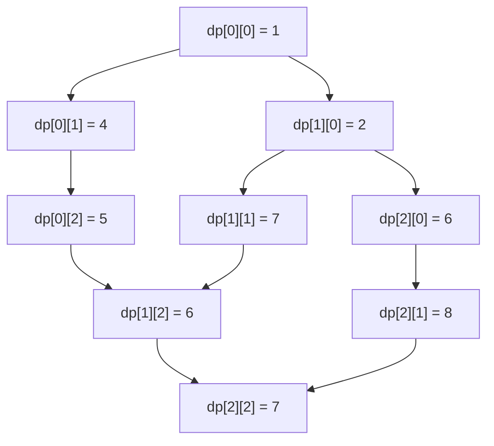

# 2D Dynamic Programming Problems

## Introduction

Welcome to the world of 2D Dynamic Programming! If you've mastered 1D dynamic programming problems, it's time to level up. 2D DP problems use a two-dimensional array to store and compute solutions to subproblems, allowing us to solve more complex problems efficiently.

In 2D DP, we typically build a table where each cell `dp[i][j]` represents the solution to a subproblem defined by two parameters `i` and `j`. This approach is particularly useful for problems involving sequences, grids, or when we need to consider two changing variables simultaneously.

## When to Use 2D DP?

You should consider a 2D DP approach when:

1. The problem involves two changing parameters or dimensions
2. Solutions to subproblems can be used to build solutions to larger problems
3. The problem exhibits overlapping subproblems and optimal substructure

## Key Components of 2D DP Problems

1. **State definition**: What does `dp[i][j]` represent?
2. **Base cases**: Initial values for `dp[i][j]` for boundary conditions
3. **State transition**: How to compute `dp[i][j]` from previous states
4. **Final answer**: Where in the DP table is the solution to the original problem?

## Common 2D DP Problem Patterns

### Pattern 1: Grid-based Problems

Grid problems are classic examples where 2D DP shines. Let's look at a simple example:

#### Example: Minimum Path Sum

**Problem**: Given a grid filled with integers, find a path from the top-left corner to the bottom-right corner with the minimum sum of numbers along the path. You can only move right or down.

**Solution**:

1. **State Definition**: `dp[i][j]` represents the minimum path sum from the top-left corner (0,0) to position (i,j).
2. **Base Cases**: 
   - `dp[0][0]` = value of the top-left cell
   - First row and first column cells can only be reached from one direction
3. **State Transition**: `dp[i][j] = min(dp[i-1][j], dp[i][j-1]) + grid[i][j]`
4. **Final Answer**: `dp[m-1][n-1]` (where m and n are grid dimensions)

```javascript
function minPathSum(grid) {
  if (!grid || grid.length === 0) return 0;
  
  const m = grid.length;
  const n = grid[0].length;
  const dp = Array(m).fill().map(() => Array(n).fill(0));
  
  // Initialize dp[0][0]
  dp[0][0] = grid[0][0];
  
  // Initialize first row
  for (let j = 1; j < n; j++) {
    dp[0][j] = dp[0][j-1] + grid[0][j];
  }
  
  // Initialize first column
  for (let i = 1; i < m; i++) {
    dp[i][0] = dp[i-1][0] + grid[i][0];
  }
  
  // Fill the dp table
  for (let i = 1; i < m; i++) {
    for (let j = 1; j < n; j++) {
      dp[i][j] = Math.min(dp[i-1][j], dp[i][j-1]) + grid[i][j];
    }
  }
  
  return dp[m-1][n-1];
}

// Example
const grid = [
  [1, 3, 1],
  [1, 5, 1],
  [4, 2, 1]
];
console.log(minPathSum(grid)); // Output: 7 (path: 1 → 3 → 1 → 1 → 1)
```

Let's visualize how the DP table gets filled:



### Pattern 2: String-related Problems

Many string operations can be modeled using 2D DP, particularly when comparing two strings.

#### Example: Longest Common Subsequence (LCS)

**Problem**: Given two strings, find the length of the longest subsequence that appears in both strings.

**Solution**:

1. **State Definition**: `dp[i][j]` represents the length of LCS of substrings `text1[0...i-1]` and `text2[0...j-1]`
2. **Base Cases**: `dp[0][j] = dp[i][0] = 0` (empty string matches with nothing)
3. **State Transition**:
   - If `text1[i-1] == text2[j-1]`, then `dp[i][j] = dp[i-1][j-1] + 1`
   - Else `dp[i][j] = max(dp[i-1][j], dp[i][j-1])`
4. **Final Answer**: `dp[m][n]` (where m and n are lengths of the two strings)

```javascript
function longestCommonSubsequence(text1, text2) {
  const m = text1.length;
  const n = text2.length;
  
  // Create DP table with an extra row and column for the base case
  const dp = Array(m + 1).fill().map(() => Array(n + 1).fill(0));
  
  // Fill the dp table
  for (let i = 1; i <= m; i++) {
    for (let j = 1; j <= n; j++) {
      if (text1[i - 1] === text2[j - 1]) {
        dp[i][j] = dp[i - 1][j - 1] + 1;
      } else {
        dp[i][j] = Math.max(dp[i - 1][j], dp[i][j - 1]);
      }
    }
  }
  
  return dp[m][n];
}

// Example
const text1 = "abcde";
const text2 = "ace";
console.log(longestCommonSubsequence(text1, text2)); // Output: 3 (LCS is "ace")
```

### Pattern 3: Decision Making Problems

2D DP is also excellent for problems where we make decisions at each step and track results across multiple dimensions.

#### Example: 0/1 Knapsack Problem

**Problem**: Given weights and values of n items, put these items in a knapsack of capacity W to get the maximum value. You cannot break an item - either pick it entirely or don't pick it (0/1 property).

**Solution**:

1. **State Definition**: `dp[i][w]` represents the maximum value when considering first i items with a knapsack capacity of w.
2. **Base Cases**: `dp[0][w] = 0` (no items means no value)
3. **State Transition**:
   - If weight of current item > current capacity: `dp[i][w] = dp[i-1][w]` (skip the item)
   - Otherwise: `dp[i][w] = max(dp[i-1][w], dp[i-1][w-weight[i-1]] + value[i-1])` (max of including or excluding the item)
4. **Final Answer**: `dp[n][W]`

```javascript
function knapsack(weights, values, capacity) {
  const n = weights.length;
  const dp = Array(n + 1).fill().map(() => Array(capacity + 1).fill(0));
  
  for (let i = 1; i <= n; i++) {
    for (let w = 0; w <= capacity; w++) {
      if (weights[i - 1] <= w) {
        // We can either include or exclude this item
        dp[i][w] = Math.max(
          dp[i - 1][w],  // Exclude
          dp[i - 1][w - weights[i - 1]] + values[i - 1]  // Include
        );
      } else {
        // We can't include this item due to weight constraint
        dp[i][w] = dp[i - 1][w];
      }
    }
  }
  
  return dp[n][capacity];
}

// Example
const weights = [1, 3, 4, 5];
const values = [1, 4, 5, 7];
const capacity = 7;
console.log(knapsack(weights, values, capacity)); // Output: 9 (items with values 4 and 5)
```

## Practical Real-World Applications

### 1. Sequence Alignment in Computational Biology

The **Edit Distance** algorithm (a 2D DP problem) is used in DNA sequence alignment, spell checkers, and comparing differences between versions of a document.

```javascript
function editDistance(word1, word2) {
  const m = word1.length;
  const n = word2.length;
  
  const dp = Array(m + 1).fill().map(() => Array(n + 1).fill(0));
  
  // Base cases: transforming empty string to string of length j requires j insertions
  for (let i = 0; i <= m; i++) {
    dp[i][0] = i;
  }
  for (let j = 0; j <= n; j++) {
    dp[0][j] = j;
  }
  
  for (let i = 1; i <= m; i++) {
    for (let j = 1; j <= n; j++) {
      if (word1[i - 1] === word2[j - 1]) {
        // Characters match, no operation needed
        dp[i][j] = dp[i - 1][j - 1];
      } else {
        // Take the minimum of insert, delete, or replace
        dp[i][j] = 1 + Math.min(
          dp[i][j - 1],      // Insert
          dp[i - 1][j],      // Delete
          dp[i - 1][j - 1]   // Replace
        );
      }
    }
  }
  
  return dp[m][n];
}

// Example: "kitten" to "sitting"
console.log(editDistance("kitten", "sitting")); // Output: 3
```

### 2. Image Processing and Computer Vision

Dynamic programming is used in various image processing tasks like seam carving for content-aware image resizing.

### 3. Resource Allocation in Operations Research

The knapsack problem we discussed earlier is a classic resource allocation problem with applications in finance, logistics, and manufacturing.

## Tips for Solving 2D DP Problems

1. **Clearly define the state**: What exactly does `dp[i][j]` represent?
2. **Determine dependencies**: Which previous states are needed to compute the current state?
3. **Handle base cases**: Initialize the DP table properly for boundary conditions.
4. **Draw small examples**: Work through small examples manually to verify your approach.
5. **Look for optimizations**: Sometimes space complexity can be reduced from O(n²) to O(n).
6. **Check for off-by-one errors**: Index mapping between the problem and the DP table can be tricky.

## Common Optimization: Space Optimization

Many 2D DP problems only depend on a few rows or columns of the previous states. For example, in the knapsack problem, each state only depends on the previous row, so we can reduce the space complexity from O(n×W) to O(W) by keeping just two rows.

```javascript
function knapsackOptimized(weights, values, capacity) {
  const n = weights.length;
  // We only need two rows - the current row and the previous row
  let prevRow = Array(capacity + 1).fill(0);
  let currRow = Array(capacity + 1).fill(0);
  
  for (let i = 1; i <= n; i++) {
    for (let w = 0; w <= capacity; w++) {
      if (weights[i - 1] <= w) {
        currRow[w] = Math.max(
          prevRow[w],
          prevRow[w - weights[i - 1]] + values[i - 1]
        );
      } else {
        currRow[w] = prevRow[w];
      }
    }
    // Current row becomes previous row for the next iteration
    prevRow = [...currRow];
  }
  
  return currRow[capacity];
}

// Example
const weights = [1, 3, 4, 5];
const values = [1, 4, 5, 7];
const capacity = 7;
console.log(knapsackOptimized(weights, values, capacity)); // Output: 9
```

## Summary

2D Dynamic Programming is a powerful technique for solving problems with two changing parameters. Key points to remember:

- 2D DP uses tables where each cell depends on previously computed values
- The critical steps are defining the state, establishing base cases, and deriving the transition formula
- Common patterns include grid-based problems, string-related problems, and decision-making problems
- Real-world applications include sequence alignment, image processing, and resource allocation
- Space optimization techniques can often reduce memory requirements

With practice, you'll start recognizing patterns in problems that can be solved efficiently using 2D DP. The ability to formulate problems in terms of overlapping subproblems is a valuable skill in algorithm design.

## Practice Exercises

To solidify your understanding, try these problems:

1. **Unique Paths**: Count how many unique paths exist from the top-left to the bottom-right corner of a grid when you can only move right or down.

2. **Maximum Square**: Given a 2D binary matrix filled with 0's and 1's, find the largest square containing all 1's.

3. **Coin Change 2**: Count the number of ways to make a given amount using an unlimited supply of given coins.

4. **Longest Increasing Path in a Matrix**: Find the length of the longest increasing path in a 2D matrix.

5. **Regular Expression Matching**: Implement regular expression matching with support for '.' and '*'.

Remember, the key to mastering 2D DP is practice and pattern recognition. Happy coding!