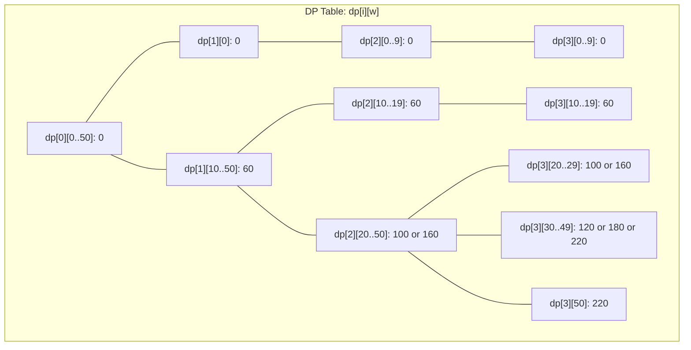

# Knapsack Problems

## Introduction

Imagine you're a thief who has broken into a store with a knapsack that can only hold a limited weight. There are various items around you, each with its own weight and value. Your goal is to fill your knapsack with items that maximize the total value without exceeding the weight capacity. This classic optimization scenario is known as the **Knapsack Problem**.

Knapsack problems are fundamental in computer science and serve as excellent examples for understanding Dynamic Programming. They appear in various real-world applications, from resource allocation to financial optimization.

In this tutorial, we'll explore different variations of the Knapsack Problem and learn how to solve them using Dynamic Programming techniques.

## Types of Knapsack Problems

There are several variations of the Knapsack Problem, but we'll focus on the two most common ones:

1. **0/1 Knapsack Problem**: Each item can either be taken entirely (1) or left behind (0)
2. **Unbounded Knapsack Problem**: Each item can be taken any number of times (including zero)

Let's dive into each of these variants in detail.

## 0/1 Knapsack Problem

In the 0/1 Knapsack Problem, you have `n` items, each with a weight `w[i]` and a value `v[i]`. You need to determine which items to include in your knapsack to maximize the total value without exceeding the weight capacity `W`.

### Naive Recursive Approach

Let's start with a simple recursive approach to understand the problem better:

```python
def knapsack_recursive(weights, values, capacity, n):
    # Base case: If no items left or no capacity left
    if n == 0 or capacity == 0:
        return 0
    
    # If weight of current item is more than capacity,
    # we cannot include this item
    if weights[n-1] > capacity:
        return knapsack_recursive(weights, values, capacity, n-1)
    
    # Return maximum of two cases:
    # 1. nth item included
    # 2. nth item not included
    else:
        return max(
            values[n-1] + knapsack_recursive(weights, values, capacity - weights[n-1], n-1),
            knapsack_recursive(weights, values, capacity, n-1)
        )
```

For example:

```
Input:
weights = [10, 20, 30]
values = [60, 100, 120]
capacity = 50
n = 3

Output: 220 (by taking items with weights 20 and 30)
```

However, this recursive approach recomputes the same subproblems multiple times, which leads to exponential time complexity. This is where Dynamic Programming comes in!

### Dynamic Programming Solution for 0/1 Knapsack

Let's implement a bottom-up DP solution using a 2D array:

```python
def knapsack_dp(weights, values, capacity, n):
    # Create a 2D DP table
    dp = [[0 for _ in range(capacity + 1)] for _ in range(n + 1)]
    
    # Fill the DP table in bottom-up manner
    for i in range(1, n + 1):
        for w in range(1, capacity + 1):
            # If current item weight is less than or equal to capacity
            if weights[i-1] <= w:
                # Maximum of including or excluding current item
                dp[i][w] = max(
                    values[i-1] + dp[i-1][w-weights[i-1]],
                    dp[i-1][w]
                )
            else:
                # Cannot include current item
                dp[i][w] = dp[i-1][w]
    
    # Return the maximum value that can be put in a knapsack of capacity W
    return dp[n][capacity]
```

Let's understand what's happening:
- We create a 2D array `dp` where `dp[i][w]` represents the maximum value we can get considering the first `i` items with a knapsack capacity of `w`.
- For each item `i` and each capacity `w`, we have two choices:
  - Include item `i` if its weight fits, giving us a value of `values[i-1] + dp[i-1][w-weights[i-1]]`
  - Exclude item `i`, giving us a value of `dp[i-1][w]`
- We take the maximum of these two options.

Let's visualize the DP table for our example:



### Space Optimization

We can optimize our solution to use only O(W) space instead of O(n*W):

```python
def knapsack_dp_optimized(weights, values, capacity, n):
    # Create a 1D array for DP
    dp = [0 for _ in range(capacity + 1)]
    
    # Fill the DP array in bottom-up manner
    for i in range(n):
        # Start from the right to avoid overwriting values
        for w in range(capacity, weights[i] - 1, -1):
            dp[w] = max(dp[w], values[i] + dp[w - weights[i]])
    
    return dp[capacity]
```

## Unbounded Knapsack Problem

In the Unbounded Knapsack Problem, each item can be taken any number of times. This changes our approach slightly.

### Dynamic Programming Solution for Unbounded Knapsack

```python
def unbounded_knapsack(weights, values, capacity, n):
    # Create a 1D DP array
    dp = [0 for _ in range(capacity + 1)]
    
    # Fill dp[] in bottom-up manner
    for w in range(1, capacity + 1):
        for i in range(n):
            if weights[i] <= w:
                dp[w] = max(dp[w], dp[w - weights[i]] + values[i])
    
    return dp[capacity]
```

The key difference here is that after considering an item, we may use it again for the same or different capacity.

For example:

```
Input:
weights = [1, 3, 4, 5]
values = [10, 40, 50, 70]
capacity = 8
n = 4

Output: 110 (by taking two items of weight 4 each with a total value of 100)
```

## Variations and Extensions

### Fractional Knapsack

While not a DP problem (this is solved using a greedy approach), it's worth mentioning the Fractional Knapsack problem where items can be broken into fractional parts:

```python
def fractional_knapsack(weights, values, capacity):
    # Calculate value per weight ratio for each item
    ratio = [(values[i] / weights[i], weights[i], values[i]) for i in range(len(weights))]
    
    # Sort by value-to-weight ratio in descending order
    ratio.sort(reverse=True)
    
    total_value = 0
    remaining_capacity = capacity
    
    for r, weight, value in ratio:
        if remaining_capacity >= weight:
            # Take the whole item
            total_value += value
            remaining_capacity -= weight
        else:
            # Take a fraction of the item
            total_value += r * remaining_capacity
            break
    
    return total_value
```

### Multiple Knapsack Problem

In this variation, you have multiple knapsacks, each with its own capacity. The goal is to distribute items among these knapsacks to maximize the total value. This can be solved using a 3D DP array, where `dp[i][j][k]` represents the maximum value with the first `i` items using `j` knapsacks with a total capacity of `k`.

## Real-World Applications

Knapsack problems appear in various real-world scenarios:

1. **Budget Allocation**: Allocating a limited budget to different projects to maximize returns.
2. **Cargo Loading**: Determining the optimal way to load cargo into containers or vehicles.
3. **Investment Portfolio**: Selecting investments to maximize returns with limited capital.
4. **Resource Scheduling**: Allocating computing resources to tasks with different requirements and priorities.

### Example: Budget Allocation

Imagine you're a project manager with a budget of $500,000. You have several projects, each requiring a different amount of money and providing different expected returns:

```
Project A: Cost $100,000, Expected Return $120,000
Project B: Cost $250,000, Expected Return $400,000
Project C: Cost $300,000, Expected Return $450,000
Project D: Cost $150,000, Expected Return $200,000
```

This is essentially a 0/1 Knapsack Problem where:
- The weights are the costs of each project
- The values are the expected returns
- The capacity is your total budget of $500,000

Using our DP solution, we can determine the optimal portfolio of projects to fund.

```python
costs = [100000, 250000, 300000, 150000]
returns = [120000, 400000, 450000, 200000]
budget = 500000

# Convert the problem to our knapsack format
max_return = knapsack_dp(costs, returns, budget, len(costs))
print(f"Maximum expected return: ${max_return}")
```

Output:
```
Maximum expected return: $620000
```

This means you should invest in Projects A, B, and D for a total cost of $500,000 and an expected return of $620,000.

## Common Patterns and Tips

1. **State Definition**: Always clearly define what your DP table represents.
2. **Transition Functions**: Understand how to move from one state to another.
3. **Base Cases**: Initialize your DP table with appropriate base values.
4. **Space Optimization**: Consider if you can reduce the dimension of your DP table.
5. **Backtracking**: To know which items were included, you may need to trace back through your DP table.

## Practice Problems

To solidify your understanding, try these practice problems:

1. **Basic 0/1 Knapsack**: Given weights and values of n items, put these items in a knapsack of capacity W to get the maximum total value.
2. **Subset Sum Problem**: Determine if there is a subset of the given set with a sum equal to a given target sum.
3. **Equal Sum Partition**: Determine if the given array can be divided into two subsets such that the sum of elements in both subsets is equal.
4. **Count of Subset Sum**: Count the number of subsets with a sum equal to a given value.
5. **Minimum Subset Sum Difference**: Partition the array into two subsets such that the difference between their sums is minimized.

## Summary

In this tutorial, we've covered:

- The concept of Knapsack Problems and their variations
- How to solve the 0/1 Knapsack Problem using Dynamic Programming
- Space optimization techniques
- The Unbounded Knapsack Problem
- Real-world applications of Knapsack Problems

Knapsack problems are fundamental in the study of Dynamic Programming and serve as a gateway to understanding more complex optimization problems. By mastering these techniques, you'll be better equipped to tackle a wide range of algorithmic challenges.

## Additional Resources

- "Introduction to Algorithms" by Cormen, Leiserson, Rivest, and Stein
- "Algorithms" by Robert Sedgewick and Kevin Wayne
- [GeeksforGeeks Knapsack Problem](https://www.geeksforgeeks.org/0-1-knapsack-problem-dp-10/)
- [Competitive Programmer's Handbook](https://cses.fi/book/book.pdf) Chapter 7

Now that you understand Knapsack Problems, try implementing the solutions yourself and gradually move on to the practice problems to strengthen your skills in Dynamic Programming!