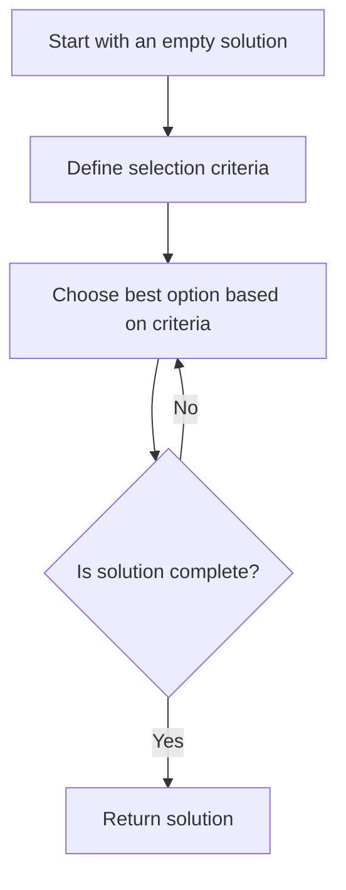

# Greedy Algorithms Introduction

## What Are Greedy Algorithms?

Greedy algorithms are a simple, intuitive class of algorithms that solve optimization problems by making the locally optimal choice at each step with the hope of finding a global optimum solution. As the name suggests, these algorithms are "greedy" because they always choose the best immediate option without considering the big picture.

The core principle is straightforward:

> "At each step, choose the option that looks best at the moment."

## How Greedy Algorithms Work

A greedy algorithm typically follows this structure:

1. Identify a problem that can be solved incrementally
2. Define what the "best" or "optimal" choice means at each step
3. Make that optimal choice at each step
4. Move to the next step and repeat until you reach a solution

Let's visualize this approach:



## Key Characteristics of Greedy Algorithms

- **Iterative approach**: Problems are solved one step at a time
- **Locally optimal choices**: Always select the best choice at each step
- **No backtracking**: Once a choice is made, it's never reconsidered
- **Simple implementation**: Often easy to understand and code
- **Efficiency**: Usually have good time complexity

## When to Use Greedy Algorithms

Greedy algorithms work well for problems that have these properties:

1. **Greedy-choice property**: A local optimal choice leads to a globally optimal solution
2. **Optimal substructure**: Optimal solution contains optimal solutions to subproblems

## A Simple Example: Making Change

Let's consider a classic problem: given a set of coin denominations and an amount, find the minimum number of coins needed to make that amount.

Here's a greedy approach in Python:

```python
def make_change_greedy(amount, coins):
    # Sort coins in descending order
    coins.sort(reverse=True)
    
    count = 0
    coin_usage = {}
    
    # Try to use the largest coins first
    for coin in coins:
        # Use as many of the current coin as possible
        num_coins = amount // coin
        
        if num_coins > 0:
            coin_usage[coin] = num_coins
            count += num_coins
            amount -= coin * num_coins
            
    # Check if we've made exact change
    if amount == 0:
        print(f"Total coins used: {count}")
        for coin, num in coin_usage.items():
            print(f"{num} coin(s) of {coin}")
        return count
    else:
        print("Cannot make exact change with these coins")
        return -1

# Example usage
coins = [25, 10, 5, 1]  # Quarter, dime, nickel, penny
amount = 63

print(f"Making change for {amount} cents:")
make_change_greedy(amount, coins)
```

**Output:**
```
Making change for 63 cents:
Total coins used: 6
2 coin(s) of 25
1 coin(s) of 10
0 coin(s) of 5
3 coin(s) of 1
```

The algorithm works by always choosing the largest coin that doesn't exceed the remaining amount. For U.S. coins, this greedy approach always gives the optimal solution. However, this is not true for all coin systems!

## Advantages of Greedy Algorithms

1. **Simplicity**: Easy to understand, implement, and debug
2. **Efficiency**: Often have good time complexity (usually O(n log n) or better)
3. **Low memory usage**: Don't require storing multiple paths or states

## Limitations and Pitfalls

1. **Not always optimal**: Greedy algorithms don't always find the globally best solution
2. **Problem suitability**: Only work for problems with specific properties
3. **No backtracking**: Can't reconsider poor choices made earlier

## Practical Applications

Greedy algorithms are used in many real-world scenarios:

### 1. Huffman Coding for Data Compression

Huffman coding assigns variable-length codes to characters based on their frequency. The most frequent characters get the shortest codes, which results in efficient compression.

### 2. Dijkstra's Algorithm for Finding Shortest Paths

Dijkstra's algorithm finds the shortest path in a graph by always exploring the node with the smallest distance from the starting point.

### 3. Activity Selection Problem

When scheduling activities that require exclusive use of a resource, selecting activities that finish earliest often maximizes the number of activities that can be completed.

Let's implement the activity selection problem:

```python
def activity_selection(start_times, finish_times):
    # Create a list of activities with their start and finish times
    activities = list(zip(range(len(start_times)), start_times, finish_times))
    
    # Sort activities by finish time
    activities.sort(key=lambda x: x[2])
    
    selected = [activities[0][0]]  # Select first activity
    last_finish_time = activities[0][2]
    
    # Consider all activities one by one
    for i in range(1, len(activities)):
        # If this activity starts after the finish time of
        # the previously selected activity, select it
        if activities[i][1] >= last_finish_time:
            selected.append(activities[i][0])
            last_finish_time = activities[i][2]
    
    return selected

# Example usage
start_times = [1, 3, 0, 5, 8, 5]
finish_times = [2, 4, 6, 7, 9, 9]

selected = activity_selection(start_times, finish_times)
print("Selected activities:", selected)
print("Details:")
for i in selected:
    print(f"Activity {i}: Start time = {start_times[i]}, Finish time = {finish_times[i]}")
```

**Output:**
```
Selected activities: [0, 1, 3, 4]
Details:
Activity 0: Start time = 1, Finish time = 2
Activity 1: Start time = 3, Finish time = 4
Activity 3: Start time = 5, Finish time = 7
Activity 4: Start time = 8, Finish time = 9
```

## When Greedy Algorithms Fail

Consider the coin change problem again, but with different denominations:

```python
# Example where greedy approach fails
coins = [1, 3, 4]
amount = 6

print(f"\nMaking change for {amount} cents with coins {coins}:")
make_change_greedy(amount, sorted(coins, reverse=True))

print("\nOptimal solution would be:")
print("2 coin(s) of 3 = 6 cents (total: 2 coins)")
```

**Output:**
```
Making change for 6 cents with coins [4, 3, 1]:
Total coins used: 3
1 coin(s) of 4
0 coin(s) of 3
2 coin(s) of 1
```

Here, the greedy algorithm gives us 3 coins (one 4-cent coin and two 1-cent coins), but the optimal solution would be 2 coins (two 3-cent coins).

## Summary

Greedy algorithms are powerful tools when applied to suitable problems:

- They work by making the locally optimal choice at each step
- They're simple to understand and implement
- They often have good time complexity
- They work best for problems with greedy-choice property and optimal substructure
- They don't always produce the optimal solution for all problems

Understanding when a greedy approach will work and when it might fail is essential. Always verify that a problem has the necessary properties before applying a greedy solution.

## Practice Exercises

1. **Fractional Knapsack**: Given items with weights and values, maximize the value in a knapsack of limited capacity by taking fractions of items.

2. **Minimum Spanning Tree**: Implement Prim's or Kruskal's algorithm to find the minimum spanning tree of a graph.

3. **Job Sequencing with Deadlines**: Schedule jobs to maximize profit, where each job has a deadline and associated profit.

4. **Implement a Huffman Coding Algorithm**: Create a data compression algorithm using the greedy approach of Huffman coding.

## Additional Resources

- Explore dynamic programming as an alternative for problems where greedy algorithms fail
- Study specific greedy algorithms like Dijkstra's, Prim's, and Kruskal's in depth
- Analyze the proofs for why greedy algorithms work for specific problems

As you continue learning about algorithms, you'll develop intuition for when a greedy approach is appropriate and when you need more complex strategies. Happy coding!