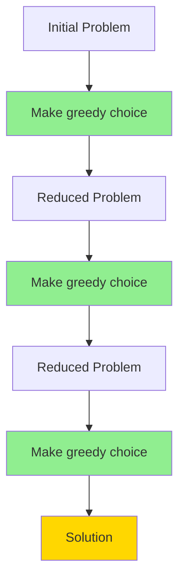

# Greedy Choice Property

## Introduction

The Greedy Choice Property is a fundamental concept in the design and analysis of greedy algorithms. It states that a globally optimal solution can be reached by making a series of locally optimal (greedy) choices. In simpler terms, at each step of the algorithm, we make the choice that looks best at the moment, without worrying about future consequences, and this sequence of choices leads to an optimal solution for the overall problem.

This property doesn't apply to all problems, which is why greedy algorithms don't always yield correct solutions. However, when a problem exhibits the Greedy Choice Property, greedy algorithms can provide elegant and efficient solutions.

## Understanding the Greedy Choice Property

### Core Principles

The Greedy Choice Property has two essential components:

1. **Local Optimality**: At each step, the algorithm makes the best possible choice based on the available information at that time.
2. **Global Optimality**: The series of locally optimal choices ultimately leads to a globally optimal solution.

For a problem to have the Greedy Choice Property, making the greedy choice at each step must not invalidate the possibility of reaching an optimal solution.

### How It Works

When applying a greedy algorithm to a problem with the Greedy Choice Property:

1. We identify the next best choice based on some criteria.
2. We make that choice and commit to it.
3. We reduce the problem to a smaller subproblem.
4. We repeat until we've solved the entire problem.

## Proving the Greedy Choice Property

To use a greedy algorithm confidently, we typically need to prove that the problem has the Greedy Choice Property. This is often done using:

1. **Exchange Arguments**: Showing that any solution not making the greedy choice can be transformed into one that does, without worsening the solution.
2. **Induction**: Proving that making the greedy choice allows us to optimally solve the remaining subproblem.

## Common Examples with Code

### 1. Coin Change Problem (with specific coin denominations)

Let's consider a system with coin denominations {1, 5, 10, 25} and we want to make change with the minimum number of coins.

```javascript
function minCoins(amount, denominations) {
  // Sort denominations in descending order
  denominations.sort((a, b) => b - a);
  
  let coinCount = 0;
  let remainingAmount = amount;
  let coinsUsed = {};
  
  // Greedy approach: Always pick the largest possible coin
  for (const coin of denominations) {
    const count = Math.floor(remainingAmount / coin);
    remainingAmount -= count * coin;
    coinCount += count;
    
    if (count > 0) {
      coinsUsed[coin] = count;
    }
    
    if (remainingAmount === 0) break;
  }
  
  console.log("Coins used:", coinsUsed);
  return coinCount;
}

// Example usage
const amount = 67;
const denominations = [1, 5, 10, 25];
console.log(`Minimum coins needed for ${amount} cents: ${minCoins(amount, denominations)}`);
```

**Output:**
```
Coins used: { '25': 2, '10': 1, '5': 1, '1': 2 }
Minimum coins needed for 67 cents: 6
```

**Why it works:** For the US coin system {1, 5, 10, 25}, the greedy approach always yields an optimal solution because of the specific relationship between these denominations. Each coin is less than 3 times the value of the next smaller coin.

**Important note:** This greedy approach doesn't always work for arbitrary coin denominations. For example, with denominations {1, 3, 4}, to make 6, greedy would give {4, 1, 1} (3 coins) but the optimal solution is {3, 3} (2 coins).

### 2. Activity Selection Problem

The activity selection problem involves selecting the maximum number of non-overlapping activities.

```javascript
function activitySelection(start, finish) {
  const activities = [];
  
  // Create activities with their start and finish times
  for (let i = 0; i < start.length; i++) {
    activities.push({ index: i + 1, start: start[i], finish: finish[i] });
  }
  
  // Sort activities by finish time
  activities.sort((a, b) => a.finish - b.finish);
  
  // Select first activity
  const selected = [activities[0]];
  let lastFinishTime = activities[0].finish;
  
  // Greedy choice: select activities that start after the last selected activity finishes
  for (let i = 1; i < activities.length; i++) {
    if (activities[i].start >= lastFinishTime) {
      selected.push(activities[i]);
      lastFinishTime = activities[i].finish;
    }
  }
  
  return selected;
}

// Example usage
const start = [1, 3, 0, 5, 8, 5];
const finish = [2, 4, 6, 7, 9, 9];

const selectedActivities = activitySelection(start, finish);
console.log("Selected activities:", selectedActivities.map(a => a.index));
console.log("Number of activities selected:", selectedActivities.length);
```

**Output:**
```
Selected activities: [1, 2, 4, 5]
Number of activities selected: 4
```

**Why it works:** The greedy choice here is to always select the activity that finishes earliest among the remaining compatible activities. This works because:
1. By selecting the activity with the earliest finish time, we leave as much time as possible for remaining activities.
2. We can prove that there's always an optimal solution that includes the first activity that finishes.

## Real-World Applications

### 1. Huffman Coding for Data Compression

Huffman coding is a classic example of the Greedy Choice Property used in data compression algorithms.

```javascript
class HuffmanNode {
  constructor(char, frequency) {
    this.char = char;
    this.frequency = frequency;
    this.left = null;
    this.right = null;
  }
}

function buildHuffmanTree(text) {
  if (!text || text.length === 0) return null;
  
  // Count frequency of each character
  const frequencyMap = {};
  for (const char of text) {
    frequencyMap[char] = (frequencyMap[char] || 0) + 1;
  }
  
  // Create a min heap (priority queue) based on character frequencies
  const priorityQueue = [];
  for (const char in frequencyMap) {
    priorityQueue.push(new HuffmanNode(char, frequencyMap[char]));
  }
  
  // Sort by frequency (simulating a min heap)
  priorityQueue.sort((a, b) => a.frequency - b.frequency);
  
  // Build the Huffman Tree
  while (priorityQueue.length > 1) {
    // Extract the two nodes with lowest frequency
    const left = priorityQueue.shift();
    const right = priorityQueue.shift();
    
    // Create a new internal node with these two nodes as children
    // and with frequency equal to the sum of the two nodes' frequencies
    const internalNode = new HuffmanNode(null, left.frequency + right.frequency);
    internalNode.left = left;
    internalNode.right = right;
    
    // Add the new node back to the queue
    priorityQueue.push(internalNode);
    priorityQueue.sort((a, b) => a.frequency - b.frequency);
  }
  
  // The remaining node is the root of the Huffman Tree
  return priorityQueue[0];
}

// Generate Huffman codes from the tree
function generateCodes(root) {
  const codes = {};
  
  function traverse(node, code) {
    if (!node) return;
    
    // If leaf node (has a character), assign code
    if (node.char) {
      codes[node.char] = code;
      return;
    }
    
    // Traverse left (add '0')
    traverse(node.left, code + '0');
    // Traverse right (add '1')
    traverse(node.right, code + '1');
  }
  
  traverse(root, '');
  return codes;
}

// Example usage
const text = "this is an example for huffman encoding";
const tree = buildHuffmanTree(text);
const codes = generateCodes(tree);

console.log("Huffman Codes:");
for (const char in codes) {
  console.log(`'${char}': ${codes[char]}`);
}

// Calculate compression ratio
let originalBits = text.length * 8; // Assuming 8 bits per character
let compressedBits = 0;
for (let i = 0; i < text.length; i++) {
  compressedBits += codes[text[i]].length;
}

console.log(`\nOriginal size: ${originalBits} bits`);
console.log(`Compressed size: ${compressedBits} bits`);
console.log(`Compression ratio: ${(originalBits / compressedBits).toFixed(2)}`);
```

**Greedy Choice:** Always merge the two nodes with the lowest frequencies. This leads to an optimal prefix code because characters with higher frequencies get shorter codes.

### 2. Network Routing (Dijkstra's Algorithm)

Dijkstra's algorithm for finding the shortest path in a graph employs the Greedy Choice Property.

```javascript
function dijkstra(graph, start) {
  const nodes = Object.keys(graph);
  const distances = {};
  const previous = {};
  const unvisited = new Set(nodes);
  
  // Initialize distances
  for (const node of nodes) {
    distances[node] = Infinity;
  }
  distances[start] = 0;
  
  while (unvisited.size > 0) {
    // Greedy choice: select the unvisited node with minimum distance
    let current = null;
    let minDistance = Infinity;
    
    for (const node of unvisited) {
      if (distances[node] < minDistance) {
        minDistance = distances[node];
        current = node;
      }
    }
    
    // If we can't find a reachable node, break
    if (current === null || distances[current] === Infinity) break;
    
    unvisited.delete(current);
    
    // Update distances to neighbors
    for (const neighbor in graph[current]) {
      const distance = distances[current] + graph[current][neighbor];
      if (distance < distances[neighbor]) {
        distances[neighbor] = distance;
        previous[neighbor] = current;
      }
    }
  }
  
  return { distances, previous };
}

// Example graph (adjacency list with weights)
const graph = {
  'A': { 'B': 4, 'C': 2 },
  'B': { 'A': 4, 'D': 2, 'E': 3 },
  'C': { 'A': 2, 'D': 4, 'F': 5 },
  'D': { 'B': 2, 'C': 4, 'E': 1, 'F': 7 },
  'E': { 'B': 3, 'D': 1, 'G': 2 },
  'F': { 'C': 5, 'D': 7, 'G': 4 },
  'G': { 'E': 2, 'F': 4 }
};

const startNode = 'A';
const result = dijkstra(graph, startNode);

console.log(`Shortest distances from ${startNode}:`);
for (const node in result.distances) {
  console.log(`${startNode} → ${node}: ${result.distances[node]}`);
}
```

**Greedy Choice:** At each step, select the unvisited node with the smallest tentative distance. This works because if a shorter path to any node existed, it would have been discovered earlier due to the edge weights being non-negative.

## When Greedy Fails: Counter-Examples

Not all optimization problems have the Greedy Choice Property. Here are a couple of examples where greedy fails:

### 1. Knapsack Problem (0/1 version)

Consider we have items with values and weights, and we want to maximize value while keeping total weight under a limit.

```javascript
// This greedy approach doesn't always work for 0/1 Knapsack!
function greedyKnapsack(values, weights, capacity) {
  const n = values.length;
  const items = [];
  
  // Calculate value-to-weight ratio for each item
  for (let i = 0; i < n; i++) {
    items.push({
      index: i + 1,
      value: values[i],
      weight: weights[i],
      ratio: values[i] / weights[i]
    });
  }
  
  // Sort by value-to-weight ratio in descending order
  items.sort((a, b) => b.ratio - a.ratio);
  
  let totalValue = 0;
  let totalWeight = 0;
  const selectedItems = [];
  
  for (const item of items) {
    if (totalWeight + item.weight <= capacity) {
      totalWeight += item.weight;
      totalValue += item.value;
      selectedItems.push(item.index);
    }
  }
  
  return { totalValue, selectedItems };
}

// Counter-example
const values = [60, 100, 120];
const weights = [10, 20, 30];
const capacity = 50;

const result = greedyKnapsack(values, weights, capacity);
console.log("Greedy approach result:", result);

// The optimal solution would be to select items 2 and 3 for a total value of 220
console.log("Optimal solution would be items [2, 3] with total value 220");
```

**Why greedy fails:** The Greedy Choice Property doesn't hold for the 0/1 Knapsack problem. The greedy approach might choose an item with the highest value-to-weight ratio first, but this might prevent it from selecting a better combination later.

### 2. Traveling Salesperson Problem (TSP)

The greedy approach for TSP (always select the nearest unvisited city) often produces suboptimal tours.

## Visualizing the Greedy Choice

Let's visualize how the Greedy Choice Property works using a simple tree diagram:



The green nodes represent points where a greedy choice is made, and the golden node represents the optimal solution reached through these choices.

## Summary

The Greedy Choice Property is a powerful concept that allows us to solve complex optimization problems using straightforward algorithms:

1. It states that a globally optimal solution can be built by making locally optimal (greedy) choices.
2. Not all problems have this property, which is why greedy algorithms don't always work.
3. When applicable, greedy algorithms are usually simpler and more efficient than dynamic programming or other approaches.
4. Proving a problem has the Greedy Choice Property typically involves exchange arguments or induction.

Common examples where the property holds include:
- Activity selection (scheduling)
- Huffman coding
- Minimum spanning tree algorithms (Kruskal's, Prim's)
- Dijkstra's shortest path algorithm

Understanding when and why the Greedy Choice Property holds is crucial for algorithm design and analysis.

## Exercises

1. **Prove the Greedy Choice Property**: For the activity selection problem, prove that selecting the activity with the earliest finish time is always part of some optimal solution.

2. **Fractional Knapsack**: Implement a greedy algorithm for the fractional knapsack problem and explain why the Greedy Choice Property holds in this case but not in the 0/1 variant.

3. **Minimum Spanning Tree**: Implement Kruskal's algorithm for finding a minimum spanning tree and explain the Greedy Choice Property in this context.

4. **Counter-Example**: Design a scheduling problem where the greedy approach fails to find the optimal solution.

5. **Real-World Application**: Research and explain a real-world application where understanding the Greedy Choice Property led to an efficient algorithmic solution.

## Further Reading

- "Introduction to Algorithms" by Cormen, Leiserson, Rivest, and Stein - Chapter on Greedy Algorithms
- "Algorithm Design" by Kleinberg and Tardos - Chapter on Greedy Algorithms
- "The Algorithm Design Manual" by Steven S. Skiena - Section on Greedy Algorithms

By mastering the Greedy Choice Property, you'll significantly improve your algorithm design skills and be able to recognize when simple, efficient greedy solutions can solve complex problems.