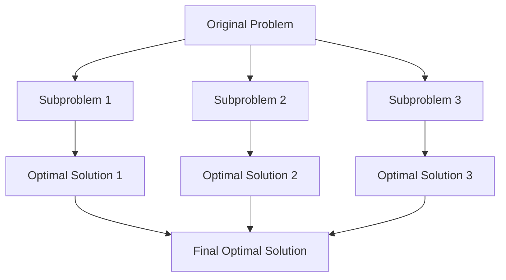

# Optimal Substructure

## Introduction

Optimal substructure is a fundamental property that serves as the backbone of both greedy algorithms and dynamic programming. When a problem has the optimal substructure property, it means that an optimal solution to the problem contains optimal solutions to its subproblems.

In simpler terms, if we can break down a problem into smaller parts and independently find the best solution for each part, those solutions can be combined to create the optimal solution to the original problem.

This concept is crucial because:

1. It allows us to solve complex problems by breaking them into simpler, more manageable subproblems
2. It ensures that we can build our solution incrementally
3. It forms the theoretical foundation for many efficient algorithms

Let's dive deeper into understanding optimal substructure and see how it applies to real-world programming challenges.

## Understanding Optimal Substructure

### Definition

A problem has optimal substructure if an optimal solution can be constructed from optimal solutions of its subproblems.

### Key Characteristics

For a problem to have optimal substructure:

1. The problem can be divided into smaller subproblems
2. The optimal solution to the problem contains optimal solutions to the subproblems
3. The subproblems are independent and don't overlap (particularly important for greedy algorithms)

### Visual Representation



## Examples of Optimal Substructure

### 1. Shortest Path Problem

The shortest path problem exhibits optimal substructure because if the shortest path from vertex A to vertex C goes through vertex B, then the path from B to C must also be the shortest path between those two vertices.

Let's implement Dijkstra's algorithm, which leverages this property:

```python
import heapq

def dijkstra(graph, start):
    # Initialize distances with infinity for all nodes except start
    distances = {node: float('infinity') for node in graph}
    distances[start] = 0
    priority_queue = [(0, start)]
    
    while priority_queue:
        current_distance, current_node = heapq.heappop(priority_queue)
        
        # If we've already found a shorter path, continue
        if current_distance > distances[current_node]:
            continue
            
        # Examine neighbors
        for neighbor, weight in graph[current_node].items():
            distance = current_distance + weight
            
            # If we've found a shorter path to the neighbor
            if distance < distances[neighbor]:
                distances[neighbor] = distance
                heapq.heappush(priority_queue, (distance, neighbor))
                
    return distances

# Example usage
graph = {
    'A': {'B': 1, 'C': 4},
    'B': {'A': 1, 'C': 2, 'D': 5},
    'C': {'A': 4, 'B': 2, 'D': 1},
    'D': {'B': 5, 'C': 1}
}

print(dijkstra(graph, 'A'))
# Output: {'A': 0, 'B': 1, 'C': 3, 'D': 4}
```

In this example, to find the shortest path from 'A' to 'D', the algorithm determines that it should go through 'B' and 'C', which are themselves optimal paths.

### 2. Minimum Spanning Tree (Kruskal's Algorithm)

A minimum spanning tree (MST) connects all vertices in a graph with the minimum possible total edge weight. Kruskal's algorithm demonstrates optimal substructure because each step adds the minimum weight edge that doesn't create a cycle.

```python
def kruskal(graph):
    # Sort all edges in non-decreasing order of weight
    edges = []
    for u in graph:
        for v, weight in graph[u].items():
            if u < v:  # Avoid adding edges twice
                edges.append((weight, u, v))
    edges.sort()
    
    # Initialize forest with each vertex in its own tree
    forest = {vertex: vertex for vertex in graph}
    
    def find_root(vertex):
        if forest[vertex] != vertex:
            forest[vertex] = find_root(forest[vertex])  # Path compression
        return forest[vertex]
    
    mst = []
    for weight, u, v in edges:
        root_u = find_root(u)
        root_v = find_root(v)
        if root_u != root_v:
            mst.append((u, v, weight))
            forest[root_u] = root_v  # Union by simple linking
            
    return mst

# Example usage
graph = {
    'A': {'B': 2, 'D': 6},
    'B': {'A': 2, 'C': 3, 'D': 8},
    'C': {'B': 3, 'D': 7},
    'D': {'A': 6, 'B': 8, 'C': 7}
}

print(kruskal(graph))
# Output: [('A', 'B', 2), ('B', 'C', 3), ('A', 'D', 6)]
```

Each edge added to the MST is optimal for the current state of the forest, demonstrating optimal substructure.

## Recognizing Optimal Substructure in Problems

To identify if a problem has optimal substructure, ask yourself:

1. Can I break down this problem into smaller instances of the same problem?
2. Will the optimal solution to the original problem incorporate optimal solutions to the subproblems?
3. Can I make a choice at each step that will lead to an optimal solution?

### Common Problem Patterns with Optimal Substructure

1. **Path-finding problems**: Shortest path, longest path
2. **Tree optimization**: Minimum spanning tree, optimal binary search tree
3. **Resource allocation**: Job scheduling, knapsack problem
4. **String problems**: Longest common subsequence, edit distance

## Practical Application: Coin Change Problem

Let's solve the coin change problem, which asks for the minimum number of coins needed to make a given amount.

```python
def min_coins(coins, amount):
    # Initialize an array to store the minimum coins for each amount
    dp = [float('infinity')] * (amount + 1)
    dp[0] = 0
    
    # Calculate minimum coins for each amount from 1 to target
    for i in range(1, amount + 1):
        for coin in coins:
            if coin <= i:
                dp[i] = min(dp[i], dp[i - coin] + 1)
                
    return dp[amount] if dp[amount] != float('infinity') else -1

# Example usage
coins = [1, 5, 10, 25]
amount = 63

print(f"Minimum coins needed for {amount} cents: {min_coins(coins, amount)}")
# Output: Minimum coins needed for 63 cents: 6 (25 + 25 + 10 + 1 + 1 + 1)
```

In this problem, the optimal substructure is evident:
- To find the minimum number of coins for amount `n`
- We must find the minimum number of coins for amount `n-c` for each coin `c`
- Then add 1 more coin (the coin `c` itself)
- The optimal solution will be the minimum across all coin choices

## Optimal Substructure vs. Greedy Choice Property

Optimal substructure is often used alongside the greedy choice property in greedy algorithms. Here's the key difference:

1. **Optimal substructure**: The optimal solution contains optimal solutions to subproblems
2. **Greedy choice property**: A locally optimal choice leads to a globally optimal solution

For a greedy algorithm to be valid, both properties must be present. For example, in the activity selection problem:

```python
def activity_selection(activities):
    # Sort activities by finish time
    activities.sort(key=lambda x: x[1])
    
    selected = [activities[0]]
    last_finish_time = activities[0][1]
    
    for start, finish in activities[1:]:
        if start >= last_finish_time:
            selected.append((start, finish))
            last_finish_time = finish
            
    return selected

# Example
# Each activity is (start_time, finish_time)
activities = [(1, 4), (3, 5), (0, 6), (5, 7), (3, 8), (5, 9), (6, 10), (8, 11), (8, 12), (2, 13), (12, 14)]
selected = activity_selection(activities)

print("Selected activities:")
for start, finish in selected:
    print(f"Start: {start}, Finish: {finish}")
```

Output:
```
Selected activities:
Start: 1, Finish: 4
Start: 5, Finish: 7
Start: 8, Finish: 11
Start: 12, Finish: 14
```

## When Optimal Substructure Fails

Not all problems exhibit optimal substructure. Here are situations where it might fail:

1. **Overlapping subproblems with dependencies**: When the solution to one subproblem affects the solution to another
2. **Global constraints**: When there are constraints that can't be decomposed into constraints on subproblems
3. **Non-serial subproblems**: When subproblems can't be ordered in a way that allows sequential solving

An example is the longest simple path problem in a graph (unlike shortest path), which doesn't have optimal substructure.

## Summary

Optimal substructure is a powerful property that allows us to:

1. Break complex problems into manageable subproblems
2. Solve each subproblem optimally
3. Combine these solutions to solve the original problem

This property forms the foundation of both dynamic programming and greedy algorithms, though it's applied differently in each paradigm:

- In **dynamic programming**, we solve all subproblems and store their results
- In **greedy algorithms**, we make the locally optimal choice at each step

By recognizing optimal substructure in problems, you can develop efficient algorithms that solve complex problems in a methodical way.

## Exercises

1. Determine whether the following problems have optimal substructure:
   - Finding the longest path in a directed acyclic graph
   - Finding the maximum sum subarray
   - The traveling salesman problem

2. Implement a solution for the rod-cutting problem using dynamic programming, explaining where optimal substructure appears.

3. Design a greedy algorithm for the fractional knapsack problem and prove that it has optimal substructure.

## Additional Resources

- "Introduction to Algorithms" by Cormen, Leiserson, Rivest, and Stein
- "Algorithm Design" by Jon Kleinberg and Éva Tardos
- Stanford University's Algorithms course on Coursera
- MIT OpenCourseWare's Introduction to Algorithms

Understanding optimal substructure deeply will help you recognize when to apply dynamic programming or greedy algorithms, and ultimately develop more efficient solutions to complex problems.