# Activity Selection Problem

## Introduction

The Activity Selection Problem is a classic example of how greedy algorithms can provide optimal solutions for certain types of problems. Imagine you have a set of activities, each with a start time and an end time, and you want to select the maximum number of activities that can be performed by a single person, assuming that a person can only work on a single activity at a time.

This problem appears frequently in real-world scenarios like scheduling meetings in a conference room, managing time slots for a resource, or organizing tasks in project management.

## Problem Definition

Formally, the problem can be defined as:

- Given a set of n activities with their start times and finish times
- A person can only work on one activity at a time
- The goal is to select the maximum number of activities that can be performed

Each activity can be represented as a tuple `(start_time, finish_time)`.

## The Greedy Approach

The key insight for solving this problem efficiently is to use a greedy approach. But what's the best greedy choice here?

There are several possibilities:
1. Select the activity that starts earliest
2. Select the activity that is shortest in duration
3. Select the activity that finishes earliest

It turns out that selecting the activity that finishes earliest gives us the optimal solution. Why? Because choosing the activity that finishes earliest gives us more time to accommodate other activities afterward.

## Algorithm Steps

Here's how we solve the Activity Selection Problem:

1. Sort all activities according to their finish times
2. Select the first activity (the one that finishes earliest)
3. For the remaining activities, select an activity if its start time is greater than or equal to the finish time of the previously selected activity

Let's implement this algorithm:

```python
def activity_selection(activities):
    # Sort activities based on finish time
    activities.sort(key=lambda x: x[1])
    
    # Select the first activity
    selected = [activities[0]]
    last_finish_time = activities[0][1]
    
    # Consider the rest of the activities
    for i in range(1, len(activities)):
        # If this activity starts after the last selected activity finishes
        if activities[i][0] >= last_finish_time:
            selected.append(activities[i])
            last_finish_time = activities[i][1]
            
    return selected
```

## Example Walkthrough

Let's walk through an example:

Suppose we have the following activities represented as (start_time, finish_time):
- A1: (1, 4)
- A2: (3, 5)
- A3: (0, 6)
- A4: (5, 7)
- A5: (3, 9)
- A6: (5, 9)
- A7: (6, 10)
- A8: (8, 11)
- A9: (8, 12)
- A10: (2, 14)
- A11: (12, 16)

Let's visualize these activities on a timeline:

```mermaid
gantt
    title Activity Timeline
    dateFormat X
    axisFormat %d
    
    Activity 1 :a1, 1, 3
    Activity 2 :a2, 3, 2
    Activity 3 :a3, 0, 6
    Activity 4 :a4, 5, 2
    Activity 5 :a5, 3, 6
    Activity 6 :a6, 5, 4
    Activity 7 :a7, 6, 4
    Activity 8 :a8, 8, 3
    Activity 9 :a9, 8, 4
    Activity 10 :a10, 2, 12
    Activity 11 :a11, 12, 4
```



After sorting by finish time:
1. A1: (1, 4)
2. A2: (3, 5)
3. A3: (0, 6)
4. A4: (5, 7)
5. A5: (3, 9)
6. A6: (5, 9)
7. A7: (6, 10)
8. A8: (8, 11)
9. A9: (8, 12)
10. A10: (2, 14)
11. A11: (12, 16)

Now, let's run our algorithm:

1. Select A1 (finish time: 4)
2. A2 starts at 3, which is before A1 finishes, so skip
3. A3 starts at 0, which is before A1 finishes, so skip
4. A4 starts at 5, which is after A1 finishes, so select A4 (finish time: 7)
5. A5 starts at 3, which is before A4 finishes, so skip
6. A6 starts at 5, which is before A4 finishes, so skip
7. A7 starts at 6, which is before A4 finishes, so skip
8. A8 starts at 8, which is after A4 finishes, so select A8 (finish time: 11)
9. A9 starts at 8, which is before A8 finishes, so skip
10. A10 starts at 2, which is before A8 finishes, so skip
11. A11 starts at 12, which is after A8 finishes, so select A11 (finish time: 16)

So, the maximum number of activities that can be selected is 4: A1, A4, A8, and A11.

## Code Implementation with Example

Let's see a complete implementation in Python:

```python
def activity_selection(activities):
    # Sort activities based on finish time
    activities.sort(key=lambda x: x[1])
    
    # Select the first activity
    selected = [activities[0]]
    last_finish_time = activities[0][1]
    
    # Consider the rest of the activities
    for i in range(1, len(activities)):
        # If this activity starts after the last selected activity finishes
        if activities[i][0] >= last_finish_time:
            selected.append(activities[i])
            last_finish_time = activities[i][1]
            
    return selected

# Example usage
activities = [(1, 4), (3, 5), (0, 6), (5, 7), (3, 9), 
               (5, 9), (6, 10), (8, 11), (8, 12), (2, 14), (12, 16)]
               
selected_activities = activity_selection(activities)

print(f"Maximum number of activities that can be selected: {len(selected_activities)}")
print("Selected activities:")
for i, activity in enumerate(selected_activities):
    print(f"Activity {i+1}: Start time = {activity[0]}, Finish time = {activity[1]}")
```

Output:
```
Maximum number of activities that can be selected: 4
Selected activities:
Activity 1: Start time = 1, Finish time = 4
Activity 2: Start time = 5, Finish time = 7
Activity 3: Start time = 8, Finish time = 11
Activity 4: Start time = 12, Finish time = 16
```

## Time Complexity Analysis

Let's analyze the time complexity of our solution:
- Sorting the activities takes O(n log n) time, where n is the number of activities.
- The selection process involves a single pass through the sorted activities, which takes O(n) time.

Therefore, the overall time complexity is O(n log n), which is dominated by the sorting step.

## Real-World Applications

The Activity Selection Problem has numerous practical applications:

### 1. Meeting Room Scheduling

In a corporate environment with limited meeting rooms, the activity selection algorithm can help maximize the number of meetings that can be scheduled in a single room.

```python
meetings = [
    ("Team A Standup", 9, 10),
    ("Product Demo", 9.5, 12),
    ("Lunch & Learn", 11, 13),
    ("Interview", 13, 14),
    ("Team B Planning", 14, 15.5),
    ("All Hands", 15, 17),
    ("Executive Review", 16, 18)
]

# Convert to (start_time, finish_time) format
activities = [(m[1], m[2]) for m in meetings]
selected_indices = []

# Sort activities based on finish time
sorted_activities = sorted(enumerate(activities), key=lambda x: x[1][1])

# Select activities
selected_indices = [sorted_activities[0][0]]
last_finish_time = sorted_activities[0][1][1]

for i in range(1, len(sorted_activities)):
    idx, (start_time, finish_time) = sorted_activities[i]
    if start_time >= last_finish_time:
        selected_indices.append(idx)
        last_finish_time = finish_time

print("Selected meetings:")
for idx in selected_indices:
    print(f"- {meetings[idx][0]} ({meetings[idx][1]} - {meetings[idx][2]})")
```

### 2. Project Management

When managing multiple projects with different start and end times, but with limited resources, this algorithm can help maximize the number of projects that can be completed.

### 3. CPU Job Scheduling

In operating systems, when multiple processes need CPU time, this algorithm can help schedule the maximum number of processes.

## Variations of the Problem

### 1. Weighted Activity Selection

What if each activity has a value or weight associated with it? In that case, the goal would be to maximize the total value rather than the number of activities. This is a more complex problem that requires dynamic programming.

### 2. Multiple Resources

The classic activity selection problem assumes a single person or resource. If multiple resources are available (e.g., multiple meeting rooms), the problem becomes more complex and can be approached using graph coloring or other techniques.

## Summary

The Activity Selection Problem is a perfect example of how a greedy approach can lead to an optimal solution for certain types of problems. The key insights are:

1. Sort activities by their finish times
2. Select the activity that finishes earliest
3. Continue selecting activities that start after the previously selected activity finishes

This algorithm has a time complexity of O(n log n) and can be applied to many real-world scheduling scenarios.

## Practice Exercises

1. **Basic**: Implement the activity selection algorithm in your preferred programming language.

2. **Intermediate**: Modify the algorithm to handle activities with weights/values instead of maximizing the number of activities.

3. **Advanced**: Extend the algorithm to handle multiple resources (e.g., multiple meeting rooms).

4. **Challenge**: Given n activities and m identical resources (e.g., m meeting rooms), find the minimum number of resources needed to schedule all activities without conflicts.

By mastering the Activity Selection Problem, you've taken an important step in understanding greedy algorithms and their applications in optimization problems. The concepts you've learned here will serve as building blocks for more complex scheduling and optimization challenges in computer science.