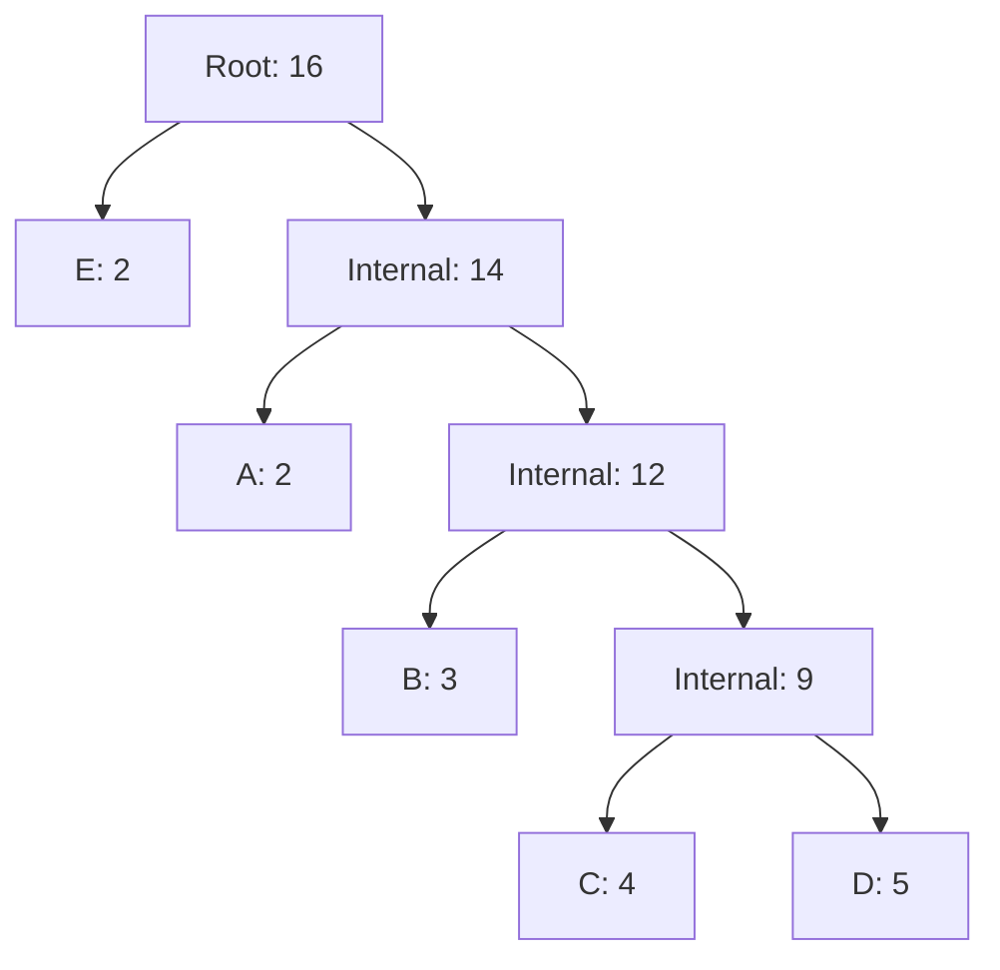

# Huffman Coding

## Introduction

Huffman Coding is a popular algorithm used for lossless data compression, developed by David A. Huffman in 1952 while he was a student at MIT. It's a perfect example of a greedy algorithm that makes locally optimal choices at each step to achieve a globally optimal solution.

The fundamental idea behind Huffman coding is to assign variable-length codes to characters based on their frequencies of occurrence. More frequent characters get shorter codes, while less frequent characters get longer codes. This approach minimizes the total space required to represent a message.

## Why Huffman Coding?

In standard encoding schemes like ASCII, each character uses the same number of bits (typically 8 bits). However, this fixed-length approach doesn't account for character frequency. Consider the English language where 'e' appears much more frequently than 'z'. Huffman coding takes advantage of this uneven distribution to reduce the overall size of encoded data.

## How Huffman Coding Works

The Huffman coding algorithm follows these steps:

1. Calculate the frequency of each character in the input message
2. Build a priority queue (min-heap) of nodes, each containing a character and its frequency
3. Construct a Huffman tree by repeatedly combining the two nodes with lowest frequencies
4. Traverse the tree to assign binary codes to each character (left edge = 0, right edge = 1)
5. Encode the original message using the generated codes

Let's break down each step in detail:

### Step 1: Calculate Character Frequencies

First, we scan through the entire input and count how many times each character appears.

For example, if our input is "AABBBCCCCDDDDDEE", the frequencies would be:
- A: 2
- B: 3
- C: 4
- D: 5
- E: 2

### Step 2: Build a Priority Queue

We create a leaf node for each character and add it to a priority queue. The priority is determined by the frequency of the character, with lower frequencies having higher priority.

### Step 3: Construct the Huffman Tree

This is where the greedy approach comes in:

1. Remove the two nodes with the lowest frequencies from the queue
2. Create a new internal node with these two nodes as children, and with a frequency equal to the sum of their frequencies
3. Add this new node back to the priority queue
4. Repeat until only one node remains (the root)

Let's visualize this process with our example "AABBBCCCCDDDDDEE":



### Step 4: Assign Binary Codes

We traverse the tree from the root to each leaf, assigning '0' for left branches and '1' for right branches. The code for each character is the sequence of 0s and 1s on the path from the root to that character's leaf node.

For our example, the codes would be:
- E: 0
- A: 10
- B: 110
- C: 1110
- D: 1111

Notice that the most frequent character (D) got a 4-bit code while the less frequent ones got shorter codes. This may seem counterintuitive, but this particular tree structure is just one possible outcome. The structure depends on how ties are broken in the priority queue.

### Step 5: Encode the Message

Finally, we replace each character in the original message with its code:

"AABBBCCCCDDDDDEE" becomes "101010110110110111011101110111111111111100"

## Implementation

Let's implement Huffman coding in Python:

```python
import heapq
from collections import defaultdict

class Node:
    def __init__(self, char, freq):
        self.char = char
        self.freq = freq
        self.left = None
        self.right = None
    
    # Define comparison for the priority queue
    def __lt__(self, other):
        return self.freq < other.freq

def build_frequency_table(text):
    """Count the frequency of each character in the text."""
    frequency = defaultdict(int)
    for char in text:
        frequency[char] += 1
    return frequency

def build_huffman_tree(frequency):
    """Build the Huffman tree and return the root node."""
    priority_queue = [Node(char, freq) for char, freq in frequency.items()]
    heapq.heapify(priority_queue)
    
    # Until there is only one node in the queue
    while len(priority_queue) > 1:
        # Remove the two nodes with lowest frequencies
        left = heapq.heappop(priority_queue)
        right = heapq.heappop(priority_queue)
        
        # Create a new internal node with these two nodes as children
        # and with frequency equal to the sum of their frequencies
        internal_node = Node(None, left.freq + right.freq)
        internal_node.left = left
        internal_node.right = right
        
        # Add this node back to the queue
        heapq.heappush(priority_queue, internal_node)
    
    # Return the root of the Huffman tree
    return priority_queue[0]

def generate_codes(node, current_code="", codes={}):
    """Generate Huffman codes for each character."""
    if node is None:
        return
    
    # If this is a leaf node (has a character)
    if node.char:
        codes[node.char] = current_code
        return
    
    # Traverse left (add 0)
    generate_codes(node.left, current_code + "0", codes)
    # Traverse right (add 1)
    generate_codes(node.right, current_code + "1", codes)
    
    return codes

def huffman_encoding(text):
    """Encode a string using Huffman coding."""
    # Handle empty string
    if not text:
        return "", None
    
    # Handle strings with only one unique character
    if len(set(text)) == 1:
        return "0" * len(text), {text[0]: "0"}
    
    frequency = build_frequency_table(text)
    root = build_huffman_tree(frequency)
    codes = generate_codes(root)
    
    encoded_text = "".join(codes[char] for char in text)
    return encoded_text, codes

def huffman_decoding(encoded_text, codes):
    """Decode a Huffman-encoded string."""
    # Reverse the codes dictionary to map codes to characters
    reverse_mapping = {code: char for char, code in codes.items()}
    
    current_code = ""
    decoded_text = ""
    
    for bit in encoded_text:
        current_code += bit
        if current_code in reverse_mapping:
            decoded_text += reverse_mapping[current_code]
            current_code = ""
    
    return decoded_text

# Example usage
text = "AABBBCCCCDDDDDEE"
encoded_text, codes = huffman_encoding(text)
decoded_text = huffman_decoding(encoded_text, codes)

print(f"Original text: {text}")
print(f"Encoded text: {encoded_text}")
print(f"Codes: {codes}")
print(f"Decoded text: {decoded_text}")
print(f"Original size: {len(text) * 8} bits")  # Assuming 8 bits per character
print(f"Compressed size: {len(encoded_text)} bits")
```

The output for our example would be something like:

```
Original text: AABBBCCCCDDDDDEE
Encoded text: 101010110110110111011101110111111111111100
Codes: {'A': '10', 'B': '110', 'C': '1110', 'D': '1111', 'E': '0'}
Decoded text: AABBBCCCCDDDDDEE
Original size: 128 bits
Compressed size: 42 bits
```

As you can see, we've reduced the size from 128 bits (16 characters × 8 bits) to just 42 bits, achieving approximately 67% compression!

## Time and Space Complexity

- **Time Complexity**: O(n log n), where n is the number of characters in the input text. Building the frequency table takes O(n) time, but building the Huffman tree requires O(n log n) operations due to the heap operations.

- **Space Complexity**: O(n) for storing the frequency table, the priority queue, and the final Huffman codes.

## Real-World Applications

Huffman coding has several practical applications:

1. **File Compression**: Tools like gzip and PKZIP use variants of Huffman coding.

2. **Image Compression**: JPEG uses Huffman coding as part of its compression algorithm.

3. **MP3 Compression**: Audio compression formats often use Huffman coding.

4. **PDF Files**: Huffman encoding is used to compress text in PDF documents.

### Example: Text File Compression

Let's see how Huffman coding would compress an English text file:

```python
def calculate_compression_ratio(text):
    encoded_text, codes = huffman_encoding(text)
    original_size = len(text) * 8  # 8 bits per character
    compressed_size = len(encoded_text)
    return compressed_size / original_size

# Sample text from a book
sample_text = """
Alice was beginning to get very tired of sitting by her sister on the bank, and of having nothing to do: once or twice she had peeped into the book her sister was reading, but it had no pictures or conversations in it, 'and what is the use of a book,' thought Alice 'without pictures or conversations?'
"""

ratio = calculate_compression_ratio(sample_text)
print(f"Compression ratio: {ratio:.2f}")
print(f"Space saved: {(1 - ratio) * 100:.2f}%")
```

Output:
```
Compression ratio: 0.57
Space saved: 43.00%
```

This means we save roughly 43% of space when compressing this English text using Huffman coding!

## Advantages and Limitations

### Advantages:
- Lossless compression (all original data can be recovered)
- Optimal prefix code (no codeword is a prefix of another)
- Simple to implement
- Reasonably fast encoding and decoding

### Limitations:
- Requires knowledge of character frequencies in advance
- The code table needs to be transmitted along with the compressed data
- Not as efficient for adaptive compression (when frequencies change over time)

## Summary

Huffman coding is a powerful greedy algorithm for lossless data compression. By assigning shorter codes to more frequent characters, it achieves significant space savings. The algorithm builds a binary tree based on character frequencies and uses the paths from root to leaves to generate variable-length codes.

The process involves:
1. Counting character frequencies
2. Building a priority queue
3. Constructing a Huffman tree
4. Generating codes by traversing the tree
5. Encoding the message using these codes

Despite being developed in the 1950s, Huffman coding remains relevant and is used in many modern compression techniques, often as one component in more complex compression systems.

## Exercises

1. Implement Huffman coding from scratch in your preferred programming language.
2. Add functionality to save the encoded text and the Huffman tree to a file, then read and decode it.
3. Compare the compression ratio of Huffman coding with other compression algorithms like LZW on different types of files (text, binary, images).
4. Modify the algorithm to handle adaptive Huffman coding, where frequencies are updated as the text is processed.
5. Implement a visualization tool that shows the Huffman tree for a given text input.

## Additional Resources

- Original paper: "A Method for the Construction of Minimum-Redundancy Codes" by David A. Huffman (1952)
- MIT lecture notes on data compression
- Online compression tools that implement Huffman coding
- Related algorithms: Arithmetic coding, LZ77, LZ78, and LZW compression algorithms

Happy coding!