# Fractional Knapsack

## Introduction

The Fractional Knapsack problem is a classic optimization problem that demonstrates the power of greedy algorithms. Unlike its cousin, the 0/1 Knapsack problem, the Fractional Knapsack allows us to take fractions of items, making it amenable to a greedy approach.

Imagine you're a thief who has broken into a store with a knapsack that can hold a limited weight. Each item in the store has a certain weight and value. Your goal is to fill your knapsack with items to maximize the total value. In the Fractional Knapsack problem, you can take a fraction of an item, which means you can break items into smaller pieces and take as much as you want.

## Problem Statement

Given:
- A set of n items, each with a weight and value
- A knapsack with a maximum weight capacity W

Goal: Fill the knapsack to maximize the total value while keeping the total weight less than or equal to W.

## The Greedy Approach

The optimal strategy for the Fractional Knapsack problem follows a simple intuition: **Always take the item with the highest value-to-weight ratio first**.

Here's the step-by-step approach:

1. Calculate the value-to-weight ratio for each item
2. Sort the items based on this ratio in non-increasing order
3. Add items to the knapsack in order of their ratio
4. If an item can't be added completely, add a fraction of it

Let's understand this with a simple example:

## Example

Consider a knapsack with a capacity of 15 kg and the following items:

| Item | Value | Weight | Value/Weight |
|------|-------|--------|--------------|
| A    | 60    | 10     | 6.0          |
| B    | 100   | 20     | 5.0          |
| C    | 120   | 30     | 4.0          |

Following our greedy approach:

1. Sort by value-to-weight ratio: A (6.0), B (5.0), C (4.0)
2. Take item A completely: 10 kg used, value = 60, remaining capacity = 5 kg
3. Take a fraction of item B: 5/20 = 0.25 of B, value added = 100 × 0.25 = 25
4. Total value = 60 + 25 = 85

Let's implement this in code:

```python
def fractional_knapsack(items, capacity):
    # Calculate value-to-weight ratio for each item
    for item in items:
        item['ratio'] = item['value'] / item['weight']
    
    # Sort items by value-to-weight ratio in non-increasing order
    items.sort(key=lambda x: x['ratio'], reverse=True)
    
    total_value = 0
    remaining_capacity = capacity
    
    for item in items:
        if remaining_capacity >= item['weight']:
            # Take the whole item
            total_value += item['value']
            remaining_capacity -= item['weight']
        else:
            # Take a fraction of the item
            fraction = remaining_capacity / item['weight']
            total_value += item['value'] * fraction
            break  # The knapsack is full
    
    return total_value

# Example usage
items = [
    {'name': 'A', 'value': 60, 'weight': 10},
    {'name': 'B', 'value': 100, 'weight': 20},
    {'name': 'C', 'value': 120, 'weight': 30}
]

max_value = fractional_knapsack(items, 15)
print(f"Maximum value in knapsack: {max_value}")
```

Output:
```
Maximum value in knapsack: 85.0
```

## Time and Space Complexity

- **Time Complexity**: O(n log n) due to the sorting step
- **Space Complexity**: O(n) for storing the items and their ratios

## Proof of Correctness

The greedy strategy for the Fractional Knapsack problem can be proven optimal using an exchange argument. If we try to exchange a higher-ratio portion with a lower-ratio portion, the total value would decrease, proving our greedy choice is optimal.

## Visualizing the Algorithm

Let's visualize how the knapsack gets filled with our greedy approach:

```mermaid
gantt
    title Knapsack Filling Process
    dateFormat X
    axisFormat %d
    section Knapsack
    Item A (Complete)                  :a1, 0, 10
    Item B (Fraction: 0.25)            :a2, 10, 5
    Remaining (Empty)                  :done, a3, 15, 0
```



## Real-world Applications

The Fractional Knapsack problem has numerous practical applications:

1. **Resource Allocation**: Distributing limited resources (like computing power, network bandwidth) among different tasks.

2. **Investment Strategies**: Deciding how to allocate a fixed budget across different investment opportunities to maximize returns.

3. **Cargo Loading**: Optimizing the loading of cargo into ships or trucks where goods can be divided.

4. **Time Management**: Allocating limited time to various activities based on their importance and duration.

## Comparison with 0/1 Knapsack

The key difference between Fractional and 0/1 Knapsack:

| Fractional Knapsack | 0/1 Knapsack |
|---------------------|--------------|
| Items can be broken into fractions | Items must be taken completely or not at all |
| Greedy approach works | Requires dynamic programming |
| O(n log n) time complexity | O(nW) time complexity |

## Implementation in Other Languages

### Java Implementation

```java
import java.util.*;

class Item {
    int value;
    int weight;
    double ratio;
    
    Item(int value, int weight) {
        this.value = value;
        this.weight = weight;
        this.ratio = (double)value / weight;
    }
}

public class FractionalKnapsack {
    public static double getMaxValue(Item[] items, int capacity) {
        // Sort items by value/weight ratio in non-increasing order
        Arrays.sort(items, (a, b) -> Double.compare(b.ratio, a.ratio));
        
        double totalValue = 0;
        int remainingCapacity = capacity;
        
        for (Item item : items) {
            if (remainingCapacity >= item.weight) {
                // Take the whole item
                totalValue += item.value;
                remainingCapacity -= item.weight;
            } else {
                // Take a fraction of the item
                double fraction = (double)remainingCapacity / item.weight;
                totalValue += item.value * fraction;
                break;  // The knapsack is full
            }
        }
        
        return totalValue;
    }
    
    public static void main(String[] args) {
        Item[] items = {
            new Item(60, 10),
            new Item(100, 20),
            new Item(120, 30)
        };
        
        int capacity = 15;
        double maxValue = getMaxValue(items, capacity);
        System.out.println("Maximum value in knapsack: " + maxValue);
    }
}
```

### C++ Implementation

```cpp
#include <iostream>
#include <vector>
#include <algorithm>

struct Item {
    int value;
    int weight;
    double ratio;
    
    Item(int v, int w) : value(v), weight(w) {
        ratio = (double)value / weight;
    }
};

double fractionalKnapsack(std::vector<Item>& items, int capacity) {
    // Sort items by value/weight ratio in non-increasing order
    std::sort(items.begin(), items.end(), 
              [](const Item& a, const Item& b) { return a.ratio > b.ratio; });
    
    double totalValue = 0;
    int remainingCapacity = capacity;
    
    for (const Item& item : items) {
        if (remainingCapacity >= item.weight) {
            // Take the whole item
            totalValue += item.value;
            remainingCapacity -= item.weight;
        } else {
            // Take a fraction of the item
            double fraction = (double)remainingCapacity / item.weight;
            totalValue += item.value * fraction;
            break;  // The knapsack is full
        }
    }
    
    return totalValue;
}

int main() {
    std::vector<Item> items = {
        Item(60, 10),
        Item(100, 20),
        Item(120, 30)
    };
    
    int capacity = 15;
    double maxValue = fractionalKnapsack(items, capacity);
    std::cout << "Maximum value in knapsack: " << maxValue << std::endl;
    
    return 0;
}
```

## Common Variations and Extensions

1. **Multiple Knapsacks**: Having more than one knapsack, each with its own capacity.

2. **Items with Dependencies**: Some items can only be taken if certain other items are also taken.

3. **Time-Limited Knapsack**: Including a time constraint for each item, with a total time limit.

## Summary

The Fractional Knapsack problem demonstrates a perfect application of the greedy algorithm paradigm:

1. We sort items based on their value-to-weight ratio
2. We take items with the highest ratio first
3. If needed, we take a fraction of an item to fill the knapsack
4. This approach guarantees an optimal solution

Unlike the 0/1 Knapsack problem which requires dynamic programming, the greedy approach works here because we can take fractions of items. This allows us to always choose the most valuable items per unit weight.

## Exercises

1. Implement the Fractional Knapsack algorithm for a given set of items and knapsack capacity.

2. Modify the algorithm to handle the case where each item has a minimum amount that must be taken if any of it is taken.

3. Solve the problem when there are multiple knapsacks with different capacities.

4. Analyze how the algorithm behaves when all items have the same value-to-weight ratio.

5. Compare the runtime of Fractional Knapsack with the 0/1 Knapsack for different input sizes.

## Additional Resources

- [Introduction to Algorithms](https://mitpress.mit.edu/books/introduction-algorithms-third-edition) by Cormen, Leiserson, Rivest, and Stein
- [Algorithm Design Manual](http://www.algorist.com/) by Steven Skiena
- [GeeksforGeeks: Fractional Knapsack Problem](https://www.geeksforgeeks.org/fractional-knapsack-problem/)

Understanding the Fractional Knapsack problem provides a solid foundation for learning more complex optimization algorithms and strengthens your intuition for when greedy strategies are appropriate.