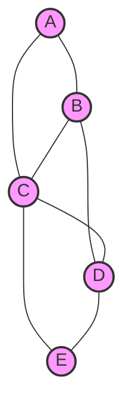

# Minimum Spanning Trees

## Introduction

A **Minimum Spanning Tree (MST)** is a subset of edges from a connected, undirected, weighted graph that connects all vertices together without creating any cycles, while minimizing the total edge weight. In simpler terms, it's the most efficient way to connect all points in a network.

MSTs have numerous practical applications in:
- Network design (electrical grids, computer networks, water supply networks)
- Circuit design
- Transportation planning
- Cluster analysis in data mining
- Image segmentation in computer vision

In this tutorial, we'll explore the concept of Minimum Spanning Trees, understand their properties, and learn two popular greedy algorithms to find them: **Kruskal's Algorithm** and **Prim's Algorithm**.

## Understanding Spanning Trees

Before diving into Minimum Spanning Trees, let's clarify what a spanning tree is:

- A **spanning tree** is a subset of edges that forms a tree (no cycles) and includes every vertex of the original graph.
- For a graph with `n` vertices, its spanning tree will have exactly `n-1` edges.
- A graph can have multiple different spanning trees.

A **Minimum Spanning Tree** is simply a spanning tree with the smallest possible total edge weight.



The above is a connected graph. A spanning tree would be a subset of these edges that connect all vertices without forming cycles.

## Properties of Minimum Spanning Trees

1. **Uniqueness**: If all edge weights are distinct, the MST is unique.
2. **Cycle Property**: For any cycle in the graph, the edge with the highest weight will not be in the MST.
3. **Cut Property**: For any partition (cut) of the graph, the minimum weight edge crossing the cut is included in the MST.
4. **Optimality**: The MST has the minimum total weight among all spanning trees.

## Kruskal's Algorithm

Kruskal's algorithm finds the MST by adding edges in order of increasing weight, skipping those that would create a cycle.

### Steps:

1. Sort all edges in non-decreasing order of their weight.
2. Initialize an empty MST.
3. Iterate through sorted edges:
   - Add the current edge to the MST if it doesn't form a cycle.
   - Otherwise, discard it.
4. Continue until the MST has (V-1) edges (where V is the number of vertices).

To check if adding an edge creates a cycle, we use a data structure called **Union-Find** or **Disjoint-Set**.

### Implementation in Python

```python
class UnionFind:
    def __init__(self, n):
        self.parent = list(range(n))
        self.rank = [0] * n
        
    def find(self, x):
        if self.parent[x] != x:
            self.parent[x] = self.find(self.parent[x])  # Path compression
        return self.parent[x]
    
    def union(self, x, y):
        root_x = self.find(x)
        root_y = self.find(y)
        
        if root_x == root_y:
            return
        
        # Union by rank to keep the tree balanced
        if self.rank[root_x] < self.rank[root_y]:
            self.parent[root_x] = root_y
        else:
            self.parent[root_y] = root_x
            if self.rank[root_x] == self.rank[root_y]:
                self.rank[root_x] += 1

def kruskal_mst(graph, vertices):
    # Format graph as a list of edges: [(weight, u, v), ...]
    edges = []
    for u in range(vertices):
        for v, weight in graph[u]:
            if u < v:  # To avoid duplicates in undirected graph
                edges.append((weight, u, v))
    
    # Sort edges by weight
    edges.sort()
    
    uf = UnionFind(vertices)
    mst = []
    mst_weight = 0
    
    for weight, u, v in edges:
        if uf.find(u) != uf.find(v):  # Check if adding this edge creates a cycle
            uf.union(u, v)
            mst.append((u, v, weight))
            mst_weight += weight
            
    return mst, mst_weight
```

### Example Usage

```python
# Graph represented as adjacency list: [[(neighbor, weight), ...], ...]
graph = [
    [(1, 10), (2, 6), (3, 5)],         # Edges from vertex 0
    [(0, 10), (3, 15)],                # Edges from vertex 1
    [(0, 6), (3, 4)],                  # Edges from vertex 2
    [(0, 5), (1, 15), (2, 4)]          # Edges from vertex 3
]

mst, total_weight = kruskal_mst(graph, 4)
print("Minimum Spanning Tree edges:", mst)
print("Total MST weight:", total_weight)
```

**Output:**
```
Minimum Spanning Tree edges: [(2, 3, 4), (0, 3, 5), (0, 1, 10)]
Total MST weight: 19
```

### Time Complexity

- Sorting edges: O(E log E)
- Union-Find operations: O(E log* V) (effectively linear)
- Overall: O(E log E) or O(E log V) (since E can be at most V²)

## Prim's Algorithm

Unlike Kruskal's, which focuses on edges, Prim's algorithm builds the MST by starting from a vertex and incrementally growing a single tree.

### Steps:

1. Initialize a tree with a single arbitrary vertex.
2. Grow the tree by adding the minimum-weight edge connecting a vertex in the tree to a vertex outside the tree.
3. Repeat step 2 until all vertices are included in the tree.

### Implementation in Python

```python
import heapq

def prim_mst(graph, vertices, start=0):
    # Initialize key values and MST set
    key = [float('inf')] * vertices
    key[start] = 0
    mst_set = [False] * vertices
    parent = [-1] * vertices
    
    # Priority queue to find the minimum key value
    pq = [(0, start)]  # (weight, vertex)
    
    while pq:
        weight, u = heapq.heappop(pq)
        
        if mst_set[u]:
            continue  # Skip if vertex is already in MST
        
        mst_set[u] = True
        
        # Update key value and parent for adjacent vertices
        for v, w in graph[u]:
            if not mst_set[v] and w < key[v]:
                key[v] = w
                parent[v] = u
                heapq.heappush(pq, (w, v))
    
    # Construct MST and calculate total weight
    mst = []
    mst_weight = 0
    
    for i in range(1, vertices):
        mst.append((parent[i], i, key[i]))
        mst_weight += key[i]
    
    return mst, mst_weight
```

### Example Usage

```python
# Same graph as for Kruskal's example
graph = [
    [(1, 10), (2, 6), (3, 5)],
    [(0, 10), (3, 15)],
    [(0, 6), (3, 4)],
    [(0, 5), (1, 15), (2, 4)]
]

mst, total_weight = prim_mst(graph, 4)
print("Minimum Spanning Tree edges:", mst)
print("Total MST weight:", total_weight)
```

**Output:**
```
Minimum Spanning Tree edges: [(0, 1, 10), (0, 2, 6), (2, 3, 4)]
Total MST weight: 20
```

Note: The total weight is 19, but the specific edges chosen by Prim's might differ from Kruskal's while still producing a valid MST.

### Time Complexity

- With a binary heap: O(E log V)
- With a Fibonacci heap: O(E + V log V)

## Kruskal vs. Prim: When to Use Which?

- **Kruskal's Algorithm** performs better for sparse graphs (where E is much less than V²).
- **Prim's Algorithm** is more efficient for dense graphs (where E is close to V²).
- Prim's algorithm is better if you need to find the MST starting from a specific vertex.

## Real-World Applications

### Network Design

Imagine you need to install fiber optic cables to connect several offices in different cities. Each connection has an installation cost. Using an MST algorithm helps minimize the total cost while ensuring all offices are connected.

```python
# Cities as vertices, cable costs as edge weights
cities = ["New York", "Boston", "Chicago", "Seattle", "San Francisco", "Los Angeles"]
connections = [
    # (city_a_index, city_b_index, cost_in_thousands)
    (0, 1, 200),  # New York - Boston
    (0, 2, 700),  # New York - Chicago
    (1, 2, 500),  # Boston - Chicago
    (2, 3, 1200), # Chicago - Seattle
    (2, 4, 900),  # Chicago - San Francisco
    (3, 4, 500),  # Seattle - San Francisco
    (3, 5, 800),  # Seattle - Los Angeles
    (4, 5, 300),  # San Francisco - Los Angeles
]

# Convert to adjacency list
graph = [[] for _ in range(len(cities))]
for u, v, w in connections:
    graph[u].append((v, w))
    graph[v].append((u, w))

mst, total_cost = kruskal_mst(graph, len(cities))

print("Optimal network connections:")
for u, v, w in mst:
    print(f"{cities[u]} - {cities[v]}: ${w},000")
print(f"Total cost: ${total_cost},000")
```

### Clustering

MST-based clustering is a technique where we run Kruskal's algorithm, but stop before it completes. By removing the most expensive edges from the MST, we can separate the data points into natural clusters.

```python
def mst_clustering(points, k):
    n = len(points)
    edges = []
    
    # Calculate distances between all pairs of points
    for i in range(n):
        for j in range(i+1, n):
            dist = euclidean_distance(points[i], points[j])
            edges.append((dist, i, j))
    
    edges.sort()
    
    # Run Kruskal's until we have k connected components
    uf = UnionFind(n)
    components = n
    
    for weight, u, v in edges:
        if uf.find(u) != uf.find(v):
            if components <= k:
                # This edge would merge two clusters, so skip it
                continue
            uf.union(u, v)
            components -= 1
    
    # Assign cluster labels
    clusters = {}
    for i in range(n):
        root = uf.find(i)
        if root not in clusters:
            clusters[root] = []
        clusters[root].append(i)
    
    return list(clusters.values())
```

## Summary

Minimum Spanning Trees are a fundamental concept in graph theory and have extensive applications in network design, clustering, and optimization problems. We covered:

1. The definition and properties of Minimum Spanning Trees
2. Kruskal's Algorithm for finding MSTs by considering edges in order of increasing weight
3. Prim's Algorithm for growing an MST from a starting vertex
4. Real-world applications of MSTs, including network design and clustering

Both algorithms we discussed follow the greedy approach—making the locally optimal choice at each step—and both guarantee a globally optimal solution for the MST problem.

## Exercises

1. Implement a function that determines if an edge is a "bridge" in a graph (i.e., removing it would disconnect the graph).
2. Modify Kruskal's algorithm to find the Maximum Spanning Tree.
3. Implement a function that returns all edges that could be part of some MST (in case of ties in edge weights).
4. Given a weighted graph, find the minimum weight cycle.
5. Implement Borůvka's algorithm, another method to find MSTs that's especially efficient for parallel computing.

## Additional Resources

- Introduction to Algorithms by Cormen, Leiserson, Rivest, and Stein has excellent chapters on MSTs.
- [Visualizations of MST algorithms](https://visualgo.net/en/mst) can help deepen your understanding.
- If you're interested in advanced applications, look into "approximation algorithms for the Traveling Salesman Problem" that use MSTs.

Happy coding!