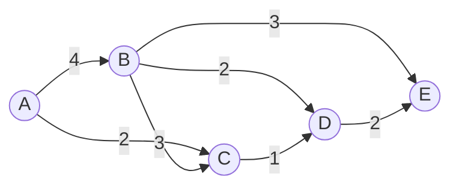

# Dijkstra's Algorithm

## Introduction

Dijkstra's Algorithm is a famous greedy algorithm used to find the shortest path between nodes in a weighted graph. Named after its creator, Dutch computer scientist Edsger W. Dijkstra, this algorithm efficiently determines the shortest path from a starting node to all other nodes in a graph with non-negative edge weights.

Unlike simpler graph traversal methods like BFS (Breadth-First Search), Dijkstra's Algorithm can handle weighted edges, making it extremely useful for real-world applications like navigation systems, network routing protocols, and more.

## Why Is It Considered Greedy?

Dijkstra's Algorithm is considered a greedy algorithm because at each step, it chooses the locally optimal choice—the node with the smallest known distance from the source—without considering the global picture. This local optimization strategy eventually leads to a globally optimal solution (the shortest paths to all nodes).

## Prerequisites

Before diving into Dijkstra's Algorithm, you should be familiar with:
- Basic graph terminology (nodes, edges, weights)
- Priority queues or min-heaps
- Basic programming concepts (loops, conditionals, data structures)

## How Dijkstra's Algorithm Works

### The Core Idea

The algorithm maintains two sets:
1. A set of visited nodes whose shortest distances from the source are already determined
2. A set of unvisited nodes with tentative distance values

At each step, we select the unvisited node with the minimum tentative distance, mark it as visited, and update the distances to its adjacent nodes if we find shorter paths.

### Algorithm Steps

1. Initialize distances of all nodes from the source as infinity, except the source node itself (which is 0)
2. Mark all nodes as unvisited
3. For the current node (initially the source):
   - Examine all its unvisited neighbors
   - Calculate their tentative distances through the current node
   - Update the neighbor's distance if the new calculated distance is smaller
4. Mark the current node as visited
5. Select the unvisited node with the smallest tentative distance as the new "current node"
6. If all nodes have been visited or the smallest tentative distance is infinity, stop
7. Otherwise, repeat from step 3

### Visual Representation

Let's visualize how Dijkstra's Algorithm works on a simple graph:



If we start from node A, the algorithm would process the nodes in the following order:
1. Start with A (distance: 0)
2. Visit C (distance: 2)
3. Visit B (distance: 4)
4. Visit D (distance: 3 = 2 + 1, through C)
5. Visit E (distance: 5 = 3 + 2, through D)

## Implementation

Let's implement Dijkstra's Algorithm in Python:

```python
import heapq

def dijkstra(graph, start):
    # Initialize distances dictionary with infinity for all nodes except start
    distances = {node: float('infinity') for node in graph}
    distances[start] = 0
    
    # Priority queue to store (distance, node) pairs
    priority_queue = [(0, start)]
    
    # Dictionary to store the previous node in the optimal path
    previous = {node: None for node in graph}
    
    while priority_queue:
        # Get the node with the smallest distance
        current_distance, current_node = heapq.heappop(priority_queue)
        
        # If we've already found a shorter path to the current node, skip it
        if current_distance > distances[current_node]:
            continue
        
        # Check all neighbors of the current node
        for neighbor, weight in graph[current_node].items():
            distance = current_distance + weight
            
            # If we found a shorter path to the neighbor
            if distance < distances[neighbor]:
                distances[neighbor] = distance
                previous[neighbor] = current_node
                heapq.heappush(priority_queue, (distance, neighbor))
    
    return distances, previous

# Helper function to reconstruct the path from source to target
def reconstruct_path(previous, target):
    path = []
    current = target
    while current is not None:
        path.append(current)
        current = previous[current]
    return path[::-1]  # Reverse to get path from source to target
```

### Example Usage

```python
# Define a graph as an adjacency list with edge weights
graph = {
    'A': {'B': 4, 'C': 2},
    'B': {'C': 3, 'D': 2, 'E': 3},
    'C': {'D': 1},
    'D': {'E': 2},
    'E': {}
}

start_node = 'A'
distances, previous = dijkstra(graph, start_node)

print(f"Shortest distances from {start_node}:")
for node, distance in distances.items():
    print(f"{node}: {distance}")

# Find the path to node E
target = 'E'
path = reconstruct_path(previous, target)
print(f"Shortest path from {start_node} to {target}: {' -> '.join(path)}")
```

### Output

```
Shortest distances from A:
A: 0
B: 4
C: 2
D: 3
E: 5
Shortest path from A to E: A -> C -> D -> E
```

## Time and Space Complexity

- **Time Complexity**: O(E log V), where E is the number of edges and V is the number of vertices.
- **Space Complexity**: O(V) for storing the distances and visited nodes.

With an optimized priority queue implementation (like a Fibonacci heap), the time complexity can be reduced to O(E + V log V).

## Limitations

Dijkstra's Algorithm has some limitations:
1. It doesn't work with negative edge weights (for graphs with negative weights, you should use the Bellman-Ford algorithm)
2. It can be inefficient for very large graphs

## Real-World Applications

### 1. GPS Navigation Systems

Navigation applications like Google Maps use Dijkstra's Algorithm (or variants of it) to find the shortest or fastest route between your current location and your destination.

```python
# Simplified navigation example
road_network = {
    'Home': {'Grocery': 5, 'Park': 7},
    'Grocery': {'Home': 5, 'Mall': 10, 'School': 3},
    'Park': {'Home': 7, 'School': 2},
    'School': {'Grocery': 3, 'Park': 2, 'Mall': 4},
    'Mall': {'Grocery': 10, 'School': 4}
}

start = 'Home'
destination = 'Mall'
distances, previous = dijkstra(road_network, start)
path = reconstruct_path(previous, destination)

print(f"Best route from {start} to {destination}: {' -> '.join(path)}")
print(f"Estimated travel time: {distances[destination]} minutes")
```

### 2. Network Routing Protocols

Internet routers use algorithms like Dijkstra's to determine the most efficient paths for data packets to travel through the network.

### 3. Flight Path Planning

Airlines use shortest path algorithms to plan fuel-efficient routes between airports.

### 4. Social Network Analysis

Finding the shortest connection between two people in a social network (e.g., "six degrees of separation").

## Variations and Optimizations

1. **Bidirectional Dijkstra**: Runs the algorithm from both the start and end points, which can be faster for point-to-point path finding
2. **A* Algorithm**: An extension of Dijkstra's that uses heuristics to guide the search towards the destination
3. **Multi-level Dijkstra**: For road networks, preprocessing certain paths can significantly speed up later queries

## Implementation Tips

1. Use a priority queue (min-heap) for efficient extraction of the node with minimum distance
2. For sparse graphs, use an adjacency list representation
3. Consider using a Fibonacci heap for optimal theoretical performance

## Summary

Dijkstra's Algorithm is a powerful greedy algorithm for finding shortest paths in weighted graphs with non-negative edges. Its elegance lies in its simplicity and effectiveness:

1. It starts from a source node and gradually explores the graph
2. At each step, it greedily selects the unvisited node with the minimum distance
3. It updates distances to neighbors if shorter paths are found
4. It terminates when all nodes are visited or unreachable

This algorithm demonstrates how a greedy approach—making locally optimal choices at each step—can lead to a globally optimal solution for the single-source shortest path problem.

## Practice Exercises

1. Implement Dijkstra's Algorithm using different priority queue data structures and compare their performance
2. Modify the algorithm to also return the total number of shortest paths between the source and each vertex
3. Solve the following problem: Given a weighted graph representing a road network, find the shortest path from city A to city B that passes through city C
4. Implement a version of the algorithm that stops once it reaches a specific target node
5. Extend the algorithm to handle time-dependent weights (e.g., traffic conditions that change during the day)

## Additional Resources

- Original paper: E. W. Dijkstra, "A note on two problems in connexion with graphs" (1959)
- Advanced graph algorithms books and courses
- Online practice platforms with graph algorithm problems
- Visualization tools to see the algorithm in action

Happy coding and path finding!