# Interval Scheduling

## Introduction

Interval scheduling is a classic problem in computer science where we need to select the maximum number of non-overlapping intervals from a given set. Each interval has a start time and an end time, and two intervals are considered to overlap if they share any point in time.

This problem commonly appears in many real-world scenarios:
- Scheduling meetings in a single conference room
- Allocating resources that can only serve one request at a time
- Managing time slots for television programming
- Planning tasks that require exclusive access to a resource

The interval scheduling problem is an excellent example of how greedy algorithms can provide optimal solutions efficiently. In this tutorial, we'll explore how to approach this problem step by step.

## Problem Statement

Given a set of intervals with start and end times, find the maximum number of non-overlapping intervals that can be scheduled.

For example, given these intervals:
- Interval 1: [1, 3]
- Interval 2: [2, 5]
- Interval 3: [3, 9]
- Interval 4: [6, 8]

The maximum number of non-overlapping intervals would be 2 (Interval 1 and Interval 4).

## The Greedy Approach

The key insight for solving the interval scheduling problem efficiently is to use a greedy approach. Among several possible greedy strategies, selecting intervals based on their **earliest end time** proves to be optimal.

Here's why this works: By always choosing the interval that finishes first, we leave as much time as possible for the remaining intervals, maximizing our options for future selections.

### Algorithm Steps

1. Sort all intervals based on their end times.
2. Initialize an empty result set to store selected intervals.
3. Select the first interval (the one with the earliest end time) and add it to the result set.
4. Iterate through the remaining intervals and pick an interval if its start time is greater than or equal to the end time of the last selected interval.
5. Return the result set with the maximum number of non-overlapping intervals.

Let's visualize this with a diagram:

```mermaid
gantt
    title Interval Scheduling Example
    dateFormat  X
    axisFormat %d
    section Intervals
    Interval 1 (Selected)    :1, 3
    Interval 2               :2, 5
    Interval 3               :3, 9
    Interval 4 (Selected)    :6, 8
```



## Implementation

Let's implement the interval scheduling algorithm in Python:

```python
def max_intervals(intervals):
    """
    Find the maximum number of non-overlapping intervals.
    
    Args:
        intervals: List of [start, end] intervals
        
    Returns:
        List of selected intervals
    """
    if not intervals:
        return []
    
    # Sort intervals by end time
    intervals.sort(key=lambda x: x[1])
    
    selected = [intervals[0]]  # Select the first interval
    last_end_time = intervals[0][1]
    
    # Process remaining intervals
    for i in range(1, len(intervals)):
        current_start = intervals[i][0]
        current_end = intervals[i][1]
        
        # If current interval doesn't overlap with the last selected interval
        if current_start >= last_end_time:
            selected.append(intervals[i])
            last_end_time = current_end
    
    return selected
```

### Example Usage

```python
# Example usage
intervals = [[1, 3], [2, 5], [3, 9], [6, 8]]
result = max_intervals(intervals)
print(f"Maximum non-overlapping intervals: {len(result)}")
print(f"Selected intervals: {result}")
```

**Output:**
```
Maximum non-overlapping intervals: 2
Selected intervals: [[1, 3], [6, 8]]
```

## Step-by-Step Walkthrough

Let's trace through the algorithm step by step with our example:

1. Input intervals: `[[1, 3], [2, 5], [3, 9], [6, 8]]`
   
2. Sort intervals by end time:
   - `[1, 3]` (end time: 3)
   - `[2, 5]` (end time: 5)
   - `[6, 8]` (end time: 8)
   - `[3, 9]` (end time: 9)

3. Initialize `selected = [[1, 3]]` and `last_end_time = 3`

4. Process remaining intervals:
   - For `[2, 5]`: Start time (2) < last end time (3), so skip
   - For `[6, 8]`: Start time (6) >= last end time (3), so select and update `last_end_time = 8`
   - For `[3, 9]`: Start time (3) < last end time (8), so skip

5. Return `selected = [[1, 3], [6, 8]]`

## Time and Space Complexity

- **Time Complexity**: O(n log n), where n is the number of intervals. Sorting the intervals takes O(n log n) time, and the subsequent traversal takes O(n) time.
- **Space Complexity**: O(n) for storing the sorted intervals and the selected intervals.

## Real-World Applications

### 1. Conference Room Scheduling

Imagine you're managing a conference room that can only host one meeting at a time. You have requests for different time slots, and you want to accommodate as many meetings as possible.

```python
meetings = [
    {"name": "Team A Standup", "start": 9, "end": 10},
    {"name": "Product Review", "start": 9.5, "end": 11},
    {"name": "Lunch Meeting", "start": 12, "end": 13},
    {"name": "Interview", "start": 10.5, "end": 12},
    {"name": "Team B Planning", "start": 13, "end": 15}
]

# Convert to interval format
intervals = [[m["start"], m["end"]] for m in meetings]
selected_indices = [meetings.index(meetings[i]) for i in range(len(meetings)) 
                   if [meetings[i]["start"], meetings[i]["end"]] in max_intervals(intervals)]

# Display selected meetings
for idx in selected_indices:
    print(f"Scheduled: {meetings[idx]['name']} from {meetings[idx]['start']} to {meetings[idx]['end']}")
```

### 2. Task Scheduling for a Single Processor

When scheduling tasks on a single processor, each task needs exclusive access to the processor.

```python
def schedule_tasks(tasks):
    intervals = [[task["start_time"], task["end_time"]] for task in tasks]
    selected_intervals = max_intervals(intervals)
    
    scheduled_tasks = []
    for interval in selected_intervals:
        for task in tasks:
            if task["start_time"] == interval[0] and task["end_time"] == interval[1]:
                scheduled_tasks.append(task)
                break
    
    return scheduled_tasks
```

## Variations and Extensions

### 1. Weighted Interval Scheduling

In this variation, each interval has an associated weight or value, and the goal is to select a set of non-overlapping intervals with maximum total weight.

### 2. Interval Scheduling with Multiple Resources

When you have k identical resources (e.g., k conference rooms), you want to schedule intervals across these resources to maximize the number of scheduled intervals.

### 3. Minimum Number of Resources

Given a set of intervals, find the minimum number of resources needed to schedule all intervals without any conflicts.

## Summary

Interval scheduling is a classic optimization problem solved efficiently using a greedy algorithm. By selecting intervals based on their earliest end time, we can find the maximum number of non-overlapping intervals in O(n log n) time.

Key takeaways:
- Sort intervals by end time for optimal results
- Always choose the earliest ending interval that doesn't conflict
- This greedy approach guarantees an optimal solution
- The problem has many practical applications in resource allocation and scheduling

## Practice Exercises

1. **Basic Implementation**: Implement the interval scheduling algorithm and test it with various inputs.

2. **Scheduling with Priorities**: Modify the algorithm to prioritize certain intervals based on additional criteria.

3. **Minimum Resources**: Implement an algorithm to find the minimum number of resources needed to schedule all intervals.

4. **Visualization Tool**: Create a simple visualization that shows the selected intervals on a timeline.

5. **Real-World Application**: Apply the interval scheduling algorithm to solve a resource allocation problem in your domain of interest.

## Additional Resources

- Introduction to Algorithms by Cormen, Leiserson, Rivest, and Stein (Chapter on Greedy Algorithms)
- Algorithm Design Manual by Steven Skiena (Discussion on Interval Scheduling)
- Competitive Programming resources like CLRS, GeeksforGeeks, and LeetCode for more practice problems

Learning interval scheduling is not only useful for algorithm competitions but also for solving real-world resource allocation problems efficiently. As you master this technique, you'll find it applicable across many domains in computer science and beyond.