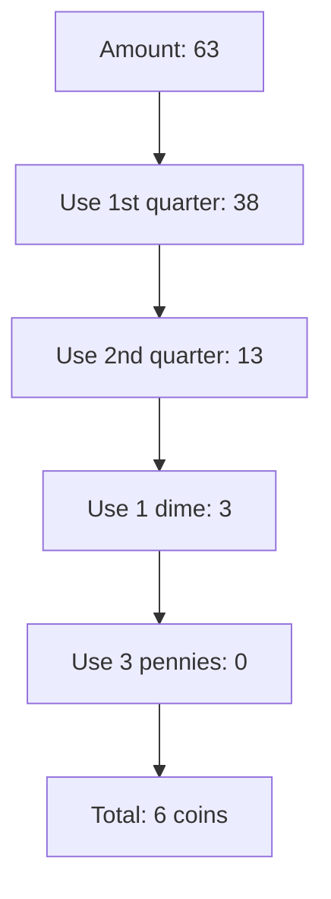

# Coin Change Greedy Algorithm

## Introduction

The Coin Change problem is a classic algorithmic challenge that you'll encounter frequently in programming interviews and real-world applications. It asks: **given a set of coin denominations and a target amount, what is the minimum number of coins needed to make up that amount?**

In this tutorial, we'll explore the greedy approach to solving the coin change problem. The greedy algorithm makes locally optimal choices at each step with the hope of finding a global optimum. For the coin change problem, this means always selecting the largest possible coin denomination that doesn't exceed our remaining amount.

## Understanding the Problem

Let's formalize the problem:

1. We have a set of coin denominations `D = {d₁, d₂, ..., dₙ}` (e.g., {1, 5, 10, 25})
2. We need to make change for amount `A`
3. Our goal is to use the **minimum number** of coins to reach exactly amount `A`

For example, if we have coins of denominations {1, 5, 10, 25} (like US pennies, nickels, dimes, and quarters) and need to make change for 63 cents, what's the minimum number of coins required?

## The Greedy Approach

The greedy strategy for the coin change problem follows these steps:

1. Sort the coin denominations in descending order
2. Start with the largest denomination that doesn't exceed the remaining amount
3. Take as many of these coins as possible without exceeding the remaining amount
4. Subtract the value of the coins used from the remaining amount
5. Repeat steps 2-4 with the next largest denomination until the remaining amount is zero

## Implementation

Let's implement this algorithm in Python:

```python
def coin_change_greedy(coins, amount):
    # Sort coins in descending order
    coins.sort(reverse=True)
    
    # Initialize count of coins
    count = 0
    
    # Track which coins were used (for explanation)
    coins_used = []
    
    # Try each coin denomination
    for coin in coins:
        # Use as many coins of this denomination as possible
        while amount >= coin:
            amount -= coin
            count += 1
            coins_used.append(coin)
    
    # Check if we were able to make the exact change
    if amount == 0:
        print(f"Coins used: {coins_used}")
        return count
    else:
        return -1  # Cannot make exact change
```

Let's test our algorithm with the example of making change for 63 cents with denominations {1, 5, 10, 25}:

```python
coins = [1, 5, 10, 25]
amount = 63
min_coins = coin_change_greedy(coins, amount)
print(f"Minimum number of coins required: {min_coins}")
```

**Output:**
```
Coins used: [25, 25, 10, 1, 1, 1]
Minimum number of coins required: 6
```

## Step-by-Step Explanation

Let's break down how the algorithm works for our example:

1. Sort coins in descending order: [25, 10, 5, 1]
2. Start with 25 cents:
   - We can use 2 quarters (25 × 2 = 50 cents)
   - Remaining amount: 63 - 50 = 13 cents
3. Try 10 cents:
   - We can use 1 dime (10 × 1 = 10 cents)
   - Remaining amount: 13 - 10 = 3 cents
4. Try 5 cents:
   - We cannot use a nickel because 5 > 3 cents
5. Try 1 cent:
   - We can use 3 pennies (1 × 3 = 3 cents)
   - Remaining amount: 3 - 3 = 0 cents
6. Total coins used: 2 quarters + 1 dime + 3 pennies = 6 coins

Here's a visualization of the process:



## Time and Space Complexity

- **Time Complexity**: O(amount), because in the worst case (e.g., if we only have pennies), we might need to use "amount" number of coins.
- **Space Complexity**: O(amount) for storing the coins used.

## Limitations of the Greedy Approach

While the greedy algorithm works correctly for standard U.S. coin denominations {1, 5, 10, 25}, it doesn't always produce the optimal solution for all coin systems.

For example, consider a coin system with denominations {1, 3, 4} and an amount of 6:

- The greedy approach would use: 4 + 1 + 1 = 3 coins
- The optimal solution is: 3 + 3 = 2 coins

This happens because the greedy algorithm makes local optimal choices (picking the largest coin first) without considering the global picture.

The greedy algorithm works optimally for a coin system if it has the "canonical property," which means every amount can be represented using the minimum number of coins by selecting coins greedily.

## Real-World Applications

### 1. Cash Register Systems

In retail and banking systems, coin change algorithms are used to determine how to dispense the minimum number of bills and coins to customers. The U.S. and most European countries have currency denominations that allow for an optimal greedy solution.

### 2. Vending Machines

Vending machines use coin change algorithms to calculate the change to return when a customer makes a purchase.

```python
def calculate_change(price, payment, denominations):
    change_amount = payment - price
    
    if change_amount < 0:
        return "Insufficient payment"
    
    return coin_change_greedy(denominations, change_amount)
```

### 3. Financial Applications

When designing financial systems that involve transaction fees or minimizing costs, variations of the coin change problem frequently appear.

## Advanced Considerations

### Dynamic Programming Solution

For coin systems where the greedy approach doesn't work, dynamic programming provides a guaranteed optimal solution:

```python
def coin_change_dp(coins, amount):
    # Initialize dp array with amount+1 (representing infinity)
    dp = [float('inf')] * (amount + 1)
    dp[0] = 0
    
    # Fill the dp array
    for coin in coins:
        for x in range(coin, amount + 1):
            dp[x] = min(dp[x], dp[x - coin] + 1)
    
    return dp[amount] if dp[amount] != float('inf') else -1
```

### When to Use Greedy vs. Dynamic Programming

- **Use greedy** when you're certain the coin system has the canonical property (like U.S. coins)
- **Use dynamic programming** when dealing with arbitrary coin denominations or when you need a guaranteed optimal solution

## Summary

The Coin Change Greedy algorithm is a simple and efficient approach for finding the minimum number of coins needed to make change when working with standard coin systems. It follows the principle of always taking the largest possible coin at each step.

Key points to remember:

- The greedy approach is straightforward to implement and understand
- It has a time complexity of O(amount) which is efficient
- It works optimally for standard coin systems like U.S. currency
- Not all coin systems can be solved optimally with a greedy approach
- Dynamic programming offers a universally optimal solution, albeit with higher time complexity

## Practice Exercises

1. Implement the greedy algorithm for a coin system with denominations {1, 5, 10, 25, 50} and make change for 93 cents.
2. Find a coin system where the greedy algorithm fails to produce the optimal solution.
3. Modify the algorithm to output all possible ways to make change using a greedy approach.
4. Implement both greedy and dynamic programming solutions and compare their performance for various inputs.
5. Extend the algorithm to handle cases where there are limited quantities of each coin denomination.

## Additional Resources

- [Introduction to Algorithms](https://mitpress.mit.edu/books/introduction-algorithms-third-edition) by Cormen, Leiserson, Rivest, and Stein
- [Algorithms](https://algs4.cs.princeton.edu/home/) by Robert Sedgewick and Kevin Wayne
- [Competitive Programmer's Handbook](https://cses.fi/book/book.pdf) by Antti Laaksonen

Happy coding!