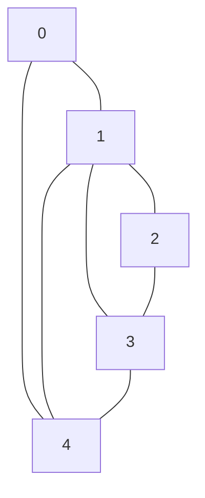

# Graph Representation

In this tutorial, we'll explore the different ways to represent graphs in computer programming. Understanding graph representation is fundamental to implementing graph algorithms efficiently.

## Introduction

A graph is a collection of nodes (vertices) connected by edges. Unlike linear data structures like arrays or linked lists, graphs represent complex relationships between elements. Before we can implement algorithms like breadth-first search or Dijkstra's shortest path, we need to understand how to represent graphs in code.

There are several common ways to represent graphs:
- Adjacency Matrix
- Adjacency List
- Edge List

Each representation has its advantages and trade-offs regarding memory usage, operation efficiency, and implementation complexity.

## Adjacency Matrix Representation

An adjacency matrix is a 2D array where both dimensions represent vertices. If there's an edge between vertex `i` and vertex `j`, we set `matrix[i][j]` to 1 (or to the weight of the edge for weighted graphs). Otherwise, we set it to 0 or infinity.

### Implementation

Here's how to implement an adjacency matrix for an undirected graph:

```java
public class GraphWithAdjacencyMatrix {
    private int V; // Number of vertices
    private int[][] adjMatrix;
    
    public GraphWithAdjacencyMatrix(int v) {
        V = v;
        adjMatrix = new int[v][v];
    }
    
    // Add an edge between vertices v and w
    public void addEdge(int v, int w) {
        // Add edge from v to w
        adjMatrix[v][w] = 1;
        
        // Add edge from w to v (for undirected graph)
        adjMatrix[w][v] = 1;
    }
    
    // Print the adjacency matrix
    public void printGraph() {
        System.out.println("Graph representation using adjacency matrix:");
        for (int i = 0; i < V; i++) {
            for (int j = 0; j < V; j++) {
                System.out.print(adjMatrix[i][j] + " ");
            }
            System.out.println();
        }
    }
}
```

### Example Usage

```java
public static void main(String[] args) {
    // Create a graph with 5 vertices
    GraphWithAdjacencyMatrix graph = new GraphWithAdjacencyMatrix(5);
    
    // Add edges
    graph.addEdge(0, 1);
    graph.addEdge(0, 4);
    graph.addEdge(1, 2);
    graph.addEdge(1, 3);
    graph.addEdge(1, 4);
    graph.addEdge(2, 3);
    graph.addEdge(3, 4);
    
    // Print the graph
    graph.printGraph();
}
```

**Output:**
```
Graph representation using adjacency matrix:
0 1 0 0 1 
1 0 1 1 1 
0 1 0 1 0 
0 1 1 0 1 
1 1 0 1 0 
```

### Visual Representation



### Pros and Cons

**Advantages:**
- Simple implementation
- Edge lookup is O(1)
- Removing an edge takes O(1) time
- Good for dense graphs

**Disadvantages:**
- Uses O(V²) space, wasteful for sparse graphs
- Iterating over all edges from a vertex takes O(V) time
- Adding a new vertex requires recreating the matrix

## Adjacency List Representation

An adjacency list stores a list of adjacent vertices for each vertex in the graph. This is typically implemented using an array (or ArrayList) of linked lists or other collections.

### Implementation

Here's how to implement an adjacency list:

```java
import java.util.ArrayList;
import java.util.List;

public class GraphWithAdjacencyList {
    private int V; // Number of vertices
    private List<List<Integer>> adjList;
    
    public GraphWithAdjacencyList(int v) {
        V = v;
        adjList = new ArrayList<>(v);
        
        // Initialize the adjacency list
        for (int i = 0; i < v; i++) {
            adjList.add(new ArrayList<>());
        }
    }
    
    // Add an edge between vertices v and w
    public void addEdge(int v, int w) {
        // Add edge from v to w
        adjList.get(v).add(w);
        
        // Add edge from w to v (for undirected graph)
        adjList.get(w).add(v);
    }
    
    // Print the adjacency list
    public void printGraph() {
        System.out.println("Graph representation using adjacency list:");
        for (int i = 0; i < V; i++) {
            System.out.print("Vertex " + i + " is connected to: ");
            for (Integer neighbor : adjList.get(i)) {
                System.out.print(neighbor + " ");
            }
            System.out.println();
        }
    }
}
```

### Example Usage

```java
public static void main(String[] args) {
    // Create a graph with 5 vertices
    GraphWithAdjacencyList graph = new GraphWithAdjacencyList(5);
    
    // Add edges
    graph.addEdge(0, 1);
    graph.addEdge(0, 4);
    graph.addEdge(1, 2);
    graph.addEdge(1, 3);
    graph.addEdge(1, 4);
    graph.addEdge(2, 3);
    graph.addEdge(3, 4);
    
    // Print the graph
    graph.printGraph();
}
```

**Output:**
```
Graph representation using adjacency list:
Vertex 0 is connected to: 1 4 
Vertex 1 is connected to: 0 2 3 4 
Vertex 2 is connected to: 1 3 
Vertex 3 is connected to: 1 2 4 
Vertex 4 is connected to: 0 1 3 
```

### Pros and Cons

**Advantages:**
- Space-efficient for sparse graphs: O(V + E)
- Adding a vertex is easier
- Iterating over all edges of a specific vertex is efficient
- Good for most graph algorithms like BFS, DFS

**Disadvantages:**
- Edge lookup is O(degree of vertex) which can be O(V) in the worst case
- More complex implementation compared to adjacency matrix
- Requires more memory management

## Edge List Representation

An edge list is simply a collection of all edges in the graph. Each edge is represented as a pair of vertices or a triplet (for weighted graphs).

### Implementation

```java
import java.util.ArrayList;
import java.util.List;

public class GraphWithEdgeList {
    private int V; // Number of vertices
    private List<Edge> edges;
    
    public GraphWithEdgeList(int v) {
        V = v;
        edges = new ArrayList<>();
    }
    
    class Edge {
        int source, destination, weight;
        
        Edge(int source, int destination, int weight) {
            this.source = source;
            this.destination = destination;
            this.weight = weight;
        }
    }
    
    // Add an edge between vertices source and destination with weight
    public void addEdge(int source, int destination, int weight) {
        Edge edge = new Edge(source, destination, weight);
        edges.add(edge);
    }
    
    // Add an edge between vertices source and destination (default weight = 1)
    public void addEdge(int source, int destination) {
        addEdge(source, destination, 1);
    }
    
    // Print all the edges
    public void printGraph() {
        System.out.println("Graph representation using edge list:");
        for (Edge e : edges) {
            System.out.println("Edge: " + e.source + " -> " + e.destination + ", Weight: " + e.weight);
        }
    }
}
```

### Example Usage

```java
public static void main(String[] args) {
    // Create a graph with 5 vertices
    GraphWithEdgeList graph = new GraphWithEdgeList(5);
    
    // Add edges with weights
    graph.addEdge(0, 1, 5);
    graph.addEdge(0, 4, 2);
    graph.addEdge(1, 2, 3);
    graph.addEdge(1, 3, 7);
    graph.addEdge(1, 4, 4);
    graph.addEdge(2, 3, 1);
    graph.addEdge(3, 4, 6);
    
    // Print the graph
    graph.printGraph();
}
```

**Output:**
```
Graph representation using edge list:
Edge: 0 -> 1, Weight: 5
Edge: 0 -> 4, Weight: 2
Edge: 1 -> 2, Weight: 3
Edge: 1 -> 3, Weight: 7
Edge: 1 -> 4, Weight: 4
Edge: 2 -> 3, Weight: 1
Edge: 3 -> 4, Weight: 6
```

### Pros and Cons

**Advantages:**
- Simple to implement
- Space-efficient: O(E)
- Good for algorithms that primarily work with edges (like Kruskal's algorithm)

**Disadvantages:**
- Edge lookup is inefficient: O(E)
- Finding all edges connected to a vertex is inefficient
- Not suitable for many common graph operations

## Real-world Applications

Let's look at some real-world problems where different graph representations are particularly useful:

### Social Network Analysis

In a social network like Facebook or LinkedIn, users are vertices and connections are edges. Since each user typically has a limited number of connections compared to the total number of users, an adjacency list is more efficient.

```java
class SocialNetwork {
    private Map<Integer, User> users;
    
    class User {
        int userId;
        String name;
        List<Integer> friends;
        
        User(int id, String name) {
            userId = id;
            this.name = name;
            friends = new ArrayList<>();
        }
    }
    
    public SocialNetwork() {
        users = new HashMap<>();
    }
    
    public void addUser(int userId, String name) {
        users.put(userId, new User(userId, name));
    }
    
    public void addFriendship(int user1Id, int user2Id) {
        // Add bi-directional friendship
        users.get(user1Id).friends.add(user2Id);
        users.get(user2Id).friends.add(user1Id);
    }
    
    public List<Integer> getFriends(int userId) {
        return users.get(userId).friends;
    }
    
    public void suggestFriends(int userId) {
        // Friend suggestion algorithm (friends of friends)
        Set<Integer> directFriends = new HashSet<>(getFriends(userId));
        Set<Integer> suggestedFriends = new HashSet<>();
        
        for (int friendId : directFriends) {
            for (int potentialSuggestion : getFriends(friendId)) {
                if (potentialSuggestion != userId && !directFriends.contains(potentialSuggestion)) {
                    suggestedFriends.add(potentialSuggestion);
                }
            }
        }
        
        System.out.println("Friend suggestions for user " + userId + ": " + suggestedFriends);
    }
}
```

### Road Network

Road networks can be modeled as weighted graphs where cities are vertices, roads are edges, and weights could be distances or travel times. This is a perfect use case for edge lists, especially for algorithms like Dijkstra's shortest path.

```java
class RoadNetwork {
    private int V; // Number of cities
    private List<Edge> roads;
    private String[] cityNames;
    
    class Edge {
        int source, destination;
        double distance; // in kilometers
        
        Edge(int source, int destination, double distance) {
            this.source = source;
            this.destination = destination;
            this.distance = distance;
        }
    }
    
    public RoadNetwork(int cities) {
        V = cities;
        roads = new ArrayList<>();
        cityNames = new String[cities];
    }
    
    public void setCity(int cityId, String name) {
        cityNames[cityId] = name;
    }
    
    public void addRoad(int city1, int city2, double distance) {
        roads.add(new Edge(city1, city2, distance));
        roads.add(new Edge(city2, city1, distance)); // Roads are bidirectional
    }
    
    public void printShortestRoute(int startCity, int endCity) {
        System.out.println("The shortest route from " + cityNames[startCity] + 
                          " to " + cityNames[endCity] + " would be calculated using Dijkstra's algorithm");
        // Implementation of Dijkstra's algorithm would go here
    }
}
```

### Web Page Connectivity

Search engines like Google represent web pages as vertices and hyperlinks as directed edges. Given the sparse nature of web connectivity, an adjacency list is most suitable.

```java
class WebGraph {
    private Map<String, List<String>> webGraph; // URL -> List of outgoing URLs
    
    public WebGraph() {
        webGraph = new HashMap<>();
    }
    
    public void addPage(String url) {
        if (!webGraph.containsKey(url)) {
            webGraph.put(url, new ArrayList<>());
        }
    }
    
    public void addLink(String fromUrl, String toUrl) {
        // Ensure both URLs exist in the graph
        addPage(fromUrl);
        addPage(toUrl);
        
        // Add the directed edge (hyperlink)
        webGraph.get(fromUrl).add(toUrl);
    }
    
    public List<String> getOutgoingLinks(String url) {
        return webGraph.getOrDefault(url, new ArrayList<>());
    }
    
    public void calculatePageRank() {
        System.out.println("PageRank would be calculated here using the graph structure");
        // PageRank algorithm implementation would go here
    }
}
```

## Choosing the Right Representation

The choice of graph representation depends on:

1. **Graph density**: Is your graph sparse (few edges) or dense (many edges)?
2. **Operations**: What operations will you perform most frequently?
3. **Memory constraints**: How large is your graph?

Here's a quick comparison:

| Representation   | Space Complexity | Edge Lookup | Add Edge | Add Vertex | Iterate Over Edges | Best For                            |
|------------------|------------------|-------------|----------|------------|--------------------|-------------------------------------|
| Adjacency Matrix | O(V²)            | O(1)        | O(1)     | O(V²)      | O(V)               | Dense graphs, frequent edge lookups |
| Adjacency List   | O(V + E)         | O(degree)   | O(1)     | O(1)       | O(degree)          | Sparse graphs, traversal algorithms |
| Edge List        | O(E)             | O(E)        | O(1)     | O(1)       | O(E)               | Algorithms focusing on edges        |

## Summary

In this tutorial, we've explored three different ways to represent graphs in code:

1. **Adjacency Matrix**: A 2D array where matrix[i][j] indicates an edge between vertices i and j.
2. **Adjacency List**: Each vertex maintains a list of its adjacent vertices.
3. **Edge List**: A simple list of all edges in the graph.

Each representation has its own advantages and use cases. Choosing the right representation is crucial for efficient implementation of graph algorithms.

## Practice Exercises

1. Implement a directed graph using adjacency list representation.
2. Write a function to convert between adjacency matrix and adjacency list representations.
3. Implement a weighted graph using both adjacency matrix and adjacency list.
4. Create a function to check if a graph is connected using any representation.
5. Implement a function that finds all isolated vertices (vertices with no edges) in a graph.

## Additional Resources

- Introduction to Algorithms by Thomas H. Cormen (CLRS)
- Algorithms by Robert Sedgewick and Kevin Wayne
- Graph Theory tutorials on Khan Academy
- Visualizations of graph algorithms: [VisuAlgo](https://visualgo.net/en/graphds)

Understanding these graph representations will serve as the foundation for learning and implementing various graph algorithms like BFS, DFS, Dijkstra's algorithm, and many more.