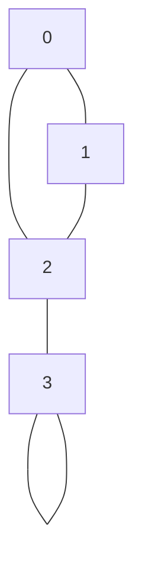

# Graph Traversal

Graph traversal is the process of visiting (checking and/or updating) each vertex in a graph. It forms the foundation for many important graph algorithms and applications. Unlike arrays or linked lists, graphs require specialized traversal techniques due to their non-linear structure.

## Introduction to Graph Traversal

When working with graphs, we often need to systematically visit each vertex and possibly each edge to perform operations like searching, path finding, or analysis. The two fundamental graph traversal algorithms are:

1. **Breadth-First Search (BFS)**: Explores all vertices at the current depth before moving to vertices at the next depth level
2. **Depth-First Search (DFS)**: Explores as far as possible along a branch before backtracking

Both algorithms guarantee that every vertex and edge will be visited exactly once, making them complete traversal methods.

## Representing Graphs for Traversal

Before diving into traversal techniques, let's first understand how to represent a graph in code. The two common representations are:

1. **Adjacency Matrix**: A 2D array where `matrix[i][j] = 1` indicates an edge from vertex `i` to vertex `j`
2. **Adjacency List**: An array of lists where each list contains the neighbors of the corresponding vertex

For our examples, we'll use an adjacency list representation as it's more space-efficient for sparse graphs:

```java
// Graph representation using adjacency list
class Graph {
    private int V;  // Number of vertices
    private LinkedList<Integer>[] adj;  // Adjacency Lists
    
    // Constructor
    Graph(int v) {
        V = v;
        adj = new LinkedList[v];
        for (int i = 0; i < v; i++) {
            adj[i] = new LinkedList<>();
        }
    }
    
    // Add an edge to the graph
    void addEdge(int v, int w) {
        adj[v].add(w);
    }
    
    // Rest of the graph implementation
    // ...
}
```

## Breadth-First Search (BFS)

BFS starts at a specific vertex (the source) and explores all vertices at the current depth level before moving on to vertices at the next depth level. This creates a "breadth-first tree" where the source is the root and each level contains vertices that are the same distance from the root.

### BFS Algorithm Steps:

1. Select a starting vertex
2. Visit the starting vertex and mark it as visited
3. Add the vertex to a queue
4. While the queue is not empty:
   - Dequeue a vertex
   - Visit all its unvisited neighbors
   - Mark them as visited and enqueue them

### BFS Implementation:

```java
void BFS(int startVertex) {
    // Mark all vertices as not visited
    boolean visited[] = new boolean[V];
    
    // Create a queue for BFS
    LinkedList<Integer> queue = new LinkedList<Integer>();
    
    // Mark the current node as visited and enqueue it
    visited[startVertex] = true;
    queue.add(startVertex);
    
    while (!queue.isEmpty()) {
        // Dequeue a vertex from queue and print it
        startVertex = queue.poll();
        System.out.print(startVertex + " ");
        
        // Get all adjacent vertices of the dequeued vertex
        // If an adjacent vertex has not been visited, mark it
        // visited and enqueue it
        for (Integer neighbor : adj[startVertex]) {
            if (!visited[neighbor]) {
                visited[neighbor] = true;
                queue.add(neighbor);
            }
        }
    }
}
```

### Example of BFS Execution:

Let's trace the BFS algorithm on a simple graph:



Starting with vertex 0:
- Visit 0, mark as visited, output: `0`
- Visit neighbors 1, 2, mark as visited, output: `0 1 2`
- Visit neighbor of 1 (which is 2, but already visited)
- Visit neighbor of 2 (which is 3), mark as visited, output: `0 1 2 3`
- Visit neighbor of 3 (which is 3 but already visited)
- Done!

Final BFS traversal output: `0 1 2 3`

## Depth-First Search (DFS)

DFS starts at a specific vertex and explores as far as possible along each branch before backtracking. Unlike BFS which explores level by level, DFS goes deep into the graph before exploring alternative paths.

### DFS Algorithm Steps:

1. Select a starting vertex
2. Visit the starting vertex and mark it as visited
3. Recursively visit any unvisited neighbors
4. Backtrack when all neighbors are visited

### DFS Implementation:

```java
void DFS(int startVertex) {
    // Mark all the vertices as not visited
    boolean visited[] = new boolean[V];
    
    // Call the recursive helper function to print DFS traversal
    DFSUtil(startVertex, visited);
}

void DFSUtil(int vertex, boolean visited[]) {
    // Mark the current node as visited and print it
    visited[vertex] = true;
    System.out.print(vertex + " ");
    
    // Recur for all the vertices adjacent to this vertex
    for (Integer neighbor : adj[vertex]) {
        if (!visited[neighbor]) {
            DFSUtil(neighbor, visited);
        }
    }
}
```

### Iterative DFS Implementation (Using Stack):

DFS can also be implemented iteratively using a stack:

```java
void DFSIterative(int startVertex) {
    // Mark all the vertices as not visited
    boolean visited[] = new boolean[V];
    
    // Create a stack for DFS
    Stack<Integer> stack = new Stack<>();
    
    // Push the starting vertex
    stack.push(startVertex);
    
    while (!stack.isEmpty()) {
        // Pop a vertex from stack and print it
        int vertex = stack.pop();
        
        // If the vertex is not visited yet, mark it as visited
        if (!visited[vertex]) {
            System.out.print(vertex + " ");
            visited[vertex] = true;
        }
        
        // Get all adjacent vertices of the popped vertex
        // If an adjacent has not been visited, push it to the stack
        for (Integer neighbor : adj[vertex]) {
            if (!visited[neighbor]) {
                stack.push(neighbor);
            }
        }
    }
}
```

### Example of DFS Execution:

Using the same graph as before:


Starting with vertex 0 (recursive approach):
- Visit 0, mark as visited, output: `0`
- Visit first neighbor 1, mark as visited, output: `0 1`
- Visit neighbor of 1 (which is 2), mark as visited, output: `0 1 2`
- Visit neighbor of 2 (which is 3), mark as visited, output: `0 1 2 3`
- Backtrack to 2, then to 1, then to 0
- All vertices visited, done!

Final DFS traversal output: `0 1 2 3`

## Comparing BFS and DFS

Let's compare these two fundamental traversal algorithms:

| Feature | BFS | DFS |
|---------|-----|-----|
| Order of exploration | Level by level | Path by path |
| Data Structure | Queue | Stack or Recursion |
| Memory Usage | Higher (must store all vertices at a level) | Lower (only stores vertices on a path) |
| Completeness | Yes (finds all vertices) | Yes (finds all vertices) |
| Use Cases | Shortest path (unweighted), connected components | Topological sorting, cycle detection, path finding |
| Time Complexity | O(V + E) | O(V + E) |
| Space Complexity | O(V) | O(V) |

## Time and Space Complexity

For both BFS and DFS:
- **Time Complexity**: O(V + E) where V is the number of vertices and E is the number of edges
  - Each vertex is processed once: O(V)
  - Each edge is considered once: O(E)
- **Space Complexity**: O(V) for storing the visited array and the queue/stack

## Practical Applications

### 1. Shortest Path Finding (BFS)

BFS is commonly used to find the shortest path in an unweighted graph. Since BFS explores level by level, the first time a node is discovered during the traversal, it's guaranteed to be at the shortest distance from the source.

```java
Map<Integer, Integer> shortestPath(int startVertex) {
    Map<Integer, Integer> distances = new HashMap<>();
    boolean[] visited = new boolean[V];
    Queue<Integer> queue = new LinkedList<>();
    
    visited[startVertex] = true;
    queue.add(startVertex);
    distances.put(startVertex, 0);
    
    while (!queue.isEmpty()) {
        int vertex = queue.poll();
        
        for (int neighbor : adj[vertex]) {
            if (!visited[neighbor]) {
                visited[neighbor] = true;
                distances.put(neighbor, distances.get(vertex) + 1);
                queue.add(neighbor);
            }
        }
    }
    
    return distances;
}
```

### 2. Cycle Detection (DFS)

DFS can be used to detect cycles in a graph. A cycle exists if during the traversal, we encounter a vertex that's already in the recursion stack.

```java
boolean hasCycle() {
    boolean[] visited = new boolean[V];
    boolean[] recursionStack = new boolean[V];
    
    // Call the recursive helper function for all vertices
    for (int i = 0; i < V; i++) {
        if (isCyclicUtil(i, visited, recursionStack)) {
            return true;
        }
    }
    return false;
}

boolean isCyclicUtil(int vertex, boolean[] visited, boolean[] recursionStack) {
    // Mark the current node as visited and add to recursion stack
    if (recursionStack[vertex]) {
        return true;
    }
    
    if (visited[vertex]) {
        return false;
    }
    
    visited[vertex] = true;
    recursionStack[vertex] = true;
    
    for (Integer neighbor : adj[vertex]) {
        if (isCyclicUtil(neighbor, visited, recursionStack)) {
            return true;
        }
    }
    
    // Remove the vertex from recursion stack
    recursionStack[vertex] = false;
    return false;
}
```

### 3. Connected Components (BFS/DFS)

Both BFS and DFS can be used to find connected components in an undirected graph.

```java
int countConnectedComponents() {
    boolean[] visited = new boolean[V];
    int count = 0;
    
    for (int v = 0; v < V; v++) {
        if (!visited[v]) {
            // Start a new connected component
            DFSUtil(v, visited);
            count++;
        }
    }
    return count;
}
```

### 4. Topological Sorting (DFS)

DFS is used to perform topological sorting on a directed acyclic graph (DAG), which orders vertices such that for every directed edge (u, v), vertex u comes before v in the ordering.

```java
void topologicalSort() {
    Stack<Integer> stack = new Stack<>();
    boolean[] visited = new boolean[V];
    
    // Call the recursive helper function for all vertices
    for (int i = 0; i < V; i++) {
        if (!visited[i]) {
            topologicalSortUtil(i, visited, stack);
        }
    }
    
    // Print contents of stack
    while (!stack.isEmpty()) {
        System.out.print(stack.pop() + " ");
    }
}

void topologicalSortUtil(int vertex, boolean[] visited, Stack<Integer> stack) {
    // Mark the current node as visited
    visited[vertex] = true;
    
    // Recur for all the vertices adjacent to this vertex
    for (Integer neighbor : adj[vertex]) {
        if (!visited[neighbor]) {
            topologicalSortUtil(neighbor, visited, stack);
        }
    }
    
    // Push current vertex to stack which stores result
    stack.push(vertex);
}
```

## Real-World Applications

1. **Social Networks**: Finding friends of friends (BFS), analyzing social connections (DFS)
2. **Web Crawling**: Discovering and indexing web pages (both BFS and DFS are used)
3. **Navigation Systems**: Finding shortest routes between locations (BFS for unweighted graphs)
4. **Network Broadcast**: Finding all devices that can be reached (BFS/DFS)
5. **Garbage Collection**: Identifying unreachable objects (DFS)
6. **Puzzle Solving**: Finding solutions to puzzles like maze solving (DFS for depth exploration, BFS for shortest path)

## Summary

Graph traversal algorithms are fundamental techniques to navigate through graphs systematically:

- **Breadth-First Search (BFS)** explores a graph level by level using a queue, making it ideal for finding shortest paths in unweighted graphs.
- **Depth-First Search (DFS)** explores as far as possible along each branch before backtracking, using recursion or a stack, and is useful for topological sorting and cycle detection.

Both algorithms have a time complexity of O(V + E) and a space complexity of O(V), making them efficient for most graph applications. The choice between BFS and DFS depends on the specific requirements of the problem at hand.

## Practice Exercises

1. Implement BFS to find the shortest path between two vertices in an unweighted graph.
2. Use DFS to detect if a directed graph contains a cycle.
3. Implement an algorithm to count the number of connected components in an undirected graph.
4. Use BFS to determine if a binary tree is a complete binary tree.
5. Implement a word ladder problem solver using BFS (finding the shortest transformation sequence from one word to another).

## Further Reading

- Graph algorithms like Dijkstra's algorithm and A* search that build upon traversal techniques
- Advanced applications like strongly connected components and minimum spanning trees
- Bidirectional search combining BFS from both source and destination
- Iterative deepening depth-first search (IDDFS) that combines depth-first search's space efficiency with breadth-first search's completeness

By mastering graph traversal algorithms, you'll have a solid foundation for tackling more complex graph problems and understanding more advanced algorithms that build upon these traversal techniques.