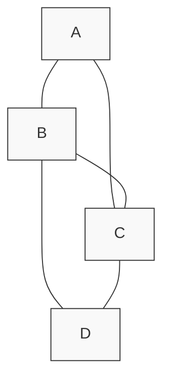
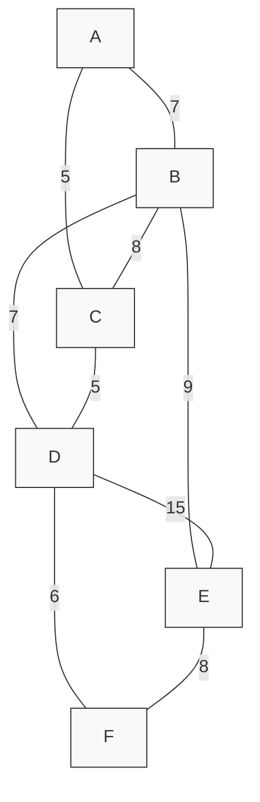

# Kruskal's Algorithm

## Introduction

When working with connected weighted graphs, one common problem is finding the **minimum spanning tree** (MST) - a subset of the edges that connects all vertices together with the minimum possible total edge weight, without creating any cycles. 

Kruskal's Algorithm, developed by Joseph Kruskal in 1956, offers an elegant and efficient solution to this problem using a greedy approach. It's particularly useful for applications like network design, circuit design, transportation planning, and clustering algorithms.

In this tutorial, we'll explore how Kruskal's Algorithm works, implement it in code, and look at practical applications.

## What is a Minimum Spanning Tree?

Before diving into the algorithm, let's clarify what a minimum spanning tree is:

- A **spanning tree** is a subset of edges that forms a tree (no cycles) and connects all vertices.
- A **minimum spanning tree** is a spanning tree where the sum of edge weights is minimized.

For any connected, undirected weighted graph, there may be several spanning trees. The minimum spanning tree is the one with the smallest total edge weight.



From the graph above, a minimum spanning tree would include only the edges needed to connect all vertices with the minimum total weight.

## How Kruskal's Algorithm Works

Kruskal's Algorithm follows these key steps:

1. Sort all the edges in non-decreasing order of their weight.
2. Initialize an empty result set for the MST.
3. For each edge in the sorted order:
   - If adding this edge doesn't form a cycle in the current result set, include it.
   - Otherwise, discard the edge.
4. Continue until the result set has (V-1) edges, where V is the number of vertices.

To check if adding an edge would create a cycle, we use a **disjoint-set data structure** (also known as Union-Find).

## Step-by-Step Implementation

Let's implement Kruskal's Algorithm in Python:

```python
class DisjointSet:
    def __init__(self, n):
        # Initialize each element as a separate set
        self.parent = list(range(n))
        self.rank = [0] * n
    
    def find(self, x):
        # Find the representative (root) of the set containing x
        if self.parent[x] != x:
            # Path compression: make the parent of x the root
            self.parent[x] = self.find(self.parent[x])
        return self.parent[x]
    
    def union(self, x, y):
        # Merge the sets containing x and y
        root_x = self.find(x)
        root_y = self.find(y)
        
        if root_x == root_y:
            return False  # Already in the same set
        
        # Union by rank: attach smaller rank tree under the root of higher rank tree
        if self.rank[root_x] < self.rank[root_y]:
            self.parent[root_x] = root_y
        elif self.rank[root_x] > self.rank[root_y]:
            self.parent[root_y] = root_x
        else:
            # Same rank, make one as root and increment its rank
            self.parent[root_y] = root_x
            self.rank[root_x] += 1
        
        return True  # Union successful

def kruskal_mst(graph, vertices):
    """
    Find the Minimum Spanning Tree using Kruskal's Algorithm
    
    Args:
        graph: List of edges in the format (u, v, weight)
        vertices: Number of vertices in the graph
        
    Returns:
        List of edges in the MST and the total weight
    """
    # Sort all edges in non-decreasing order of their weight
    graph.sort(key=lambda edge: edge[2])
    
    # Initialize disjoint set
    ds = DisjointSet(vertices)
    
    mst = []
    total_weight = 0
    
    # Process all edges
    for u, v, weight in graph:
        # Include this edge only if it doesn't form a cycle
        if ds.union(u, v):
            mst.append((u, v, weight))
            total_weight += weight
            
        # Stop when we have (vertices-1) edges
        if len(mst) == vertices - 1:
            break
    
    return mst, total_weight
```

## Example Usage

Let's work through an example to see how Kruskal's Algorithm works in practice:

```python
# Example graph represented as a list of edges: (from, to, weight)
graph = [
    (0, 1, 10),
    (0, 2, 6),
    (0, 3, 5),
    (1, 3, 15),
    (2, 3, 4)
]

# Number of vertices
vertices = 4

# Find MST using Kruskal's Algorithm
mst, total_weight = kruskal_mst(graph, vertices)

print("Edges in the Minimum Spanning Tree:")
for u, v, weight in mst:
    print(f"Edge ({u}, {v}) with weight {weight}")
print(f"Total weight of MST: {total_weight}")
```

### Output
```
Edges in the Minimum Spanning Tree:
Edge (2, 3) with weight 4
Edge (0, 3) with weight 5
Edge (0, 1) with weight 10
Total weight of MST: 19
```

## Visual Walkthrough

Let's visualize how Kruskal's Algorithm works on a sample graph:



1. Sort all edges by weight: (A-C: 5), (C-D: 5), (D-F: 6), (A-B: 7), (B-D: 7), (B-C: 8), (E-F: 8), (B-E: 9), (D-E: 15)
2. Process edges in sorted order:
   - Add (A-C: 5) to MST
   - Add (C-D: 5) to MST
   - Add (D-F: 6) to MST
   - Add (A-B: 7) to MST
   - Skip (B-D: 7) as it would create a cycle
   - Skip (B-C: 8) as it would create a cycle
   - Add (E-F: 8) to MST - this completes the MST as we've connected all vertices

## Time and Space Complexity

- **Time Complexity**: O(E log E) or O(E log V), where E is the number of edges and V is the number of vertices. This is dominated by the sorting step.
- **Space Complexity**: O(V + E) for storing the graph and disjoint-set data structure.

## Real-world Applications

Kruskal's Algorithm has many practical applications:

1. **Network Design**: When designing telecommunication networks, you want to minimize the total cost of connections while ensuring all locations are connected.

2. **Circuit Design**: In electrical engineering, finding minimum-cost wiring configurations.

3. **Transportation Planning**: Designing efficient road or railway networks that connect all cities with minimal construction costs.

4. **Clustering Algorithms**: In machine learning, it can be used as part of single-linkage clustering.

### Example: Network Infrastructure Planning

Imagine you're tasked with connecting six office buildings with network cables. The cost of laying cable between buildings varies based on distance and terrain. You want to ensure all buildings are connected while minimizing the total cost.

```python
# Buildings represented as vertices (0-5)
# Edges represent possible connections with their costs in thousands of dollars
network_links = [
    (0, 1, 10),  # Building 0 to Building 1 costs $10,000
    (0, 2, 6),
    (0, 3, 8),
    (1, 2, 12),
    (1, 4, 15),
    (2, 3, 5),
    (2, 4, 7),
    (3, 4, 9),
    (3, 5, 11),
    (4, 5, 8)
]

num_buildings = 6

mst, total_cost = kruskal_mst(network_links, num_buildings)

print("Optimal network connections:")
for u, v, cost in mst:
    print(f"Connect Building {u} to Building {v} - Cost: ${cost},000")
print(f"Total network cost: ${total_cost},000")
```

### Output
```
Optimal network connections:
Connect Building 2 to Building 3 - Cost: $5,000
Connect Building 0 to Building 2 - Cost: $6,000
Connect Building 2 to Building 4 - Cost: $7,000
Connect Building 4 to Building 5 - Cost: $8,000
Connect Building 0 to Building 1 - Cost: $10,000
Total network cost: $36,000
```

## Common Pitfalls and Optimization

1. **Forgetting to check for cycles**: The key part of Kruskal's Algorithm is avoiding cycles. Without proper cycle detection, you won't get a tree.

2. **Inefficient Union-Find**: A naive implementation of the disjoint-set data structure can lead to poor performance. Using "union by rank" and "path compression" optimizations (as shown in our code) significantly improves efficiency.

3. **Not handling disconnected graphs**: For disconnected graphs, Kruskal's Algorithm will produce a minimum spanning forest (a collection of MSTs, one for each connected component).

## Summary

Kruskal's Algorithm is a powerful and elegant solution for finding minimum spanning trees in connected weighted graphs. It employs a greedy strategy, always selecting the next lightest edge that doesn't form a cycle. The key insights are:

- Sort edges by weight and consider them in ascending order
- Use a disjoint-set data structure to efficiently detect cycles
- Build the MST by adding edges that don't create cycles
- Stop when you have (V-1) edges in the MST

The algorithm is efficient, with a time complexity of O(E log E), making it suitable for many real-world graph problems.

## Exercises

1. Implement Kruskal's Algorithm for an adjacency matrix representation of a graph.

2. Modify the algorithm to handle directed graphs.

3. Compare the performance of Kruskal's Algorithm with another MST algorithm, like Prim's Algorithm, for different graph densities.

4. Apply Kruskal's Algorithm to find the MST for a graph representing:
   - Roads connecting cities where weights are distances
   - Network connections where weights are bandwidth capacities
   - Social connections where weights represent interaction strengths

5. Extend the algorithm to find the maximum spanning tree (use negative weights or sort in descending order).

## Additional Resources

- **Disjoint-Set Data Structure**: Explore more about the Union-Find algorithm for efficient cycle detection.
- **Prim's Algorithm**: Another approach to solving the MST problem, which works differently from Kruskal's.
- **Graph Theory**: Deepen your understanding of graphs and trees.
- **Greedy Algorithms**: Study other greedy approaches for different problems.

Happy graph traversing! 🌳