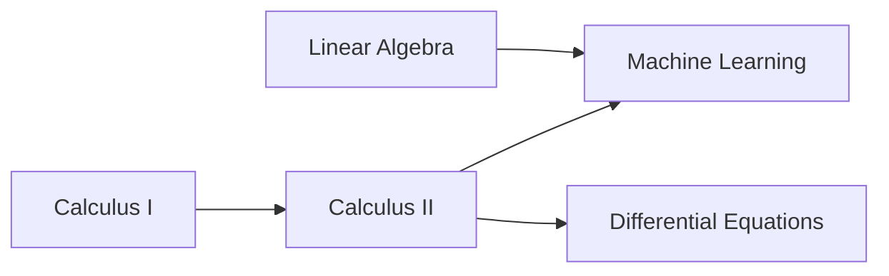

# Topological Sort

## Introduction

Topological sorting is an algorithm for ordering the vertices of a directed acyclic graph (DAG) in such a way that for every directed edge (u, v), vertex u comes before vertex v in the ordering. In simpler terms, it creates a linear sequence of vertices where each vertex appears before all the vertices it points to.

A topological sort is **only possible** if the graph has no directed cycles, meaning it must be a DAG. If a graph has a cycle, then no linear ordering is possible.


## Why Do We Need Topological Sort?

Topological sorting helps solve many real-world problems where we need to handle dependencies between tasks:

- **Task Scheduling**: When tasks have dependencies (some tasks must be completed before others can start)
- **Course Prerequisites**: Determining the order in which to take courses when some are prerequisites for others
- **Build Systems**: Managing dependencies between compilation units
- **Package Management**: Installing software packages in the correct order based on dependencies

## Understanding Topological Sort

Let's understand topological sort with a simple example:

Consider a graph representing course prerequisites:



In this graph, a valid topological sort would be:
- A (Calculus I)
- B (Linear Algebra)
- C (Calculus II)
- E (Differential Equations)
- D (Machine Learning)

Notice that each course appears before any course that depends on it.

## Algorithms for Topological Sorting

There are two main algorithms for topological sorting:

1. **Depth-First Search (DFS) Based Algorithm**
2. **Kahn's Algorithm** (using indegrees of vertices)

Let's explore both approaches.

### 1. DFS-Based Topological Sort

The DFS-based approach works by performing a depth-first search and adding vertices to the result in postorder (when all descendants have been processed).

#### Algorithm Steps:

1. Create a temporary stack to store the result
2. Create a visited array to keep track of visited vertices
3. For each unvisited vertex:
   - Call a recursive helper function that does the following:
     - Mark the current vertex as visited
     - Recursively call the helper function for all adjacent vertices
     - After all adjacent vertices are processed, push the current vertex to the stack
4. The contents of the stack, when read from top to bottom, give the topological sort

#### Implementation in Python:

```python
def topological_sort(graph):
    """
    Perform topological sort on a directed acyclic graph.
    
    Args:
        graph: Dictionary representing adjacency list of the graph
    
    Returns:
        List containing vertices in topologically sorted order
    """
    visited = set()
    temp_stack = []
    
    def dfs(vertex):
        visited.add(vertex)
        
        # Visit all the adjacent vertices
        if vertex in graph:
            for neighbor in graph[vertex]:
                if neighbor not in visited:
                    dfs(neighbor)
        
        # After all the descendants are visited, push the vertex
        temp_stack.append(vertex)
    
    # Visit all vertices
    for vertex in graph:
        if vertex not in visited:
            dfs(vertex)
    
    # Return reversed stack
    return temp_stack[::-1]

# Example usage
graph = {
    'A': ['C'],
    'B': ['D'],
    'C': ['D', 'E'],
    'D': [],
    'E': []
}

result = topological_sort(graph)
print("Topological Sort Order:", result)
```

**Output:**
```
Topological Sort Order: ['B', 'A', 'C', 'E', 'D']
```

### 2. Kahn's Algorithm (Using In-degrees)

Kahn's algorithm uses the concept of in-degree (the number of edges pointing to a vertex) to perform topological sorting.

#### Algorithm Steps:

1. Calculate in-degree for all vertices
2. Add all vertices with 0 in-degree to a queue
3. While the queue is not empty:
   - Remove a vertex from the queue and add it to the result
   - Reduce the in-degree of all its neighbors by 1
   - If any neighbor's in-degree becomes 0, add it to the queue
4. If all vertices are in the result, return it; otherwise, the graph has a cycle

#### Implementation in Python:

```python
from collections import defaultdict, deque

def kahns_topological_sort(graph):
    """
    Perform topological sort using Kahn's algorithm.
    
    Args:
        graph: Dictionary representing adjacency list of the graph
    
    Returns:
        List containing vertices in topologically sorted order,
        or empty list if graph has a cycle
    """
    # Create a dictionary to store indegrees of all vertices
    indegree = defaultdict(int)
    
    # Initialize all vertices with indegree 0
    for vertex in graph:
        if vertex not in indegree:
            indegree[vertex] = 0
    
    # Calculate indegree for each vertex
    for vertex in graph:
        for neighbor in graph[vertex]:
            indegree[neighbor] += 1
    
    # Create a queue and add all vertices with indegree 0
    queue = deque([vertex for vertex, degree in indegree.items() if degree == 0])
    
    # Initialize the result list
    result = []
    
    # Process vertices
    while queue:
        # Remove a vertex from the queue
        vertex = queue.popleft()
        result.append(vertex)
        
        # Reduce indegree of all neighbors
        if vertex in graph:
            for neighbor in graph[vertex]:
                indegree[neighbor] -= 1
                
                # If indegree becomes 0, add to queue
                if indegree[neighbor] == 0:
                    queue.append(neighbor)
    
    # Check if topological sort is possible
    if len(result) == len(indegree):
        return result
    else:
        return []  # Graph has at least one cycle

# Example usage
graph = {
    'A': ['C'],
    'B': ['D'],
    'C': ['D', 'E'],
    'D': [],
    'E': []
}

result = kahns_topological_sort(graph)
print("Topological Sort Order:", result)
```

**Output:**
```
Topological Sort Order: ['A', 'B', 'C', 'E', 'D']
```

## Time and Space Complexity

Both algorithms have the same time and space complexity:

- **Time Complexity**: O(V + E), where V is the number of vertices and E is the number of edges.
- **Space Complexity**: O(V), for storing the visited array, result, and recursion stack (for DFS) or queue (for Kahn's).

## Detecting Cycles

Both algorithms can be modified to detect cycles in a directed graph:

- In the DFS approach, we can maintain an additional "being processed" set and check if we visit a vertex that's already being processed.
- In Kahn's algorithm, if the final result doesn't contain all vertices, the graph has at least one cycle.

## Real-World Applications

### 1. Course Scheduling

Suppose you're registering for university courses, and each course has prerequisites:

```python
def can_finish_courses(num_courses, prerequisites):
    """
    Determine if it's possible to finish all courses given prerequisites.
    
    Args:
        num_courses: Number of courses
        prerequisites: List of [course, prerequisite] pairs
    
    Returns:
        True if all courses can be finished, False otherwise
    """
    # Build adjacency list
    graph = defaultdict(list)
    indegree = [0] * num_courses
    
    for course, prereq in prerequisites:
        graph[prereq].append(course)
        indegree[course] += 1
    
    # Add all courses with no prerequisites to the queue
    queue = deque([i for i in range(num_courses) if indegree[i] == 0])
    
    # Count courses that can be taken
    count = 0
    
    while queue:
        course = queue.popleft()
        count += 1
        
        for next_course in graph[course]:
            indegree[next_course] -= 1
            if indegree[next_course] == 0:
                queue.append(next_course)
    
    # If count equals number of courses, we can finish all courses
    return count == num_courses
```

### 2. Build System Dependency Resolution

In build systems like Make, we need to compile files in the correct order based on their dependencies:

```python
def build_order(projects, dependencies):
    """
    Find a valid build order for projects with dependencies.
    
    Args:
        projects: List of project names
        dependencies: List of [project, dependency] pairs
    
    Returns:
        List containing valid build order, or None if impossible
    """
    # Build the graph
    graph = {project: [] for project in projects}
    indegree = {project: 0 for project in projects}
    
    for project, dependency in dependencies:
        graph[dependency].append(project)
        indegree[project] += 1
    
    # Start with projects having no dependencies
    queue = deque([p for p, count in indegree.items() if count == 0])
    build_order = []
    
    while queue:
        project = queue.popleft()
        build_order.append(project)
        
        for dependent in graph[project]:
            indegree[dependent] -= 1
            if indegree[dependent] == 0:
                queue.append(dependent)
    
    # Check if all projects can be built
    if len(build_order) != len(projects):
        return None  # Circular dependency detected
    
    return build_order
```

### 3. Task Scheduling with Deadlines

When you have tasks with dependencies and deadlines, topological sort can help determine if all tasks can be completed in time:

```python
def schedule_tasks(tasks, dependencies, durations):
    """
    Schedule tasks based on dependencies and calculate earliest completion time.
    
    Args:
        tasks: List of task IDs
        dependencies: List of [task, dependency] pairs
        durations: Dictionary mapping task IDs to their durations
    
    Returns:
        Dictionary with earliest start times for each task, or None if impossible
    """
    # Build the graph
    graph = {task: [] for task in tasks}
    indegree = {task: 0 for task in tasks}
    
    for task, dependency in dependencies:
        graph[dependency].append(task)
        indegree[task] += 1
    
    # Start with tasks having no dependencies
    queue = deque([task for task, count in indegree.items() if count == 0])
    
    # Calculate earliest start time for each task
    earliest_start = {task: 0 for task in tasks}
    
    while queue:
        current_task = queue.popleft()
        
        # Calculate earliest start time for dependent tasks
        for dependent_task in graph[current_task]:
            # Dependent task can start after current task finishes
            new_start_time = earliest_start[current_task] + durations[current_task]
            earliest_start[dependent_task] = max(
                earliest_start[dependent_task],
                new_start_time
            )
            
            indegree[dependent_task] -= 1
            if indegree[dependent_task] == 0:
                queue.append(dependent_task)
    
    # Check if all tasks can be scheduled
    if any(indegree.values()):
        return None  # Circular dependency detected
    
    return earliest_start
```

## Common Pitfalls and Tips

1. **Always Check for Cycles**: Topological sort is only defined for DAGs. Always check if your graph has cycles before applying the algorithm.

2. **Multiple Valid Orderings**: A DAG can have multiple valid topological orderings. Don't assume there's only one correct answer.

3. **Empty Graph**: An empty graph is considered a DAG, and the topological sort is an empty list.

4. **Single Vertex**: A graph with a single vertex and no edges is a DAG, and the topological sort is just that vertex.

5. **Disconnected Components**: If your graph has disconnected components, remember that each component needs to be processed.

## Summary

Topological sorting is a powerful algorithm for ordering vertices in a directed acyclic graph. It has numerous practical applications in scheduling, dependency resolution, and compilation systems.

Key takeaways:
- Topological sort provides a linear ordering of vertices such that for every directed edge (u, v), vertex u comes before vertex v
- Two main approaches: DFS-based and Kahn's algorithm (using in-degrees)
- Only works on directed acyclic graphs (DAGs)
- Time complexity: O(V + E)
- Used in task scheduling, course prerequisites, build systems, etc.

## Exercises

1. Implement a function to check if a graph is a DAG using topological sort.

2. Modify the DFS topological sort algorithm to detect and report cycles in a graph.

3. Given a list of tasks with dependencies, find the minimum time to complete all tasks if multiple tasks can be done in parallel.

4. Implement a function that returns all possible topological orderings of a given DAG.

5. Apply topological sort to solve the "alien dictionary" problem: given a sorted dictionary of an alien language, find the order of characters in that language.

## Additional Resources

- [Topological Sort - GeeksforGeeks](https://www.geeksforgeeks.org/topological-sorting/)
- [Khan's Algorithm for Topological Sorting - GeeksforGeeks](https://www.geeksforgeeks.org/topological-sorting-indegree-based-solution/)
- [Introduction to Algorithms](https://mitpress.mit.edu/books/introduction-algorithms-third-edition) by Cormen, Leiserson, Rivest, and Stein (Section 22.4: Topological Sort)
- [Coursera - Algorithms specialization](https://www.coursera.org/specializations/algorithms) (Course 3: Graphs)

Happy coding!