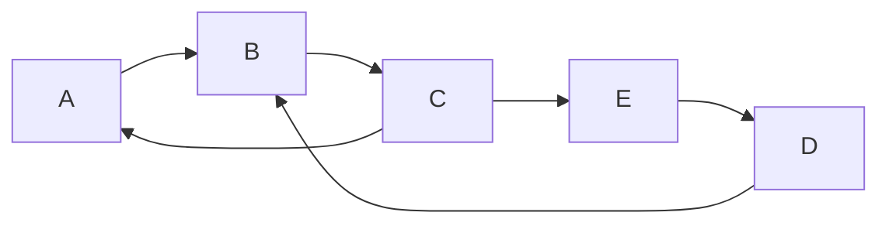

# Strongly Connected Components

## Introduction

When working with directed graphs, one of the fundamental properties we're often interested in is connectivity. A **Strongly Connected Component (SCC)** is a portion of a directed graph where every vertex is reachable from every other vertex. In other words, for any two vertices u and v in an SCC, there is a path from u to v and a path from v to u.

Understanding SCCs allows us to simplify complex directed graphs into more manageable components and is crucial for solving many real-world problems, from analyzing social networks to optimizing transportation systems.

## Basic Concepts

### Directed Graphs Review

Before diving into SCCs, let's quickly review directed graphs:

- A **directed graph** (or digraph) consists of vertices connected by directed edges
- Each edge has a direction, indicating a one-way relationship between vertices
- For any two vertices, they might be connected in one direction, both directions, or not at all



### Definition of Strongly Connected Components

A **Strongly Connected Component (SCC)** is a maximal subgraph of a directed graph where there is a directed path from any vertex to every other vertex within the component.

Key properties:
- Any vertex can reach any other vertex within the same SCC
- SCCs partition the graph (each vertex belongs to exactly one SCC)
- The SCCs form a directed acyclic graph (DAG) when each SCC is contracted to a single vertex

In the graph above, vertices A, B, and C form one SCC (as they all can reach each other), while D and E each form their own SCCs.

## Finding Strongly Connected Components

There are two main algorithms for finding SCCs in a graph:

1. **Kosaraju's Algorithm** - A simple two-pass algorithm using DFS
2. **Tarjan's Algorithm** - A more efficient one-pass algorithm

Let's explore both, starting with the more straightforward Kosaraju's Algorithm.

### Kosaraju's Algorithm

Kosaraju's Algorithm finds all SCCs in a directed graph in linear time O(V+E). The algorithm works in three steps:

1. Perform a DFS on the original graph and store the "finish times" of each vertex
2. Create the transpose of the graph (reverse all edges)
3. Perform a second DFS on the transposed graph, visiting vertices in decreasing order of finish time from step 1

Each DFS tree in step 3 corresponds to one strongly connected component.

Here's a step-by-step implementation:

```python
from collections import defaultdict

class Graph:
    def __init__(self, vertices):
        self.V = vertices
        self.graph = defaultdict(list)
        
    def add_edge(self, u, v):
        self.graph[u].append(v)
        
    def transpose(self):
        g = Graph(self.V)
        for i in self.graph:
            for j in self.graph[i]:
                g.add_edge(j, i)
        return g
    
    def dfs_first_pass(self, v, visited, stack):
        visited[v] = True
        
        for i in self.graph[v]:
            if not visited[i]:
                self.dfs_first_pass(i, visited, stack)
                
        stack.append(v)
    
    def dfs_second_pass(self, v, visited, component):
        visited[v] = True
        component.append(v)
        
        for i in self.graph[v]:
            if not visited[i]:
                self.dfs_second_pass(i, visited, component)
    
    def find_SCCs(self):
        stack = []
        visited = [False] * self.V
        
        # First DFS to fill the stack
        for i in range(self.V):
            if not visited[i]:
                self.dfs_first_pass(i, visited, stack)
        
        # Create transpose graph
        transpose = self.transpose()
        
        # Reset visited array
        visited = [False] * self.V
        
        # Process vertices in order defined by stack
        all_components = []
        while stack:
            v = stack.pop()
            if not visited[v]:
                component = []
                transpose.dfs_second_pass(v, visited, component)
                all_components.append(component)
        
        return all_components
```

Let's see how this works with an example:

```python
# Example usage
g = Graph(8)
g.add_edge(0, 1)
g.add_edge(1, 2)
g.add_edge(2, 0)
g.add_edge(2, 3)
g.add_edge(3, 4)
g.add_edge(4, 5)
g.add_edge(5, 3)
g.add_edge(6, 5)
g.add_edge(6, 7)
g.add_edge(7, 6)

sccs = g.find_SCCs()
print("Strongly Connected Components:")
for i, component in enumerate(sccs):
    print(f"Component {i+1}: {component}")
```

Output:
```
Strongly Connected Components:
Component 1: [0, 2, 1]
Component 2: [3, 5, 4]
Component 3: [6, 7]
```

### Tarjan's Algorithm

Tarjan's algorithm finds SCCs in a single DFS pass, making it more efficient in practice. It uses a clever tracking system with "discovery times" and "low-link values" to identify SCCs.

Here's how Tarjan's algorithm works:

```python
class Graph:
    def __init__(self, vertices):
        self.V = vertices
        self.graph = defaultdict(list)
        self.Time = 0
        
    def add_edge(self, u, v):
        self.graph[u].append(v)
        
    def tarjan_scc_util(self, u, low, disc, stackMember, st, sccs):
        disc[u] = self.Time
        low[u] = self.Time
        self.Time += 1
        stackMember[u] = True
        st.append(u)
        
        for v in self.graph[u]:
            if disc[v] == -1:  # If v is not visited
                self.tarjan_scc_util(v, low, disc, stackMember, st, sccs)
                low[u] = min(low[u], low[v])
            elif stackMember[v]:  # Update low value if v is in stack
                low[u] = min(low[u], disc[v])
        
        # Check if u is the head of an SCC
        w = -1
        if low[u] == disc[u]:
            component = []
            while w != u:
                w = st.pop()
                component.append(w)
                stackMember[w] = False
            sccs.append(component)
    
    def find_SCCs(self):
        disc = [-1] * self.V
        low = [-1] * self.V
        stackMember = [False] * self.V
        st = []
        sccs = []
        
        for i in range(self.V):
            if disc[i] == -1:
                self.tarjan_scc_util(i, low, disc, stackMember, st, sccs)
                
        return sccs
```

## Understanding the Algorithms

### Why These Algorithms Work

Both Kosaraju's and Tarjan's algorithms exploit fundamental properties of directed graphs:

1. **Kosaraju's Algorithm:**
   - The first DFS gives a finishing order that ensures we start from "sink" SCCs when doing the second DFS on the transposed graph
   - In a transposed graph, the directions are reversed, but SCCs remain the same
   - Starting DFS from the right order ensures each SCC is discovered completely

2. **Tarjan's Algorithm:**
   - It identifies "back edges" that form cycles
   - The low-link value represents the oldest (earliest discovered) vertex reachable from a given vertex
   - If a vertex's low-link value equals its discovery time, it's the root of an SCC

### Time Complexity

Both algorithms have a time complexity of O(V+E), where:
- V is the number of vertices
- E is the number of edges

This makes them efficient even for large graphs.

## Applications of SCCs

Strongly Connected Components have numerous practical applications:

### 1. Social Network Analysis

In social networks, SCCs can represent tightly connected communities. For example:
- Identifying groups where each member follows every other member
- Finding mutual connection clusters for recommendation systems

### 2. Website Structure Analysis

SCCs help analyze the structure of websites:
- Pages that link to each other form an SCC
- Understanding how information flows through a website
- Identifying isolated sections that need better integration

### 3. Transportation Networks

In transportation planning:
- SCCs identify regions where you can travel between any two points
- Helps in planning public transport routes
- Identifies areas needing better connectivity

### 4. Compiler Optimization

In compiler design:
- SCCs identify cyclic dependencies in variable definitions
- Help in register allocation
- Optimize data-flow analysis

### Example: Solving 2-SAT Problems

A practical application of SCCs is solving 2-SAT (Boolean satisfiability with 2 variables per clause) problems:

```python
def solve_2sat(n, clauses):
    # Build implication graph
    graph = Graph(2 * n)
    for clause in clauses:
        # For a clause (a or b), add implications (~a => b) and (~b => a)
        x, y = clause
        # Convert variables to graph indices
        not_x = x + n if x < 0 else x
        not_y = y + n if y < 0 else y
        x = abs(x) - 1
        y = abs(y) - 1
        
        # Add implication edges
        graph.add_edge(not_x, y)
        graph.add_edge(not_y, x)
    
    # Find SCCs
    sccs = graph.find_SCCs()
    
    # Check if any variable and its negation are in the same SCC
    # If so, the formula is unsatisfiable
    component_of = {}
    for i, component in enumerate(sccs):
        for vertex in component:
            component_of[vertex] = i
    
    for i in range(n):
        if component_of[i] == component_of[i + n]:
            return False  # Unsatisfiable
    
    return True  # Satisfiable
```

## Practical Implementation Tips

When implementing SCC algorithms, keep these tips in mind:

1. **Representing the Graph:**
   - Adjacency list is usually more efficient than adjacency matrix
   - For Kosaraju's algorithm, having both the graph and its transpose is helpful

2. **Memory Management:**
   - In Kosaraju's algorithm, you can reuse the visited array for both passes
   - In Tarjan's algorithm, keep track of stack membership efficiently

3. **Handling Large Graphs:**
   - For very large graphs, consider using more space-efficient data structures
   - Implement iterative versions to avoid stack overflow with deep recursion

4. **Testing:**
   - Test with small graphs where you know the expected SCCs
   - Include edge cases like self-loops and disconnected vertices

## Summary

Strongly Connected Components are a fundamental concept in graph theory with many practical applications. They allow us to decompose complex directed graphs into simpler components, making analysis and algorithm design more manageable.

In this guide, we've covered:
- What SCCs are and why they're important
- How to find SCCs using Kosaraju's algorithm and Tarjan's algorithm
- The intuition behind why these algorithms work
- Real-world applications of SCCs
- Practical implementation tips

Both Kosaraju's and Tarjan's algorithms provide efficient ways to find SCCs, with Kosaraju's being conceptually simpler and Tarjan's being more efficient in practice.

## Exercises

1. Implement Kosaraju's algorithm and find the SCCs in the following graph:
   ```
   0 → 1 → 2 ← 3
   ↑   ↓   ↓   ↑
   7 ← 6 ← 5 ← 4
   ```

2. Modify the Tarjan's algorithm implementation to count the number of SCCs without storing them.

3. Given a directed graph, determine if it is strongly connected (i.e., consists of a single SCC).

4. Implement an algorithm to find the "condensation graph" where each SCC is contracted to a single vertex.

5. Use SCCs to solve the 2-SAT problem for the formula: (x₁ ∨ x₂) ∧ (¬x₁ ∨ x₃) ∧ (¬x₂ ∨ ¬x₃).

## Additional Resources

- [Introduction to Algorithms](https://mitpress.mit.edu/books/introduction-algorithms-third-edition) by Cormen, Leiserson, Rivest, and Stein covers SCCs in detail
- Stanford's [Graph Algorithms](https://www.coursera.org/learn/algorithms-graphs-data-structures) course on Coursera
- The [DFS and Connected Components](https://cp-algorithms.com/graph/depth-first-search.html) chapter on CP-Algorithms
- [Visualgo](https://visualgo.net/en/dfsbfs) for visualizing graph algorithms

With these concepts and implementations, you'll be well-equipped to tackle problems involving directed graphs and their connectivity properties.