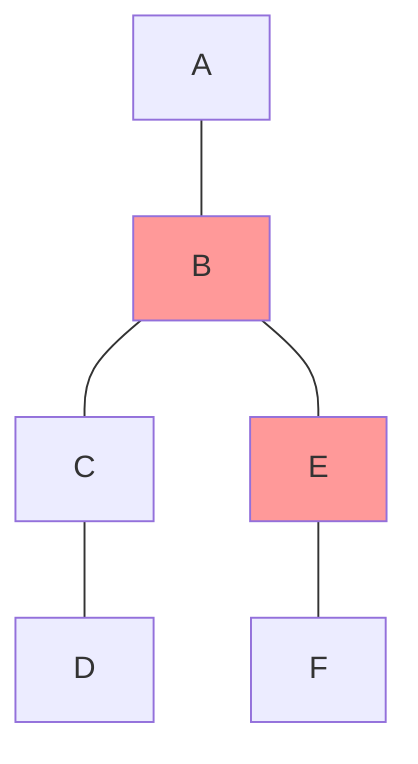
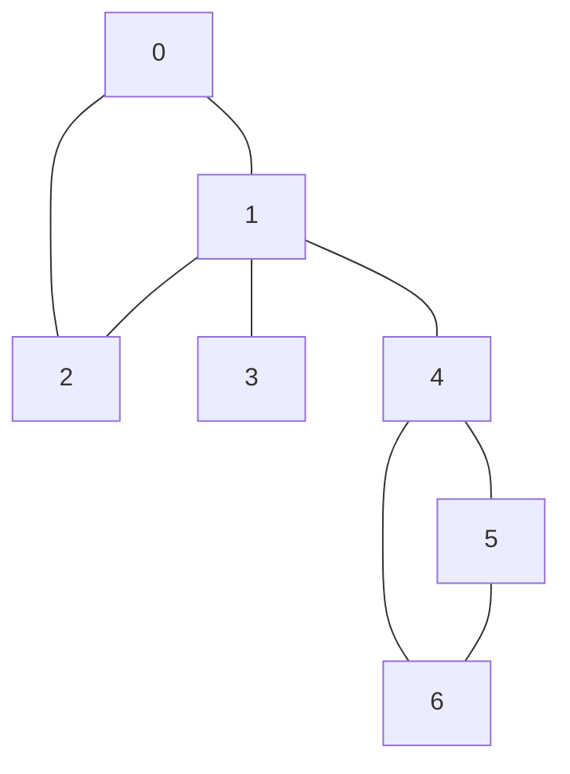
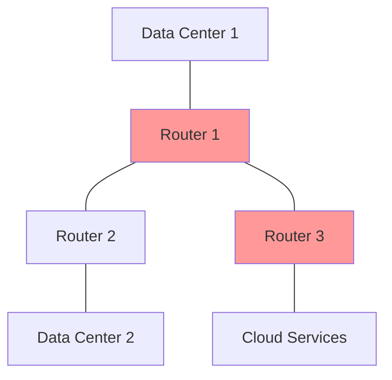
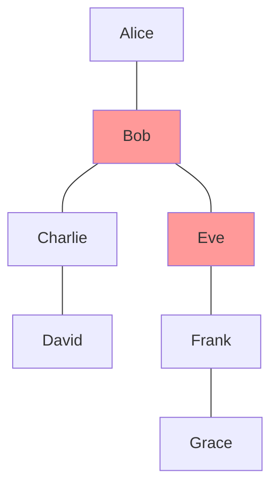
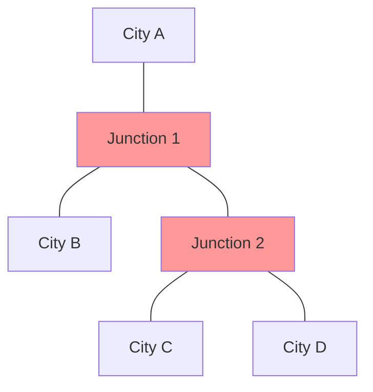

# Articulation Points

## Introduction

In a connected graph, some vertices play a crucial role in maintaining the graph's connectivity. These special vertices are called **articulation points** (also known as cut vertices). An articulation point is a vertex that, when removed along with its associated edges, increases the number of connected components in the graph.

In simpler terms, if removing a vertex splits the graph into two or more disconnected parts, that vertex is an articulation point.



In the graph above, vertices B and E are articulation points. Removing either would disconnect the graph.

## Why Articulation Points Matter

Articulation points are critical in many real-world scenarios:

1. **Network Reliability**: They represent single points of failure in networks.
2. **Infrastructure Planning**: Help identify vulnerable nodes in transportation systems.
3. **Social Network Analysis**: Identify key individuals who connect different communities.
4. **System Design**: Critical for designing robust, fault-tolerant systems.

## Finding Articulation Points

We can identify articulation points using a modified Depth-First Search (DFS) algorithm. The key insight is to track:

1. **Discovery Time**: When a vertex is first visited in DFS
2. **Low Value**: The earliest discovered vertex reachable from the subtree rooted at the current vertex

### The Algorithm Steps

1. Start DFS from any vertex in the graph
2. For each vertex, track its discovery time and lowest reachable vertex
3. A vertex is an articulation point if either:
   - It's the root of the DFS tree and has more than one child
   - It's not the root, and there exists a child such that no vertex in the child's subtree has a back edge to an ancestor of the current vertex

Let's implement this algorithm:

```java
import java.util.*;

class Graph {
    private int V; // Number of vertices
    private LinkedList<Integer>[] adj; // Adjacency list representation
    private int time = 0;
    
    public Graph(int v) {
        V = v;
        adj = new LinkedList[v];
        for (int i = 0; i < v; ++i)
            adj[i] = new LinkedList<>();
    }
    
    public void addEdge(int v, int w) {
        adj[v].add(w);
        adj[w].add(v); // Undirected graph
    }
    
    // Function to find articulation points
    public void findArticulationPoints() {
        boolean[] visited = new boolean[V];
        int[] disc = new int[V]; // Discovery times
        int[] low = new int[V]; // Earliest visited vertex
        boolean[] isArticulationPoint = new boolean[V];
        int[] parent = new int[V];
        
        // Initialize parent and visited arrays
        for (int i = 0; i < V; i++) {
            parent[i] = -1;
            visited[i] = false;
        }
        
        // Call the recursive helper function for DFS
        for (int i = 0; i < V; i++)
            if (!visited[i])
                APUtil(i, visited, disc, low, parent, isArticulationPoint);
        
        // Print articulation points
        System.out.println("Articulation points in the graph:");
        for (int i = 0; i < V; i++)
            if (isArticulationPoint[i])
                System.out.print(i + " ");
    }
    
    private void APUtil(int u, boolean[] visited, int[] disc, int[] low, int[] parent, boolean[] isArticulationPoint) {
        // Count of children in DFS tree
        int children = 0;
        
        // Mark the current node as visited
        visited[u] = true;
        
        // Initialize discovery time and low value
        disc[u] = low[u] = ++time;
        
        // Go through all vertices adjacent to this
        for (Integer v : adj[u]) {
            // If v is not visited yet, then make it a child of u in DFS tree and recur
            if (!visited[v]) {
                children++;
                parent[v] = u;
                
                APUtil(v, visited, disc, low, parent, isArticulationPoint);
                
                // Check if the subtree rooted with v has a connection to one of the ancestors of u
                low[u] = Math.min(low[u], low[v]);
                
                // u is an articulation point in following cases:
                // (1) u is root of DFS tree and has two or more children
                if (parent[u] == -1 && children > 1)
                    isArticulationPoint[u] = true;
                
                // (2) If u is not root and low value of one of its children is more than or equal to discovery value of u
                if (parent[u] != -1 && low[v] >= disc[u])
                    isArticulationPoint[u] = true;
            }
            // Update low value of u for parent function calls
            else if (v != parent[u])
                low[u] = Math.min(low[u], disc[v]);
        }
    }
}
```

Let's see how this works with an example:

```java
public class ArticulationPointExample {
    public static void main(String[] args) {
        // Create a graph with 7 vertices
        Graph g = new Graph(7);
        
        // Add edges
        g.addEdge(0, 1);
        g.addEdge(1, 2);
        g.addEdge(2, 0);
        g.addEdge(1, 3);
        g.addEdge(1, 4);
        g.addEdge(4, 5);
        g.addEdge(5, 6);
        g.addEdge(6, 4);
        
        // Find and print articulation points
        g.findArticulationPoints();
    }
}
```

Output:
```
Articulation points in the graph:
1 4
```

## Time and Space Complexity

- **Time Complexity**: O(V + E), where V is the number of vertices and E is the number of edges
- **Space Complexity**: O(V) for the visited array, discovery time array, and low value array

## Step-by-Step Visualization

Let's walk through a simple example to understand how we identify articulation points:



1. Start DFS from vertex 0:
   - Set discovery time of 0 as 1, low value as 1
   - Visit vertex 1 (neighbor of 0)
   
2. For vertex 1:
   - Set discovery time of 1 as 2, low value as 2
   - Visit vertex 2 (neighbor of 1)
   
3. For vertex 2:
   - Set discovery time of 2 as 3, low value as 3
   - Visit vertex 0 (neighbor of 2)
   - Since 0 is already visited and is not the parent of 2, update low value of 2 to min(3, 1) = 1
   - Return to vertex 1
   
4. Back at vertex 1:
   - Update low value of 1 to min(2, 1) = 1
   - Visit vertex 3 (another neighbor of 1)
   
5. For vertex 3:
   - Set discovery time of 3 as 4, low value as 4
   - Return to vertex 1 (no more neighbors for 3)
   - Check if 1 is an articulation point for child 3: low[3] = 4 > disc[1] = 2, so 1 is an articulation point
   
6. Continue with the remaining vertices...

When complete, vertices 1 and 4 are identified as articulation points.

## Real-World Applications

### 1. Network Infrastructure

Imagine a computer network where some nodes are connecting different segments:



Routers 1 and 3 are articulation points. If either fails, some parts of the network become unreachable from others. Network administrators must ensure redundant connections to avoid such single points of failure.

### 2. Social Network Analysis

In a social network, articulation points represent individuals who connect otherwise separate communities:



Bob and Eve are articulation points, connecting different social circles. Removing them would fragment the social network.

### 3. Transportation Systems

In road networks, some intersections are critical for connectivity between regions:



Junctions 1 and 2 are articulation points in this transportation network. If either becomes unusable (due to construction or accidents), certain cities would be isolated.

## Summary

Articulation points are vertices in a graph that, when removed, increase the number of connected components. They represent critical vulnerabilities in networks and systems.

Key takeaways:
- Articulation points can be found in O(V+E) time using a modified DFS algorithm
- They help identify single points of failure in networks
- In many real-world applications, we want to avoid having articulation points or ensure backup systems are in place

## Additional Resources and Exercises

### Exercises

1. Implement the articulation points algorithm for a directed graph.
2. Modify the algorithm to count the number of connected components that would result from removing each articulation point.
3. Given a graph, suggest the minimum number of edges to add to eliminate all articulation points.

### Practice Problems

1. Find articulation points in a graph representing a computer network, and suggest where to add redundant connections.
2. Analyze a real social network dataset to identify key individuals who connect different communities.
3. Design an algorithm that, given a graph with weighted edges, finds the articulation point whose removal would cause the maximum disruption.

### Further Reading

- Tarjan's algorithm for finding biconnected components
- Bridge edges in graphs (edges that, when removed, increase the number of connected components)
- Network reliability and fault-tolerance in system design

By understanding articulation points, you'll gain valuable insights into graph structure and improve your ability to design robust systems and networks.