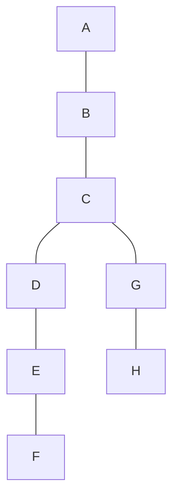
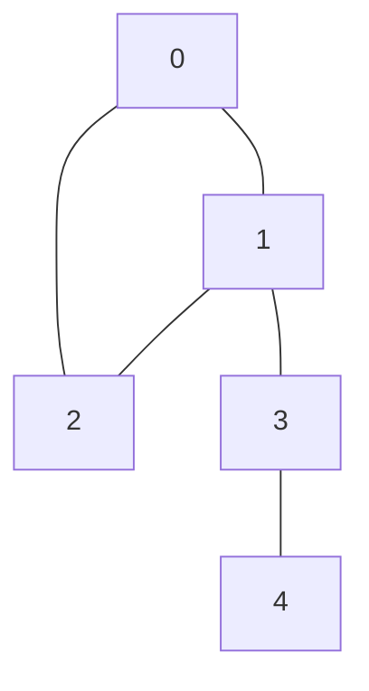
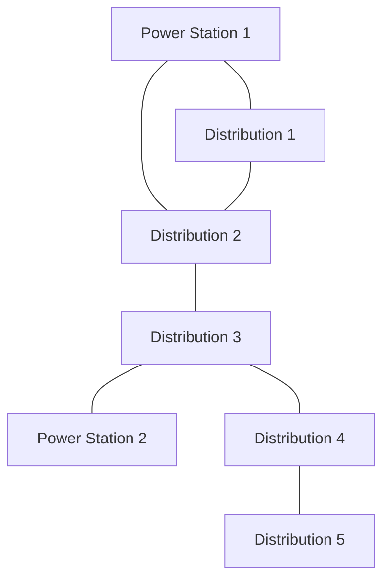

# Bridges in Graphs

## Introduction

In the world of graph theory, certain edges carry more significance than others. **Bridges** (also known as cut edges or critical connections) are one such special type of edge that, when removed, increases the number of connected components in a graph. In simpler terms, a bridge is an edge whose deletion breaks a connected graph into two separate components.

Understanding bridges is crucial in many real-world scenarios: network reliability, transportation systems, and even social network analysis. In this tutorial, we'll explore what bridges are, how to identify them, and their applications in solving real-world problems.

## What is a Bridge?

A bridge in a graph is an edge that, if removed, would disconnect the graph or increase the number of connected components in the graph.

Let's visualize this with a simple example:



In this graph, the edges B-C, C-G, and G-H are bridges. If we remove any of these edges, the graph would be separated into two disconnected components.

### Key Properties of Bridges

1. A bridge is always part of every path between certain pairs of vertices
2. A bridge is never part of a cycle
3. Removing a bridge increases the number of connected components

## Finding Bridges: The Naive Approach

A straightforward way to find bridges would be to:
1. Remove each edge one by one
2. Check if the graph becomes disconnected
3. If yes, the edge is a bridge

Let's implement this in pseudocode:

```
function findBridges(Graph G):
    bridges = empty list
    
    for each edge (u, v) in G:
        remove edge (u, v) from G
        if G becomes disconnected:
            add (u, v) to bridges
        add edge (u, v) back to G
    
    return bridges
```

This approach works but is inefficient with a time complexity of O(E × (V+E)), where E is the number of edges and V is the number of vertices.

## Finding Bridges Efficiently: Tarjan's Algorithm

Tarjan's algorithm uses Depth-First Search (DFS) to find bridges in O(V+E) time. The key insight is to use two values for each vertex:

1. **Discovery time (disc)**: The order in which vertices are visited during DFS
2. **Low value (low)**: The earliest discovery time that can be reached from the vertex through back edges

Here's how the algorithm works:

```
function findBridges(Graph G):
    time = 0
    disc[v] = -1 for all vertices v (not visited)
    low[v] = -1 for all vertices v 
    bridges = empty list
    
    for each vertex v in G:
        if disc[v] == -1:
            dfs(G, v, -1, time, disc, low, bridges)
    
    return bridges

function dfs(Graph G, vertex u, parent p, time, disc, low, bridges):
    disc[u] = time
    low[u] = time
    time = time + 1
    
    for each neighbor v of u:
        if v == p:
            continue  // Skip parent
        
        if disc[v] == -1:  // If v is not visited
            dfs(G, v, u, time, disc, low, bridges)
            low[u] = min(low[u], low[v])
            
            if low[v] > disc[u]:
                bridges.add(u, v)
        else:
            low[u] = min(low[u], disc[v])
```

Let's implement this in actual code:

```java
import java.util.*;

class Graph {
    private int V;  // Number of vertices
    private LinkedList<Integer>[] adj;  // Adjacency list

    // Constructor
    Graph(int v) {
        V = v;
        adj = new LinkedList[v];
        for (int i = 0; i < v; ++i)
            adj[i] = new LinkedList<>();
    }

    // Add edge to undirected graph
    void addEdge(int u, int v) {
        adj[u].add(v);
        adj[v].add(u);
    }

    // DFS based function to find bridges
    void bridgeUtil(int u, boolean[] visited, int[] disc, int[] low, 
                    int[] parent, List<int[]> bridges) {
        
        // Static variable to keep track of discovery time
        int time = 0;
        
        // Mark current node as visited
        visited[u] = true;
        
        // Initialize discovery time and low value
        disc[u] = low[u] = ++time;
        
        // Go through all neighbors
        for (int v : adj[u]) {
            // If v is not visited yet, make it a child of u in DFS tree and recur
            if (!visited[v]) {
                parent[v] = u;
                bridgeUtil(v, visited, disc, low, parent, bridges);
                
                // Check if the subtree rooted with v has a connection to
                // one of the ancestors of u
                low[u] = Math.min(low[u], low[v]);
                
                // If the lowest vertex reachable from subtree under v is
                // below u in DFS tree, then (u,v) is a bridge
                if (low[v] > disc[u]) {
                    bridges.add(new int[]{u, v});
                }
            }
            // Update low value of u for parent function calls
            else if (v != parent[u]) {
                low[u] = Math.min(low[u], disc[v]);
            }
        }
    }
    
    // Find bridges in the graph
    List<int[]> findBridges() {
        boolean[] visited = new boolean[V];
        int[] disc = new int[V];
        int[] low = new int[V];
        int[] parent = new int[V];
        List<int[]> bridges = new ArrayList<>();
        
        // Initialize parent and visited arrays
        for (int i = 0; i < V; i++) {
            parent[i] = -1;
            visited[i] = false;
        }
        
        // Call the recursive helper function to find bridges
        // for all unvisited vertices
        for (int i = 0; i < V; i++) {
            if (!visited[i]) {
                bridgeUtil(i, visited, disc, low, parent, bridges);
            }
        }
        
        return bridges;
    }
}
```

## Step-by-Step Example

Let's work through a simple example to understand how the algorithm identifies bridges:



1. Start DFS from vertex 0:
   - disc[0] = low[0] = 1
   - Visit neighbor 1:
     - disc[1] = low[1] = 2
     - Visit neighbor 2:
       - disc[2] = low[2] = 3
       - Visit neighbor 0 (already visited):
         - low[2] = min(low[2], disc[0]) = min(3, 1) = 1
     - Visit neighbor 3:
       - disc[3] = low[3] = 4
       - Visit neighbor 4:
         - disc[4] = low[4] = 5
         - No more neighbors for 4
         - Since low[4] (5) > disc[3] (4), edge (3,4) is a bridge
       - low[1] = min(low[1], low[3]) = min(2, 4) = 2
     - low[0] = min(low[0], low[1]) = min(1, 1) = 1

After the algorithm completes, it identifies (3,4) as the only bridge in the graph.

## Input and Output Example

Let's demonstrate the bridge-finding algorithm with some input and output:

**Input:**
```
Number of vertices: 5
Edges: (0,1), (1,2), (2,0), (1,3), (3,4)
```

**Output:**
```
Bridges in the graph:
3 - 4
```

## Practical Applications of Bridges

Understanding bridges has numerous real-world applications:

### 1. Network Reliability

In computer networks, bridges represent vulnerable connections. If a bridge fails, parts of the network become disconnected. Network designers use this knowledge to:
- Add redundant connections to eliminate bridges
- Prioritize monitoring and maintenance of bridge connections
- Plan network expansion to increase reliability

### 2. Transportation Systems

In transportation networks (roads, railways, flights):
- Bridges identify critical routes that, if closed, would significantly disrupt travel
- City planners use this information to build alternative routes
- Emergency services can prepare contingency plans for when these critical connections are unavailable

### 3. Social Network Analysis

In social networks:
- Bridges connect otherwise separate communities
- Identifying these connections helps understand information flow between groups
- Marketing strategies can target individuals at these bridging positions to maximize reach

### Example: Critical Infrastructure Analysis

Consider a city's power grid represented as a graph where:
- Vertices are power stations and distribution points
- Edges are transmission lines



By finding bridges in this graph, city planners can:
1. Identify the most vulnerable connections (D2-D3 and D3-D4 are bridges)
2. Prioritize maintenance and security for these critical lines
3. Plan redundancy measures to improve system reliability

## Optimizations and Variations

### Biconnected Components

A graph is biconnected if it remains connected after removing any single vertex. Bridges are closely related to biconnectivity - a graph with no bridges is not necessarily biconnected, but a biconnected graph never has bridges.

### Edge Biconnectivity

A graph is edge-biconnected if it remains connected after removing any single edge - which means it has no bridges.

### Finding Articulation Points

Articulation points (or cut vertices) are vertices that, when removed, increase the number of connected components. The algorithm to find articulation points is very similar to the bridge-finding algorithm.

## Summary

In this tutorial, we've explored the concept of bridges in graphs:

- A bridge is an edge whose removal increases the number of connected components
- Bridges can be found efficiently using Tarjan's algorithm with O(V+E) time complexity
- Bridges have important applications in network reliability, transportation systems, and social network analysis

Understanding bridges is essential for designing robust systems and analyzing existing networks for vulnerabilities. The algorithms we discussed provide efficient ways to identify these critical connections in various practical scenarios.

## Exercises

1. Implement the bridge finding algorithm in your preferred programming language
2. Modify the algorithm to also find articulation points
3. Analyze a small social network to find bridges between communities
4. Implement an algorithm to make a graph bridge-less by adding the minimum number of edges
5. Explore how to use the concept of bridges to improve the reliability of a computer network

## Additional Resources

- "Introduction to Algorithms" by Cormen, Leiserson, Rivest, and Stein (Chapter on Graph Algorithms)
- "Algorithms in C++ Part 5: Graph Algorithms" by Robert Sedgewick
- [Stanford's CS Theory course notes on Graph Connectivity](https://cs.stanford.edu)
- Online practice problems on competitive programming platforms like LeetCode ("Critical Connections in a Network") and CodeForces

Happy coding!