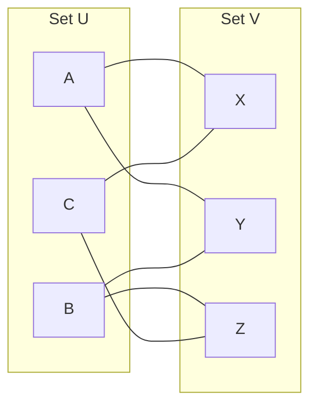

# Bipartite Graphs

## Introduction

Bipartite graphs are a special class of graphs that have numerous applications in computer science, mathematics, and real-world scenarios. The word "bipartite" gives us a hint about their structure - "bi" meaning two and "partite" referring to parts. As the name suggests, a bipartite graph can be divided into two distinct sets of vertices where connections (edges) only exist between vertices from different sets, never within the same set.

In this tutorial, you'll learn:
- What bipartite graphs are and their properties
- How to check if a graph is bipartite
- Common algorithms for working with bipartite graphs
- Real-world applications of bipartite graphs

## What is a Bipartite Graph?

A bipartite graph is a graph whose vertices can be divided into two disjoint sets U and V, such that every edge connects a vertex in U to a vertex in V. In other words, there is no edge that connects vertices of the same set.

Let's visualize this:



In this example, we have two sets: U = `{A, B, C}` and V = `{X, Y, Z}`. Notice that all edges connect a vertex from set U to a vertex from set V. There are no edges between vertices within set U or within set V.

### Key Properties of Bipartite Graphs:

1. The vertices can be divided into two disjoint sets.
2. Each edge connects vertices from different sets.
3. No edge connects vertices within the same set.
4. Bipartite graphs cannot contain odd-length cycles (cycles with an odd number of edges).
5. A graph is bipartite if and only if it is 2-colorable. This means we can color all vertices using only 2 colors such that no adjacent vertices have the same color.

## Checking if a Graph is Bipartite

There are multiple ways to determine if a graph is bipartite:

1. Using a two-coloring approach
2. Using Breadth-First Search (BFS)
3. Using Depth-First Search (DFS)

Let's implement the BFS approach, as it's intuitive and efficient:

```java
import java.util.*;

public class BipartiteGraph {
    private int V; // Number of vertices
    private List<List<Integer>> adj; // Adjacency list

    public BipartiteGraph(int v) {
        V = v;
        adj = new ArrayList<>(v);
        for (int i = 0; i < v; i++) {
            adj.add(new ArrayList<>());
        }
    }

    // Add an edge to the graph
    public void addEdge(int u, int v) {
        adj.get(u).add(v);
        adj.get(v).add(u); // For undirected graphs
    }

    // Check if graph is bipartite using BFS
    public boolean isBipartite() {
        // Create a color array to store colors assigned to all vertices
        int[] color = new int[V];
        
        // Initialize all vertices as uncolored (-1)
        Arrays.fill(color, -1);

        // Start BFS from the first vertex
        for (int start = 0; start < V; start++) {
            // If not colored, start BFS from this vertex
            if (color[start] == -1) {
                // Assign first color (0)
                color[start] = 0;

                // Create a queue for BFS
                Queue<Integer> queue = new LinkedList<>();
                queue.add(start);

                // Process all vertices in BFS manner
                while (!queue.isEmpty()) {
                    int u = queue.poll();

                    // Check all adjacent vertices
                    for (int v : adj.get(u)) {
                        // If the adjacent vertex is not colored
                        if (color[v] == -1) {
                            // Assign alternate color to this adjacent
                            color[v] = 1 - color[u];
                            queue.add(v);
                        }
                        // If the adjacent vertex has the same color
                        else if (color[v] == color[u]) {
                            return false; // Graph is not bipartite
                        }
                    }
                }
            }
        }
        
        // If all vertices are colored without any conflict
        return true;
    }
}
```

Let's test this with an example:

```java
public static void main(String[] args) {
    // Example 1: A bipartite graph
    BipartiteGraph g1 = new BipartiteGraph(4);
    g1.addEdge(0, 1);
    g1.addEdge(1, 2);
    g1.addEdge(2, 3);
    g1.addEdge(3, 0);
    
    if (g1.isBipartite())
        System.out.println("Graph is Bipartite");
    else
        System.out.println("Graph is not Bipartite");
    
    // Example 2: A non-bipartite graph
    BipartiteGraph g2 = new BipartiteGraph(3);
    g2.addEdge(0, 1);
    g2.addEdge(1, 2);
    g2.addEdge(2, 0);
    
    if (g2.isBipartite())
        System.out.println("Graph is Bipartite");
    else
        System.out.println("Graph is not Bipartite");
}
```

Output:
```
Graph is Bipartite
Graph is not Bipartite
```

In Example 1, the graph is a cycle with 4 vertices, which is bipartite because we can divide the vertices into two sets: {0, 2} and {1, 3}.

In Example 2, the graph is a cycle with 3 vertices, which is not bipartite because it contains an odd-length cycle. We cannot divide the vertices into two sets where edges only connect vertices from different sets.

## Maximum Bipartite Matching

One important algorithm related to bipartite graphs is finding the maximum bipartite matching. A matching in a graph is a set of edges that do not share any vertices. A maximum matching is a matching with the largest possible number of edges.

This has numerous real-world applications, such as job assignments, resource allocation, and network flows.

Here's an implementation using the Ford-Fulkerson algorithm (a simplified version known as the Hungarian algorithm for bipartite matching):

```java
public class BipartiteMatching {
    private int leftSet; // Number of vertices in left set
    private int rightSet; // Number of vertices in right set
    private List<List<Integer>> adj; // Adjacency list
    private int[] match; // Stores the matching vertex for each vertex in right set
    private boolean[] visited; // For DFS

    public BipartiteMatching(int left, int right) {
        leftSet = left;
        rightSet = right;
        adj = new ArrayList<>(left);
        for (int i = 0; i < left; i++) {
            adj.add(new ArrayList<>());
        }
        match = new int[right];
        Arrays.fill(match, -1);
        visited = new boolean[left];
    }

    // Add an edge from left to right set
    public void addEdge(int u, int v) {
        adj.get(u).add(v);
    }

    // Find maximum matching
    public int maxBipartiteMatching() {
        int result = 0;
        
        for (int u = 0; u < leftSet; u++) {
            Arrays.fill(visited, false);
            if (dfs(u)) {
                result++;
            }
        }
        
        return result;
    }
    
    // DFS to find an augmenting path
    private boolean dfs(int u) {
        visited[u] = true;
        
        for (int v : adj.get(u)) {
            // If the vertex in right set is not matched or 
            // recursively assigned matching is possible
            if (match[v] == -1 || (!visited[match[v]] && dfs(match[v]))) {
                match[v] = u;
                return true;
            }
        }
        
        return false;
    }
    
    // Print the matches
    public void printMatching() {
        System.out.println("Matches from left set to right set:");
        for (int i = 0; i < rightSet; i++) {
            if (match[i] != -1) {
                System.out.println("Right vertex " + i + " is matched with left vertex " + match[i]);
            }
        }
    }
}
```

Example usage:

```java
public static void main(String[] args) {
    // Example of job assignment
    int workers = 4;  // Left set (Workers)
    int jobs = 4;     // Right set (Jobs)
    
    BipartiteMatching bm = new BipartiteMatching(workers, jobs);
    
    // Worker 0 can do jobs 0, 1
    bm.addEdge(0, 0);
    bm.addEdge(0, 1);
    
    // Worker 1 can do job 1
    bm.addEdge(1, 1);
    
    // Worker 2 can do jobs 0, 2
    bm.addEdge(2, 0);
    bm.addEdge(2, 2);
    
    // Worker 3 can do jobs 2, 3
    bm.addEdge(3, 2);
    bm.addEdge(3, 3);
    
    int maxMatching = bm.maxBipartiteMatching();
    System.out.println("Maximum number of workers that can be assigned jobs: " + maxMatching);
    bm.printMatching();
}
```

Output:
```
Maximum number of workers that can be assigned jobs: 4
Matches from left set to right set:
Right vertex 0 is matched with left vertex 2
Right vertex 1 is matched with left vertex 0
Right vertex 2 is matched with left vertex 3
Right vertex 3 is matched with left vertex 3
```

## Real-World Applications of Bipartite Graphs

Bipartite graphs have many practical applications:

### 1. Assignment Problems

In many scenarios, we need to assign resources to tasks where each resource can be assigned to specific tasks only. This can be modeled as a bipartite matching problem:

- Workers (left set) assigned to jobs (right set)
- Students assigned to dormitory rooms
- Doctors assigned to patients

### 2. Network Flow Problems

Many network flow problems can be modeled using bipartite graphs:

- Transportation networks where goods move from sources to destinations
- Communication networks where messages flow between senders and receivers

### 3. Recommendation Systems

Bipartite graphs are used in recommendation systems:

- Users (left set) and items (right set) with edges representing user preferences
- Based on this graph structure, recommendations can be made by finding similar users or items

### 4. Scheduling

Course scheduling, exam scheduling, and similar problems often use bipartite graph models:

- Courses (left set) and time slots (right set)
- Teachers (left set) and classes (right set)

### 5. Online Matching

Real-time ad auctions, ride-sharing allocations, and other online platforms use bipartite matching algorithms:

- Advertisers (left set) matched to ad slots (right set)
- Drivers (left set) matched to riders (right set)

## Example: Course Scheduling

Let's consider a concrete example of scheduling university courses to classrooms. Some courses require specific facilities that are only available in certain classrooms.

```java
public static void main(String[] args) {
    // 5 courses and 4 classrooms
    BipartiteMatching scheduler = new BipartiteMatching(5, 4);
    
    // Course 0 can be held in classroom 0 and 1
    scheduler.addEdge(0, 0);
    scheduler.addEdge(0, 1);
    
    // Course 1 can be held in classroom 0 and 2
    scheduler.addEdge(1, 0);
    scheduler.addEdge(1, 2);
    
    // Course 2 can be held in classroom 1 and 3
    scheduler.addEdge(2, 1);
    scheduler.addEdge(2, 3);
    
    // Course 3 can be held in classroom 0
    scheduler.addEdge(3, 0);
    
    // Course 4 can be held in classroom 2 and 3
    scheduler.addEdge(4, 2);
    scheduler.addEdge(4, 3);
    
    int maxScheduled = scheduler.maxBipartiteMatching();
    System.out.println("Maximum number of courses that can be scheduled: " + maxScheduled);
    scheduler.printMatching();
}
```

Output:
```
Maximum number of courses that can be scheduled: 4
Course assignments:
Classroom 0 is assigned to Course 3
Classroom 1 is assigned to Course 0
Classroom 2 is assigned to Course 4
Classroom 3 is assigned to Course 2
```

This shows that we can schedule at most 4 courses simultaneously, with Course 1 not being assigned a classroom.

## Summary

Bipartite graphs are a fundamental concept in graph theory with numerous practical applications. In this tutorial, we've learned:

- What bipartite graphs are: graphs whose vertices can be divided into two disjoint sets with edges only between the sets
- How to check if a graph is bipartite using BFS or DFS
- The concept of maximum bipartite matching and how to implement it
- Real-world applications including assignment problems, network flows, and scheduling

Understanding bipartite graphs and their algorithms is essential for solving a wide range of problems in computer science and real-world scenarios.

## Additional Exercises

1. Implement a DFS-based algorithm to check if a graph is bipartite.
2. Modify the bipartite matching algorithm to handle weighted edges (where each edge has a cost or preference).
3. Implement a solution for the "Stable Marriage Problem" using bipartite graphs.
4. Create an algorithm to find all possible maximum matchings in a bipartite graph.
5. Solve the minimum vertex cover problem for bipartite graphs using König's theorem.

## Further Reading

- Graph Theory: Bipartite Graphs and Matchings
- Network Flow Algorithms: Ford-Fulkerson and Applications
- The Hungarian Algorithm for Assignment Problems
- Hall's Marriage Theorem
- Hopcroft-Karp Algorithm for Maximum Bipartite Matching

Happy coding!