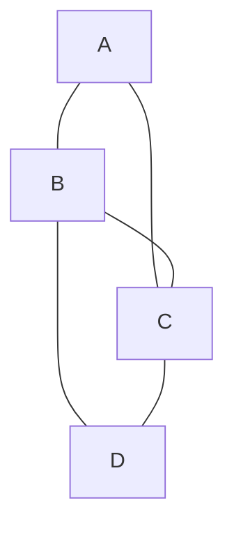

# Graph Coloring

## Introduction

Graph coloring is a special case of graph labeling where we assign colors (or labels) to elements of a graph subject to certain constraints. In its simplest form, we assign colors to each vertex of a graph such that no adjacent vertices share the same color. This is called **vertex coloring**.

Graph coloring serves as a model for many practical problems in computer science, such as:
- Scheduling problems
- Register allocation in compilers
- Pattern matching
- Map coloring
- Frequency assignment in radio networks

In this tutorial, we'll explore the concept of graph coloring, understand its mathematical foundations, and look at algorithms to solve graph coloring problems with practical examples.

## Understanding Graph Coloring

### Basic Terminology

- **Proper Coloring**: An assignment of colors to vertices such that no adjacent vertices have the same color.
- **Chromatic Number**: The minimum number of colors needed for a proper coloring of a graph, denoted by χ(G).
- **k-colorable**: A graph that can be properly colored using k or fewer colors.

### Visual Example

Let's consider a simple graph to understand the concept:



This graph cannot be colored with just 2 colors (try it!), but it can be properly colored with 3 colors. Therefore, its chromatic number is 3.

## The Graph Coloring Problem

The graph coloring problem can be stated formally as:

> Given an undirected graph G = (V, E), find a proper coloring of G using the minimum number of colors.

Unfortunately, determining the chromatic number of a graph is an NP-hard problem, meaning there's no known efficient algorithm that works for all graphs. However, we can use various heuristics and algorithms to find good (often optimal) colorings for many practical cases.

## Graph Coloring Algorithms

### 1. Greedy Coloring Algorithm

The simplest approach is to use a greedy algorithm:

1. Order the vertices according to some strategy
2. Color the vertices one by one, using the first available color that doesn't conflict with already colored adjacent vertices

Let's implement this in Python:

```python
def greedy_coloring(graph):
    """
    Applies greedy coloring to the given graph.
    
    Args:
        graph: A dictionary representing an adjacency list for the graph
               where key is a vertex and value is a list of its neighbors
               
    Returns:
        A dictionary mapping each vertex to its color (integers starting from 0)
    """
    # Initialize result, assign the first color (0) to the first vertex
    result = {}
    # Track available colors for each vertex
    
    # Process all vertices one by one
    for vertex in graph:
        # Get colors of all adjacent vertices
        neighbor_colors = {result[neighbor] for neighbor in graph[vertex] if neighbor in result}
        
        # Find the first available color
        color = 0
        while color in neighbor_colors:
            color += 1
            
        # Assign color to current vertex
        result[vertex] = color
        
    return result
```

Example usage:

```python
# Example graph (adjacency list)
graph = {
    'A': ['B', 'C'],
    'B': ['A', 'C', 'D'],
    'C': ['A', 'B', 'D'],
    'D': ['B', 'C']
}

coloring = greedy_coloring(graph)
print("Vertex coloring:", coloring)
print(f"Number of colors used: {max(coloring.values()) + 1}")
```

Output:
```
Vertex coloring: {'A': 0, 'B': 1, 'C': 2, 'D': 0}
Number of colors used: 3
```

### 2. Welsh-Powell Algorithm

This is another greedy algorithm that often performs better by coloring vertices in order of their degree (number of connections).

```python
def welsh_powell_coloring(graph):
    """
    Applies Welsh-Powell coloring algorithm to the given graph.
    
    Args:
        graph: A dictionary representing an adjacency list
        
    Returns:
        A dictionary mapping each vertex to its color
    """
    # Create a list of vertices sorted by degree in descending order
    vertices = sorted(graph.keys(), key=lambda x: len(graph[x]), reverse=True)
    
    # Initialize result dictionary
    colors = {}
    
    # Assign first color (0) to first vertex
    current_color = 0
    
    # While there are uncolored vertices
    while len(colors) < len(graph):
        # Get uncolored vertices
        uncolored = [v for v in vertices if v not in colors]
        
        # Try to color as many vertices as possible with current_color
        colored_this_round = []
        
        for vertex in uncolored:
            # Check if any neighbor has the same color
            neighbors = graph[vertex]
            neighbor_colors = [colors.get(neighbor) for neighbor in neighbors if neighbor in colors]
            
            if current_color not in neighbor_colors:
                colors[vertex] = current_color
                colored_this_round.append(vertex)
        
        # Move to the next color
        current_color += 1
    
    return colors
```

### 3. Backtracking Approach

For exact solutions, we can use backtracking to try all possible colorings:

```python
def is_safe(graph, colors, vertex, color):
    """Check if assigning color to vertex is valid"""
    for neighbor in graph[vertex]:
        if neighbor in colors and colors[neighbor] == color:
            return False
    return True

def graph_coloring_util(graph, m, colors, vertex_list, vertex_index):
    """Recursive utility function for graph coloring"""
    # Base case: all vertices colored
    if vertex_index == len(vertex_list):
        return True
    
    vertex = vertex_list[vertex_index]
    
    # Try different colors
    for color in range(m):
        if is_safe(graph, colors, vertex, color):
            colors[vertex] = color
            
            # Recur to assign colors to rest of the vertices
            if graph_coloring_util(graph, m, colors, vertex_list, vertex_index + 1):
                return True
            
            # Backtrack if coloring not possible
            colors[vertex] = -1
    
    return False

def graph_coloring(graph, m):
    """
    Graph m-coloring problem using backtracking
    
    Args:
        graph: A dictionary representing an adjacency list
        m: Maximum number of colors
        
    Returns:
        A dictionary of vertex colors if possible, None otherwise
    """
    vertices = list(graph.keys())
    colors = {vertex: -1 for vertex in vertices}  # -1 means no color
    
    if graph_coloring_util(graph, m, colors, vertices, 0):
        return colors
    
    return None
```

## Applications of Graph Coloring

### 1. Map Coloring

One classic application is coloring political maps where adjacent regions must have different colors.

```python
# Example: Map of a simplified region with 5 territories
territories_graph = {
    'Region1': ['Region2', 'Region3', 'Region5'],
    'Region2': ['Region1', 'Region3', 'Region4'],
    'Region3': ['Region1', 'Region2', 'Region4', 'Region5'],
    'Region4': ['Region2', 'Region3', 'Region5'],
    'Region5': ['Region1', 'Region3', 'Region4']
}

# Color the map
map_coloring = greedy_coloring(territories_graph)
print("Map Coloring Result:")
for region, color in map_coloring.items():
    print(f"{region}: Color {color}")
```

Output:
```
Map Coloring Result:
Region1: Color 0
Region2: Color 1
Region3: Color 2
Region4: Color 0
Region5: Color 1
```

### 2. Scheduling Problems

Graph coloring can be used to schedule tasks or examinations, ensuring no conflicts.

```python
# Example: Exam scheduling
# Each vertex represents a course
# An edge means students are taking both courses
exam_conflicts = {
    'Math101': ['CS101', 'Physics101', 'Chemistry101'],
    'CS101': ['Math101', 'DataStructures'],
    'Physics101': ['Math101', 'Electronics101'],
    'Chemistry101': ['Math101', 'Biology101'],
    'DataStructures': ['CS101', 'Algorithms'],
    'Electronics101': ['Physics101'],
    'Biology101': ['Chemistry101'],
    'Algorithms': ['DataStructures']
}

# Schedule exams
exam_schedule = greedy_coloring(exam_conflicts)
print("\nExam Schedule (Time slots):")
for course, time_slot in exam_schedule.items():
    print(f"{course}: Time Slot {time_slot}")
```

Output:
```
Exam Schedule (Time slots):
Math101: Time Slot 0
CS101: Time Slot 1
Physics101: Time Slot 1
Chemistry101: Time Slot 1
DataStructures: Time Slot 0
Electronics101: Time Slot 0
Biology101: Time Slot 0
Algorithms: Time Slot 1
```

### 3. Register Allocation in Compilers

Modern compilers use graph coloring for register allocation. Variables that are needed at the same time cannot be assigned to the same register.

```python
# Example: Register allocation for variables
# Each vertex is a variable, and an edge represents overlapping lifetimes
variable_conflicts = {
    'a': ['b', 'c'],
    'b': ['a', 'd', 'e'],
    'c': ['a', 'e'],
    'd': ['b', 'e'],
    'e': ['b', 'c', 'd']
}

# Allocate registers
register_allocation = greedy_coloring(variable_conflicts)
print("\nRegister Allocation:")
for variable, register in register_allocation.items():
    print(f"Variable {variable}: Register R{register}")
```

Output:
```
Register Allocation:
a: Register R0
b: Register R1
c: Register R1
d: Register R0
e: Register R2
```

## Optimizations and Variations

### Different Vertex Ordering Strategies

The performance of greedy coloring heavily depends on the order of vertices. Some common strategies include:

1. **Largest Degree First (Welsh-Powell)**: Process vertices in descending order of their degrees.
2. **Smallest Degree Last**: Repeatedly remove the vertex of the smallest degree and push it onto a stack. Then color vertices in the order they come off the stack.
3. **DSATUR (Degree of Saturation)**: Dynamically select vertices based on the number of different colors in their neighborhood.

### Edge Coloring

In edge coloring, we assign colors to edges such that no two adjacent edges share the same color. This has applications in scheduling and matching problems.

### Face Coloring

For planar graphs, face coloring involves coloring regions such that no adjacent faces have the same color.

## Performance and Complexity

- The graph coloring problem is NP-hard, meaning there's no known polynomial-time algorithm.
- The greedy approach runs in O(V + E) time, where V is the number of vertices and E is the number of edges.
- Welsh-Powell algorithm also runs in O(V + E) time but often produces better results.
- Backtracking approach has exponential time complexity O(m^V), where m is the number of colors.

## Common Patterns and Insights

### Special Graphs and Their Chromatic Numbers

- **Complete Graph (Kn)**: Chromatic number = n
- **Bipartite Graph**: Chromatic number = 2
- **Cycle Graph (Cn)**: 
  - If n is even: Chromatic number = 2
  - If n is odd: Chromatic number = 3
- **Planar Graph**: Chromatic number ≤ 4 (Four Color Theorem)

### Four Color Theorem

The Four Color Theorem states that any planar graph can be colored using at most four colors. This was one of the first major theorems to be proven using a computer.

## Summary

Graph coloring is a fascinating problem with many practical applications. While finding the optimal coloring is computationally hard, several efficient algorithms can provide good solutions in practice:

1. **Greedy algorithms** provide quick solutions but may not always be optimal
2. **Welsh-Powell** often yields better results by considering vertex degrees
3. **Backtracking** can find optimal solutions for small graphs
4. Special graph types have known chromatic numbers that can guide our approach

Understanding graph coloring opens up solutions to many real-world problems in scheduling, resource allocation, and optimization.

## Exercises

1. Implement the DSATUR algorithm for graph coloring.
2. Write a function to check if a graph is bipartite (2-colorable).
3. Solve the register allocation problem for a small assembly code snippet.
4. Create a visualization of the Welsh-Powell algorithm step by step.
5. Implement face coloring for a planar graph.

## Additional Resources

- "Graph Coloring Applications" by Jensen and Toft
- "Introduction to Algorithms" by Cormen, Leiserson, Rivest, and Stein
- "Algorithm Design" by Kleinberg and Tardos
- Interactive graph coloring tools online can help visualize these algorithms in action

By mastering graph coloring, you'll add a powerful technique to your algorithmic toolkit that can solve a wide range of practical problems in computer science and beyond.