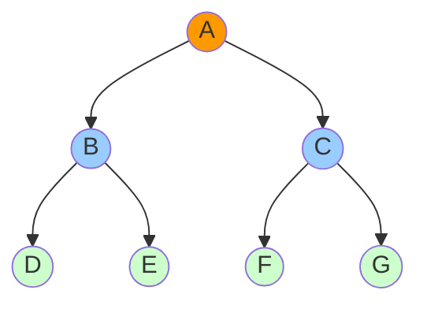

# Breadth First Search

## Introduction

Breadth First Search (BFS) is a fundamental graph traversal algorithm that explores all vertices of a graph at the current depth level before moving on to vertices at the next depth level. Think of it as exploring a graph in "layers" - you start at a source node, then visit all its neighbors, then all their neighbors, and so on.

BFS is particularly useful for finding the shortest path between two nodes in an unweighted graph and is the foundation for many other graph algorithms. Unlike its counterpart, Depth First Search (DFS), which explores as far as possible along each branch before backtracking, BFS explores the graph in a more methodical, level-by-level approach.

## How BFS Works

The BFS algorithm works as follows:

1. Start at a specified source node and mark it as visited
2. Add the source node to a queue
3. While the queue is not empty:
   - Remove a node from the queue
   - Explore all adjacent nodes that haven't been visited
   - Mark each adjacent node as visited and add them to the queue

This approach ensures that nodes are explored in order of their distance from the source node, which is why BFS is perfect for finding shortest paths in unweighted graphs.

Let's visualize the BFS traversal:



For the graph above, if we start BFS from node A:
- Level 0: A (source)
- Level 1: B, C (neighbors of A)
- Level 2: D, E, F, G (neighbors of B and C)

The traversal order would be: A, B, C, D, E, F, G

## BFS Implementation

Let's implement BFS in Python using a queue to keep track of nodes to visit:

```python
from collections import deque

def bfs(graph, start):
    # Initialize a queue with the start node
    queue = deque([start])
    # Keep track of visited nodes
    visited = {start}
    # Keep track of the traversal order
    result = []
    
    while queue:
        # Remove the first node from the queue
        node = queue.popleft()
        result.append(node)
        
        # Add all unvisited neighbors to the queue
        for neighbor in graph[node]:
            if neighbor not in visited:
                visited.add(neighbor)
                queue.append(neighbor)
                
    return result

# Example usage
graph = {
    'A': ['B', 'C'],
    'B': ['A', 'D', 'E'],
    'C': ['A', 'F', 'G'],
    'D': ['B'],
    'E': ['B'],
    'F': ['C'],
    'G': ['C']
}

print(bfs(graph, 'A'))
```

Output:
```
['A', 'B', 'C', 'D', 'E', 'F', 'G']
```

## Finding Shortest Paths with BFS

One of the most practical applications of BFS is finding the shortest path between two nodes in an unweighted graph. Since BFS explores nodes in order of their distance from the source, the first time we encounter the destination node is guaranteed to be via the shortest path.

Let's modify our BFS implementation to find the shortest path:

```python
from collections import deque

def shortest_path_bfs(graph, start, end):
    # Initialize queue with path to start node
    queue = deque([[start]])
    # Keep track of visited nodes
    visited = {start}
    
    while queue:
        # Get the first path from the queue
        path = queue.popleft()
        # Get the last node from the path
        node = path[-1]
        
        # If we've reached the end node, return the path
        if node == end:
            return path
        
        # Add new paths for all the unvisited neighbors
        for neighbor in graph[node]:
            if neighbor not in visited:
                visited.add(neighbor)
                new_path = list(path)
                new_path.append(neighbor)
                queue.append(new_path)
    
    # If no path is found
    return None

# Example usage
graph = {
    'A': ['B', 'C'],
    'B': ['A', 'D', 'E'],
    'C': ['A', 'F', 'G'],
    'D': ['B'],
    'E': ['B', 'H'],
    'F': ['C'],
    'G': ['C'],
    'H': ['E']
}

path = shortest_path_bfs(graph, 'A', 'H')
print(f"Shortest path from A to H: {path}")
print(f"Distance: {len(path) - 1} edges")
```

Output:
```
Shortest path from A to H: ['A', 'B', 'E', 'H']
Distance: 3 edges
```

## Time and Space Complexity

For a graph with V vertices and E edges:

- **Time Complexity**: O(V + E)
  - In the worst case, we might need to visit all vertices and edges
  
- **Space Complexity**: O(V)
  - We need to store visited vertices, and in the worst case, all vertices can be in the queue at once

## Real-World Applications of BFS

Breadth First Search has numerous practical applications:

1. **Social Networks**: Finding the shortest connection between two people (e.g., LinkedIn's "degrees of connection")

2. **Web Crawlers**: Discovering and indexing web pages by following links in a breadth-first manner

3. **GPS Navigation**: Finding the shortest route with the fewest turns or intersections

4. **Network Broadcasting**: Efficiently broadcasting messages to all nodes in a network

5. **Puzzle Solving**: Solving puzzles like the 15-puzzle, 8-puzzle, or Rubik's cube by exploring all possible states

### Example: Friend Recommendation System

Let's see how BFS could be used in a simple friend recommendation system:

```python
from collections import deque

def friend_recommendations(social_graph, user, max_distance=2):
    """
    Find potential friend recommendations for a user.
    Recommendations are users who are not currently friends but are
    connected through mutual friends (at distance 2).
    """
    queue = deque([(user, 0)])  # (user, distance)
    visited = {user}
    recommendations = []
    
    while queue:
        person, distance = queue.popleft()
        
        # If we've reached our maximum search distance, stop exploring further
        if distance >= max_distance:
            continue
        
        for friend in social_graph[person]:
            if friend not in visited:
                visited.add(friend)
                queue.append((friend, distance + 1))
                
                # If this person is at distance 2, they are a potential recommendation
                if distance + 1 == 2:
                    recommendations.append(friend)
    
    return recommendations

# Example social network
social_graph = {
    'Alice': ['Bob', 'Charlie', 'David'],
    'Bob': ['Alice', 'Emma', 'Frank'],
    'Charlie': ['Alice', 'Grace'],
    'David': ['Alice', 'Harry'],
    'Emma': ['Bob'],
    'Frank': ['Bob', 'Irene'],
    'Grace': ['Charlie'],
    'Harry': ['David'],
    'Irene': ['Frank'],
}

recommendations = friend_recommendations(social_graph, 'Alice')
print(f"Friend recommendations for Alice: {recommendations}")
```

Output:
```
Friend recommendations for Alice: ['Emma', 'Frank', 'Grace', 'Harry']
```

These are people who are friends with Alice's friends but not directly friends with Alice.

## Common Variations and Extensions

### BFS with Level Tracking

Sometimes it's useful to know the level or distance of each node from the source:

```python
from collections import deque

def bfs_with_levels(graph, start):
    queue = deque([(start, 0)])  # (node, level)
    visited = {start}
    result = []
    
    while queue:
        node, level = queue.popleft()
        result.append((node, level))
        
        for neighbor in graph[node]:
            if neighbor not in visited:
                visited.add(neighbor)
                queue.append((neighbor, level + 1))
    
    return result

# Example usage
graph = {
    'A': ['B', 'C'],
    'B': ['A', 'D', 'E'],
    'C': ['A', 'F', 'G'],
    'D': ['B'],
    'E': ['B'],
    'F': ['C'],
    'G': ['C']
}

levels = bfs_with_levels(graph, 'A')
for node, level in levels:
    print(f"Node {node} is at level {level} from the source")
```

Output:
```
Node A is at level 0 from the source
Node B is at level 1 from the source
Node C is at level 1 from the source
Node D is at level 2 from the source
Node E is at level 2 from the source
Node F is at level 2 from the source
Node G is at level 2 from the source
```

### Bidirectional BFS

For finding the shortest path between two nodes, bidirectional BFS runs two simultaneous BFS - one from the source and one from the destination. This can significantly reduce the search space.

## Common Pitfalls and Best Practices

1. **Always mark nodes as visited when they're added to the queue**, not when they're processed. This prevents the same node from being added to the queue multiple times.

2. **Be careful with disconnected graphs**. BFS will only explore the connected component that contains the starting node.

3. **Consider using deque instead of list for the queue** in Python. Lists have O(n) time complexity for popping from the beginning, while deques have O(1).

4. **Ensure your graph representation is correct**. BFS can work with adjacency lists, adjacency matrices, or edge lists, but the implementation details will differ.

5. **Remember that BFS finds the shortest path only in unweighted graphs**. For weighted graphs, consider using Dijkstra's algorithm instead.

## Summary

Breadth First Search is a powerful and intuitive graph traversal algorithm that explores nodes in layers outward from the source. It's particularly valuable for finding shortest paths in unweighted graphs and serves as the foundation for many other graph algorithms.

Key points to remember:
- BFS uses a queue data structure to maintain the order of exploration
- It visits all nodes at the current distance before moving to nodes at the next distance
- BFS guarantees the shortest path in unweighted graphs
- The time complexity is O(V + E) and space complexity is O(V)
- It has many real-world applications from social networks to GPS navigation

## Exercises

1. Implement BFS for a graph represented as an adjacency matrix instead of an adjacency list.
2. Modify the BFS algorithm to detect cycles in an undirected graph.
3. Use BFS to determine the connectivity of a graph - are all nodes reachable from a given starting node?
4. Implement a solution to the "knight's shortest path" problem: find the minimum number of moves needed for a knight on a chessboard to move from one position to another.
5. Extend BFS to work with a directed, weighted graph where all edge weights are either 0 or 1. (Hint: use a deque where 0-weight edges put nodes at the front, and 1-weight edges put nodes at the back.)

## Additional Resources

- Introduction to Algorithms by Cormen, Leiserson, Rivest, and Stein (CLRS)
- Algorithms, 4th Edition by Robert Sedgewick and Kevin Wayne
- [Visualgo - Graph Traversal Visualization](https://visualgo.net/en/dfsbfs)
- [Khan Academy - Graph Representation](https://www.khanacademy.org/computing/computer-science/algorithms/graph-representation/a/representing-graphs)
- [GeeksforGeeks - BFS for Disconnected Graph](https://www.geeksforgeeks.org/bfs-disconnected-graph/)

Try implementing BFS for different types of problems to gain a deeper understanding of this versatile algorithm!