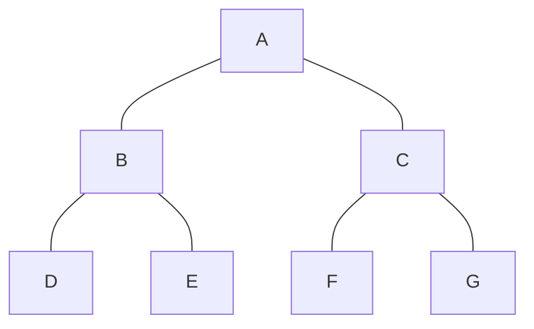

# Depth First Search (DFS)

## Introduction

Depth First Search (DFS) is one of the most fundamental and widely used algorithms for traversing or searching through graph or tree data structures. As the name suggests, this algorithm explores as far as possible along each branch before backtracking, essentially diving "deep" into the structure before turning back.

DFS is like exploring a maze by following one path until you reach a dead end, then backtracking to explore other paths. It's incredibly versatile and serves as the foundation for many complex algorithms.

## Understanding DFS

### How DFS Works

The Depth First Search algorithm follows this simple principle:
1. Start at a chosen vertex (node)
2. Explore as far as possible along each branch before backtracking
3. Mark vertices as visited to avoid cycles
4. Continue until all vertices are visited

Let's visualize this with a simple graph:



If we start DFS from vertex A, one possible traversal order would be:
A → B → D → E → C → F → G

### DFS Pseudocode

```
DFS(Graph G, Vertex start):
    Mark start as visited
    For each neighbor v of start:
        If v is not visited:
            DFS(G, v)
```

## Implementing DFS

Let's implement DFS in different programming languages:

### DFS Implementation in Python

```python
def dfs(graph, start, visited=None):
    if visited is None:
        visited = set()
    
    visited.add(start)
    print(start, end=' ')
    
    for neighbor in graph[start]:
        if neighbor not in visited:
            dfs(graph, neighbor, visited)

# Example usage
graph = {
    'A': ['B', 'C'],
    'B': ['A', 'D', 'E'],
    'C': ['A', 'F', 'G'],
    'D': ['B'],
    'E': ['B'],
    'F': ['C'],
    'G': ['C']
}

print("DFS traversal starting from 'A':")
dfs(graph, 'A')
# Output: A B D E C F G
```

### DFS Implementation in Java

```java
import java.util.*;

class Graph {
    private Map<String, List<String>> adjacencyList;
    
    public Graph() {
        adjacencyList = new HashMap<>();
    }
    
    public void addVertex(String vertex) {
        adjacencyList.putIfAbsent(vertex, new ArrayList<>());
    }
    
    public void addEdge(String source, String destination) {
        adjacencyList.get(source).add(destination);
        adjacencyList.get(destination).add(source);  // For undirected graph
    }
    
    public void dfs(String startVertex) {
        Set<String> visited = new HashSet<>();
        dfsHelper(startVertex, visited);
    }
    
    private void dfsHelper(String vertex, Set<String> visited) {
        visited.add(vertex);
        System.out.print(vertex + " ");
        
        for (String neighbor : adjacencyList.get(vertex)) {
            if (!visited.contains(neighbor)) {
                dfsHelper(neighbor, visited);
            }
        }
    }
    
    public static void main(String[] args) {
        Graph g = new Graph();
        g.addVertex("A");
        g.addVertex("B");
        g.addVertex("C");
        g.addVertex("D");
        g.addVertex("E");
        g.addVertex("F");
        g.addVertex("G");
        
        g.addEdge("A", "B");
        g.addEdge("A", "C");
        g.addEdge("B", "D");
        g.addEdge("B", "E");
        g.addEdge("C", "F");
        g.addEdge("C", "G");
        
        System.out.println("DFS traversal starting from 'A':");
        g.dfs("A");
        // Output: A B D E C F G
    }
}
```

### Iterative DFS Implementation

While the recursive approach is elegant, DFS can also be implemented iteratively using a stack:

```python
def dfs_iterative(graph, start):
    visited = set()
    stack = [start]
    
    while stack:
        vertex = stack.pop()
        if vertex not in visited:
            visited.add(vertex)
            print(vertex, end=' ')
            
            # Add neighbors to stack in reverse order
            # to match recursive DFS traversal order
            for neighbor in reversed(graph[vertex]):
                if neighbor not in visited:
                    stack.append(neighbor)

# Example usage
graph = {
    'A': ['B', 'C'],
    'B': ['A', 'D', 'E'],
    'C': ['A', 'F', 'G'],
    'D': ['B'],
    'E': ['B'],
    'F': ['C'],
    'G': ['C']
}

print("Iterative DFS traversal starting from 'A':")
dfs_iterative(graph, 'A')
# Output: A B D E C F G
```

## Time and Space Complexity

- **Time Complexity**: O(V + E), where V is the number of vertices and E is the number of edges in the graph
- **Space Complexity**: O(V) for the visited set and the recursion stack (in the worst case, when the graph is a linear chain)

## Applications of DFS

DFS isn't just a theoretical concept; it has numerous practical applications:

### 1. Cycle Detection

DFS can detect cycles in a graph. If during traversal, we encounter a vertex that's already in our current path (not just visited), then there's a cycle.

```python
def has_cycle(graph):
    visited = set()
    recursion_stack = set()
    
    def dfs_cycle_check(vertex):
        visited.add(vertex)
        recursion_stack.add(vertex)
        
        for neighbor in graph[vertex]:
            if neighbor not in visited:
                if dfs_cycle_check(neighbor):
                    return True
            elif neighbor in recursion_stack:
                return True
                
        recursion_stack.remove(vertex)
        return False
    
    for vertex in graph:
        if vertex not in visited:
            if dfs_cycle_check(vertex):
                return True
    return False

# Example with a cycle
graph_with_cycle = {
    'A': ['B'],
    'B': ['C'],
    'C': ['A']  # Creates a cycle A → B → C → A
}

print("Graph has cycle:", has_cycle(graph_with_cycle))  # True
```

### 2. Topological Sorting

For directed acyclic graphs (DAGs), DFS can perform topological sorting, which is useful in task scheduling and dependency resolution.

```python
def topological_sort(graph):
    visited = set()
    topo_order = []
    
    def dfs_topo(vertex):
        visited.add(vertex)
        
        for neighbor in graph.get(vertex, []):
            if neighbor not in visited:
                dfs_topo(neighbor)
        
        topo_order.append(vertex)
    
    for vertex in graph:
        if vertex not in visited:
            dfs_topo(vertex)
    
    return topo_order[::-1]  # Reverse to get correct order

# Example: Course prerequisites (directed graph)
course_prereqs = {
    'Data Structures': ['Intro to Programming'],
    'Algorithms': ['Data Structures'],
    'Databases': ['Data Structures'],
    'Web Development': ['Intro to Programming'],
    'Machine Learning': ['Algorithms', 'Statistics'],
    'Statistics': ['Calculus'],
    'Calculus': [],
    'Intro to Programming': []
}

print("Course order:", topological_sort(course_prereqs))
# Output: ['Intro to Programming', 'Calculus', 'Data Structures', 'Statistics', 'Web Development', 'Algorithms', 'Databases', 'Machine Learning']
```

### 3. Connected Components

DFS can identify all connected components in an undirected graph:

```python
def find_connected_components(graph):
    visited = set()
    components = []
    
    def dfs(vertex, component):
        visited.add(vertex)
        component.append(vertex)
        
        for neighbor in graph.get(vertex, []):
            if neighbor not in visited:
                dfs(neighbor, component)
    
    for vertex in graph:
        if vertex not in visited:
            component = []
            dfs(vertex, component)
            components.append(component)
    
    return components

# Example with multiple components
graph = {
    'A': ['B', 'C'],
    'B': ['A'],
    'C': ['A'],
    'D': ['E'],
    'E': ['D'],
    'F': []
}

print("Connected components:", find_connected_components(graph))
# Output: [['A', 'B', 'C'], ['D', 'E'], ['F']]
```

### 4. Maze Solving

DFS is perfect for solving mazes, where you need to find a path from start to end:

```python
def solve_maze(maze, start, end):
    rows, cols = len(maze), len(maze[0])
    visited = [[False for _ in range(cols)] for _ in range(rows)]
    path = []
    
    def is_valid(x, y):
        return 0 <= x < rows and 0 <= y < cols and maze[x][y] == 1 and not visited[x][y]
    
    def dfs(x, y):
        if (x, y) == end:
            path.append((x, y))
            return True
        
        visited[x][y] = True
        
        # Try all four directions: right, down, left, up
        directions = [(0, 1), (1, 0), (0, -1), (-1, 0)]
        for dx, dy in directions:
            nx, ny = x + dx, y + dy
            if is_valid(nx, ny):
                if dfs(nx, ny):
                    path.append((x, y))
                    return True
        
        return False
    
    if dfs(start[0], start[1]):
        path.reverse()  # Reverse to get path from start to end
        return path
    return None

# Example maze (1 = path, 0 = wall)
maze = [
    [1, 0, 1, 1, 1],
    [1, 1, 1, 0, 1],
    [0, 0, 1, 0, 1],
    [1, 1, 1, 1, 1],
    [1, 0, 0, 0, 1]
]

start_pos = (0, 0)
end_pos = (4, 4)

path = solve_maze(maze, start_pos, end_pos)
print("Path found:", path)
# Output: Path found: [(0, 0), (1, 0), (1, 1), (1, 2), (2, 2), (3, 2), (3, 3), (3, 4), (4, 4)]
```

## Common Pitfalls and Tips

1. **Infinite Loops**: Always mark vertices as visited to avoid infinite loops in graphs with cycles.
2. **Stack Overflow**: For deeply nested graphs, recursive DFS might cause stack overflow. Consider using the iterative approach.
3. **Order Matters**: The order in which you process neighbors affects the traversal path, but not the completeness of the search.
4. **Directed vs Undirected**: Be careful about how you define edges based on whether your graph is directed or undirected.

## Summary

Depth First Search is a powerful graph traversal algorithm that explores as deep as possible along each branch before backtracking. Its elegant recursive nature makes it easy to understand and implement, while its iterative version provides a more memory-efficient alternative for certain scenarios.

Key takeaways:
- DFS uses a recursive or stack-based approach to traverse graphs
- It has a time complexity of O(V + E) and space complexity of O(V)
- DFS has many practical applications including cycle detection, topological sorting, and maze solving
- It's essential to maintain a visited set to prevent infinite loops in cyclic graphs

## Exercises

1. Modify the DFS algorithm to find the longest path in an acyclic graph.
2. Implement an algorithm using DFS to check if a graph is bipartite.
3. Use DFS to identify all strongly connected components in a directed graph (Hint: Look up Kosaraju's algorithm).
4. Solve the "Word Ladder" problem using DFS (finding transformation sequence from one word to another by changing one letter at a time).
5. Implement a function that uses DFS to print all paths between two vertices in a graph.

## Additional Resources

- "Introduction to Algorithms" by Cormen, Leiserson, Rivest, and Stein
- "Algorithms, 4th Edition" by Robert Sedgewick and Kevin Wayne
- [Visualizing Algorithms](https://visualgo.net/en/dfsbfs) - Interactive visualization of DFS
- [Stanford CS Theory: DFS](https://cs.stanford.edu/~rishig/courses/ref/l19-dfs.pdf) - Advanced DFS applications
- [MIT OpenCourseWare: Graph Search](https://ocw.mit.edu/courses/electrical-engineering-and-computer-science/6-006-introduction-to-algorithms-fall-2011/lecture-videos/lecture-13-breadth-first-search-bfs/)

Happy coding and graph traversing!