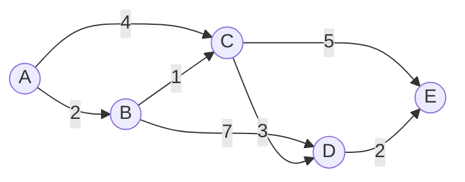

# Shortest Path Algorithms

## Introduction

In our daily lives, we often seek the shortest or most efficient route between two points. Whether you're using GPS navigation to find the quickest way home or a network router determining the most efficient path to send data packets, shortest path algorithms play a crucial role in these processes.

Shortest path algorithms are techniques used to find the most efficient path between nodes in a graph. They have numerous real-world applications, from navigation systems and network routing to game development and social network analysis.

In this tutorial, we'll explore the most important shortest path algorithms, understand how they work, and implement them in code.

## Understanding the Problem

Before diving into the algorithms, let's clarify what we're trying to solve:

**The Shortest Path Problem**: Given a weighted graph, find the path with the minimum total weight (cost) between a source vertex and all other vertices (or a specific target vertex).

Key concepts to understand:
- **Path**: A sequence of vertices where each adjacent pair is connected by an edge
- **Path Weight**: Sum of the weights of all edges in the path
- **Shortest Path**: A path with the minimum possible weight

Let's visualize a simple weighted graph:



In this graph, the shortest path from A to E is `A → B → C → E` with a total weight of 2 + 1 + 5 = 8.

## Major Shortest Path Algorithms

We'll focus on the two most important shortest path algorithms:

1. **Dijkstra's Algorithm**: Works for graphs with non-negative weights
2. **Bellman-Ford Algorithm**: Can handle graphs with negative weights (and detect negative cycles)

Let's explore each one in detail.

## Dijkstra's Algorithm

Dijkstra's algorithm finds the shortest path from a single source vertex to all other vertices in a weighted graph with non-negative edge weights.

### How Dijkstra's Algorithm Works

1. Assign distance value 0 to the source vertex and infinity to all other vertices
2. Mark all vertices as unvisited (maintain a separate set)
3. For each iteration:
   - Select the unvisited vertex with the smallest distance value
   - Mark it as visited
   - Update the distance values of its adjacent vertices if a shorter path is found
4. Repeat until all vertices are visited or the destination is reached

### Implementation of Dijkstra's Algorithm

Here's a Python implementation of Dijkstra's algorithm:

```python
import heapq

def dijkstra(graph, start):
    # Initialize distances with infinity for all nodes except the start node
    distances = {vertex: float('infinity') for vertex in graph}
    distances[start] = 0
    
    # Priority queue to keep track of vertices to visit
    priority_queue = [(0, start)]
    
    # To keep track of the shortest path
    previous = {vertex: None for vertex in graph}
    
    while priority_queue:
        # Get the vertex with the smallest distance
        current_distance, current_vertex = heapq.heappop(priority_queue)
        
        # If we've already found a shorter path, skip
        if current_distance > distances[current_vertex]:
            continue
            
        # Check all neighbors of the current vertex
        for neighbor, weight in graph[current_vertex].items():
            distance = current_distance + weight
            
            # If we found a shorter path to the neighbor
            if distance < distances[neighbor]:
                distances[neighbor] = distance
                previous[neighbor] = current_vertex
                heapq.heappush(priority_queue, (distance, neighbor))
                
    return distances, previous

# Function to reconstruct the path from start to end
def reconstruct_path(previous, start, end):
    path = []
    current = end
    
    while current != start:
        path.append(current)
        current = previous[current]
        if current is None:
            return []  # No path exists
            
    path.append(start)
    path.reverse()  # Reverse the path to get it from start to end
    
    return path

# Example usage
graph = {
    'A': {'B': 2, 'C': 4},
    'B': {'C': 1, 'D': 7},
    'C': {'D': 3, 'E': 5},
    'D': {'E': 2},
    'E': {}
}

# Find shortest paths from A to all vertices
distances, previous = dijkstra(graph, 'A')
print("Shortest distances from A:", distances)

# Reconstruct path from A to E
path = reconstruct_path(previous, 'A', 'E')
print("Shortest path from A to E:", " → ".join(path))
```

Expected output:

```
Shortest distances from A: {'A': 0, 'B': 2, 'C': 3, 'D': 6, 'E': 8}
Shortest path from A to E: A → B → C → E
```

### Time and Space Complexity

- **Time Complexity**: O(E + V log V) with a binary heap implementation (E = number of edges, V = number of vertices)
- **Space Complexity**: O(V)

## Bellman-Ford Algorithm

Unlike Dijkstra's algorithm, the Bellman-Ford algorithm can handle graphs with negative edge weights and detect negative cycles.

### How Bellman-Ford Algorithm Works

1. Initialize distance from the source to all vertices as infinity, and to the source itself as 0
2. Relax all edges V-1 times (where V is the number of vertices):
   - For each edge (u, v) with weight w, if distance[u] + w < distance[v], then update distance[v] = distance[u] + w
3. Check for negative cycles by relaxing all edges one more time:
   - If any distance value decreases, there's a negative cycle

### Implementation of Bellman-Ford Algorithm

```python
def bellman_ford(graph, start):
    # Step 1: Initialize distances
    distances = {vertex: float('infinity') for vertex in graph}
    distances[start] = 0
    
    # To keep track of the path
    previous = {vertex: None for vertex in graph}
    
    # Get all edges
    edges = []
    for u in graph:
        for v, w in graph[u].items():
            edges.append((u, v, w))
    
    # Step 2: Relax all edges |V| - 1 times
    n_vertices = len(graph)
    for _ in range(n_vertices - 1):
        for u, v, w in edges:
            if distances[u] != float('infinity') and distances[u] + w < distances[v]:
                distances[v] = distances[u] + w
                previous[v] = u
    
    # Step 3: Check for negative cycles
    for u, v, w in edges:
        if distances[u] != float('infinity') and distances[u] + w < distances[v]:
            print("Graph contains a negative cycle")
            return None, None
            
    return distances, previous

# Example usage
graph = {
    'A': {'B': 2, 'C': 4},
    'B': {'C': 1, 'D': 7},
    'C': {'D': 3, 'E': 5},
    'D': {'E': 2},
    'E': {}
}

# Find shortest paths from A to all vertices
distances, previous = bellman_ford(graph, 'A')
print("Shortest distances from A:", distances)

# Graph with negative edge weight
graph_with_negative = {
    'A': {'B': 2, 'C': 4},
    'B': {'C': -10, 'D': 7},
    'C': {'D': 3, 'E': 5},
    'D': {'E': 2},
    'E': {}
}

distances, previous = bellman_ford(graph_with_negative, 'A')
print("Shortest distances from A with negative edges:", distances)
```

Expected output:

```
Shortest distances from A: {'A': 0, 'B': 2, 'C': 3, 'D': 6, 'E': 8}
Shortest distances from A with negative edges: {'A': 0, 'B': 2, 'C': -8, 'D': -5, 'E': -3}
```

### Time and Space Complexity

- **Time Complexity**: O(V × E) (V = number of vertices, E = number of edges)
- **Space Complexity**: O(V)

## Dijkstra vs. Bellman-Ford: When to Use Each

| Algorithm | Advantages | Disadvantages | When to Use |
|-----------|------------|--------------|------------|
| **Dijkstra** | Faster (for sparse graphs) | Cannot handle negative weights | When all edge weights are non-negative |
| **Bellman-Ford** | Can handle negative edge weights and detect negative cycles | Slower than Dijkstra's | When graph may contain negative edge weights |

## Real-World Applications

### 1. Navigation Systems

GPS applications like Google Maps use enhanced versions of shortest path algorithms to find the most efficient routes between locations, considering factors like distance, traffic, road conditions, etc.

```python
# Simplified example of routing in a city map
city_map = {
    'Home': {'Park': 5, 'Mall': 9, 'Office': 3},
    'Park': {'School': 4, 'Mall': 2},
    'Mall': {'Restaurant': 1},
    'Office': {'Park': 2, 'School': 6},
    'School': {'Restaurant': 3},
    'Restaurant': {}
}

distances, previous = dijkstra(city_map, 'Home')
path = reconstruct_path(previous, 'Home', 'Restaurant')
print(f"Best route to restaurant: {' → '.join(path)}, Taking {distances['Restaurant']} minutes")
```

### 2. Network Routing Protocols

Protocols like OSPF (Open Shortest Path First) use Dijkstra's algorithm to determine the best path for data packets to travel across networks.

### 3. Social Networks

Shortest path algorithms can be used to find the "degrees of separation" between users in social networks.

```python
# Finding the shortest connection between two users
social_network = {
    'Alice': {'Bob': 1, 'Charlie': 1, 'David': 1},
    'Bob': {'Eve': 1, 'Frank': 1},
    'Charlie': {'Grace': 1},
    'David': {'Frank': 1},
    'Eve': {'Henry': 1},
    'Frank': {'Henry': 1, 'Ivy': 1},
    'Grace': {'Ivy': 1},
    'Henry': {'Jack': 1},
    'Ivy': {'Jack': 1},
    'Jack': {}
}

distances, previous = dijkstra(social_network, 'Alice')
path = reconstruct_path(previous, 'Alice', 'Jack')
print(f"Connection between Alice and Jack: {' → '.join(path)}")
print(f"Degrees of separation: {distances['Jack']}")
```

## Advanced Shortest Path Algorithms

Beyond the basic algorithms we've covered, there are several advanced algorithms for specific use cases:

1. **A* (A-Star) Algorithm**: An extension of Dijkstra's algorithm that uses heuristics to improve performance for specific searches
2. **Floyd-Warshall Algorithm**: Finds shortest paths between all pairs of vertices
3. **Johnson's Algorithm**: Finds all pairs of shortest paths in sparse, weighted, directed graphs
4. **Bidirectional Search**: Searches forward from the source and backward from the destination simultaneously

## Summary

Shortest path algorithms are fundamental techniques in graph theory with wide-ranging applications. In this tutorial, we covered:

1. **Dijkstra's Algorithm**: Efficient for non-negative edge weights
2. **Bellman-Ford Algorithm**: Can handle negative edge weights and detect negative cycles
3. **Real-world applications** in navigation, network routing, and social networks

These algorithms form the foundation for many advanced applications and systems we use daily, from finding the quickest route home to efficiently routing data across the internet.

## Practice Exercises

1. Implement Dijkstra's algorithm to find the shortest path in a grid where cells can be either passable or blocked.
2. Modify the Bellman-Ford algorithm to not only detect but also report the negative cycle if one exists.
3. Implement the A* algorithm with a Manhattan distance heuristic for pathfinding in a 2D grid.
4. Solve a problem where you need to find the k-shortest paths between two vertices.
5. Use shortest path algorithms to solve a real-world problem, such as finding the most efficient delivery route for multiple destinations.

## Additional Resources

- Books:
  - "Introduction to Algorithms" by Cormen, Leiserson, Rivest, and Stein
  - "Algorithms" by Robert Sedgewick and Kevin Wayne
- Online courses:
  - Stanford's Algorithms Specialization on Coursera
  - Princeton's Algorithms course on Coursera
- Practice platforms:
  - LeetCode (has many graph-related problems)
  - HackerRank's Graph Theory section

Happy coding and pathfinding!