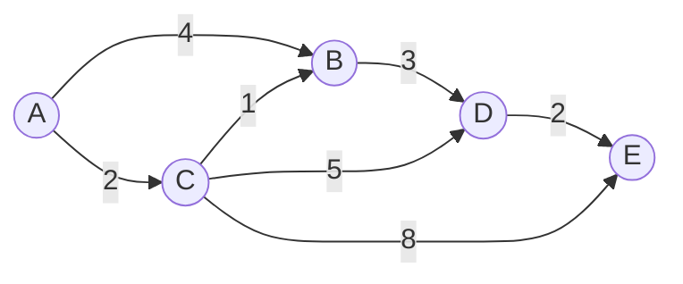

# Dijkstra's Algorithm

## Introduction

Imagine you're using a maps application to find the fastest route from your home to a new restaurant across town. Behind the scenes, the application likely uses a powerful algorithm called **Dijkstra's Algorithm** to find the optimal path.

Dijkstra's Algorithm, named after Dutch computer scientist Edsger W. Dijkstra, is a graph search algorithm that solves the single-source shortest path problem. In simpler terms, it finds the shortest path from a starting node to all other nodes in a graph with non-negative edge weights.

In this tutorial, you'll learn:
- What Dijkstra's Algorithm is and how it works
- Step-by-step explanation of the algorithm
- Implementation in code
- Real-world applications
- Optimization techniques

## Prerequisites

To follow along, you should have:
- Basic understanding of graphs (nodes and edges)
- Basic knowledge of programming concepts (arrays, loops, etc.)
- Familiarity with data structures like arrays, queues, and priority queues

## Understanding the Problem

Before diving into the algorithm, let's understand what problem Dijkstra's algorithm solves:

**Single-Source Shortest Path Problem**: Given a graph and a source vertex, find the shortest paths from the source to all vertices in the given graph.

The key constraints for Dijkstra's Algorithm:
- It works on weighted graphs
- Edge weights must be non-negative
- The graph can be directed or undirected

## How Dijkstra's Algorithm Works

Dijkstra's Algorithm is a greedy algorithm that builds the solution step by step. Here's a high-level overview:

1. Maintain a set of unvisited nodes
2. Assign a tentative distance value to each node
   - Initialize source node with 0 and all other nodes with infinity
3. Visit the unvisited node with the smallest distance, mark it as visited
4. Update the distances to all its neighboring unvisited nodes
5. Repeat steps 3-4 until all nodes are visited

Let's visualize this with a diagram:



## Step-by-Step Explanation

Let's work through an example using the graph above, starting from node A:

1. **Initialization**:
   - Distance to A = 0 (source)
   - Distance to B, C, D, E = ∞ (infinity)
   - Unvisited set = `{A, B, C, D, E}`

2. **First Iteration**:
   - Visit A (smallest distance: 0)
   - Update distances to neighbors:
     - B = min(∞, 0 + 4) = 4
     - C = min(∞, 0 + 2) = 2
   - Mark A as visited
   - Unvisited set = `{B, C, D, E}`

3. **Second Iteration**:
   - Visit C (smallest distance: 2)
   - Update distances to neighbors:
     - B = min(4, 2 + 1) = 3
     - D = min(∞, 2 + 5) = 7
     - E = min(∞, 2 + 8) = 10
   - Mark C as visited
   - Unvisited set = `{B, D, E}`

4. **Third Iteration**:
   - Visit B (smallest distance: 3)
   - Update distances to neighbors:
     - D = min(7, 3 + 3) = 6
   - Mark B as visited
   - Unvisited set = `{D, E}`

5. **Fourth Iteration**:
   - Visit D (smallest distance: 6)
   - Update distances to neighbors:
     - E = min(10, 6 + 2) = 8
   - Mark D as visited
   - Unvisited set = `{E}`

6. **Fifth Iteration**:
   - Visit E (smallest distance: 8)
   - No neighbors to update
   - Mark E as visited
   - Unvisited set = `{}`

**Final Result**:
- Shortest path to A: 0
- Shortest path to B: 3 (A → C → B)
- Shortest path to C: 2 (A → C)
- Shortest path to D: 6 (A → C → B → D)
- Shortest path to E: 8 (A → C → B → D → E)

## Implementing Dijkstra's Algorithm

Now let's implement the algorithm in code. We'll use JavaScript for this example:

```javascript
function dijkstra(graph, startNode) {
  // Set initial distances to Infinity for all nodes except the starting node
  const distances = {};
  const visited = {};
  const previousNodes = {};
  
  // Initialize all nodes with infinity distance
  for (let node in graph) {
    distances[node] = Infinity;
    previousNodes[node] = null;
  }
  
  // Distance from starting node to itself is 0
  distances[startNode] = 0;
  
  // Helper function to find the node with minimum distance
  function findMinDistanceNode() {
    let minDistance = Infinity;
    let minNode = null;
    
    for (let node in distances) {
      if (!visited[node] && distances[node] < minDistance) {
        minDistance = distances[node];
        minNode = node;
      }
    }
    
    return minNode;
  }
  
  // Main algorithm logic
  let currentNode = findMinDistanceNode();
  
  while (currentNode !== null) {
    const distance = distances[currentNode];
    const neighbors = graph[currentNode];
    
    // Check all neighboring nodes
    for (let neighbor in neighbors) {
      const newDistance = distance + neighbors[neighbor];
      
      // If we found a shorter path to the neighbor
      if (newDistance < distances[neighbor]) {
        distances[neighbor] = newDistance;
        previousNodes[neighbor] = currentNode;
      }
    }
    
    // Mark the current node as visited
    visited[currentNode] = true;
    
    // Find the next node to visit
    currentNode = findMinDistanceNode();
  }
  
  return { distances, previousNodes };
}

// Example usage
const graph = {
  'A': { 'B': 4, 'C': 2 },
  'B': { 'D': 3 },
  'C': { 'B': 1, 'D': 5, 'E': 8 },
  'D': { 'E': 2 },
  'E': {}
};

const result = dijkstra(graph, 'A');
console.log('Distances from A:', result.distances);

// Output: Distances from A: { A: 0, B: 3, C: 2, D: 6, E: 8 }
```

For large graphs, we can optimize using a priority queue (min-heap) to find the next node with minimum distance efficiently:

```javascript
// Using a simple Priority Queue implementation
class PriorityQueue {
  constructor() {
    this.queue = [];
  }

  enqueue(element, priority) {
    this.queue.push({ element, priority });
    this.sort();
  }

  dequeue() {
    if (this.isEmpty()) return null;
    return this.queue.shift().element;
  }

  isEmpty() {
    return this.queue.length === 0;
  }

  sort() {
    this.queue.sort((a, b) => a.priority - b.priority);
  }
}

function dijkstraOptimized(graph, startNode) {
  const distances = {};
  const previousNodes = {};
  const pq = new PriorityQueue();
  
  // Initialize distances
  for (let node in graph) {
    distances[node] = node === startNode ? 0 : Infinity;
    previousNodes[node] = null;
    pq.enqueue(node, distances[node]);
  }
  
  while (!pq.isEmpty()) {
    const currentNode = pq.dequeue();
    
    // Skip if we've found a better path already
    if (distances[currentNode] === Infinity) continue;
    
    for (let neighbor in graph[currentNode]) {
      const distance = graph[currentNode][neighbor];
      
      // Calculate new distance
      const newDistance = distances[currentNode] + distance;
      
      // If better path found
      if (newDistance < distances[neighbor]) {
        distances[neighbor] = newDistance;
        previousNodes[neighbor] = currentNode;
        
        // Add to priority queue with new priority
        pq.enqueue(neighbor, newDistance);
      }
    }
  }
  
  return { distances, previousNodes };
}
```

## Reconstructing the Path

The above implementation gives us the shortest distances but doesn't show the actual paths. Let's add a function to reconstruct the path from source to any node:

```javascript
function getPath(previousNodes, endNode) {
  const path = [];
  let currentNode = endNode;
  
  // Reconstruct path by backtracking through previousNodes
  while (currentNode !== null) {
    path.unshift(currentNode);
    currentNode = previousNodes[currentNode];
  }
  
  return path;
}

// Example usage
const result = dijkstra(graph, 'A');
const pathToE = getPath(result.previousNodes, 'E');
console.log('Shortest path to E:', pathToE.join(' → '));

// Output: Shortest path to E: A → C → B → D → E
```

## Time and Space Complexity

The time and space complexity of Dijkstra's Algorithm depends on the implementation:

**Basic implementation** (using an array to find minimum distances):
- Time Complexity: O(V²) where V is the number of vertices
- Space Complexity: O(V)

**Optimized implementation** (using a priority queue):
- Time Complexity: O((V + E) log V) where V is the number of vertices and E is the number of edges
- Space Complexity: O(V + E)

## Real-World Applications

Dijkstra's Algorithm is used in many real-world applications:

1. **Navigation Systems**: GPS and mapping services use it to find the shortest route between locations
   
2. **Network Routing Protocols**: Used in routing protocols like OSPF (Open Shortest Path First) to determine the best path for data packets

3. **Flight Planning**: Airlines use similar algorithms to plan the most efficient routes

4. **Robotics**: For path planning in autonomous robots to navigate efficiently

5. **Telecommunications**: To route calls and data through networks with minimal delay

## Example: Network Routing

Imagine you have a network of routers, and you want to find the path with the least latency:

```javascript
const network = {
  'Router1': { 'Router2': 5, 'Router3': 10 },
  'Router2': { 'Router4': 3, 'Router5': 7 },
  'Router3': { 'Router5': 4 },
  'Router4': { 'Router6': 6 },
  'Router5': { 'Router4': 2, 'Router6': 8 },
  'Router6': {}
};

const result = dijkstra(network, 'Router1');
console.log('Shortest paths from Router1:');
for (let router in result.distances) {
  const path = getPath(result.previousNodes, router);
  console.log(`- To ${router} (latency: ${result.distances[router]}ms): ${path.join(' → ')}`);
}

/* Output:
Shortest paths from Router1:
- To Router1 (latency: 0ms): Router1
- To Router2 (latency: 5ms): Router1 → Router2
- To Router3 (latency: 10ms): Router1 → Router3
- To Router4 (latency: 8ms): Router1 → Router2 → Router4
- To Router5 (latency: 12ms): Router1 → Router3 → Router5
- To Router6 (latency: 14ms): Router1 → Router2 → Router4 → Router6
*/
```

## Common Pitfalls and Limitations

1. **Negative Edge Weights**: Dijkstra's algorithm doesn't work with negative edge weights. For those cases, you need the Bellman-Ford algorithm.

2. **Infinite Loops**: If your graph has cycles, make sure your implementation handles them properly.

3. **Performance**: The basic implementation can be slow for large graphs; use a priority queue for better performance.

4. **Memory Constraints**: For very large graphs, consider alternative approaches or optimizations.

## Summary

Dijkstra's Algorithm is a powerful and versatile approach for finding the shortest path in a weighted graph. In this tutorial, we've covered:

1. The basic principles behind Dijkstra's Algorithm
2. Step-by-step walkthrough of how the algorithm works
3. JavaScript implementation with explanations
4. Optimizations using a priority queue
5. Real-world applications
6. Common pitfalls and limitations

Remember that Dijkstra's Algorithm works only on graphs with non-negative edge weights. For graphs with negative edge weights, consider using the Bellman-Ford algorithm instead.

## Exercises

1. Implement Dijkstra's Algorithm using a more efficient priority queue data structure
2. Modify the algorithm to find the shortest path between two specific nodes (early termination)
3. Implement a visualization of Dijkstra's Algorithm running on a graph
4. Use Dijkstra's Algorithm to solve a maze-finding problem
5. Compare the performance of the basic and optimized implementations on graphs of different sizes

## Additional Resources

- "Introduction to Algorithms" by Cormen, Leiserson, Rivest, and Stein (CLRS) has an excellent chapter on Dijkstra's Algorithm
- Stanford's CS course materials on shortest paths in graphs
- Interactive visualizations of graph algorithms at [VisuAlgo](https://visualgo.net/)

Dijkstra's Algorithm is an essential tool in any programmer's toolkit. By understanding how it works, you've gained valuable knowledge about graph algorithms that can be applied to countless real-world problems.