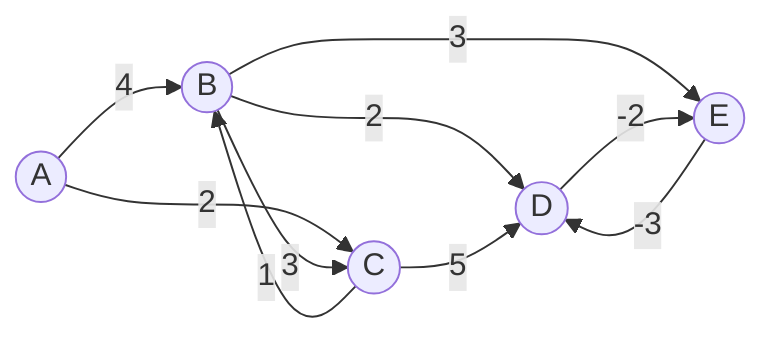
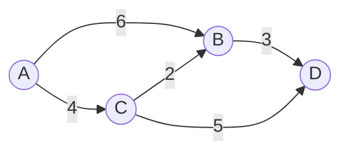

# Bellman-Ford Algorithm

## Introduction

The Bellman-Ford algorithm is a fundamental graph algorithm used to find the shortest paths from a single source vertex to all other vertices in a weighted graph. Unlike Dijkstra's algorithm, Bellman-Ford can handle graphs with negative edge weights, making it more versatile in certain scenarios.

Key features of the Bellman-Ford algorithm:

- Finds shortest paths from a source vertex to all other vertices
- Works with directed and undirected graphs
- Handles graphs with negative edge weights
- Can detect negative weight cycles
- Has a time complexity of O(V × E), where V is the number of vertices and E is the number of edges

In this tutorial, we'll explore how the Bellman-Ford algorithm works, implement it in code, and look at some practical applications.

## Understanding the Algorithm

The Bellman-Ford algorithm is based on a simple principle: repeatedly relaxing all edges of the graph. "Relaxation" is a process that attempts to improve the current shortest path estimate to a vertex by using an edge.

### The Algorithm Steps

1. Initialize distances from the source vertex to all vertices as infinite and distance to source as 0
2. Repeat the following step V-1 times (where V is the number of vertices):
   - For each edge (u, v) with weight w, if distance[u] + w < distance[v], update distance[v] to distance[u] + w
3. Check for negative-weight cycles by trying one more relaxation for each edge:
   - If any distance can still be updated, the graph contains a negative-weight cycle

### Visual Explanation

Let's visualize how the algorithm works with a simple graph:



In this graph:
- Let's say A is our source vertex
- We want to find the shortest path from A to all other vertices
- Notice that there's a negative-weight cycle between D and E

## Implementation

Here's how to implement the Bellman-Ford algorithm in Python:

```python
def bellman_ford(graph, source):
    # Step 1: Initialize distances from source to all vertices as infinity
    # and distance to source as 0
    dist = {vertex: float('infinity') for vertex in graph}
    dist[source] = 0
    
    # Step 2: Relax all edges |V| - 1 times
    for _ in range(len(graph) - 1):
        for u in graph:
            for v, weight in graph[u].items():
                if dist[u] != float('infinity') and dist[u] + weight < dist[v]:
                    dist[v] = dist[u] + weight
    
    # Step 3: Check for negative-weight cycles
    for u in graph:
        for v, weight in graph[u].items():
            if dist[u] != float('infinity') and dist[u] + weight < dist[v]:
                print("Graph contains negative weight cycle")
                return None
    
    return dist
```

### Example Usage

```python
# Example graph represented as an adjacency list with weights
graph = {
    'A': {'B': 4, 'C': 2},
    'B': {'C': 3, 'D': 2, 'E': 3},
    'C': {'B': 1, 'D': 5},
    'D': {'E': -2},
    'E': {'D': -3}
}

# Find shortest paths from vertex 'A'
shortest_paths = bellman_ford(graph, 'A')
print(shortest_paths)
```

### Expected Output

```
Graph contains negative weight cycle
None
```

This output occurs because our example graph contains a negative weight cycle between vertices D and E. If we remove this cycle, we would get the shortest distances from A to all other vertices.

## Step-by-Step Execution

Let's trace the algorithm on a simpler graph without negative cycles:



### Initial State

- distance[A] = 0 (source)
- distance[B] = ∞
- distance[C] = ∞
- distance[D] = ∞

### First Iteration (relaxing all edges)

- Relax edge (A, B): distance[B] = min(∞, 0 + 6) = 6
- Relax edge (A, C): distance[C] = min(∞, 0 + 4) = 4
- Relax edge (B, D): distance[D] = min(∞, 6 + 3) = 9
- Relax edge (C, B): distance[B] = min(6, 4 + 2) = 6
- Relax edge (C, D): distance[D] = min(9, 4 + 5) = 9

### Second Iteration

- Relax edge (A, B): No change
- Relax edge (A, C): No change
- Relax edge (B, D): No change
- Relax edge (C, B): No change
- Relax edge (C, D): No change

### Third Iteration

Since there are no changes in the second iteration, there won't be any changes in the third iteration either.

### Final Result

- distance[A] = 0
- distance[B] = 6
- distance[C] = 4
- distance[D] = 9

## Time and Space Complexity

- **Time Complexity**: O(V × E) where V is the number of vertices and E is the number of edges. This is because we relax each edge V-1 times.
- **Space Complexity**: O(V) for storing the distance array.

## Real-World Applications

The Bellman-Ford algorithm has several practical applications:

### 1. Routing Protocols

The Distance-Vector Routing Protocol (e.g., RIP - Routing Information Protocol) uses a variant of the Bellman-Ford algorithm to determine the best route for data packets across a network.

### 2. Currency Arbitrage Detection

In financial markets, currency exchange rates can create arbitrage opportunities (where you can make profit by trading currencies in a cycle). A negative-weight cycle in a graph where vertices are currencies and edge weights are exchange rates (logarithmically transformed) represents an arbitrage opportunity.

```python
def detect_arbitrage(exchange_rates):
    """
    Detect arbitrage opportunities in currency exchange.
    
    Args:
        exchange_rates: A 2D array where exchange_rates[i][j] is the rate to convert currency i to currency j
    
    Returns:
        True if arbitrage exists, False otherwise
    """
    n = len(exchange_rates)
    
    # Convert exchange rates to negative logarithms
    graph = [[-math.log(exchange_rates[i][j]) for j in range(n)] for i in range(n)]
    
    # Apply Bellman-Ford to detect negative cycles
    # Source vertex doesn't matter for cycle detection
    source = 0
    dist = [float('infinity')] * n
    dist[source] = 0
    
    # Relax all edges V-1 times
    for _ in range(n - 1):
        for u in range(n):
            for v in range(n):
                if dist[u] != float('infinity') and dist[u] + graph[u][v] < dist[v]:
                    dist[v] = dist[u] + graph[u][v]
    
    # Check for negative-weight cycle
    for u in range(n):
        for v in range(n):
            if dist[u] != float('infinity') and dist[u] + graph[u][v] < dist[v]:
                return True  # Arbitrage exists
    
    return False  # No arbitrage opportunity
```

### 3. Network Overlay Design

In distributed systems, the Bellman-Ford algorithm can be used to design network overlays where nodes need to find optimal paths to communicate with each other.

## Comparison with Dijkstra's Algorithm

| Aspect | Bellman-Ford | Dijkstra |
| ------ | ------------ | -------- |
| Negative edge weights | Can handle | Cannot handle |
| Time complexity | O(V × E) | O(E + V log V) with priority queue |
| Cycle detection | Can detect negative cycles | Not designed for cycle detection |
| Parallelization | Not easily parallelizable | Not easily parallelizable |
| Use case | When negative edges exist or cycle detection is needed | When all edges are non-negative |

## Common Optimizations

### 1. Early Termination

If during an iteration no distances are updated, we can terminate the algorithm early since no further improvements are possible.

```python
def bellman_ford_optimized(graph, source):
    dist = {vertex: float('infinity') for vertex in graph}
    dist[source] = 0
    
    for i in range(len(graph) - 1):
        no_changes = True
        for u in graph:
            for v, weight in graph[u].items():
                if dist[u] != float('infinity') and dist[u] + weight < dist[v]:
                    dist[v] = dist[u] + weight
                    no_changes = False
        
        # Early termination if no distances were updated
        if no_changes:
            break
    
    # Check for negative-weight cycles
    for u in graph:
        for v, weight in graph[u].items():
            if dist[u] != float('infinity') and dist[u] + weight < dist[v]:
                print("Graph contains negative weight cycle")
                return None
    
    return dist
```

### 2. Queue-based Implementation (SPFA)

The Shortest Path Faster Algorithm (SPFA) is an optimization of Bellman-Ford that uses a queue to only process vertices whose distance has been updated.

```python
from collections import deque

def spfa(graph, source):
    dist = {vertex: float('infinity') for vertex in graph}
    dist[source] = 0
    
    queue = deque([source])
    in_queue = {vertex: False for vertex in graph}
    in_queue[source] = True
    
    while queue:
        u = queue.popleft()
        in_queue[u] = False
        
        for v, weight in graph[u].items():
            if dist[u] != float('infinity') and dist[u] + weight < dist[v]:
                dist[v] = dist[u] + weight
                
                if not in_queue[v]:
                    queue.append(v)
                    in_queue[v] = True
    
    # Check for negative-weight cycles
    for u in graph:
        for v, weight in graph[u].items():
            if dist[u] != float('infinity') and dist[u] + weight < dist[v]:
                print("Graph contains negative weight cycle")
                return None
    
    return dist
```

## Summary

The Bellman-Ford algorithm is a powerful graph algorithm for finding shortest paths, with the key advantage of handling negative-weight edges. While it's slower than Dijkstra's algorithm, it offers more flexibility and can detect negative cycles.

Key takeaways:

- The algorithm works by repeatedly relaxing all edges in the graph
- It runs in O(V × E) time complexity
- It can handle negative edge weights
- It can detect negative weight cycles
- It has practical applications in networking, finance, and distributed systems

## Exercises

1. Implement the Bellman-Ford algorithm to find not just the distances but also the actual shortest paths (predecessor array).

2. Modify the algorithm to print the negative weight cycle if one exists.

3. Implement the SPFA optimization and compare its performance with the standard Bellman-Ford on various graphs.

4. Use the Bellman-Ford algorithm to solve the currency arbitrage problem with a dataset of real exchange rates.

5. Create a graph with a negative cycle and visualize how the Bellman-Ford algorithm detects it.

## Additional Resources

- Introduction to Algorithms (CLRS) - Chapter on Single-Source Shortest Paths
- Graph Algorithms in Competitive Programming
- Network Flows: Theory, Algorithms, and Applications

Understanding the Bellman-Ford algorithm provides a strong foundation for tackling more complex graph problems and is essential knowledge for any programmer working with graph algorithms.