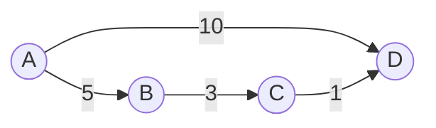

# Floyd-Warshall Algorithm

## Introduction

The Floyd-Warshall algorithm is a powerful technique for finding the shortest paths between all pairs of vertices in a weighted graph. Unlike Dijkstra's algorithm, which finds shortest paths from a single source vertex, Floyd-Warshall efficiently computes the shortest distances between **every pair of vertices** in the graph in a single execution.

This algorithm works even when the graph contains negative edge weights (as long as there are no negative cycles), making it more versatile than some other shortest path algorithms. It's based on dynamic programming and has a time complexity of O(V³), where V is the number of vertices in the graph.

## Why Learn Floyd-Warshall Algorithm?

- **All-pairs shortest paths**: It efficiently computes shortest paths between all vertex pairs at once
- **Simple implementation**: Despite its powerful capabilities, the algorithm is surprisingly simple to code
- **Works with negative weights**: Unlike Dijkstra's algorithm, it can handle negative edge weights
- **Foundational algorithm**: Forms the basis for solving many graph-related problems

## How the Algorithm Works

The core idea of the Floyd-Warshall algorithm is elegantly simple:

> For each pair of vertices (i,j), we check if going through another vertex k gives a shorter path than the direct path from i to j.

The algorithm uses dynamic programming by systematically trying each vertex as an intermediate point and updating the shortest paths accordingly.

### The Algorithm Steps

1. Initialize the distance matrix with direct edge weights between vertices
2. For each vertex k in the graph:
   - For each pair of vertices (i,j):
     - Check if path i → k → j is shorter than the current path i → j
     - If yes, update the distance from i to j

### Pseudocode

```
function floydWarshall(graph):
    // Initialize distance matrix with direct edge weights
    let dist[V][V] = graph[V][V]

    // Set distance from vertex to itself as 0
    for i from 0 to V-1:
        dist[i][i] = 0

    // Try each vertex as an intermediate point
    for k from 0 to V-1:
        for i from 0 to V-1:
            for j from 0 to V-1:
                if dist[i][k] + dist[k][j] < dist[i][j]:
                    dist[i][j] = dist[i][k] + dist[k][j]

    return dist
```

## Implementation in Code

Let's implement the Floyd-Warshall algorithm in JavaScript. We'll represent our graph as an adjacency matrix.

```javascript
/**
 * Implements the Floyd-Warshall algorithm to find shortest paths between all pairs of vertices
 * @param {number[][]} graph - Adjacency matrix representation of the graph
 * @returns {number[][]} - Distance matrix with shortest distances between all pairs
 */
function floydWarshall(graph) {
    const V = graph.length;
    const dist = [];
    
    // Initialize distance matrix
    for (let i = 0; i < V; i++) {
        dist[i] = [...graph[i]];
    }
    
    // Use each vertex as an intermediate point
    for (let k = 0; k < V; k++) {
        for (let i = 0; i < V; i++) {
            for (let j = 0; j < V; j++) {
                // If vertex k is on the shortest path from i to j,
                // update the value of dist[i][j]
                if (dist[i][k] !== Infinity && 
                    dist[k][j] !== Infinity && 
                    dist[i][k] + dist[k][j] < dist[i][j]) {
                    dist[i][j] = dist[i][k] + dist[k][j];
                }
            }
        }
    }
    
    return dist;
}

// Representing infinity for unreachable vertices
const INF = Infinity;

// Example graph represented as adjacency matrix
// graph[i][j] is the direct distance from vertex i to j
// INF means there's no direct edge
const graph = [
    [0, 5, INF, 10],
    [INF, 0, 3, INF],
    [INF, INF, 0, 1],
    [INF, INF, INF, 0]
];

const shortestPaths = floydWarshall(graph);

console.log("Shortest distances between all pairs of vertices:");
for (let i = 0; i < shortestPaths.length; i++) {
    let row = "";
    for (let j = 0; j < shortestPaths.length; j++) {
        if (shortestPaths[i][j] === INF) {
            row += "INF ";
        } else {
            row += shortestPaths[i][j] + "   ";
        }
    }
    console.log(row);
}
```

### Output

```
Shortest distances between all pairs of vertices:
0   5   8   9   
INF 0   3   4   
INF INF 0   1   
INF INF INF 0   
```

## Visual Explanation

The following diagram represents how the algorithm progresses for a small graph. At each step, we consider a new vertex as a potential intermediate:



Let's track how the algorithm updates distances when considering paths through vertex C:

1. Distance A→D (direct): 10
2. Distance A→C→D = Distance A→C + Distance C→D = 8 + 1 = 9
3. Since 9 < 10, we update distance A→D to 9

This is the core principle of the algorithm - continuously finding better paths by considering each vertex as a potential intermediate point.

## Handling Negative Cycles

One limitation of the Floyd-Warshall algorithm is that it cannot handle negative cycles properly. A negative cycle is a cycle in the graph where the sum of edge weights is negative. If such a cycle exists, there's no "shortest path" because you could traverse the cycle repeatedly to get an arbitrarily small path weight.

We can detect negative cycles by checking if any vertex's distance to itself becomes negative after running the algorithm:

```javascript
function detectNegativeCycle(dist) {
    const V = dist.length;
    for (let i = 0; i < V; i++) {
        if (dist[i][i] < 0) {
            return true; // Negative cycle found
        }
    }
    return false; // No negative cycle
}
```

## Reconstructing Paths

The standard Floyd-Warshall algorithm only gives us the distances but not the actual paths. To reconstruct the paths, we need to maintain a predecessor matrix:

```javascript
function floydWarshallWithPath(graph) {
    const V = graph.length;
    const dist = [];
    const next = [];
    
    // Initialize distance and next matrices
    for (let i = 0; i < V; i++) {
        dist[i] = [...graph[i]];
        next[i] = Array(V).fill(null);
        
        for (let j = 0; j < V; j++) {
            if (graph[i][j] !== Infinity) {
                next[i][j] = j;
            }
        }
    }
    
    // Floyd-Warshall algorithm
    for (let k = 0; k < V; k++) {
        for (let i = 0; i < V; i++) {
            for (let j = 0; j < V; j++) {
                if (dist[i][k] !== Infinity && 
                    dist[k][j] !== Infinity && 
                    dist[i][k] + dist[k][j] < dist[i][j]) {
                    dist[i][j] = dist[i][k] + dist[k][j];
                    next[i][j] = next[i][k];
                }
            }
        }
    }
    
    // Function to construct path from i to j
    function getPath(i, j) {
        if (next[i][j] === null) return [];
        
        const path = [i];
        while (i !== j) {
            i = next[i][j];
            path.push(i);
        }
        
        return path;
    }
    
    return { dist, getPath };
}
```

## Real-world Applications

### 1. Network Routing

The Floyd-Warshall algorithm can be used in network routing protocols to determine the most efficient paths for data packets. Every router can compute the shortest path to every other router in the network.

```javascript
// Simplified network latency matrix (in milliseconds)
const networkLatency = [
    [0, 5, 15, 10],
    [5, 0, 9, 14],
    [15, 9, 0, 2],
    [10, 14, 2, 0]
];

const { dist } = floydWarshallWithPath(networkLatency);
console.log("Optimal network routing table (minimum latency):", dist);
```

### 2. Geographic Information Systems

GIS applications use the algorithm to find shortest paths between locations on a map, helpful for navigation systems.

### 3. Arbitrage Detection in Currency Exchange

One fascinating application is detecting arbitrage opportunities in currency exchange markets. If we have exchange rates between currencies, we can represent them as a graph and use the Floyd-Warshall algorithm to detect negative cycles, which represent arbitrage opportunities.

```javascript
function detectArbitrage(exchangeRates) {
    const V = exchangeRates.length;
    
    // Convert exchange rates to negative logarithms
    // This transforms the problem of finding a product > 1 to finding a sum < 0
    const graph = [];
    for (let i = 0; i < V; i++) {
        graph[i] = [];
        for (let j = 0; j < V; j++) {
            if (exchangeRates[i][j] > 0) {
                graph[i][j] = -Math.log(exchangeRates[i][j]);
            } else {
                graph[i][j] = Infinity;
            }
        }
    }
    
    // Run Floyd-Warshall
    const dist = floydWarshall(graph);
    
    // Check for negative cycles
    for (let i = 0; i < V; i++) {
        if (dist[i][i] < 0) {
            return true; // Arbitrage opportunity exists
        }
    }
    
    return false; // No arbitrage opportunity
}
```

## Time and Space Complexity

- **Time Complexity**: O(V³), where V is the number of vertices
- **Space Complexity**: O(V²) for storing the distance matrix

While the cubic time complexity might seem high, the algorithm's simplicity and ability to find all-pairs shortest paths make it practical for graphs with a reasonable number of vertices (typically up to a few hundred).

## Common Mistakes and Pitfalls

1. **Forgetting initialization**: Make sure to initialize the distance from each vertex to itself as 0
2. **Incorrect handling of unreachable vertices**: Use Infinity for vertices that aren't directly connected
3. **Not detecting negative cycles**: If needed, check for negative cycles after running the algorithm
4. **Applying to very large graphs**: Due to O(V³) complexity, the algorithm may be impractical for graphs with thousands of vertices

## Summary

The Floyd-Warshall algorithm is an elegant and powerful method for finding shortest paths between all pairs of vertices in a weighted graph. Its straightforward implementation using dynamic programming makes it accessible even for beginners.

Key points to remember:
- It finds shortest paths between **all pairs** of vertices in a single execution
- Works with negative edge weights (but not negative cycles)
- Has a time complexity of O(V³) and space complexity of O(V²)
- Can be extended to reconstruct shortest paths and detect negative cycles

While other algorithms like Dijkstra's or Bellman-Ford might be more efficient for single-source shortest paths, Floyd-Warshall excels when you need to find shortest paths between all vertex pairs.

## Practice Exercises

1. **Path Reconstruction**: Modify the basic Floyd-Warshall implementation to reconstruct the actual paths between vertices.

2. **Transitive Closure**: Use the Floyd-Warshall algorithm to find the transitive closure of a graph (i.e., whether there exists a path from vertex i to vertex j).

3. **Diameter of a Graph**: Use Floyd-Warshall to find the diameter of a graph (the longest shortest path between any two vertices).

4. **Challenge**: Implement a function that detects negative cycles in a graph using the Floyd-Warshall algorithm.

## Additional Resources

- [Introduction to Algorithms](https://mitpress.mit.edu/books/introduction-algorithms-third-edition) by Cormen, Leiserson, Rivest, and Stein has an excellent chapter on the Floyd-Warshall algorithm
- [Stanford's CS161 Course Notes](http://web.stanford.edu/class/cs161/schedule.html) offer detailed explanations of dynamic programming in graph algorithms
- [Visualization of Floyd-Warshall Algorithm](https://visualgo.net/en/sssp) helps understand how the algorithm works step by step

Happy coding!